# Inex's GPT Image 2 Prompts — Cinematic Anime, Brazilian Culture & Beyond

> 🎨 A personal collection of high-detail prompts for **GPT Image 2** — OpenAI's next-gen image model with pixel-perfect text rendering, cross-image consistency, and commercial-grade illustration quality. Focused on cinematic anime aesthetics, authentic Brazilian cultural reinterpretations, character-reference workflows, and atmospheric storytelling.

[](LICENSE)

---

## 📑 Table of Contents

- [About This Repo](#-about-this-repo)
  - [Character Gallery](#-character-gallery)
- [About GPT Image 2](#-about-gpt-image-2)
- [How to Use](#-how-to-use)
- [Prompts](#-prompts)
  - [🚗 Anime Cars](#-anime-cars)
  - [🛏️ Dakimakura](#️-dakimakura)
  - [🌌 Cosmic & Cinematic Scenes](#-cosmic--cinematic-scenes)
  - [📝 Typography & Poster Art](#-typography--poster-art)
  - [🪴 Brazilian Northeastern Folk Art](#-brazilian-northeastern-folk-art)
- [General Prompting Tips](#-general-prompting-tips)
- [License](#-license)

---

## 📌 About This Repo

This is a personal dump of GPT Image 2 prompts I use and refine over time. It's not a curated community resource — it's my working library, made public so anyone who finds it useful can copy, remix, or adapt the prompts.

**The prompts are character-agnostic.** They're written as reusable templates: the *character* itself is supplied at generation time via an attached reference image or a free-form description in your own request to the model. The prompts handle composition, lighting, art style, camera angle, mood, and rendering quality — everything *around* the character. This means the same prompt can drive completely different looks depending on the reference you pair it with.

Wherever a prompt requires a reference, it's marked with **📎 Requires**.

### 🧍 Character Gallery

The character reference images I used while testing and refining these prompts live in [`assets/images/base/`](./assets/images/base/). Browse them to see what kind of input each prompt was tuned against — useful when comparing your own output against my example renders.

---

## 🚀 About GPT Image 2

GPT Image 2 stands out in three areas where previous models struggled:

- **Pixel-perfect text** — renders full words without character errors
- **Cross-image consistency** — maintains characters, styles, and elements across generations from reference images
- **Commercial quality** — illustrations ready for professional use

This collection focuses on prompts that exploit these strengths, with detailed explanations of *why* each one works.

## 📖 How to Use

1. Browse the categories below
2. Hover the prompt code block and click the **copy icon** in the top-right corner
3. Replace placeholder variables in `{CURLY_BRACES}` with your chosen values
4. If the prompt is marked **📎 Requires**, attach your character or style reference image to the same chat/request
5. Paste into GPT Image 2 (via ChatGPT, API, or Sora)

---

## 📚 Prompts

### 🚗 Anime Cars

Cinematic anime illustrations of characters inside premium sports cars, using attached references for identity-lock or style-inspiration workflows.

---

#### Anime Girl Driving a Supercar at Night

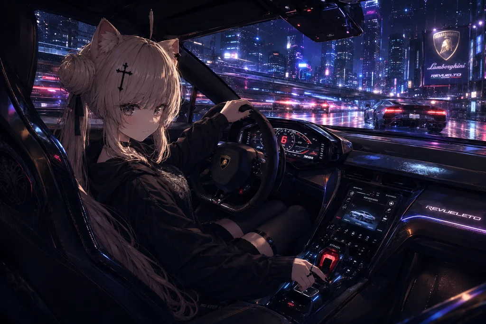

**Category:** Anime Cars · **Tags:** `anime` `cinematic` `cyberpunk` `night` `character-reference`

**📋 Prompt:**

```
CAR={McLaren P1 / Nissan GT-R R35 / Lamborghini Revuelto / Porsche 911 GT3 RS / etc}

Create a cinematic anime-style night illustration using the attached girl as the sole and explicit character reference. Fully preserve her recognizable identity, facial structure, eye shape, hairstyle, hair accessories, color palette, outfit silhouette, proportions, and soft expressive atmosphere exactly as shown in the reference image. Do not replace the character, alter her identity, obscure the face, or stylize away recognizability.

The girl is driving a {CAR} through a futuristic neon-lit city at night from an immersive interior cockpit perspective. The scene should feel atmospheric, dreamy, and slightly melancholic, with glowing city lights reflecting across the windshield, dashboard, windows, and her face. Emphasize motion blur, cinematic lighting, soft bloom, volumetric fog, reflections, chromatic aberration, and painterly brushstroke textures similar to high-end anime key visuals.

Camera angle from inside the car cabin, slightly wide-angle, showing both the character and the luxurious sports car interior. The dashboard and steering wheel should feel realistic and premium, illuminated by cool blue and white LEDs. Outside the windows: a dense cyberpunk-inspired skyline with elevated highways, speeding cars, rain-soaked streets, neon signs, and distant skyscrapers.

The character should have a relaxed but confident expression while driving, casually glancing toward the viewer. Her pose should feel natural and candid. Keep the overall composition balanced between the character, cockpit details, and the glowing urban scenery outside.

Art style: semi-realistic anime illustration, painterly rendering, highly atmospheric, cinematic composition, soft lighting gradients, deep blue night tones, detailed reflections, emotional ambience, modern anime movie aesthetic, premium digital painting quality.

Ultra detailed, masterpiece, best quality, dynamic lighting, expressive eyes, depth of field, film grain, realistic reflections, immersive perspective, high detail environment, elegant color harmony, dramatic night atmosphere.
```

**📎 Requires:** An attached reference image of the character to preserve. Alternatively, replace the "attached girl" wording with a written character description if you don't have a reference image.

**💡 Why it works:** The prompt opens with an aggressive identity-lock paragraph — explicitly listing *what* must be preserved (facial structure, eye shape, hairstyle, accessories, palette, silhouette, proportions) and *what must not happen* (no replacement, no obscuring, no stylizing away). GPT Image 2 responds very well to negative-space framing like "Do not replace the character." The `{CAR}` placeholder gives you a single swappable variable while everything else stays consistent across renders. Cyberpunk + neon + rain stack mutually reinforcing atmospheric cues.

**🔧 Variations:** swap `{CAR}` for any well-known model (the more iconic, the better the cockpit accuracy); change `night` → `golden hour` and `cyberpunk skyline` → `Tokyo Shibuya crossing` for a brighter take; add a named director reference (`Makoto Shinkai-inspired lighting`) at the end of the art-style line for a warmer painterly mood.

---

#### Anime Girls in a Convertible at Sunset

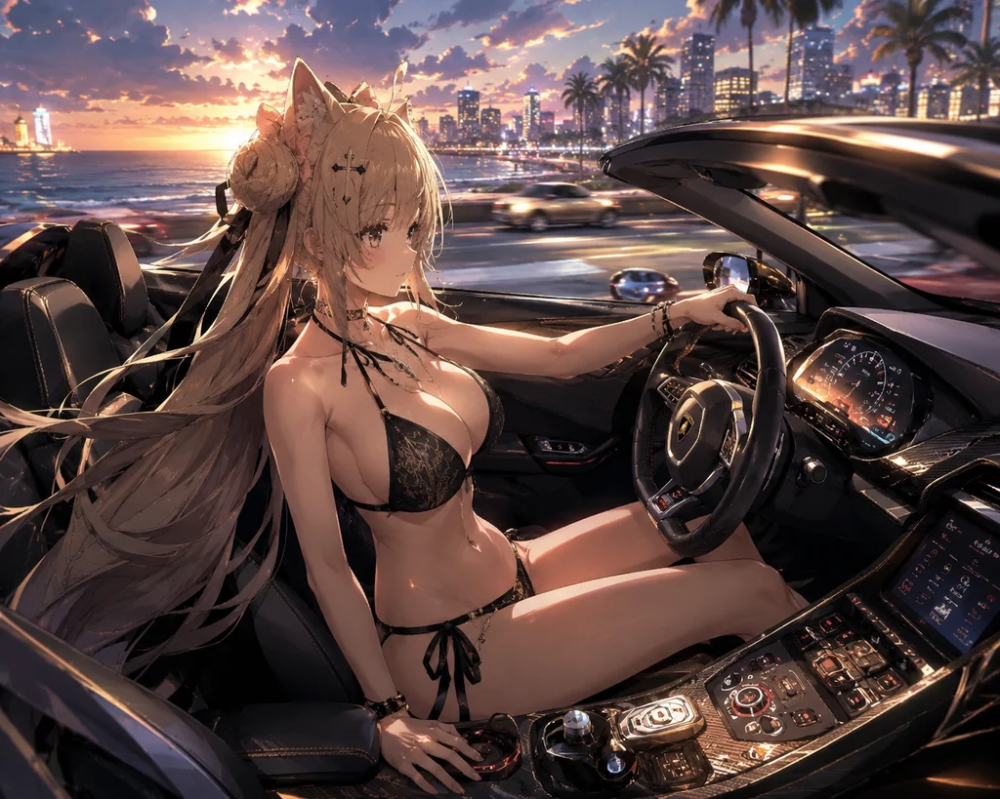

**Category:** Anime Cars · **Tags:** `anime` `cinematic` `summer` `convertible` `coastal` `style-reference`

**📋 Prompt:**

```
CAR={Any luxury convertible supercar / exotic sports car with a premium modern interior}
CHARACTERS={1 or 2}

Create a cinematic semi-realistic anime-style illustration inspired by the attached anime girl. Maintain a similar fashion aesthetic, hairstyle theme, color palette, accessories, and overall visual vibe while adapting the character into an original stylized anime illustration. Keep the design cohesive and visually consistent without directly replicating the exact identity or features from the reference.

Character placement rule:
- If CHARACTERS=1: only a single anime girl is present, sitting exclusively in the driver seat of the convertible.
- If CHARACTERS=2: use two anime girls with very similar styling, fashion aesthetic, and visual theme, with one driving and the other sitting in the passenger seat. Both should feel like alternate versions of the same original-inspired design with slight natural pose and expression variation.

Scene: a luxurious high-end convertible supercar with the roof down, cruising through a glowing coastal city highway during sunset or blue hour. The atmosphere should feel stylish, youthful, energetic, and cinematic.

The girl(s) wear elegant fashionable bikinis inspired by the original aesthetic, featuring premium summer fashion styling, soft fabric details, subtle shine, tasteful accessories, and coordinated colors. Hair ribbons, accessories, and visual motifs should remain stylistically consistent with the inspiration while still feeling original.

Camera angle from slightly above and inside the convertible cockpit, capturing the character(s), premium interior, and immersive open-air feeling of the car. The composition should emphasize the luxurious sports car cabin, glossy surfaces, metallic reflections, dashboard details, center console, ambient lighting, and realistic material rendering.

Pose and expression:
- Driver version: relaxed, confident, casually focused on the road.
- Passenger version (only if CHARACTERS=2): looking toward the viewer with a soft playful expression.

Environment details: ocean-side roads, distant skyline, palm trees, warm sunset light blending with cool evening shadows, motion blur from passing lights, soft wind moving hair and ribbons, glowing reflections on the car body, atmospheric depth, subtle lens flare, dreamy ambience.

Art style: semi-realistic anime illustration, highly polished painterly rendering, cinematic composition, premium anime key visual quality, soft bloom lighting, expressive eyes, detailed skin shading, elegant highlights, modern anime movie aesthetic, vibrant but balanced colors.

Ultra detailed, masterpiece, best quality, convertible sports car interior, open roof, luxury atmosphere, immersive perspective, dynamic lighting, realistic reflections, summer mood, glossy paint, high-detail environment, anime cinematic illustration.
```

**📎 Requires:** An attached reference image used as **style inspiration only** (not identity-locked). Alternatively, replace the "attached anime girl" wording with a written description of the aesthetic you want as inspiration.

**💡 Why it works:** This is the inverse approach to the night-driving prompt — instead of identity-locking the reference, it explicitly says "*inspired by*… without directly replicating the exact identity." That gives the model permission to create original characters that share the *aesthetic* (palette, fashion, ribbons, hair theme) without copying the face. The `CHARACTERS={1 or 2}` conditional with explicit per-case rules is the key trick: GPT Image 2 follows branching logic well when each branch lists its own positioning, pose, and expression.

**🔧 Variations:** swap sunset for `night blue hour` with neon coastal signage for a darker take; change `bikinis` to `coordinated summer dresses` for a softer, less swimwear-focused composition; replace `coastal highway` with `mountain pass at sunset` for dramatic elevation and curves.

---

### 🛏️ Dakimakura

Print-ready 1:3 vertical compositions for life-size body pillow covers, with front and back companion illustrations. Built around dense pose and anatomy rules and explicit negative-prompt blocks to keep the output print-quality.

---

#### Dakimakura — Front Side


**Category:** Dakimakura · **Tags:** `dakimakura` `body-pillow` `1:3-aspect` `print-ready` `character-reference` `identity-lock`

**📋 Prompt:**

```
Use the attached reference character ONLY for the character design, face, hairstyle, colors, outfit identity, accessories, proportions, and personality.

Create a full-body anime dakimakura FRONT-side illustration of the character in a classic premium dakimakura pose.

Canvas and format:
- exact 1:3 aspect ratio (width:height)
- ultra high resolution suitable for professional dakimakura printing
- vertical composition
- full body entirely visible from head to feet
- NO transparent background
- clean soft fabric-style background with subtle gradients or pastel bedding colors
- composition optimized specifically for life-size body pillow covers

Pose and composition:
- character lying down naturally on her back or slightly side-turned toward the viewer
- soft relaxed pose commonly used in premium anime dakimakura artwork
- gentle elegant body curves
- one arm near the chest or pillow area
- relaxed legs with natural positioning
- soft direct eye contact or sleepy affectionate expression
- hair spread softly around the head
- cozy and visually appealing presentation
- centered body alignment with balanced spacing around the silhouette
- entire silhouette clearly readable for printing

Art style:
- modern high-end anime illustration
- highly polished rendering
- detailed anime eyes with glossy highlights
- soft skin shading and subtle blush
- delicate hair strands with refined lighting
- premium gacha-game / visual novel quality artwork
- soft bloom lighting
- clean crisp linework
- smooth fabric rendering with detailed folds and cloth tension
- masterpiece quality
- collectible dakimakura artwork aesthetic

Background:
- soft bedsheets, subtle pillow wrinkles, or elegant minimal fabric textures
- simple clean background that enhances the character without clutter
- warm pastel or neutral color palette
- no detailed room environment

Rendering quality:
- extremely detailed
- razor-sharp print-ready illustration
- high detail from face to feet
- professional commercial-quality anime art
- smooth gradients
- detailed hands and feet
- anatomically clean and appealing proportions

Negative prompt:
- low resolution
- cropped body
- cropped feet
- extra limbs
- bad anatomy
- distorted perspective
- blurry image
- watermark
- text
- logo
- background clutter
- duplicate limbs
- malformed hands
- malformed feet
- fisheye distortion
- transparent background
- poorly centered composition
- low detail rendering
- messy lineart
- oversaturated colors
```

**📎 Requires:** An attached reference image of the character to identity-lock against.

**💡 Why it works:** Dakimakura artwork has very specific commercial requirements that hobby prompts usually miss — this prompt nails three of them. First, `exact 1:3 aspect ratio` stated explicitly at the top forces the model out of its default square/portrait bias. Second, the dedicated `Negative prompt:` block at the end (uncommon in GPT Image 2 prompts but extremely effective here) suppresses the top failure modes — cropped feet, malformed hands, transparent backgrounds — that ruin print runs. Third, `print-ready illustration` + `razor-sharp` as final quality keywords nudges the renderer toward higher detail density than vanilla "ultra detailed" produces. The split into Canvas/Pose/Art/Background/Quality/Negative is a clean layered structure the model handles section by section.

**🔧 Variations:** swap `lying down on her back` for `slightly side-turned with a hand near the cheek` for a more affectionate pose; change `warm pastel` → `cool blue-toned` for a different mood palette; tighten "soft sleepy expression" to a specific emotion like `slightly mischievous smile` or `gentle morning yawn` for character-specific variants.

---

#### Dakimakura — Back Side


**Category:** Dakimakura · **Tags:** `dakimakura` `body-pillow` `back-side` `1:3-aspect` `print-ready` `character-reference` `identity-lock`

**📋 Prompt:**

```
Use the attached reference character ONLY for the character design, face, hairstyle, colors, outfit identity, accessories, proportions, and personality.
Create a full-body anime dakimakura BACK-side illustration of the character in a classic premium dakimakura pose.

Canvas and format:
- exact 1:3 aspect ratio (width:height)
- ultra high resolution suitable for professional dakimakura printing
- vertical composition
- full body entirely visible from head to feet
- NO transparent background
- composition optimized specifically for life-size body pillow covers
- designed as the BACK side companion illustration to a dakimakura front-side artwork

Pose and composition:
- character lying naturally facing away from the viewer or partially turning her upper body back toward the camera
- elegant back-focused pose commonly used in premium dakimakura artwork
- visible back, shoulders, waistline, and relaxed leg positioning
- subtle natural body curves
- head slightly turned so part of the face or eye may still be visible
- hair flowing naturally across the pillow or bedsheets
- arms resting softly near the pillow or body
- relaxed legs with natural positioning
- cozy and visually appealing presentation
- centered body alignment with balanced spacing around the silhouette
- entire silhouette clearly readable for printing

Art style:
- modern high-end anime illustration
- highly polished rendering
- premium gacha-game / visual novel quality artwork
- clean refined linework
- soft anime skin shading
- delicate hair strands with glossy highlights
- detailed fabric folds and realistic cloth tension
- subtle bloom lighting
- elegant soft shadows
- masterpiece quality
- collectible dakimakura artwork aesthetic

Background:
- soft bedsheets, pillow folds, or subtle fabric textures
- clean minimal background without clutter
- warm pastel or neutral color palette
- soft cozy atmosphere

Rendering quality:
- extremely detailed
- razor-sharp print-ready illustration
- professional commercial-quality anime art
- high detail from hair to feet
- smooth gradients and polished shading
- detailed hands and feet
- anatomically clean and aesthetically pleasing proportions

Optional details:
- slightly lifted leg or subtle twist in posture for elegant silhouette flow
- hair partially covering the back or shoulders
- soft sleepy or teasing glance over the shoulder
- gentle fabric compression beneath the body

Negative prompt:
- low resolution
- cropped body
- cropped feet
- extra limbs
- distorted anatomy
- blurry details
- malformed hands
- malformed feet
- duplicate limbs
- fisheye distortion
- watermark
- logo
- text
- transparent background
- cluttered background
- poorly centered composition
- bad perspective
- messy lineart
- low-detail rendering
- overly exaggerated anatomy
```

**📎 Requires:** An attached reference image — should be the **same character used for the front-side prompt** to produce a matching pillow set.

**💡 Why it works:** Built as a deliberate companion to the front-side prompt — note the explicit line `"designed as the BACK side companion illustration to a dakimakura front-side artwork"` which tells the model this is part of a set, encouraging stylistic consistency. The "Optional details" block (lifted leg, hair across pillow, glance over shoulder) provides creative variations without forcing them — useful pattern when you want the renderer to pick one of several valid moves rather than rigidly executing one. The pose description is intentionally less prescriptive than the front-side because back-views have fewer hard constraints; instead, the prompt focuses heavily on what's *visible* (back, shoulders, waistline) to prevent awkward truncation.

**🔧 Variations:** generate front + back as a paired set using identical character reference and seed, then print both for a complete pillow cover; swap `glance over the shoulder` → `face fully turned away with only hair visible` for a more abstract back design; change the palette via the background line for matching seasonal sets.

---

### 🌌 Cosmic & Cinematic Scenes

Atmospheric anime illustrations exploring scale, emotion, and surreal environments — characters in impossible or sublime situations, with heavy emphasis on lighting and environmental storytelling.

---

#### Character on the Wing of a Flying Airplane

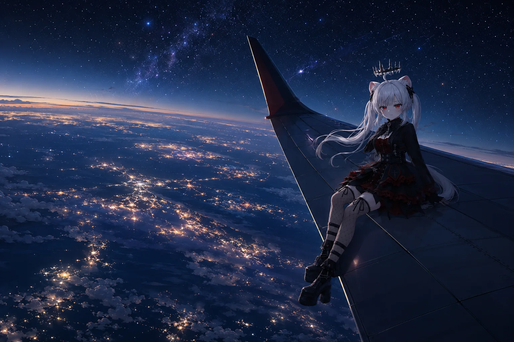

**Category:** Cosmic & Cinematic Scenes · **Tags:** `anime` `cinematic` `aviation` `night` `cosmic` `surreal` `character-reference`

**📋 Prompt:**

```
Use the attached reference character ONLY for the character design, outfit, hairstyle, colors, accessories, and identity.

Create an epic cinematic anime illustration of the character sitting or standing on the wing of a flying airplane high above Earth at night.

Scene composition:
- massive airplane wing extending into the sky
- character positioned directly on the wing
- enormous view of Earth curvature below
- glowing city lights stretching across continents
- visible atmosphere glow on the horizon
- deep dark blue and black space above
- countless stars filling the sky
- faint nebula-like clouds and cosmic dust
- surreal sense of scale and altitude
- dreamlike aviation atmosphere

Character pose:
- character sitting near the edge of the wing, legs relaxed over the side
- OR kneeling while looking toward the horizon
- OR standing carefully with hair flowing violently in the wind
- long hair streaming dramatically across the scene
- contemplative or melancholic expression
- calm body language despite impossible situation
- gaze directed toward Earth, stars, or distant horizon
- cinematic silhouette partially illuminated by city lights below

Camera and framing:
- ultra wide cinematic shot
- high-angle perspective showing both character and planet below
- airplane wing creating strong leading lines
- asymmetrical composition
- character relatively small compared to the environment for scale emphasis
- dynamic depth and atmospheric perspective
- immersive aerial composition

Lighting:
- golden city lights reflecting softly onto the character
- faint moonlight and starlight illumination
- soft rim lighting along hair and body
- subtle atmospheric glow
- deep cinematic shadows
- volumetric haze near the horizon
- gentle bloom and light streaks

Art style:
- cinematic anime key visual
- ultra detailed atmospheric rendering
- painterly anime lighting
- highly detailed nightscape
- Makoto Shinkai-inspired environmental lighting
- dramatic anime sky rendering
- soft yet detailed character shading
- elegant flowing hair animation feel
- premium anime movie aesthetic

Mood:
- lonely but beautiful
- surreal freedom
- emotional cosmic wonder
- dreamlike night flight
- peaceful solitude above the world
- melancholic yet breathtaking

IMPORTANT:
- preserve the attached character exactly
- keep original outfit unchanged
- keep original hairstyle and colors unchanged
- do not redesign the character
- the airplane wing must feel realistic in scale
- prioritize atmosphere and cinematic lighting
- avoid photorealism
- avoid hard cel-shading
- avoid overly saturated neon colors
- maintain a soft cinematic anime aesthetic

masterpiece, best quality, cinematic anime illustration, airplane wing scene, Earth from above, night flight atmosphere, glowing city lights, cosmic anime scenery, atmospheric perspective, emotional anime art, ultra detailed sky, volumetric lighting, dreamlike composition
```

**📎 Requires:** An attached reference image of the character.

**💡 Why it works:** This prompt sells the impossible by *grounding* it — the lines "calm body language despite impossible situation" and "the airplane wing must feel realistic in scale" tell the model to commit to the surreal premise without breaking physical believability. Listing three alternative pose options (sitting / kneeling / standing) gives the renderer flexibility rather than locking into one, which typically produces more natural results. The lighting block layers four light sources (city lights, moonlight, starlight, rim) — that's what gives the character physical presence in the scene instead of floating like a sticker.

**🔧 Variations:** swap `night` for `dawn breaking over the horizon` for warmer pinks/golds; change `airplane wing` to `bullet train roof` or `cargo airship deck` for different vehicle drama; replace the contemplative mood with `triumphant arms raised pose` for a more empowering shot.

---

#### Surreal Futuristic Observatory (Fisheye)

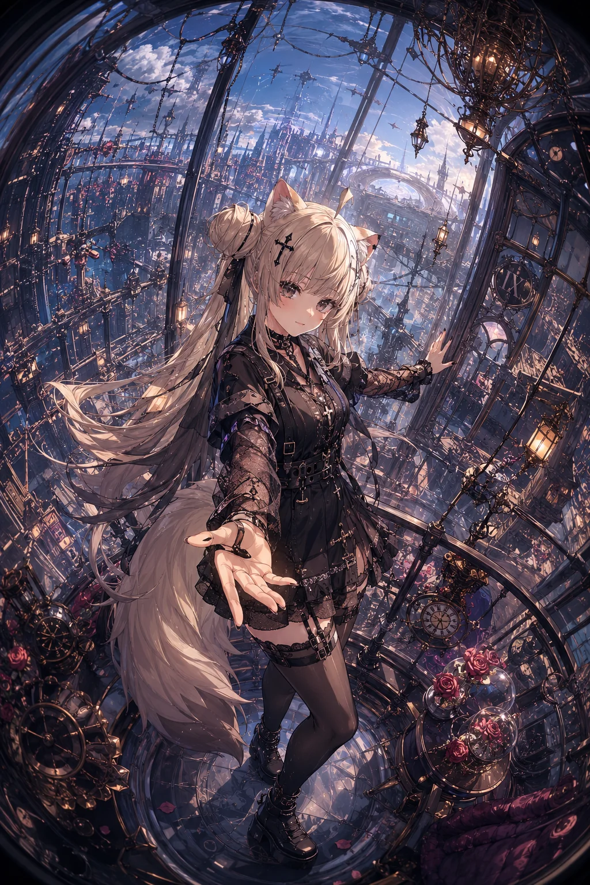

**Category:** Cosmic & Cinematic Scenes · **Tags:** `anime` `cinematic` `fisheye` `urban-fantasy` `gothic-futurism` `surreal` `character-redesign`

**📋 Prompt:**

```
create image
Use the attached reference character ONLY as the base identity reference for facial structure, hairstyle silhouette, recognizable facial traits, fox ears/tail identity, and overall character essence.

IMPORTANT CHARACTER REDESIGN:
- redesign the character so they naturally belong to the surreal futuristic world
- reinterpret the outfit into refined gothic retro-futuristic anime fashion
- preserve the recognizable identity while elevating visual sophistication
- cleaner and more intentional design language
- layered black fabrics, semi-transparent materials, lace accents, soft techwear elements, subtle metallic ornaments, ribbons, straps, asymmetrical sleeves, elegant accessories
- avoid excessive random detail clutter
- prioritize silhouette clarity and visual readability
- long flowing hair and tail should move naturally through the fisheye composition
- integrate subtle cyber-surreal motifs into clothing design rather than overwhelming mechanical complexity
- fashion should feel premium, artistic, cinematic, and believable within the world

Create an ultra-detailed surreal cinematic anime illustration inside a gigantic futuristic glass observatory suspended above a sprawling anime metropolis.

CORE VISUAL DIRECTION:
- immersive but visually readable
- highly detailed environment WITHOUT chaotic over-detailing
- focus on strong composition and atmospheric depth
- elegant environmental storytelling instead of random object overload
- the image should feel rich, alive, and cinematic while maintaining breathing room
- preserve areas of negative space for visual balance
- avoid noisy texture saturation
- avoid excessive tiny meaningless details

ENVIRONMENT:
- massive curved panoramic glass walls overlooking a futuristic city
- surreal fisheye distortion bending the architecture naturally
- layered city depth with bridges, suspended buildings, glowing streets, and distant structures
- subtle moving drones and small environmental activity below
- refined gothic interior mixed with futuristic architecture
- elegant chandeliers, hanging lamps, exposed pipes, glass reflections, roses, old clocks, suspended cables, decorative machinery, greenhouse elements
- carefully curated environmental props
- cozy luxurious atmosphere inside contrasted against gigantic city scale outside
- polished floor reflections and strong perspective depth
- environment should feel dense but organized

CHARACTER POSE:
- dynamic and visually engaging pose
- avoid stiff standing pose
- character leaning slightly toward the camera with confidence
- one hand extended naturally toward the viewer OR lightly touching curved glass
- subtle body twist to enhance perspective
- expressive posture with cinematic flow
- long hair and tail sweeping dramatically across the composition
- elegant leg positioning with believable balance
- direct eye contact toward the viewer
- expression: mysterious, inviting, slightly playful

CAMERA AND COMPOSITION:
- EXTREME fisheye / ultra wide-angle lens
- dramatic curved perspective distortion
- cinematic depth and scale
- strong leading lines guiding the eye toward the character
- foreground framing elements
- layered depth composition
- character clearly readable as focal point
- avoid overwhelming environmental clutter around the face
- maintain visual hierarchy
- balanced detail distribution across the image
- immersive but clean cinematic framing

LIGHTING:
- soft daylight mixed with warm interior lighting
- atmospheric haze
- cinematic bloom
- glowing reflections on glass
- soft volumetric lighting
- elegant contrast
- subtle colorful reflected lights
- dreamy atmospheric depth
- avoid aggressive neon overload

ART STYLE:
- premium anime concept art quality
- painterly anime rendering
- ultra detailed but controlled
- sophisticated environmental illustration
- delicate anime facial rendering
- refined linework
- rich atmospheric perspective
- cinematic anime key visual aesthetic
- surreal urban fantasy atmosphere
- visually cohesive color palette

MOOD:
- elegant surrealism
- immersive futuristic dreamscape
- mysterious urban fantasy
- cinematic wonder
- cozy sci-fi atmosphere
- dreamlike exploration
- controlled visual richness

IMPORTANT:
- the character MUST feel naturally integrated into the environment
- prioritize composition, readability, and atmosphere over raw density
- maintain visual cohesion between character and world
- avoid cluttered randomness
- avoid generic cyberpunk neon overload
- avoid empty spaces while still preserving visual breathing room
- avoid photorealism
- maintain painterly anime elegance

masterpiece, best quality, ultra detailed anime illustration, fisheye perspective, surreal futuristic observatory, cinematic anime composition, immersive urban fantasy, elegant anime sci-fi art, painterly anime rendering, atmospheric perspective, dreamlike futuristic city, refined visual storytelling, premium anime key visual, sophisticated environmental art
```

**📎 Requires:** An attached reference image — used as **essence reference** (face, silhouette, ears/tail), with explicit permission to redesign the outfit.

**💡 Why it works:** The most interesting structural choice here is the *anti-clutter discipline* — the "CORE VISUAL DIRECTION" block explicitly warns against `chaotic over-detailing`, `noisy texture saturation`, and `excessive tiny meaningless details`. GPT Image 2 tends to over-stuff scenes when given long environment lists, so this prompt counterbalances its own dense scene description with repeated calls for "breathing room" and "visual hierarchy." The `EXTREME fisheye / ultra wide-angle lens` is named multiple times because that's the highest-leverage compositional choice — it bends architecture and produces immediate visual identity for the piece.

**🔧 Variations:** swap `fisheye` for `dutch tilt cinematic angle` for a different distortion style; change `gothic retro-futuristic` to `art-nouveau futurism` or `solar-punk` for radically different fashion direction; remove `fox ears/tail` from the identity block if your reference doesn't have those features.

---

#### Tiny Character Under a Meteor Shower (16:9)

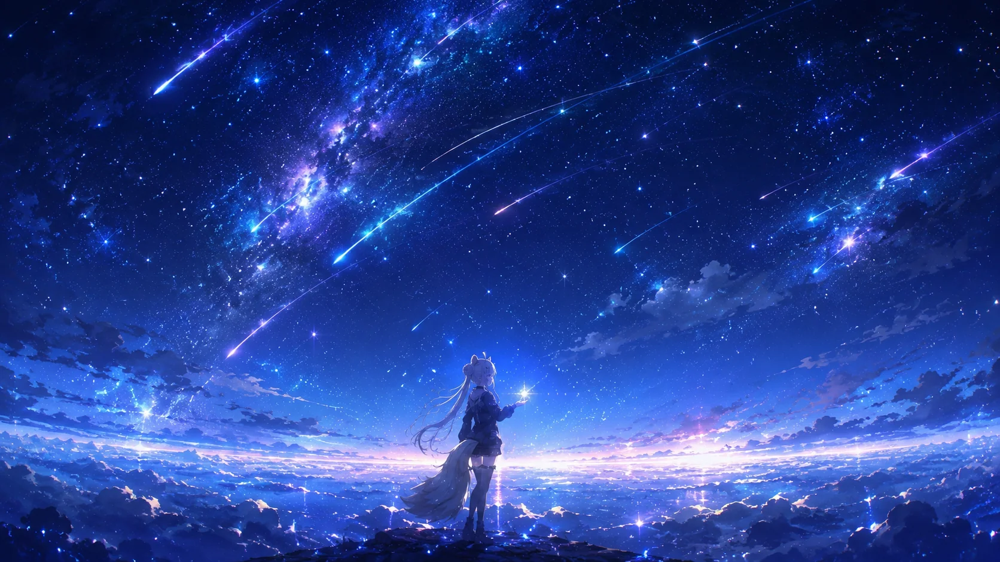

**Category:** Cosmic & Cinematic Scenes · **Tags:** `anime` `cinematic` `cosmic` `16:9` `landscape` `meteor-shower` `scale` `character-integration`

**📋 Prompt:**

```
create image
Use the attached reference character ONLY as the base identity reference for facial structure, hairstyle silhouette, recognizable traits, colors, and overall character essence.

IMPORTANT CHARACTER INTEGRATION:
- adapt the character rendering, lighting, textures, and color grading so the character naturally blends into the environment
- the character should feel like part of the atmosphere rather than pasted over the background
- soften edges where appropriate using atmospheric lighting and haze
- allow subtle painterly blending between hair, clothing, clouds, and cosmic light
- integrate the character into the scene using volumetric glow, ambient reflections, and environmental color bleed
- hair and clothing should visually flow with the wind direction and meteor movement
- avoid isolated or overly sharp character rendering
- prioritize cinematic harmony between character and environment

Create a breathtaking cinematic anime illustration of the character standing alone beneath an enormous cosmic sky filled with meteor trails and infinite stars.

FORMAT:
- exact 16:9 aspect ratio
- ultra wide cinematic framing
- landscape orientation
- extremely large environmental scale

Core visual concept:
- massive celestial sky dominating almost the entire composition
- countless meteor streaks crossing the atmosphere
- enormous curved horizon glowing softly with cosmic light
- the character appearing EXTREMELY small against the scale of the universe
- dreamlike sense of infinity and emotional solitude
- atmospheric cosmic fantasy aesthetic

Environment:
- endless cloudscape or surreal elevated world above the clouds
- horizon glowing with pale white-blue light
- deep dark blue star-filled sky
- dense stars, nebulae, and subtle galactic clouds
- shooting stars and meteor showers stretching diagonally across the scene
- faint atmospheric haze and glowing particles
- soft luminous mist drifting across the clouds
- minimal environmental clutter for maximum scale emphasis

Character composition:
- character positioned near the lower center or lower third of the image
- character occupying only a VERY tiny portion of the frame
- sky and celestial atmosphere should occupy roughly 90-95% of the composition
- partially enveloped by glowing mist and atmospheric light
- holding or reaching toward a glowing orb, star fragment, or faint cosmic light
- flowing hair and clothing moving softly in the wind
- contemplative posture
- emotional body language conveying awe and solitude
- silhouette subtly dissolving into the cosmic atmosphere in some areas
- prioritize environmental scale over character visibility

Pose rules:
- NEVER use T-pose, A-pose, mannequin pose, idle VRChat pose, or character-sheet standing pose
- if the generated pose resembles a T-pose or A-pose, replace it with a natural cinematic pose
- use soft asymmetrical body language
- natural weight distribution
- elegant relaxed arm positioning
- subtle emotional posture rather than action posing
- avoid stiff symmetrical posing

Camera and framing:
- ultra wide cinematic composition
- extremely distant camera perspective
- the character should look visually insignificant compared to the sky
- low horizon line to maximize celestial scale
- dramatic celestial perspective
- immersive atmospheric depth
- strong diagonal movement from meteor trails
- subtle curvature of the world or cloud horizon
- emphasize overwhelming cosmic scale and emptiness

Lighting:
- luminous blue-white cosmic illumination
- glowing meteor streaks casting subtle light
- soft rim lighting around the tiny character silhouette
- atmospheric bloom and haze
- delicate volumetric glow
- deep blue shadows contrasted with celestial highlights
- environmental lighting affecting the character naturally
- painterly atmospheric blending between foreground and background

Art style:
- ultra detailed anime sky rendering
- cinematic anime movie aesthetic
- painterly anime lighting
- highly integrated character/environment rendering
- Makoto Shinkai-inspired celestial atmosphere
- emotional environmental storytelling
- highly detailed stars and meteor effects
- atmospheric perspective and soft gradients
- premium anime key visual quality

Mood:
- cosmic wonder
- peaceful loneliness
- emotional transcendence
- dreamlike silence
- infinite scale and beauty
- melancholic serenity
- contemplative fantasy atmosphere

IMPORTANT:
- preserve recognizable identity traits from the attached character
- allow the rendering style to adapt for environmental cohesion
- the sky must overwhelmingly dominate the composition
- prioritize atmosphere, integration, scale, and celestial lighting
- the character should feel embedded inside the scene naturally
- avoid photorealism
- avoid hard cutout-looking character rendering
- avoid cluttered foregrounds
- avoid excessive neon cyberpunk colors
- maintain soft cinematic anime elegance

masterpiece, best quality, cinematic anime illustration, ultra wide 16:9 composition, meteor shower sky, cosmic anime scenery, emotional anime landscape, tiny character scale, overwhelming celestial environment, integrated character rendering, atmospheric blending, dreamlike celestial lighting, ultra detailed stars, atmospheric perspective, anime movie aesthetic, volumetric glow, painterly anime rendering
```

**📎 Requires:** An attached reference image — identity preserved but explicitly *adapted* to blend with environment.

**💡 Why it works:** This is one of the most structurally interesting prompts because it *inverts* the usual identity-lock pattern. The "IMPORTANT CHARACTER INTEGRATION" block at the top explicitly authorizes the model to soften edges, blend the character into atmospheric lighting, and dissolve parts of the silhouette into mist — instructions you'd never give for a portrait. This is necessary because the goal is *scale and atmosphere*, not character showcasing. The explicit `90-95% sky composition` numbers force the model out of its center-the-character default. The "Pose rules" block guards against T-pose contamination from 3D references — combined with the cosmic-integration directives, you get a character that feels embedded in the scene rather than pasted on.

**🔧 Variations:** swap `meteor shower` for `aurora borealis ribbons` or `total solar eclipse with corona` for different celestial events; change `lower third` positioning to `silhouette on a distant mountain ridge` for landscape framing; replace `glowing orb` with `paper lantern` for a more intimate emotional anchor.

---

#### Mirrored Dimensions (Gothic ↔ Futuristic)

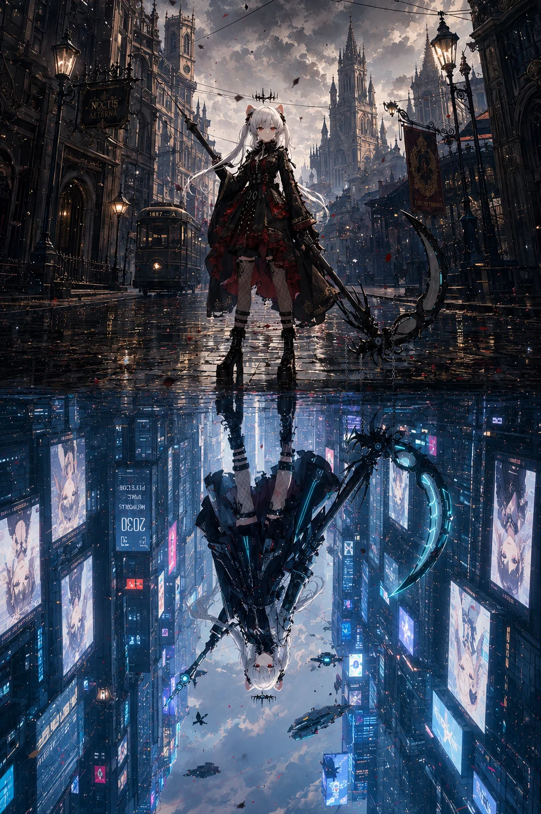

**Category:** Cosmic & Cinematic Scenes · **Tags:** `anime` `surreal` `parallel-worlds` `gothic` `futuristic` `mirrored-reality` `character-reference` `dual-version`

**📋 Prompt:**

```
Use the attached reference character ONLY for the character design, face, hairstyle, colors, silhouette, and overall character identity.
Create a surreal cinematic anime illustration of a city street divided by a massive reflective surface or impossible mirrored reality.

Core concept:
- the upper world and lower reflection are NOT identical
- both realities contain the SAME character in different versions
- the reflection reveals an alternate timeline or parallel dimension
- the transition between realities should feel mysterious and dreamlike
- visual storytelling must strongly emphasize contrast between eras

Upper world (Victorian / Gothic reality):
- elegant neo-victorian city architecture
- gothic buildings with ornate stone facades
- cathedral towers and iron street lamps
- wet cobblestone streets
- overhead tram wires and vintage transport
- muted gray-blue atmosphere with subtle gold accents
- floating ash, petals, confetti, or dust particles
- cinematic cloudy daylight
- melancholic gothic ambience

Upper character design:
- same character identity
- refined gothic/victorian-inspired outfit
- long dark coat, corset details, layered fabrics, lace, ribbons, gloves, elegant boots
- subtle aristocratic aesthetic
- calm melancholic expression
- graceful posture
- slightly dramatic wind movement in clothes and hair
- elegant anime gothic fashion without excessive complexity
- holding ONLY her massive black gothic scythe
- preserve the original scythe silhouette and dark ornate aesthetic
- NO umbrella
- NO parasol
- no additional handheld accessories

Lower reflection world (modern futuristic 2030 reality):
- ultra-clean modern city reinterpretation
- futuristic signage and holographic advertisements
- modern transit systems and sleek architecture
- subtle cyberpunk influences without neon overload
- reflective glass buildings and digital billboards
- cooler cyan and white lighting palette
- advanced but believable near-future technology
- atmospheric urban realism
- modern cables, drones, screens, and transportation details

Lower reflected character:
- exact same character identity
- fully redesigned futuristic 2030-inspired outfit
- sleek elegant techwear aesthetic
- asymmetrical futuristic jacket or coat
- high-tech fabrics, segmented materials, subtle glowing seams
- modern tactical-fashion silhouette
- cleaner and sharper design language than the gothic version
- futuristic boots and accessories integrated naturally into clothing
- confident posture and more direct expression
- mirrored positioning matching the upper version
- the weapon must ALSO be redesigned into a futuristic 2030 version
- futuristic scythe reinterpretation with advanced materials
- sleek black alloy construction
- glowing cyan or white energy accents
- mechanical segments and refined sci-fi detailing
- preserve the original silhouette identity of the scythe while modernizing it
- weapon should feel like the same scythe from another timeline
- NO umbrella
- NO parasol
- no unrelated props

Composition:
- strong centered perspective
- enormous reflective surface splitting realities
- reflection almost perfectly aligned but visibly different
- both characters clearly readable
- cinematic environmental storytelling
- layered urban depth
- dramatic vanishing point perspective

Camera and framing:
- wide-angle cinematic shot
- low camera close to reflective surface
- symmetrical composition with intentional asymmetrical details
- immersive environmental scale
- strong vertical architecture framing

Lighting:
- upper world uses soft golden daylight and gothic shadows
- lower world uses cooler futuristic ambient light
- realistic reflections and refractions
- subtle bloom and cinematic glare
- atmospheric particles visible in both worlds
- soft volumetric lighting

Extra reflection detail:
- ALL digital billboards, holographic advertisements, TV screens, posters, and electronic displays visible in the lower futuristic world must appear upside down relative to the upper world
- the screen content itself must clearly respect the mirrored reality logic
- advertisements and character images displayed on futuristic screens should be inverted vertically as if truly reflected through the dimensional surface
- maintain visual coherence between reflected architecture and reflected media displays
- upside-down screen imagery should subtly reinforce the surreal alternate-dimension effect

Art style:
- ultra detailed cinematic anime background art
- Makoto Shinkai-inspired environmental rendering
- painterly anime architecture
- highly detailed reflections
- emotional cinematic atmosphere
- premium anime movie key visual quality
- rich environmental storytelling
- refined anime character rendering

Mood:
- parallel worlds
- alternate timelines
- nostalgic vs futuristic contrast
- emotional mystery
- dreamlike urban fantasy
- bittersweet atmosphere
- surreal realism

IMPORTANT:
- preserve the attached character identity exactly
- both versions must clearly be the same person
- emphasize contrast between eras while maintaining visual harmony
- the lower version must visibly have BOTH futuristic clothing and futuristic weapon redesign
- avoid excessive neon cyberpunk
- avoid photorealism
- avoid chaotic compositions
- do not generate umbrellas, parasols, canes, staffs, handbags, or unrelated props
- maintain cinematic anime elegance

masterpiece, best quality, cinematic anime illustration, parallel worlds, mirrored reality, gothic anime city, futuristic anime city, alternate timeline, reflective street, emotional urban fantasy, ultra detailed architecture, anime environmental storytelling, surreal cinematic atmosphere
```

**📎 Requires:** An attached reference image — the *same character* appears as two stylistically-distinct versions, so identity must be locked while clothing and weapon are deliberately redesigned per timeline.

**💡 Why it works:** Probably the most ambitious prompt structurally — it asks GPT Image 2 to render *two distinct versions of the same character* in a single composition with mirrored positioning. The "upper world" / "lower reflection" / "lower character" three-block split lets the model treat each as its own design brief while the explicit `"both characters clearly readable"` and `"mirrored positioning matching the upper version"` lines anchor them spatially. The "Extra reflection detail" section is doing world-building work — telling the model that the dimensional split affects *information* too, not just architecture (upside-down billboards as a logical consequence). The repeated `"NO umbrella / NO parasol / no additional props"` block exists because the model tends to add umbrellas to gothic anime girls automatically — explicit negative listing kills the default.

**🔧 Variations:** swap `Victorian / Gothic` ↔ `Futuristic 2030` for different era contrasts (e.g. `Edo period` ↔ `cyberpunk`); change the weapon from scythe to your character's signature item (the prompt structure handles any weapon if you keep the "redesign with same silhouette identity" language); convert the reflection into `water surface in a flooded street` for a more naturalistic mirror.

---

### 📝 Typography & Poster Art

Prompts that integrate large cinematic typography into anime scenes, treating text as a compositional element rather than an overlay.

---

#### Cinematic Anime Poster with Integrated Typography

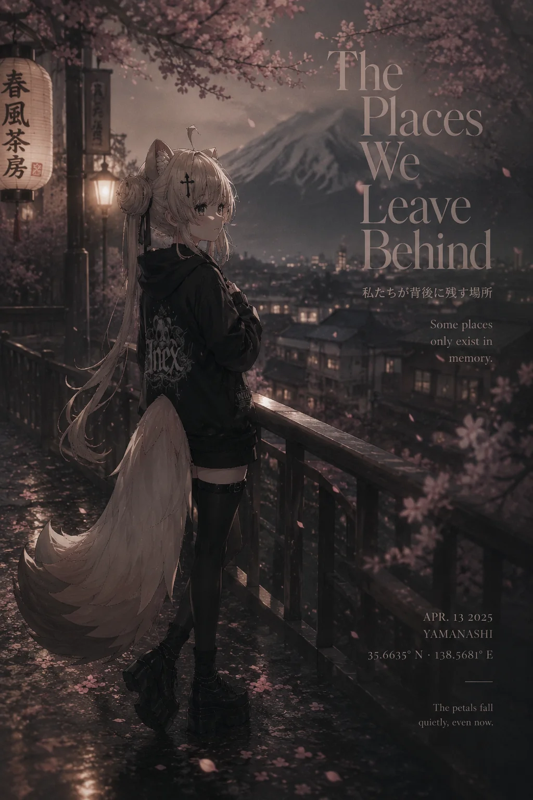

**Category:** Typography & Poster Art · **Tags:** `anime` `cinematic` `typography` `poster` `melancholic` `editorial` `character-reference`

**📋 Prompt:**

```
generate image:
Use the attached reference character ONLY for the character design, face, hairstyle, fox ears, tail, colors, outfit identity, accessories, silhouette, and overall personality.
DO NOT copy the reference pose.

Create a cinematic melancholic anime illustration with the character naturally integrated into the environment in a believable emotional pose.

Character posing rules:
- NEVER use T-pose, A-pose, model-sheet pose, idle VRChat pose, or reference-sheet stance
- avoid arms fully extended sideways
- body language must feel candid, cinematic, emotionally grounded, and naturally photographed
- use asymmetrical posture and subtle weight shifting
- hands should interact naturally with clothing, hair, railing, umbrella, pockets, sleeves, headphones, or environment
- prioritize poses seen in anime films, visual novel key art, or cinematic photography
- possible poses include:
  - standing quietly while looking into the distance
  - walking slowly through rain or petals
  - sitting on stairs, rooftops, train seats, or guardrails
  - leaning against utility poles, vending machines, windows, or fences
  - partially turned away from the camera
  - looking back over shoulder
  - holding sleeves close to chest against wind
  - resting hands in oversized hoodie pockets
  - crouching near puddles or fallen petals
  - subtle mid-motion walking poses
- facial expression should feel introspective, nostalgic, emotionally restrained, or quietly melancholic
- hair, sleeves, ribbons, and tail should react naturally to wind and movement
- avoid stiff symmetry
- avoid mannequin-like balance
- avoid generic "character showcase" composition

Scene and atmosphere:
- cinematic anime movie aesthetic
- environmental storytelling emphasized over character posing
- soft atmospheric haze
- drifting sakura petals
- wet pavement reflections
- distant urban lights or mountain silhouettes
- layered depth with foreground, midground, and background separation
- subtle film grain
- realistic cinematic lighting
- soft bloom and atmospheric diffusion
- subdued palette with muted pinks, charcoal blacks, foggy grays, and pale warm highlights

Typography and graphic design integration:
- include larger cinematic English typography integrated naturally into the environment
- typography should feel like refined anime movie poster design or melancholic visual novel key art
- use emotionally evocative English phrases, poetic fragments, location captions, timestamps, or reflective narration
- typography may occupy a significant portion of the negative space while remaining elegant and restrained
- allow tall vertical text compositions and layered cinematic title placement
- elegant serif typography strongly preferred
- typography should interact with atmospheric haze, sakura petals, and environmental depth
- use low-contrast off-white, pale gray, or faint sakura-tinted lettering
- text should softly blend into film grain and mist
- avoid bold commercial poster aesthetics
- avoid oversaturated or highly readable advertising typography
- preserve cinematic subtlety and editorial restraint

Examples of integrated text:
- "Spring remembers what we tried to forget."
- "The petals fall quietly, even now."
- "Some places only exist in memory."
- "APR. 13 2025 - YAMANASHI"
- "The silence between seasons."

Composition:
- cinematic framing with strong negative space
- portrait orientation
- layered depth and atmospheric perspective
- character should occupy only part of the frame, allowing the environment and typography to breathe
- composition should feel like a still frame from an emotional anime film
- highly detailed anime rendering
- masterpiece quality
- ultra detailed
- soft cinematic contrast
- emotional environmental storytelling
- natural anatomy and believable pose
- no T-pose
- no reference-sheet stance
- no symmetrical mannequin posture
```

**📎 Requires:** An attached reference image — used for identity essence only, with explicit `DO NOT copy the reference pose` directive.

**💡 Why it works:** This prompt sits at the intersection of three difficult things: pose authenticity (the long anti-T-pose block with 10 concrete pose examples), GPT Image 2's text rendering strength (paired with restraint — `low-contrast off-white` lettering, `avoid bold commercial poster aesthetics`), and editorial design composition. Including 5 example text strings is genius: the model picks one or generates similar phrasing, but the *register* is locked. Serif typography + sakura petals + film grain stacks reinforcing "anime movie poster" cues without ever using the word "poster" prescriptively. The result feels published, not promoted.

**🔧 Variations:** swap the example text lines for any 5 phrases in your desired tone (haiku fragments, song lyrics, location stamps); change `sakura petals` to `snow drift` or `falling autumn leaves` for seasonal variants; replace `serif typography` with `Japanese vertical kanji + small English subtitle` for a Japanese-poster aesthetic.

---

### 🪴 Brazilian Northeastern Folk Art

Character-translation prompts that reinterpret a reference into the visual language of traditional Pernambuco / sertão folk art — woodcut prints, clay sculpture, puppet theater, embroidery, baroque sacred art, carnival figures, and historical Northeastern aesthetics. Each prompt handles the *transformation rules* while you supply the character.

---

#### Cordel Woodcut (Xilogravura) Portrait

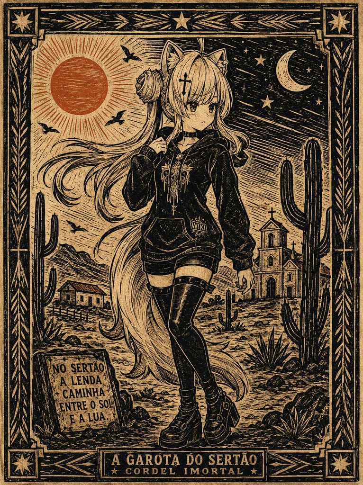

**Category:** Brazilian Northeastern Folk Art · **Tags:** `xilogravura` `cordel` `woodcut` `folk-art` `nordeste` `character-reference` `identity-lock`

**📋 Prompt:**

```
Transform the attached character into a traditional Brazilian Northeastern xilogravura / cordel illustration while fully preserving the original character identity, face, hairstyle, outfit silhouette, colors, and personality.

IMPORTANT CHARACTER RULE:
- if the reference image is in T-pose, A-pose, idle rigging pose, model-sheet pose, or any unnatural 3D reference stance, DO NOT replicate that pose
- automatically reinterpret the character into a natural, expressive, cinematic pose
- use dynamic body language appropriate for a legendary cordel protagonist
- preserve anatomical proportions and recognizable silhouette while replacing the original static pose
- avoid stiff symmetry in the arms
- create believable movement in clothing, hair, and posture

Style inspired by classic Brazilian cordel woodcut prints:
- handcrafted woodcut engraving aesthetic
- bold black ink carving lines
- strong high-contrast shapes
- visible rough carved textures
- rustic handmade appearance
- dramatic cross-hatching and parallel cut marks
- limited color palette inspired by aged paper, charcoal black, burnt orange, deep red, dusty beige, and dry-earth tones
- flat printmaking composition
- folk-art energy
- authentic northeastern Brazilian visual language

Scene should feel like a legendary cordel tale from the sertao:
- dusty wind
- dramatic sun
- symbolic background elements
- cacti
- birds
- moon and stars
- rural Brazilian atmosphere
- decorative border ornaments common in cordel covers

Composition:
- centered heroic character
- poster-like framing
- highly detailed engraved textures
- symmetrical folk-art balance
- vintage print imperfections
- aged paper texture
- expressive shadows carved like woodcuts

Suggested poses:
- walking through the sertao wind
- holding part of the hoodie or hair
- looking toward the horizon
- slightly turned torso
- one hand raised naturally
- dynamic flowing hair
- calm but powerful stance
- subtle movement in legs and shoulders

Important:
Do NOT redesign the character.
Do NOT turn the character into a different person.
Keep the exact facial identity and recognizable features from the reference image.
Only translate the character into authentic xilogravura / literatura de cordel visual language.

Ultra detailed, authentic Brazilian cordel engraving style, masterful woodcut illustration, museum-quality folk print aesthetic.
```

**📎 Requires:** An attached reference image of the character to preserve.

**💡 Why it works:** The opening "IMPORTANT CHARACTER RULE" block solves a specific pain point — VRChat/3D model references are usually in T-pose or A-pose, which the model would otherwise faithfully reproduce. By explicitly listing those static poses as forbidden *and* providing a curated "Suggested poses" list at the end, you get a natural cordel hero stance regardless of how stiff the source reference is. The dual identity-lock (open paragraph + closing "Do NOT redesign" reminder) sandwiches the style-translation instructions, which keeps the model focused on *medium translation* rather than *character redesign*. The limited palette (aged paper, charcoal, burnt orange, deep red, dusty beige) gives the model concrete swatches instead of vague "warm tones."

**🔧 Variations:** swap `walking through the sertao wind` for `riding a horse across the sertao` for a more dramatic protagonist shot; change the palette accents from `burnt orange, deep red` to `indigo blue, forest green` for a Pernambuco coastal folk variant; remove the "Suggested poses" block entirely if you actually *want* the model to lean into the reference pose.

---

#### Alto do Moura Clay Sculpture (Mestre Vitalino Style)

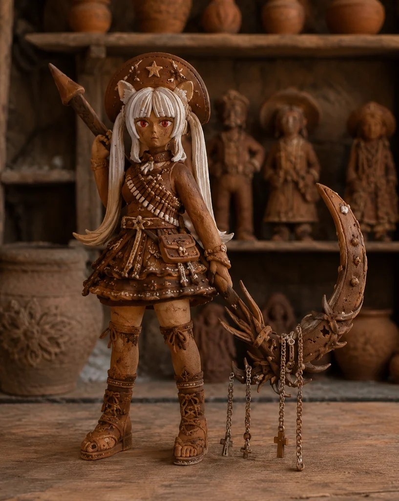

**Category:** Brazilian Northeastern Folk Art · **Tags:** `clay` `ceramics` `mestre-vitalino` `alto-do-moura` `cangaceiro` `folk-sculpture` `character-reference`

**📋 Prompt:**

```
Transform the attached anime character into an authentic traditional Northeastern Brazilian clay folk sculpture in the exact rustic aesthetic of Alto do Moura and Mestre Vitalino ceramics, strongly inspired by classic handcrafted cangaceiro statues from Pernambuco folk art.

The character must preserve her recognizable identity, face, hairstyle, white hair, red eyes, twin tails, animal ears, gothic personality, and weapon silhouette, but reinterpret all clothing and accessories as traditional handmade cangaco attire crafted entirely from clay.

Visual Style:
- genuine Brazilian artesanato aesthetic
- rustic Alto do Moura ceramic sculpture
- simplified handcrafted proportions
- naive folk-art anatomy
- matte unfired terracotta appearance
- warm reddish-brown clay tones
- visible handmade imperfections
- sculpted with simple rounded forms
- subtle fingerprints, carving marks, and uneven handmade texture
- expressive folk-art eyes typical of Northeastern clay figures
- museum-quality documentary realism

Character Adaptation:
- reinterpret the gothic dress as traditional cangaceira clothing
- leather cangaco hat with star details and stitched ornaments
- rustic leather belts and cartridge straps
- simplified clay-rendered embroidered details
- traditional sertao-inspired skirt and clothing layers
- handmade clay sandals or rustic boots
- weapons redesigned as handcrafted folk-art clay versions while preserving their recognizable silhouettes
- maintain the character's stance, personality, and overall silhouette
- preserve the white hair and twin-tail hairstyle as sculpted clay forms
- preserve the animal ears and recognizable facial identity

Important:
- do NOT redesign the character into another person
- do NOT modernize the sculpture
- avoid anime plastic appearance
- avoid realistic human anatomy
- prioritize authentic Brazilian folk ceramic craftsmanship over anime aesthetics
- the sculpture should look like it was handmade by a real artisan from Pernambuco

Scene:
- rustic wooden shelf or old artisan workshop
- low warm ambient lighting
- earthy shadows
- handmade pottery and clay folk statues in the background
- subtle dust particles in the air
- authentic sertao atmosphere
- documentary photography realism

Composition:
- full-body sculpture
- standing pose
- centered composition
- photographed like a real museum or artisan-shop ceramic piece
- shallow depth of field
- highly detailed clay surface
- realistic ceramic shading
- natural imperfections and asymmetry

Reference Style: traditional cangaceiro clay statues from Alto do Moura, Mestre Vitalino folk ceramics, authentic Pernambuco artesanato, Brazilian sertao folk sculpture realism.
```

**📎 Requires:** An attached reference image of the character. The specific traits in the second paragraph (`white hair, red eyes, twin tails, animal ears, gothic personality, weapon silhouette`) are tuned to a specific character — **edit those to match your reference** when reusing this prompt.

**💡 Why it works:** This prompt fuses *medium translation* (anime → clay sculpture) with *cultural translation* (modern outfit → cangaceiro attire) simultaneously. The "Character Adaptation" block does the cultural mapping piece by piece (dress → cangaceira clothing, weapons → folk-art clay versions) which prevents the model from defaulting to generic "rustic" without committing to the cangaço aesthetic. Naming Mestre Vitalino as a specific artisan anchors the visual register much more reliably than "Brazilian folk sculpture" alone. The "Avoid" block ("anime plastic appearance, realistic human anatomy") is crucial — without it, the model often produces a hybrid anime-clay look instead of authentic naïve folk anatomy.

**🔧 Variations:** swap the character-specific trait list in paragraph 2 to match your reference; change `cangaceira` → `lavadeira` (washerwoman) or `vaqueiro` (cowboy) for different traditional Northeastern character archetypes; replace `Mestre Vitalino` with `Manuel Eudocio` for a slightly different Alto do Moura artisan signature.

---

#### Mamulengo Puppet (Pernambuco Folk Theater)

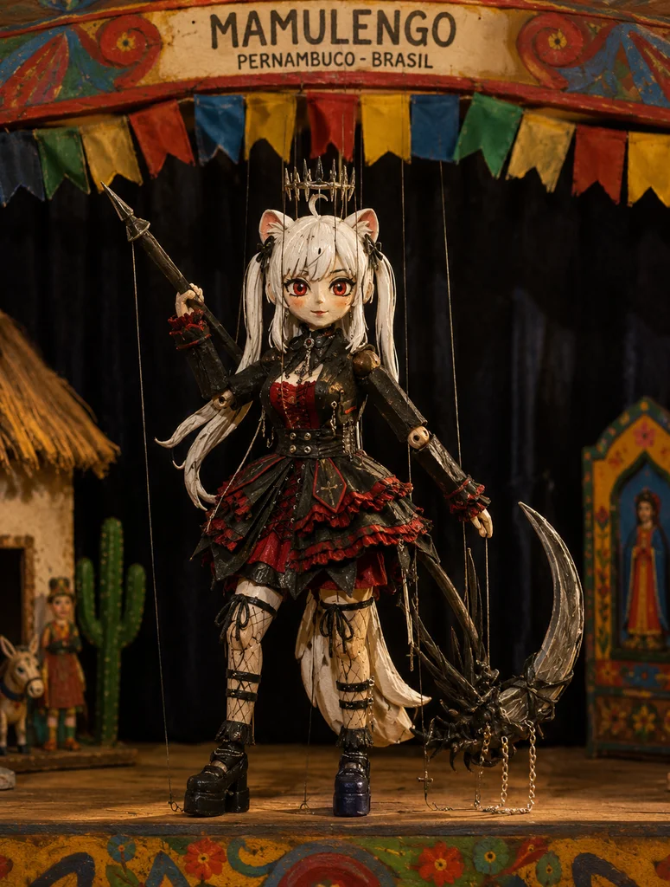

**Category:** Brazilian Northeastern Folk Art · **Tags:** `mamulengo` `puppet` `folk-theater` `pernambuco` `handcrafted` `character-reference` `identity-lock`

**📋 Prompt:**

```
Transform the attached character into an authentic Brazilian Northeastern mamulengo puppet while fully preserving the original character identity, face, hairstyle, outfit silhouette, colors, and personality.

Style inspired by traditional Pernambuco mamulengo folk theater:
- handcrafted puppet aesthetic
- handmade wooden head and fabric body
- expressive exaggerated folk-art facial features
- painted artisan textures
- rustic theatrical craftsmanship
- visible seams, stitching, cloth folds, and puppet construction details
- colorful traditional Brazilian fabrics
- playful folkloric proportions
- authentic handmade imperfections

Visual characteristics:
- articulated puppet arms and hands
- carved wooden or papier-mache head
- painted eyes and facial expressions
- fabric costume inspired by Northeastern Brazilian folk theater
- slightly worn handmade appearance
- vibrant but earthy folk-art colors
- theatrical puppet-stage energy

Scene:
- traditional mamulengo puppet theater stage
- colorful Festa Junina flags and decorations
- rustic wooden stage
- warm theatrical lighting
- folk festival atmosphere
- dark stage curtain background
- handcrafted props and rural Brazilian cultural elements

Composition:
- character presented as the main puppet performer
- cinematic puppet theater framing
- expressive pose with puppet-like movement
- shallow depth of field
- realistic textile and wood textures
- highly detailed handcrafted materials
- documentary-style folk photography realism

Mood:
- joyful
- whimsical
- folkloric
- culturally authentic
- energetic Brazilian street-theater atmosphere

Important:
Do NOT redesign the character.
Do NOT turn the character into a different person.
Preserve all recognizable visual traits from the reference image.
Only reinterpret the character as a traditional Northeastern Brazilian mamulengo puppet.

Ultra detailed Brazilian folk puppet realism, authentic Pernambuco mamulengo aesthetic, handcrafted artisan theater masterpiece, cultural documentary quality.
```

**📎 Requires:** An attached reference image of the character to preserve.

**💡 Why it works:** Compared to the xilogravura prompt, this one preserves anime-typical "exaggerated folk-art facial features" instead of fighting against them — mamulengos themselves have exaggerated features, so the natural overlap with anime stylization works in your favor. The "visible seams, stitching, cloth folds, and puppet construction details" line is the high-leverage instruction: GPT Image 2 takes that literally and renders actual textile structure rather than smooth illustrated fabric, which is what sells the "this is a real handmade puppet" reading. The Festa Junina flags + dark stage curtain combo gives the model a cohesive stage scene without leaving composition up to chance.

**🔧 Variations:** swap `mamulengo puppet theater stage` for `outdoor street performance setting` for a more raw, documentary feel; change `papier-mache head` → `carved wooden head` to force a more rigid, traditional puppet aesthetic; remove `Festa Junina flags` if you want a less festival-coded background.

---

#### Wooden Folk-Art Puppet Sculpture

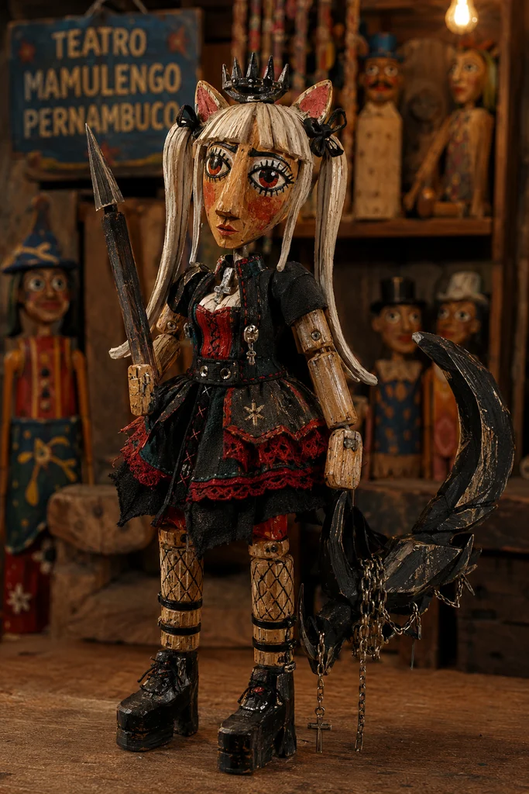

**Category:** Brazilian Northeastern Folk Art · **Tags:** `wooden-puppet` `mamulengo` `boneco-de-olinda` `carved-wood` `folk-sculpture` `pernambuco` `style-translation` `identity-flex`

**📋 Prompt:**

```
Redesign the attached character as an authentic handcrafted Northeastern Brazilian folk-art wooden puppet sculpture, inspired by mamulengo puppets, Bonecos de Olinda, rustic artisan carvings, and traditional Pernambuco folk craftsmanship.

The character should NOT remain anatomically human.
Instead, fully reinterpret the design as a stylized wooden folk-art figure made from carved wood pieces and handcrafted artisan materials.

Core redesign direction:
- oversized caricatured wooden head
- simplified geometric anatomy
- segmented puppet-like limbs
- cylindrical arms and legs
- visible wooden joints and construction
- exaggerated facial proportions
- elongated carved nose
- painted expressive eyes
- handcrafted asymmetrical shapes
- rustic folk-art distortion
- theatrical puppet silhouette

Material construction:
- carved painted wood
- visible wood grain
- handmade carving marks
- chipped paint details
- artisan brushstrokes
- matte and semi-gloss painted surfaces
- handcrafted imperfections
- rustic assembly techniques
- visible screws, pins, rope joints, or artisan connections
- traditional handmade Brazilian puppet craftsmanship

Facial redesign:
- reinterpret the original face into a caricatured folk-art sculpture
- preserve recognizable identity through colors, hairstyle, accessories, and expression
- simplified puppet-like facial construction
- painted eyebrows and eyes
- sculpted cheeks and jawlines
- expressive folkloric exaggeration
- stylized artisan proportions instead of realism

Clothing redesign:
- reinterpret all clothing as handcrafted fabric costume pieces
- stitched folk fabrics
- rustic embroidery
- patchwork textures
- simplified sculpted clothing folds
- traditional Northeastern Brazilian artisan aesthetics
- decorative handcrafted details

Scene:
- rustic artisan workshop
- puppet theater backstage
- Pernambuco carnival folk-art environment
- warm ambient lighting
- wooden shelves
- handcrafted cultural atmosphere
- Brazilian folk festival mood

Composition:
- full-body redesign showcase
- character standing like a handcrafted puppet sculpture
- cinematic folk-art photography
- shallow depth of field
- highly detailed material realism
- emphasis on wood texture and handcrafted construction

Mood:
- whimsical
- folkloric
- rustic
- expressive
- handcrafted
- culturally authentic

Avoid:
- realistic human anatomy
- polished modern toy aesthetics
- plastic textures
- CGI perfection
- anime-style rendering
- mass-produced doll appearance

Ultra detailed handcrafted wooden folk-art character redesign, authentic Northeastern Brazilian artisan puppet aesthetic, rustic carved wood sculpture realism, museum-quality cultural folk-art craftsmanship.
```

**📎 Requires:** An attached reference image used as **loose identity inspiration** — the prompt deliberately overrides faithful preservation, keeping only colors, hairstyle, accessories, and overall expression as anchor cues.

**💡 Why it works:** This prompt is a hybrid of the mamulengo and Boneco de Olinda directions, but with a critical new structural choice: it splits the redesign into four explicit *layers* (Core / Material / Facial / Clothing), each with its own checklist. GPT Image 2 handles structured per-layer instructions much better than a single dense paragraph because each section becomes its own internal "rendering pass." The line `"The character should NOT remain anatomically human"` is doing heavy lifting at the top — it gives the model permission to break human proportions, which is the single biggest mental hurdle when translating an anime/3D character into folk sculpture.

**🔧 Variations:** swap `rustic artisan workshop` → `Olinda carnival street parade` for an outdoor festive context; change `full-body redesign showcase` → `cinematic close-up portrait` to emphasize the carved-wood face details; remove the `Clothing redesign` block and add `traditional cangaceiro/cangaceira leather outfit` to push toward sertão-themed puppets specifically.

---

#### Sertão Naïve Folk-Art Painting (005)

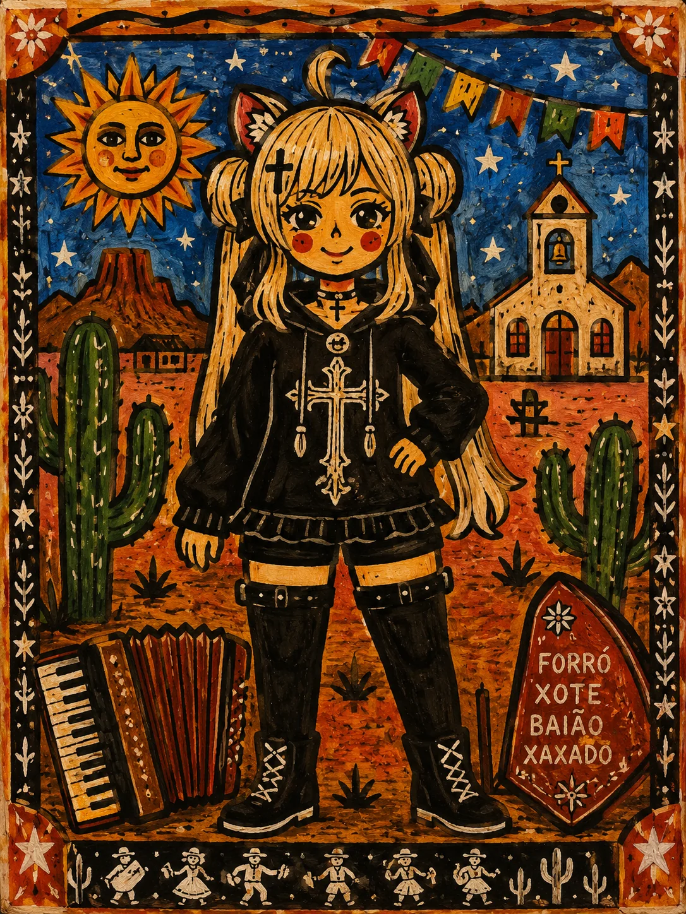

**Category:** Brazilian Northeastern Folk Art · **Tags:** `naive-painting` `sertao` `forro` `folk-painting` `nordeste` `feira-painting` `style-translation`

**📋 Prompt:**

```
Transform the attached character into an authentic Northeastern Brazilian folk-art painting inspired by rustic sertão musical illustration, handmade feira paintings, naïve Brazilian popular art, and traditional forró/cordel visual culture.

IMPORTANT STYLE GOAL:
The image should look like a handcrafted Brazilian folk painting made by a rural artisan using simple materials, expressive brushwork, and symbolic cultural imagery — NOT modern digital illustration.

IMPORTANT CANVAS SETTINGS:
- ultra high resolution
- non-transparent background
- full-body character completely visible
- centered composition
- poster-like folk-art framing

Artistic style:
- primitive naïve folk-art painting
- hand-painted appearance
- flat two-dimensional perspective
- simplified anatomy
- exaggerated symbolic proportions
- thick black contour lines
- rough expressive brushstrokes
- handcrafted imperfections
- rustic artisanal painting texture
- uneven paint application
- culturally authentic Brazilian sertão visual language

Visual characteristics:
- warm earthy palette
- strong oranges, reds, yellows, browns, dusty blues, and black outlines
- stylized folkloric facial construction
- almond-shaped or simplified eyes
- symbolic smiling expressions
- geometric simplified bodies
- decorative repetitive patterns
- rustic painted textures
- minimal realistic shading
- expressive primitive visual storytelling

Character redesign:
- reinterpret the character completely in this handcrafted folk-art style
- transform anatomy into simplified painted folk forms
- preserve recognizable identity through colors, hairstyle, silhouette, and accessories
- stylize clothing into traditional sertão-inspired artisan shapes
- simplify details into symbolic painted forms
- expressive folkloric exaggeration instead of realism

Scene atmosphere:
- Northeastern Brazilian sertão environment
- Festa Junina / forró cultural energy
- symbolic sun
- cacti
- rustic dry landscape
- accordion or traditional musical elements
- decorative folk patterns
- handmade cultural atmosphere
- joyful communal rural celebration mood

Composition:
- frontal folk-art arrangement
- character standing like a symbolic cultural figure
- decorative mural-like composition
- balanced handcrafted visual rhythm
- large color blocks separated by black outlines
- flat painted background
- rustic artisan poster aesthetic

Texture and material:
- visible paint texture
- handmade paper or painted wall feel
- pigment irregularities
- rough black ink outlines
- dry brush marks
- authentic handcrafted imperfections
- tactile folk-art realism

Mood:
- warm
- celebratory
- rustic
- musical
- folkloric
- culturally authentic
- handmade and expressive

Avoid:
- photorealism
- anime rendering
- realistic anatomy
- cinematic lighting
- glossy digital painting
- modern vector art
- polished CGI appearance
- hyper-detail realism
- transparent background

Ultra detailed Brazilian naïve folk-art masterpiece, authentic sertão musical painting aesthetic, handcrafted cordel-inspired rural illustration, museum-quality Northeastern Brazilian cultural art.
```

**📎 Requires:** An attached reference image — identity preserved through colors/hairstyle/silhouette, but the rendering itself is fully translated into naïve folk-painting language.

**💡 Why it works:** This prompt explicitly tells the model `"NOT modern digital illustration"` — a rare and powerful negative directive at the top. The combo of `"thick black contour lines"` + `"rough expressive brushstrokes"` + `"large color blocks separated by black outlines"` produces the unmistakable visual signature of Brazilian feira paintings: high-contrast outlined shapes with flat color fills. The palette is locked to a specific earthy set (oranges, reds, yellows, browns, dusty blues) rather than vague "warm tones," which keeps the output from drifting into generic folk-art that could be from anywhere. The "Avoid" block targeting `cinematic lighting` and `glossy digital painting` is key — those are the model's defaults, so naming them as failure modes shifts the output decisively toward authentic naïve craft.

**🔧 Variations:** swap `Festa Junina / forró` for `vaqueiro nordestino` or `pesca artesanal` for different sertão cultural contexts; change the palette to `indigo blues + sea greens + sand` for a Brazilian coastal folk-painting variant; replace `accordion` with `viola caipira` for an interior-Brazil musical anchor.

---

#### Psychedelic Sertão Surrealist Collage (006)

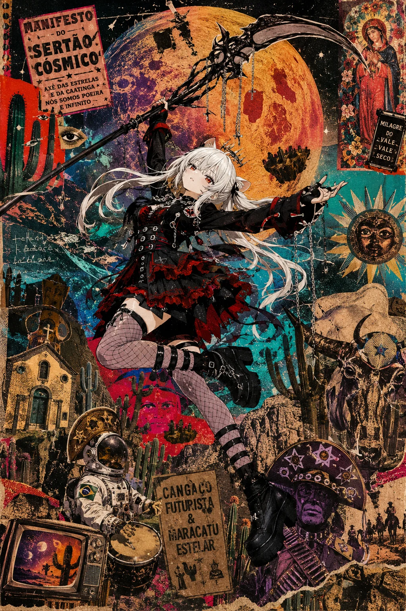

**Category:** Brazilian Northeastern Folk Art · **Tags:** `psychedelic` `collage` `surrealism` `retro-futurism` `nordeste` `experimental` `cosmic-folklore` `analog-print`

**📋 Prompt:**

```
Transform the attached character into a completely reimagined surreal Northeastern Brazilian psychedelic collage artwork with a NEW DYNAMIC POSE integrated into the composition itself — not standing still, but interacting physically and symbolically with the surreal environment.

The character should now appear in an expressive cinematic pose inspired by ritual dance, folkloric performance, cosmic trance, vaqueiro movement, maracatu energy, cangaço iconography, and avant-garde underground Brazilian poster aesthetics.

IMPORTANT:
The original pose must be completely transformed.
Avoid static "character showcase" posture.
The body language must feel alive, symbolic, theatrical, experimental, and integrated into the surreal collage storytelling.

NEW POSE IDEAS:
- floating diagonally through space
- crouching atop impossible cactus formations
- leaning backward in ecstatic trance
- twisting mid-motion like a ritual dance
- dragging the giant scythe across fragmented desert planets
- suspended upside-down among collage fragments
- stepping through cosmic paper layers
- arms spread dramatically toward a gigantic moon
- walking through surreal sand dunes with distorted perspective
- body fragmented into layered collage cutouts
- interacting with floating folkloric symbols
- spiraling through psychedelic sertão winds
- dynamic asymmetrical silhouette
- cinematic movement with exaggerated foreshortening

STYLE GOAL:
The image should feel like an obscure experimental Brazilian album cover discovered in an abandoned cultural archive from an alternate retro-futurist Northeast Brazil.

Aesthetic influences:
- psychedelic sertão futurism
- tropical surrealism
- retro Brazilian counterculture graphics
- experimental cordel art
- handmade analog collage
- underground Brazilian poster design
- cosmic regional folklore
- avant-garde Latin American print culture
- surreal mixed-media installation aesthetics

VISUAL LANGUAGE:
- asymmetrical composition
- chaotic but intentional layering
- surreal symbolic storytelling
- rough handmade montage feeling
- overlapping paper fragments
- mixed photography and painting
- torn paper textures
- photocopy artifacts
- halftone print textures
- VHS distortion
- chromatic aberration
- offset-print imperfections
- faded vintage ink
- rough scan textures
- analog media realism
- fragmented spatial logic

SCENE ELEMENTS:
- gigantic moon filling the background
- impossible desert planets
- floating cacti
- cosmic skies
- astronauts mixed with sertão imagery
- folkloric Brazilian symbolism
- retro CRT technology
- floating animals
- celestial mandalas
- dreamlike desert ruins
- surreal Brazilian religious iconography
- distorted horizons
- impossible architecture
- floating paper fragments
- celestial storms
- regional mysticism fused with sci-fi

CHARACTER REDESIGN:
- preserve recognizable hair, silhouette, red eyes, gothic palette, and iconic weapon
- reinterpret clothing with surreal retro-folk Brazilian textures
- integrate the scythe into the environment like a symbolic cosmic artifact
- mix painted, printed, photographic, and collage textures
- allow partial abstraction and symbolic fragmentation
- incorporate folkloric ornaments and psychedelic regional motifs

COLOR PALETTE:
- neon red
- electric cyan
- acid green
- cosmic purple
- saturated magenta
- desert orange
- moonlit blue
- deep black shadows
- faded vintage yellows
- psychedelic gradients
- high-contrast analog lighting

MOOD:
- mystical
- uncanny
- nostalgic
- cosmic
- poetic
- folkloric
- psychedelic
- ritualistic
- dreamlike
- culturally surreal

TEXTURE EMPHASIS:
- visible paper grain
- ripped collage edges
- dirty print artifacts
- analog paint layers
- magazine cutout textures
- silkscreen imperfections
- xerox distortion
- old Brazilian poster realism
- tactile handmade materials

Avoid:
- static character pose
- centered symmetry
- clean digital illustration
- polished CGI
- generic anime wallpaper composition
- sterile cyberpunk
- smooth rendering
- modern minimalist aesthetics
- plain background

Ultra-detailed Brazilian psychedelic folk-surrealist collage masterpiece, dynamic cinematic pose, cosmic sertão retro-futurism, experimental Northeastern Brazilian cultural art, underground Brazilian avant-garde poster aesthetic, ritual movement, dreamlike analog montage composition.
```

**📎 Requires:** An attached reference image — identity preserved through hair/silhouette/eyes/weapon, with heavy permission to fragment and stylize.

**💡 Why it works:** Three structural tricks make this prompt go far beyond generic "psychedelic art" requests. First, the 14-item "NEW POSE IDEAS" list explicitly forbids static showcase posture and gives the model a curated pool of expressive movement choices — most prompts under-specify pose. Second, the "STYLE GOAL" frame as "*obscure experimental Brazilian album cover from an alternate retro-futurist Northeast*" gives the renderer a *cultural artifact identity* to mimic, which is a much stronger anchor than listing aesthetic adjectives. Third, the analog texture stack (paper grain + ripped edges + xerox + halftone + VHS + chromatic aberration) is what differentiates this from clean digital surrealism — those imperfections are the entire aesthetic.

**🔧 Variations:** swap `gigantic moon` for `enormous setting sun` for a hot-tone variant; change `astronauts + sertão imagery` to `divers + caatinga` for an aquatic surreal mix; replace the album-cover frame with `vintage Brazilian movie poster discovered in archives` for slightly different texture priorities.

---

#### Authentic Boneco de Olinda (Cultural Documentary) (007)

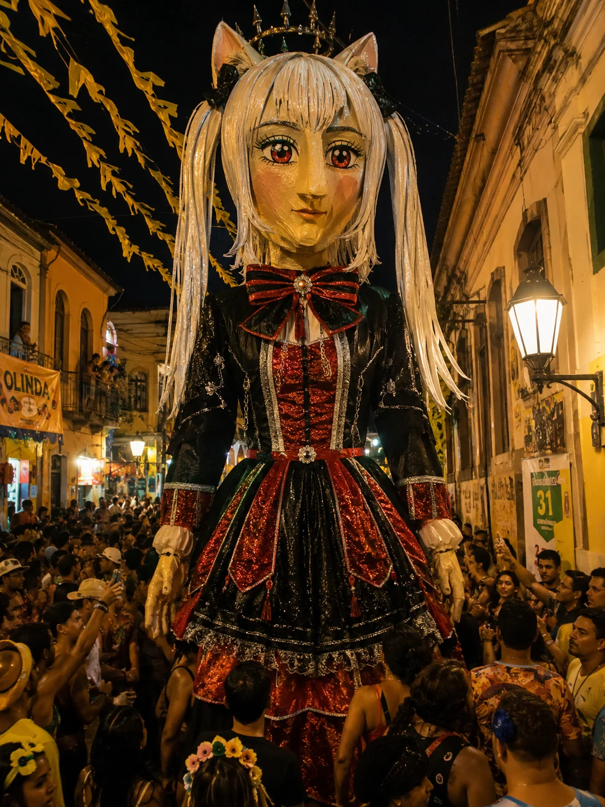

**Category:** Brazilian Northeastern Folk Art · **Tags:** `boneco-de-olinda` `carnival` `papier-mache` `pernambuco` `documentary` `street-photography` `cultural-realism`

**📋 Prompt:**

```
Transform the attached character into a gigantic authentic Boneco de Olinda carnival puppet from Pernambuco, Brazil.

IMPORTANT:
The character must be FULLY REIMAGINED as a traditional Boneco de Olinda giant puppet — not merely wearing carnival clothes.
The final result should look like a real handcrafted Brazilian carnival giant being carried through the streets during the Olinda carnival.

Core redesign:
- gigantic oversized puppet head
- massive caricatured facial proportions
- long stylized nose
- exaggerated painted eyes and eyebrows
- simplified folkloric facial anatomy
- handcrafted papier-mâché head construction
- visible artisan sculpting imperfections
- elongated puppet body
- giant carnival costume
- theatrical folk-art silhouette
- towering puppet scale above the crowd

Identity preservation:
- preserve recognizable facial identity through hairstyle, colors, expression, accessories, and key silhouette traits
- reinterpret all facial features into caricatured Boneco de Olinda proportions
- maintain recognizable personality while transforming the character into a folkloric carnival giant

Material realism:
- painted papier-mâché textures
- handcrafted wood and fabric construction
- visible brushstrokes
- artisan paint imperfections
- sewn carnival fabrics
- embroidered decorative details
- metallic trims and ribbons
- handcrafted seams and folds
- authentic carnival craftsmanship
- realistic worn handmade textures

Costume design:
- extravagant Pernambuco carnival outfit
- vibrant folkloric costume
- sequins
- ribbons
- glitter embroidery
- oversized decorative bowties or collars
- traditional carnival tailoring
- luxurious but handcrafted appearance
- strong regional Brazilian visual identity

Scene:
- crowded Olinda carnival street at night
- massive festive crowd surrounding the puppet
- yellow festa banners overhead
- colonial Brazilian houses
- warm street lighting
- energetic carnival atmosphere
- people dancing and celebrating
- authentic Pernambuco street carnival energy
- documentary photography realism

Composition:
- low-angle cinematic framing emphasizing the giant scale
- full-body puppet visible
- towering over the crowd
- dense crowd composition
- realistic carnival street depth
- dynamic documentary-style photography
- highly detailed environment and costume textures

Mood:
- euphoric
- folkloric
- theatrical
- joyful
- chaotic
- culturally authentic
- energetic Brazilian carnival atmosphere

Visual style:
- realistic cultural photography
- cinematic street photojournalism
- vibrant carnival colors
- dramatic nighttime lighting
- authentic Brazilian folk-art realism
- handcrafted puppet realism

Avoid:
- anime aesthetics
- realistic human anatomy
- plastic mascot appearance
- modern mascot costume design
- CGI perfection
- clean commercial parade aesthetics
- theme-park mascot look

Ultra detailed authentic Boneco de Olinda giant puppet redesign, handcrafted Pernambuco carnival realism, Brazilian folk-art festival masterpiece, cinematic documentary carnival photography.
```

**📎 Requires:** An attached reference image — identity preserved through hairstyle/colors/expression, with full permission to transform anatomy into caricatured puppet proportions.

**💡 Why it works:** Where prompt 004 produces a *display sculpture* of the character as wooden puppet, this prompt pushes for **cultural documentary realism** — the character isn't a static art piece but a *carnival giant being paraded through Olinda streets at night*. The low-angle framing + dense crowd + colonial Brazilian houses + yellow banners overhead is what sells the scene as real street photojournalism. The "Avoid" block explicitly killing `theme-park mascot look` and `clean commercial parade aesthetics` is important — without it, the model defaults to Disney-parade-float aesthetic. The night setting with warm street lighting forces commitment to a specific carnival moment rather than a generic daytime puppet showcase.

**🔧 Variations:** swap `night` for `late afternoon golden hour` for a brighter documentary mood; change the location from `Olinda` to `Recife Galo da Madrugada parade` for a different specific Pernambuco carnival context; remove `crowd composition` and use `solitary puppet against colonial church facade` for a more melancholic standalone shot.

---

#### Naïve Folk-Mural Integration (008)

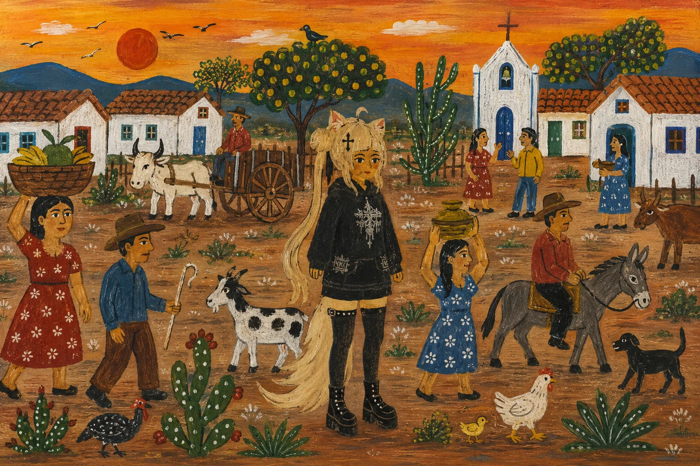

**Category:** Brazilian Northeastern Folk Art · **Tags:** `mural` `naive-painting` `sertao` `primitive-art` `folk-mural` `character-integration` `anti-anime`

**📋 Prompt:**

```
Transform the attached character into an authentic handcrafted Northeastern Brazilian naïve folk-art painting where the CHARACTER ITSELF is COMPLETELY repainted in the SAME visual language as the environment, villagers, animals, and scenery — absolutely no separation between character rendering style and background rendering style.

CRITICAL STYLE PRIORITY:
The attached character MUST lose ALL traces of modern anime rendering, glossy digital shading, 3D VTuber aesthetics, cel-shading, realistic anatomy, game-art rendering, or polished illustration techniques.

The character must look as if painted by the SAME rural Brazilian folk artisan who painted the entire countryside mural.

The final image should feel like a genuine handcrafted Brazilian primitive painting from the sertão, where every element shares the exact same artisanal naïve aesthetic.

MANDATORY CHARACTER TRANSFORMATION:
- flatten the character into primitive folk-art geometry
- fully remove 3D appearance
- remove anime rendering language
- remove modern digital-art finish
- simplify anatomy into rustic handcrafted painted forms
- simplify hands, limbs, and proportions intentionally
- reduce facial detail dramatically
- use folk-art facial construction:
  - simple almond eyes
  - tiny stylized nose
  - minimal mouth
  - painted folk expression
- paint hair as simplified decorative shape masses
- simplify clothing folds into painted symbolic shapes
- integrate the hoodie into rustic folkloric painted aesthetics
- reinterpret black clothing using matte painted pigment texture
- convert all accessories into simplified painted symbols
- repaint boots, stockings, and hoodie in handcrafted primitive style
- preserve only the recognizable silhouette:
  - blonde hair
  - twin buns
  - animal ears
  - long tail
  - black outfit
- make the character look painted directly onto wood or canvas using gouache or acrylic
- visible brush texture everywhere
- no smooth gradients
- no polished rendering
- no studio-quality character finish
- no visual hierarchy separating character from environment
- character MUST have the SAME level of simplification as villagers and animals

VERY IMPORTANT:
The character should resemble traditional Brazilian folk paintings from Northeastern artisan culture, similar to hand-painted rural murals and popular naïve countryside paintings.

The character must appear:
- rustic
- symbolic
- folkloric
- handcrafted
- communal
- decorative
- painted with emotional simplicity
- intentionally imperfect
- visually integrated into the mural composition

ENVIRONMENT STYLE:
Authentic Northeastern Brazilian sertão countryside naïve painting.

Artistic style:
- Brazilian naïve folk art
- primitive-art painting
- handcrafted mural aesthetic
- popular countryside painting
- flat two-dimensional composition
- decorative spatial organization
- simplified perspective
- symbolic storytelling
- folkloric visual rhythm
- artisanal painted textures

Scene elements:
- white rural houses with clay tile roofs
- dirt roads
- ox carts
- villagers carrying baskets and supplies
- goats, cows, chickens, donkeys, birds
- cactus and dry sertão vegetation
- decorative trees with circular foliage
- warm sunset sky
- earthy orange soil
- bright folkloric greens and blues
- communal countryside atmosphere
- peaceful rural storytelling

COMPOSITION:
- panoramic mural-like arrangement
- many small rural interactions happening simultaneously
- decorative balance between houses, trees, villagers, and animals
- flat readable storytelling composition
- handcrafted ornamental rhythm
- character naturally inserted among villagers rather than posed separately

TEXTURE AND MATERIAL:
- matte gouache or acrylic paint feel
- painted wood or canvas texture
- visible handmade brushwork
- uneven artisanal pigment application
- rustic imperfections
- handcrafted Brazilian popular-art realism

ABSOLUTELY AVOID:
- anime aesthetics
- VTuber appearance
- glossy rendering
- cel shading
- realistic anatomy
- cinematic lighting
- modern digital illustration
- hyper-detailing
- polished character rendering
- sharp digital gradients
- game-art aesthetics
- semi-realism
- photorealism
- modern stylization
- isolated character composition
- high-detail face rendering
- 3D shading
- studio-quality finish

The final result must look indistinguishable from an authentic museum-quality Northeastern Brazilian naïve folk-art mural painted entirely by hand by a traditional sertão artisan painter.
```

**📎 Requires:** An attached reference image — the character-specific silhouette traits in the "preserve only the recognizable silhouette" block (`blonde hair, twin buns, animal ears, long tail, black outfit`) should be edited to match your reference.

**💡 Why it works:** This is the most *aggressive style-translation prompt* in the entire collection — note the all-caps `"CRITICAL STYLE PRIORITY"` and `"MANDATORY CHARACTER TRANSFORMATION"` headers, plus an 18-item `"ABSOLUTELY AVOID"` block specifically targeting every rendering style the model would naturally default to (anime, VTuber, cel-shading, 3D, glossy, polished, photorealism). The line `"no visual hierarchy separating character from environment"` is the key technical demand: most character-translation prompts leave the character as a focal point with the background simpler around it; this one forces the character to be as simplified as the chickens and goats in the mural. The result is a fully-integrated naïve folk-painting where the character feels *painted by the same artisan*, not pasted on top.

**🔧 Variations:** swap `sertão countryside` for `coastal fishing village (jangadeiros)` for a different rural-Brazil setting; replace `warm sunset sky` with `early morning cool dawn` for a calmer mood; tighten the silhouette-preservation list to your specific character (this version is tuned to one specific reference).

---

#### Frevo Carnival Performer (009)

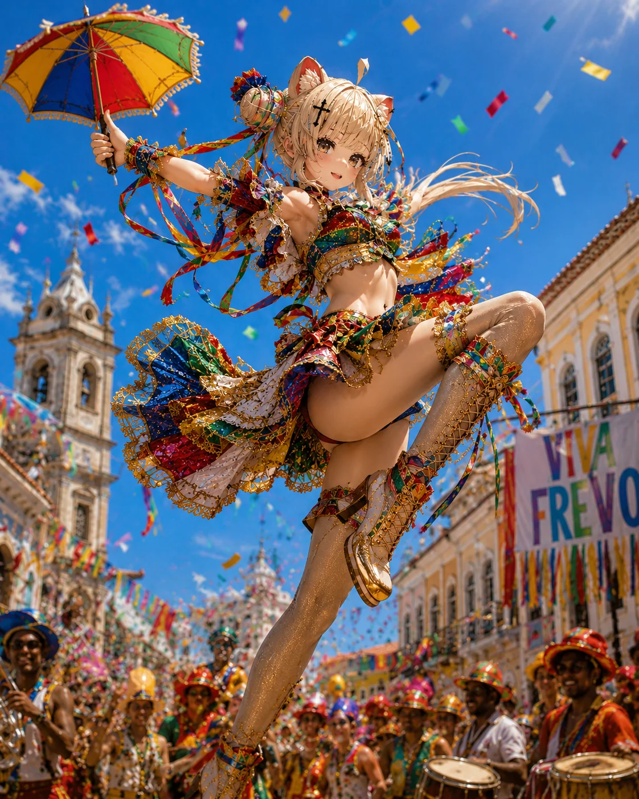

**Category:** Brazilian Northeastern Folk Art · **Tags:** `frevo` `passista` `carnival` `pernambuco` `dance` `acrobatic` `motion` `cultural-realism`

**📋 Prompt:**

```
Transform the attached character into an authentic Frevo carnival performer from Pernambuco, fully redesigning the character into the energetic visual language of traditional Brazilian Frevo culture while still preserving recognizable identity traits such as hairstyle silhouette, facial essence, colors, accessories, and personality.

IMPORTANT STYLE GOAL:
The character should feel like a true Frevo passista captured during an explosive Pernambuco carnival performance — full of movement, rhythm, acrobatics, color, and joyful chaos.

The redesign should NOT simply place the original character into a costume.
Instead, completely reinterpret the visual design through authentic Frevo aesthetics.

Character redesign:
- transform the outfit into traditional Frevo carnival attire
- vibrant multicolored fabric patterns
- sequined and embroidered details
- lightweight dance costume designed for extreme movement
- decorative ribbons and carnival trims
- colorful geometric patterns
- stylized carnival boots or dance shoes
- dynamic flowing costume elements reacting to movement
- festive handcrafted Brazilian costume realism

Movement and pose:
- highly dynamic acrobatic Frevo pose
- explosive dance movement
- airborne jump or dramatic spin
- impossible energetic body posture
- limbs extended rhythmically
- expressive joyful body language
- strong diagonal composition
- NEVER use static standing poses
- NEVER use T-pose or A-pose
- pose should communicate rhythm and speed instantly

Frevo umbrella:
- iconic small Frevo umbrella
- brightly colored segments
- saturated red, blue, green, yellow panels
- spinning or motion-blurred movement
- integrated naturally into choreography
- decorative handcrafted details

Visual style:
- vibrant Brazilian carnival atmosphere
- kinetic composition
- saturated tropical colors
- intense sunlight
- joyful crowd energy
- rhythmic visual flow
- cinematic movement photography
- dynamic festival realism
- authentic Pernambuco street carnival aesthetic

Scene:
- Recife or Olinda carnival environment
- open sky
- festival crowds
- confetti
- banners
- Brazilian street celebration atmosphere
- parade energy
- dancers and musicians in background
- realistic Brazilian cultural environment

Composition:
- dramatic low-angle camera
- airborne dance capture
- wide dynamic framing
- motion-focused composition
- character as energetic center of attention
- visual rhythm created through color repetition and movement
- cinematic cultural photography style

Texture and material:
- realistic fabric movement
- sweat, sunlight, and festival realism
- detailed embroidery and carnival textures
- vibrant cloth materials
- natural outdoor lighting
- realistic movement blur
- documentary-style cultural photography realism

Mood:
- euphoric
- explosive
- rhythmic
- joyful
- celebratory
- energetic
- colorful
- culturally authentic

Avoid:
- generic samba aesthetics
- static posing
- realistic ballet style
- cyberpunk aesthetics
- dark muted palettes
- modern fashion photography
- polished CGI look
- anime idol aesthetic

Ultra detailed Frevo carnival masterpiece, authentic Pernambuco cultural dance realism, explosive Brazilian street festival energy, cinematic passista performance photography.
```

**📎 Requires:** An attached reference image — identity preserved through hairstyle/colors/accessories; outfit fully reinterpreted as Frevo attire.

**💡 Why it works:** Movement is the entire point of Frevo, so the prompt is structured around it — `"NEVER use static standing poses"` appears twice and `"pose should communicate rhythm and speed instantly"` is a directive about *outcome* rather than just appearance. The iconic small Frevo umbrella gets its own dedicated block because it's the single visual element that prevents confusion with samba (the "Avoid" block kills `generic samba aesthetics` explicitly — that's a real failure mode). The low-angle airborne dance capture + motion blur stack pushes the rendering toward sports-photojournalism feel rather than illustration, which is the difference between a Frevo *poster* and a Frevo *moment*.

**🔧 Variations:** swap `airborne jump` for `low crouch with umbrella spinning above` for a different signature pose; change the setting to `nighttime carnival with stage lights` for dramatic moody lighting; replace `Recife/Olinda` with `Recife Antigo cobblestone street` for a specific historic district context.

---

#### Cangaceiro / Xaxado Warrior (010)

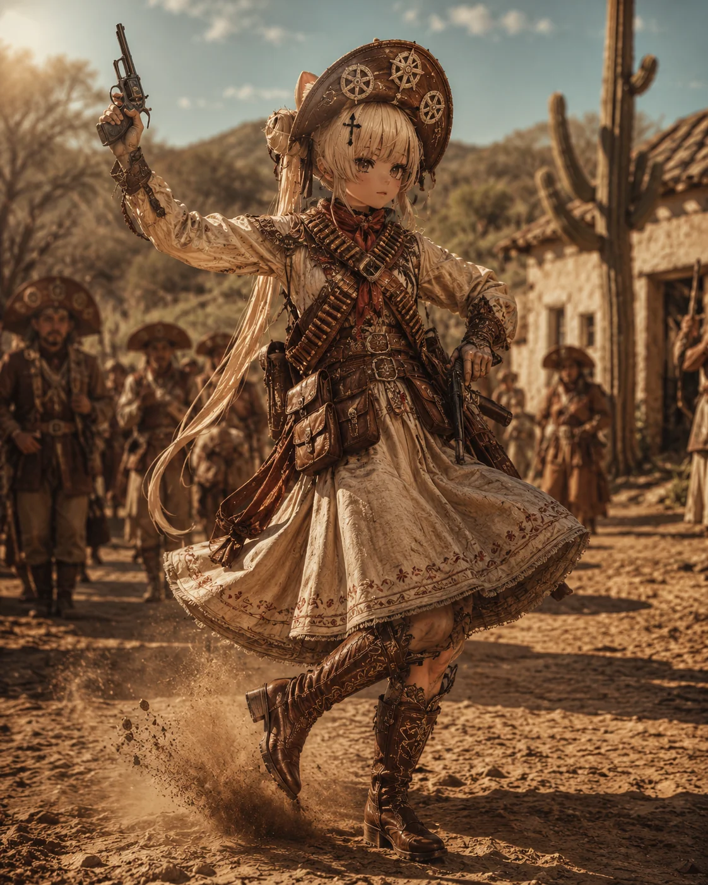

**Category:** Brazilian Northeastern Folk Art · **Tags:** `cangaco` `cangaceiro` `lampiao` `xaxado` `sertao` `historical` `nordeste` `leather-craft`

**📋 Prompt:**

```
Transform the attached character into an authentic Northeastern Brazilian xaxado and cangaço warrior figure inspired by the historical visual culture of Lampião, Maria Bonita, and the sertão cangaceiros, while preserving recognizable identity traits such as hairstyle silhouette, facial essence, colors, and personality.

IMPORTANT STYLE GOAL:
The character should feel like a legendary sertão cangaceiro captured inside a dusty cinematic Brazilian backlands epic — mixing survivalism, folk culture, historical realism, and symbolic Northeastern identity.

This is NOT generic cowboy aesthetics.
The redesign must reflect authentic cangaço visual language from the Brazilian Northeast.

Character redesign:
- transform the outfit into traditional cangaço clothing
- richly decorated leather garments
- handcrafted stitched details
- ornamental leather hats with iconic crescent shape
- leather belts crossing the torso
- rustic bandoliers
- embroidered symbols and geometric folk patterns
- aged leather textures
- handmade sertão craftsmanship
- worn fabric and survival gear
- rustic scarves and neck cloths
- traditional sandals or leather boots
- weathered historical appearance

Facial redesign:
- reinterpret the character as a hardened sertão survivor
- sunburned dusty skin tones
- expressive eyes
- rugged folkloric realism
- historically inspired styling
- dramatic but authentic facial construction
- preserve recognizable identity while adapting to cangaço aesthetics

Movement and pose:
- dynamic xaxado dance posture OR cinematic cangaceiro stance
- confident survivalist body language
- rhythmic marching movement
- diagonally composed action pose
- dust kicking from the dry ground
- expressive folkloric silhouette
- NEVER use static mannequin poses
- NEVER use T-pose or A-pose

Visual style:
- cinematic Brazilian sertão realism
- dusty sunlight
- warm earthy palette
- cracked dry landscapes
- rustic historical atmosphere
- harsh tropical backlands lighting
- dramatic cultural realism
- folkloric historical epic energy

Scene:
- Northeastern Brazilian sertão
- dry caatinga vegetation
- cacti
- rocky terrain
- dusty roads
- old rural settlements
- harsh sunlight
- leather textures reacting to heat and dust
- cinematic Brazilian backlands atmosphere
- subtle xaxado dance references or cangaceiro group presence

Composition:
- strong heroic silhouette
- cinematic low-angle framing
- dramatic desert-like composition
- visual emphasis on leather craftsmanship and iconic hat silhouette
- folkloric historical storytelling
- balanced rustic composition
- realistic environmental integration

Texture and material:
- cracked leather realism
- handmade stitching
- dusty fabric
- dry earth textures
- weathered metal details
- realistic sunlight exposure
- tactile artisan craftsmanship
- documentary-style Brazilian historical realism

Mood:
- resilient
- legendary
- folkloric
- historical
- rugged
- dramatic
- culturally authentic
- mythic sertão atmosphere

Avoid:
- generic western cowboy aesthetics
- futuristic cyberpunk elements
- anime idol styling
- polished fantasy armor
- medieval European aesthetics
- clean modern fashion
- glossy CGI look
- exaggerated Hollywood western tropes

Ultra detailed Brazilian cangaço masterpiece, authentic xaxado and sertão warrior realism, cinematic Northeastern historical folk aesthetic, museum-quality Brazilian cultural epic.
```

**📎 Requires:** An attached reference image — identity preserved through hairstyle/colors; outfit fully reinterpreted as cangaço leather attire.

**💡 Why it works:** The biggest risk with this prompt is the model defaulting to *American Old West cowboy* — the "Avoid" block explicitly kills `generic western cowboy aesthetics` and `Hollywood western tropes` to redirect toward the authentic cangaço visual language. Naming Lampião and Maria Bonita as historical anchors is much stronger than generic "Brazilian bandits" because it locks specific iconographic elements (crescent-shape leather hat, decorated bandoliers, embroidered patterns). The "cinematic Brazilian backlands epic" frame draws from Glauber Rocha's Cinema Novo aesthetic without naming him — dusty, harsh sun, dry caatinga, rocky terrain — which produces dramatically different lighting than a clean studio character render.

**🔧 Variations:** swap `mid-march xaxado dance` for `still confident stance with rifle resting on shoulder` for a more iconic Lampião-photo composition; change `harsh midday sun` to `dramatic sunset against caatinga silhouettes` for warmer Cinema Novo tones; add `flag or cangaço band insignia` for added historical specificity.

---

#### Carranca do São Francisco (River Guardian) (011)

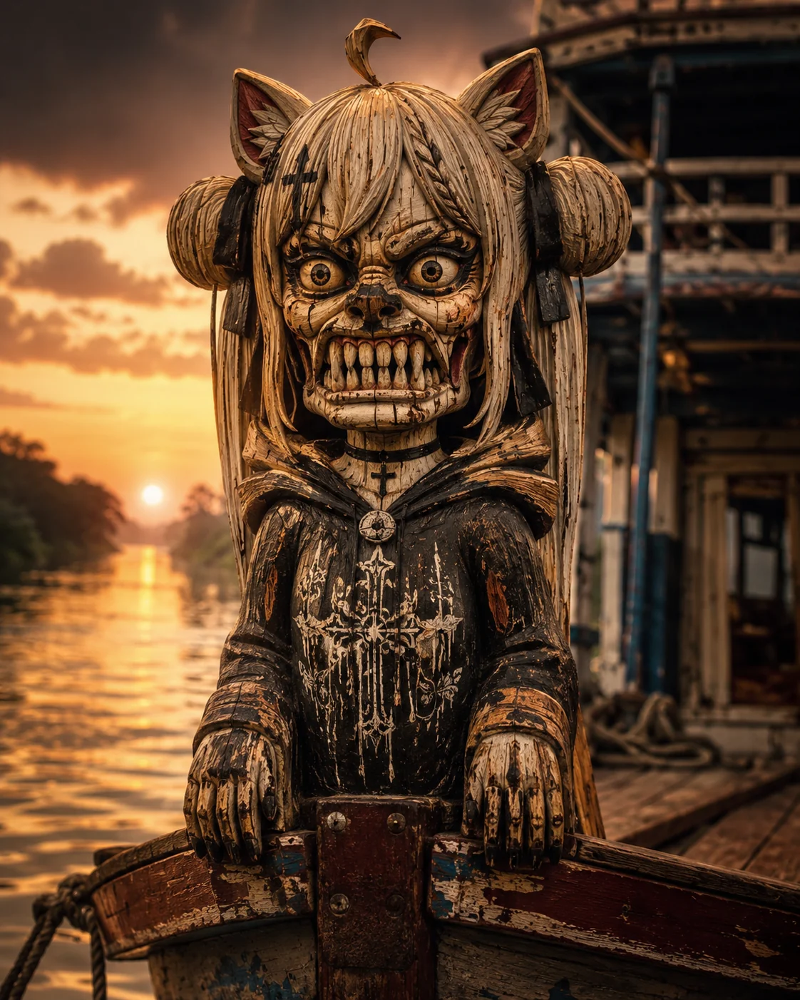

**Category:** Brazilian Northeastern Folk Art · **Tags:** `carranca` `sao-francisco` `wood-carving` `mystical` `river-guardian` `nordeste` `folkloric-horror` `identity-flex`

**📋 Prompt:**

```
Transform the attached character into an authentic Carranca do Rio São Francisco — a mystical Northeastern Brazilian river guardian sculpture carved from wood — while preserving recognizable identity traits such as facial essence, hairstyle silhouette, colors, accessories, and personality.

IMPORTANT STYLE GOAL:
The character should be fully redesigned as a supernatural carved wooden carranca figure traditionally mounted on boats from the São Francisco River.

This is NOT simply a human holding a carranca.
The character itself must become the carranca.

The result should feel:
- ancient
- mystical
- folkloric
- intimidating
- handcrafted
- spiritual
- rustic
- culturally authentic

Character redesign:
- fully reinterpret anatomy as a carved wooden guardian sculpture
- exaggerated monstrous facial construction
- oversized mouth and teeth
- sharp carved cheekbones
- wide staring eyes
- aggressive folkloric expression
- elongated sculptural nose
- carved wooden hair and beard shapes
- exaggerated brows and jawline
- stylized folk-art anatomy
- symbolic protective spirit appearance

Material construction:
- handcrafted carved wood realism
- visible wood grain
- aged river-worn texture
- cracked paint and weathering
- artisan carving marks
- rough chisel imperfections
- hand-painted folkloric details
- matte aged wood surfaces
- sculptural artisan realism

Visual characteristics:
- dramatic carved facial features
- exaggerated teeth and mouth
- large circular eyes
- river-spirit guardian aesthetic
- rustic handcrafted asymmetry
- folkloric monstrous proportions
- weathered paint layers
- ritualistic symbolic energy
- sculptural silhouette readable from distance

Scene:
- São Francisco River atmosphere
- old Brazilian riverboat environment
- foggy dawn or dramatic sunset lighting
- wooden boat textures
- tropical river environment
- mystical Brazilian folklore ambiance
- humid atmosphere
- river reflections
- poetic Northeastern realism

Composition:
- cinematic folkloric portrait OR full-body guardian sculpture framing
- strong silhouette emphasis
- low-angle dramatic camera
- environmental storytelling
- tactile sculptural realism
- visually dominant carved face
- atmospheric river composition

Mood:
- mythic
- eerie
- protective
- spiritual
- ancestral
- folkloric
- mysterious
- rustic
- culturally authentic

Texture and material:
- aged tropical wood realism
- rough carved surfaces
- visible chisel cuts
- cracked artisan paint
- river humidity wear
- organic texture detail
- handcrafted imperfections
- tactile sculptural material realism

Optional symbolic elements:
- river mist
- candles
- fishing boats
- folk talismans
- carved ornamental patterns
- spiritual protective symbols
- Brazilian river folklore atmosphere

Avoid:
- polished fantasy monster aesthetics
- generic tiki statues
- clean modern sculpture
- glossy CGI surfaces
- medieval European monster design
- polished horror creature aesthetics
- anime demon styling
- synthetic textures

Ultra detailed Brazilian Carranca masterpiece, authentic São Francisco River guardian sculpture realism, mystical Northeastern folk-art horror aesthetic, museum-quality handcrafted carved wood folklore.
```

**📎 Requires:** An attached reference image — identity preserved through facial essence/colors, but anatomy fully reimagined as a monstrous carved wooden guardian.

**💡 Why it works:** The structural masterstroke here is the line `"This is NOT simply a human holding a carranca. The character itself must become the carranca."` — without that explicit reframing, the model defaults to a person standing next to a wooden sculpture. Naming `carved teeth, oversized mouth, wide staring eyes, exaggerated brows` gives a concrete distortion vocabulary that's specifically carranca rather than generic gargoyle or tiki. The "Avoid" block does heavy work: `polished fantasy monster aesthetics, generic tiki statues, medieval European monster design, anime demon styling` — those are the four most common drift targets, and naming them explicitly suppresses each. The river mist + dawn lighting + humid atmosphere stack pushes the scene toward folkloric horror rather than craft display.

**🔧 Variations:** swap `foggy dawn` for `pitch-black night with candle-lit boat` for ritual horror intensity; change `single guardian` to `row of carrancas lined up on a riverboat prow` for documentary scale; replace `protective spirit` with `vengeful river demon` if you want a more aggressive expression direction.

---

#### Renda Renascença Lace Entity (012)

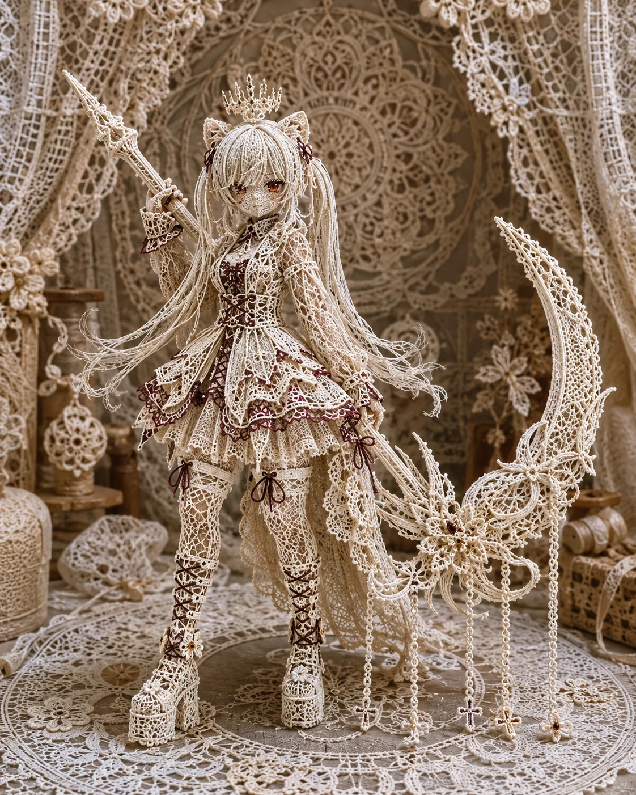

**Category:** Brazilian Northeastern Folk Art · **Tags:** `renda-renascenca` `lace` `embroidery` `textile` `pernambuco` `paraiba` `ceremonial` `identity-flex` `craft-art`

**📋 Prompt:**

```
Transform the attached character into a fully textile-based handcrafted entity made entirely from authentic Northeastern Brazilian Renda Renascença lace craftsmanship from Pernambuco and Paraíba. Preserve the recognizable identity, facial proportions, hairstyle silhouette, expression, colors, accessories, and overall personality of the original character, but reinterpret her entire body, clothing, hair, weapon, ornaments, and environment as if they were physically handcrafted from luxurious artisanal lace, embroidery, woven threads, crochet structures, and ceremonial textile construction.

IMPORTANT CORE CONCEPT:
The character herself must no longer appear as flesh wearing lace clothing — instead, she must appear as if her entire existence is made from handcrafted textile art and woven embroidery.

Her:
- skin becomes delicate woven lace mesh
- hair becomes flowing embroidered silk threads and lace filaments
- eyes become stitched gemstone embroidery and layered threadwork
- ears and tail become soft layered textile structures
- fingers, legs, and facial details become constructed from intricate stitched fabric anatomy
- weapon becomes an elaborate sculptural lace artifact made from woven threads, embroidery, crochet structures, ornamental knots, and artisanal textile engineering

The entire character should resemble:
- a sacred handcrafted textile doll
- a museum-quality artisanal embroidery sculpture
- a living lace entity
- a ceremonial folkloric textile spirit
- a handcrafted Northeastern Brazilian lace masterpiece

Authentic Brazilian Renda Renascença aesthetic:
- intricate interconnected lace geometry
- handcrafted needle lace realism
- floral and radial embroidery motifs
- visible thread tension and stitching logic
- woven textile anatomy
- layered lace transparency
- ornamental handcrafted complexity
- tactile artisanal construction
- realistic thread intersections
- handcrafted textile density
- ceremonial folkloric sophistication

Materials:
- ivory lace
- pearl embroidery
- cream woven fabric
- off-white crochet structures
- subtle gold thread accents
- handmade cotton lace
- embroidered silk thread
- linen textile layering
- delicate translucent woven patterns

Visual design:
- the body itself is constructed from embroidery and lace
- no visible human skin texture
- no synthetic surfaces
- no plastic CGI materials
- no smooth anime shading
- every surface must show thread structure and handcrafted textile realism
- layered stitched anatomy
- woven structural logic
- visible embroidery seams
- ornamental thread filigree integrated into anatomy

Hair design:
- hair made from flowing embroidered fibers
- woven thread strands
- delicate lace tassels
- ornamental textile ribbons
- layered handcrafted fabric curls
- lace veil integration
- subtle floral embroidery woven into hair structure

Facial treatment:
- preserve recognizable face and expression
- eyes made from layered embroidery and stitched gemstone-like threadwork
- embroidered eyelashes
- delicate textile blush made from pink stitched fibers
- ornamental lace markings around the eyes
- handcrafted doll-like elegance

Clothing integration:
- clothing and body partially merge together
- dress appears organically woven into anatomy
- sleeves dissolve into thread structures
- layered textile growth patterns
- ceremonial lace armor aesthetic
- folkloric sacred textile fashion
- flowing handcrafted veils and embroidered panels

Weapon redesign:
- fully made from woven lace engineering
- crocheted ornamental blade structures
- thread-based filigree weapon anatomy
- embroidered metallic illusion through textile techniques
- hanging embroidered chains and lace pendants
- sacred ceremonial textile weapon aesthetic

Scene:
- authentic Northeastern Brazilian artisan environment
- lace workshop atmosphere
- handcrafted embroidery studio
- ceremonial folkloric textile shrine
- lace curtains and embroidered backgrounds
- radial ornamental textile framing
- layered handcrafted decorative environment

Composition:
- elegant full-body pose
- fashion photography framing
- symmetrical handcrafted ornamentation
- decorative textile density
- layered foreground lace elements
- soft cinematic lighting
- sacred folkloric atmosphere

Texture quality:
- hyper-detailed textile realism
- visible fibers
- visible thread intersections
- handcrafted stitching precision
- tactile embroidery depth
- museum-quality artisanal craftsmanship
- realistic lace holes and woven transparency
- layered fabric shadows
- macro-level textile detailing

Mood:
- sacred
- poetic
- handcrafted
- folkloric
- ceremonial
- elegant
- timeless
- delicate
- culturally authentic

Avoid:
- exposed human skin
- smooth anime surfaces
- synthetic materials
- glossy CGI rendering
- modern fashion minimalism
- cyberpunk aesthetics
- mass-produced fabric appearance
- generic European lace look
- plastic doll appearance
- machine-made textile patterns

Ultra detailed Brazilian Renda Renascença textile entity, fully handcrafted lace anatomy, living embroidery sculpture, authentic Northeastern Brazilian artisanal textile realism, museum-quality handcrafted thread masterpiece, sacred folkloric lace fantasy.
```

**📎 Requires:** An attached reference image — identity preserved through face/hairstyle/expression, with the entire body radically reinterpreted as textile construction.

**💡 Why it works:** This is one of the most conceptually ambitious prompts in the collection — instead of *dressing* the character in lace or *placing* her near lace, it tells the model `"her entire existence is made from handcrafted textile art."` The bulleted breakdown (skin → woven mesh, hair → embroidered fibers, eyes → stitched gemstone threadwork, weapon → woven lace engineering) provides a per-body-part transformation rule, which the model handles much better than a vague global directive. The line `"no visible human skin texture"` is critical — without it, the model produces a character *wearing* lace rather than *made of* it. The Materials block locks the palette to ivory/cream/pearl/gold, which keeps the textile reading rather than drifting into generic fantasy doll aesthetics. Naming `Pernambuco and Paraíba` regionally anchors the prompt away from generic European needle lace.

**🔧 Variations:** swap `ivory + cream + pearl + gold` for `deep red + black + crimson` for a darker ceremonial textile entity; change `lace workshop` to `cathedral or ceremonial chapel setting` for stronger sacred framing; tighten the weapon redesign to a specific scythe/sword silhouette to preserve recognizability across renders.

---

#### Brazilian Baroque (Barroco Nordestino) Sacred Portrait (013)

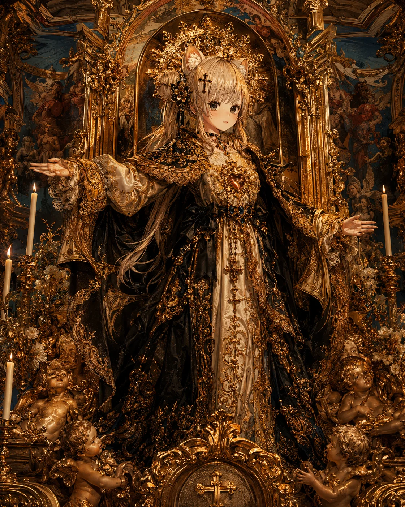

**Category:** Brazilian Northeastern Folk Art · **Tags:** `baroque` `barroco-nordestino` `sacred-art` `colonial` `gilded` `pernambuco` `bahia` `religious-aesthetic`

**📋 Prompt:**

```
Transform the attached character into a monumental Northeastern Brazilian Baroque masterpiece inspired by the sacred art, gilded churches, religious sculpture, colonial ornamentation, and dramatic visual language of Brazilian Barroco Nordestino from Pernambuco, Bahia, and Paraíba.

IMPORTANT STYLE GOAL:
The image should feel like an extravagant Brazilian colonial-Baroque religious artwork mixing:
- sacred theatricality
- overwhelming ornamentation
- tropical colonial aesthetics
- gold-covered architecture
- dramatic spirituality
- handcrafted sacred sculpture
- emotional intensity
- Brazilian historical grandeur

The result should resemble a forgotten masterpiece hidden inside an ancient Northeastern Brazilian church.

Character redesign:
- reinterpret the character through Brazilian Baroque sacred aesthetics
- transform clothing into richly ornamented colonial ceremonial garments
- elaborate gold embroidery
- sacred textile layering
- flowing dramatic fabrics
- ornamental lace and sacred detailing
- jewel-encrusted accessories
- carved decorative motifs integrated into costume
- angelic or saint-like visual symbolism
- tropical colonial luxury mixed with spiritual solemnity

Facial treatment:
- preserve recognizable identity while adapting into Baroque sacred portraiture
- emotionally expressive eyes
- dramatic spiritual intensity
- sculptural facial lighting
- soft sacred realism
- painted religious-art facial treatment
- idealized but human emotional depth

Visual characteristics:
- overwhelming ornamental density
- gilded carvings everywhere
- gold leaf textures
- dramatic arches and church interiors
- sacred floral arabesques
- carved angels and decorative saints
- candle-lit atmosphere
- painted ceilings
- colonial Brazilian ornamentation
- sacred theatrical composition
- heavy decorative symmetry

Scene:
- ancient Northeastern Brazilian Baroque church
- gilded altar background
- colonial sacred architecture
- candlelight illuminating gold surfaces
- carved wooden ornamentation
- tropical sacred atmosphere
- incense haze
- religious mural paintings
- richly decorated chapels
- emotional spiritual grandeur

Composition:
- grand cathedral-like framing
- monumental sacred portrait composition
- dramatic central figure presentation
- symmetrical Baroque visual balance
- ornate architectural layering
- theatrical sacred staging
- painterly museum-quality composition
- divine light beams entering through church windows

Lighting:
- dramatic chiaroscuro
- golden candlelight
- divine illumination
- deep shadows contrasted with glowing gold
- spiritual cinematic atmosphere
- sacred painterly light realism

Texture and materials:
- gold leaf realism
- carved wood ornamentation
- aged colonial paint textures
- cracked sacred paintings
- candle wax
- embroidered velvet fabrics
- marble and gilded surfaces
- handcrafted sculptural detailing
- museum-quality material realism

Mood:
- sacred
- monumental
- spiritual
- theatrical
- emotionally intense
- ornate
- majestic
- mystical
- culturally authentic

Art influences:
- Brazilian colonial sacred art
- Northeastern Baroque churches
- gilded Brazilian altars
- sacred Catholic procession aesthetics
- handcrafted colonial ornamentation
- tropical Baroque emotional realism

Avoid:
- minimalist aesthetics
- modern fashion styling
- futuristic cyberpunk elements
- clean contemporary architecture
- generic European-only Baroque
- sterile museum lighting
- anime rendering
- glossy CGI appearance

Ultra detailed Brazilian Baroque masterpiece, authentic Northeastern colonial sacred art realism, monumental gilded church aesthetic, museum-quality tropical Baroque painting and sculpture realism.
```

**📎 Requires:** An attached reference image — identity preserved through facial essence, with clothing fully reinterpreted as colonial ceremonial garments.

**💡 Why it works:** The "Avoid" block explicitly excludes `generic European-only Baroque` — a critical distinction because Brazilian Barroco Nordestino has tropical-colonial sensibilities (warmer palette, integration of indigenous and African motifs, regional materials) that pure European Baroque lacks. Naming three specific Brazilian regions (Pernambuco, Bahia, Paraíba) anchors the visual register regionally. The chiaroscuro + candlelight + gold leaf + incense haze stack produces Caravaggio-meets-tropics atmospheric quality. The phrase "forgotten masterpiece hidden inside an ancient Northeastern Brazilian church" gives the renderer a *cultural artifact identity* to mimic — much stronger anchor than aesthetic adjective lists.

**🔧 Variations:** swap the gilded altar background for `colonial church courtyard with tropical foliage` for an outdoor sacred procession setting; change `candle-lit interior` to `dramatic sunset through stained glass` for warmer hues; tighten `saint-like visual symbolism` to a specific saint (Nossa Senhora Aparecida, São Francisco) for character-specific iconography.

---

#### Azulejo Tile Mural (Maranhão / Bahia) (014)

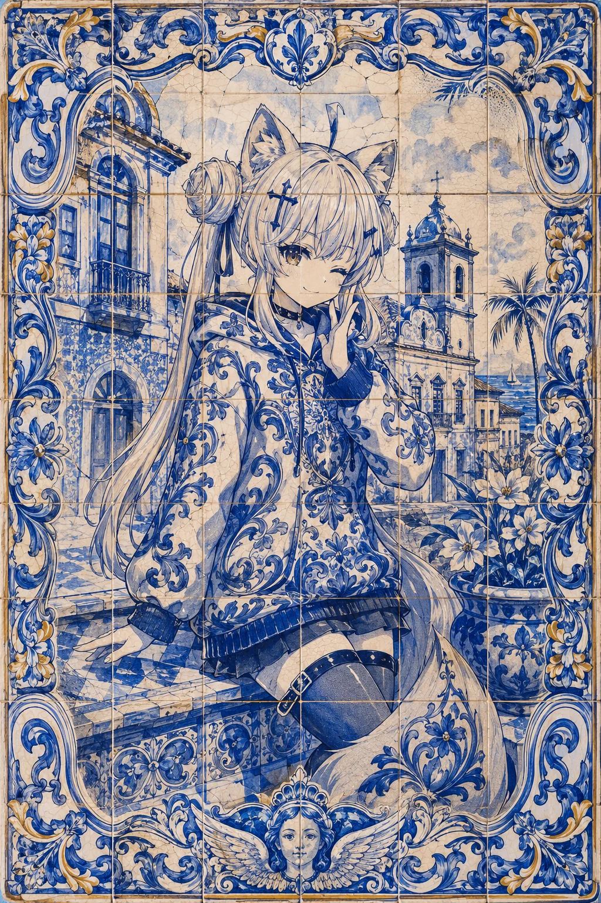

**Category:** Brazilian Northeastern Folk Art · **Tags:** `azulejo` `tile-mural` `maranhao` `bahia` `colonial` `ceramic` `cobalt-blue` `decorative` `style-translation`

**📋 Prompt:**

```
Transform the attached character into an elegant artwork inspired by traditional Azulejaria Maranhense and Bahian colonial tile aesthetics, while preserving recognizable identity traits such as facial essence, hairstyle silhouette, colors, accessories, and personality.

IMPORTANT STYLE GOAL:
The entire image should feel like a living colonial Brazilian azulejo mural — mixing Portuguese tilework traditions with tropical Northeastern Brazilian architecture, decorative geometry, handcrafted ceramic ornamentation, and historic coastal cultural atmosphere.

The character should appear naturally integrated into the tile composition itself, as if painted and glazed directly onto handcrafted ceramic panels found in São Luís do Maranhão or Salvador colonial architecture.

Art direction:
- traditional Brazilian colonial azulejo aesthetic
- handcrafted ceramic mural realism
- ornamental tile composition
- decorative geometric repetition
- floral and arabesque patterns
- Portuguese-inspired tile symmetry
- tropical Brazilian reinterpretation
- elegant handcrafted decorative storytelling
- mural-like visual structure
- artisanal ceramic craftsmanship

Character redesign:
- reinterpret the character entirely through azulejo visual language
- stylize anatomy and clothing into painted ceramic forms
- integrate decorative tile motifs into clothing, hair, and accessories
- transform costume into colonial-tropical ornamental patterns
- preserve recognizable identity while adapting all visual elements into ceramic mural aesthetics
- subtle stylization inspired by painted colonial saints, historical murals, and handcrafted tile illustrations

Visual characteristics:
- dominant blue-and-white palette
- cobalt blue ceramic painting
- off-white aged glaze
- optional turquoise, faded yellow, and weathered earthy accents
- intricate floral repetition
- decorative borders and frames
- hand-painted imperfections
- visible ceramic crackling
- glazed reflective surfaces
- ornamental geometric structures
- repetitive tile segmentation

Scene:
- colonial Northeastern Brazilian architecture
- São Luís or Salvador-inspired tiled walls
- historic tropical streets
- arched windows and balconies
- aged colonial facades
- coastal humidity atmosphere
- decorative ceramic environments
- handcrafted historical ambiance
- poetic urban Brazilian colonial realism

Composition:
- mural-like composition
- character integrated into decorative tile panels
- symmetrical ornamental framing
- repeating border elements
- layered ceramic storytelling
- elegant flat decorative perspective
- architectural visual rhythm
- handcrafted wall-art composition

Texture and materials:
- glazed ceramic realism
- cracked aged tile surfaces
- visible grout lines
- hand-painted pigment variation
- weathered colonial ceramic textures
- reflective glazed highlights
- chipped edges
- artisan tile imperfections
- tactile handcrafted material realism

Mood:
- elegant
- nostalgic
- historical
- poetic
- handcrafted
- ornamental
- tropical-colonial
- culturally authentic

Optional decorative elements:
- tropical flowers
- birds
- colonial arches
- ocean motifs
- decorative vines
- sacred symbols
- maritime iconography
- geometric tile repetition
- handcrafted border patterns

Avoid:
- clean modern minimalism
- futuristic cyberpunk elements
- glossy CGI aesthetics
- anime rendering
- realistic modern fashion photography
- sterile European-only tile aesthetics
- flat vector-art appearance
- photorealistic skin textures disconnected from ceramic style

Ultra detailed Brazilian colonial azulejo masterpiece, authentic Maranhense and Bahian tile-art realism, handcrafted ceramic mural aesthetic, museum-quality Northeastern Brazilian ornamental architecture artwork.
change pose and facial expression
```

**📎 Requires:** An attached reference image — facial essence and silhouette preserved, with the entire visual translated into painted ceramic mural language.

**💡 Why it works:** The "Avoid" block explicitly excludes `sterile European-only tile aesthetics` — that's the key distinction because Brazilian colonial azulejaria from Maranhão and Bahia developed its own tropical-coastal sensibility (different motifs, integration of local flora/fauna, different aging patterns from humidity). The line `"painted and glazed directly onto handcrafted ceramic panels"` is doing structural work: it tells the model the character isn't *in front of* a tile mural but *part of* the tile mural itself. Cobalt blue + off-white aged glaze is a specifically anchored palette rather than vague "blue and white." The "Texture and materials" section is particularly strong because authentic azulejos have very specific aging characteristics (cracking, chipping, grout lines, glaze variation) that distinguish them from clean modern ceramic tile.

**🔧 Variations:** swap the dominant `cobalt blue` for `polychrome (red, green, yellow, blue)` for a Bahian colonial church variant; change `coastal architecture` to `interior of colonial chapel` for a more sacred-art framing; replace `Maranhense/Bahian` with `Portuguese pombaline` if you want a more European register.

---

#### Festa Junina Celebration (015)

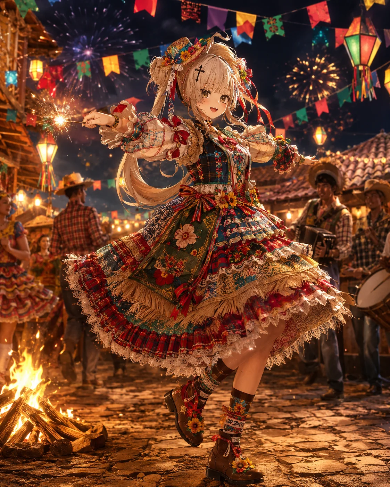

**Category:** Brazilian Northeastern Folk Art · **Tags:** `festa-junina` `sao-joao` `forro` `quadrilha` `rural-festival` `nordeste` `bonfire` `cultural-celebration`

**📋 Prompt:**

```
Transform the attached character into a fully authentic Northeastern Brazilian Festa Junina celebration redesign, completely reinterpreting the character through traditional São João visual culture, rural festival fashion, handcrafted decorations, and joyful Brazilian countryside festivities.

IMPORTANT STYLE GOAL:
The character should feel like the star of a vibrant Festa Junina night in the Brazilian Northeast — energetic, colorful, rustic, festive, and deeply connected to traditional São João culture.

This is NOT just modern clothing with plaid textures.
The entire design language, movement, atmosphere, and visual identity must become authentic Festa Junina aesthetics.

Character redesign:
- full traditional Festa Junina outfit redesign
- handcrafted rural festival fashion
- colorful patchwork fabrics
- stitched decorative remendos
- layered ruffles and ribbons
- embroidered countryside details
- rustic lace trims
- chita fabric patterns
- straw accessories
- colorful bows and ribbons
- handcrafted festival textures
- decorative floral patterns
- traditional Northeastern São João visual language

Clothing details:
- exaggerated Festa Junina fashion silhouette
- layered skirts or decorative festival garments
- colorful stitched patches
- playful asymmetrical tailoring
- handmade fabric realism
- folk-art textile aesthetics
- rustic boots or festival shoes
- traditional countryside festival accessories
- decorative hats, ribbons, braids, scarves, or straw elements

Pose and movement:
- dynamic Festa Junina dance poses
- quadrilha dance movement
- joyful spinning motion
- dancing with expressive body language
- jumping during celebration
- interacting naturally with fireworks
- holding sparklers or traditional festival props
- celebrating around bonfires
- energetic folkloric choreography
- NEVER use static standing poses
- NEVER use T-pose or A-pose
- body language should communicate rhythm, celebration, and warmth instantly

Scene:
- authentic Northeastern Festa Junina environment
- nighttime São João festival
- bonfire glow
- colorful hanging paper flags
- lanterns
- fireworks exploding in the sky
- rustic countryside square
- wooden festival stalls
- glowing warm lights
- dancers and musicians in background
- festive communal atmosphere
- magical Brazilian rural celebration energy

Visual characteristics:
- highly saturated festive colors
- warm fire lighting
- rustic handcrafted atmosphere
- folk-art decoration everywhere
- paper ornaments
- colorful geometric banners
- festive visual chaos
- joyful cultural realism
- warm cinematic night atmosphere

Composition:
- dynamic cinematic framing
- movement-focused composition
- diagonal energy lines created through dance and decorations
- character as the center of celebration
- flowing costume movement
- fireworks illuminating the scene
- immersive festival storytelling

Texture and materials:
- realistic fabric folds and stitching
- handcrafted textile realism
- paper banner textures
- glowing fireworks smoke
- rustic wood and straw materials
- warm bonfire lighting
- festive handcrafted imperfections
- tactile artisan decoration realism

Mood:
- joyful
- nostalgic
- warm
- communal
- playful
- romantic countryside energy
- vibrant
- musical
- culturally authentic

Optional elements:
- accordion players
- forró dancers
- bonfire sparks
- roasted corn stands
- balloons
- lanterns
- traditional festival foods
- folk musicians
- rural Brazilian celebration atmosphere

Avoid:
- modern nightclub aesthetics
- generic carnival costumes
- cyberpunk elements
- minimalist fashion
- polished CGI appearance
- sterile studio photography
- anime idol concert styling
- realistic urban fashion

Ultra detailed Festa Junina masterpiece, authentic Northeastern São João cultural realism, handcrafted Brazilian rural festival aesthetic, cinematic folk celebration photography.
```

**📎 Requires:** An attached reference image — identity preserved through hairstyle/colors; outfit fully reinterpreted as traditional Festa Junina rural fashion.

**💡 Why it works:** The line `"This is NOT just modern clothing with plaid textures"` directly attacks the most common Festa Junina prompt failure — the model defaulting to "anime girl in plaid shirt." By calling that out as the *wrong* answer, the model is pushed toward authentic textile elements: chita fabrics, patchwork remendos, ribbons, straw accessories. The pose block prioritizes *movement* (quadrilha dance, jumping, spinning) over showcase — that's what makes the output feel like a festival moment rather than a costume photo. Bonfire warm lighting + fireworks night sky + paper flags overhead is a specific Festa Junina visual ID stack that prevents drift into generic outdoor festival imagery.

**🔧 Variations:** swap `nighttime bonfire` for `golden afternoon dance circle` for daytime celebration tones; change `dancing alone as center of celebration` to `quadrilha couple dancing with a partner` for traditional duo dance composition; replace generic Northeast with `arraiá in Caruaru` or `São João de Campina Grande` for specific iconic festival locations.

---

#### Bordado Sertanejo (Folk Embroidery) (016)

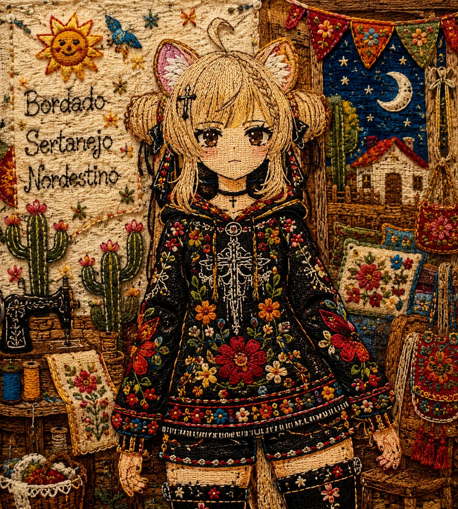

**Category:** Brazilian Northeastern Folk Art · **Tags:** `bordado-sertanejo` `embroidery` `folk-textile` `stitched-art` `nordeste` `appliqué` `craft-translation` `identity-flex`

**📋 Prompt:**

```
Transform the attached character into an authentic Northeastern Brazilian folk embroidery masterpiece inspired by Bordado Sertanejo, handcrafted popular embroidery, rural textile art, and traditional Brazilian artisan stitching culture.

IMPORTANT STYLE GOAL:
The image should feel entirely handcrafted from embroidered fabric, colorful threadwork, stitched ornamentation, and traditional Northeastern Brazilian textile artistry.

The character should look as if they were created from layers of embroidery, patchwork, stitched fabrics, handmade appliqué, and decorative thread illustrations.

This is NOT simply normal clothing with embroidery added.
The entire visual language must become embroidery-based folk art.

Character redesign:
- fully reinterpret the character through handcrafted embroidery aesthetics
- transform clothing into richly stitched textile compositions
- layered embroidered fabrics
- floral folk-art stitching
- decorative thread ornamentation
- handmade appliqué details
- patchwork fabric construction
- colorful stitched borders
- woven folk patterns
- handcrafted ribbon decorations
- visible seam structures
- embroidered accessories integrated into hair and outfit

Visual characteristics:
- visible threadwork everywhere
- raised embroidered textures
- thick stitched outlines
- floral and geometric folk motifs
- handcrafted asymmetry
- colorful textile layering
- folk-art ornamental repetition
- decorative rural Brazilian visual language
- tactile handmade realism
- visible embroidery knots and thread intersections

Color palette:
- vivid reds
- sunflower yellows
- deep blues
- bright greens
- earthy browns
- warm oranges
- off-white linen tones
- colorful handcrafted Brazilian folk-art saturation
- rich textile contrast

Facial treatment:
- preserve recognizable identity
- reinterpret facial construction through stitched and textile-like forms
- embroidered eyelashes, eyebrows, and decorative facial details
- soft handcrafted expression
- folk-art stylization instead of realistic rendering

Scene:
- Northeastern Brazilian artisan environment
- embroidered textile backdrop
- handmade rural decoration
- warm natural lighting
- rustic sewing atmosphere
- decorative hanging fabrics
- handcrafted cultural ambiance
- poetic folk-art realism

Composition:
- decorative textile-inspired framing
- symmetrical folk-art balance
- layered stitched visual density
- ornamental composition
- character integrated naturally into embroidered scenery
- handcrafted mural-like arrangement
- elegant textile storytelling

Texture and materials:
- hyper-detailed embroidery realism
- visible fabric fibers
- raised thread textures
- woven cloth materials
- linen and cotton realism
- tactile artisan craftsmanship
- handcrafted stitching imperfections
- layered textile depth
- realistic embroidered shadows and thread overlap

Mood:
- warm
- handcrafted
- nostalgic
- folkloric
- decorative
- communal
- poetic
- culturally authentic

Optional decorative elements:
- embroidered flowers
- birds
- stars
- hearts
- cacti
- folk symbols
- stitched suns and moons
- rural Brazilian motifs
- handmade textile borders

Avoid:
- photorealistic modern fashion
- glossy synthetic fabrics
- futuristic cyberpunk elements
- CGI perfection
- anime idol aesthetics
- clean vector-art appearance
- minimalist modern embroidery
- machine-made textile look

Ultra detailed Brazilian embroidery masterpiece, authentic Bordado Sertanejo realism, handcrafted Northeastern textile folk-art aesthetic, museum-quality artisan stitching artwork.
```

**📎 Requires:** An attached reference image — identity preserved through colors and recognizable traits, fully translated into stitched textile language.

**💡 Why it works:** Where prompt 012 (Renda Renascença) used delicate ivory lace with sacred ceremonial tone, this prompt does the opposite — warm folk-art saturation with vivid reds, yellows, blues, greens and *visible thread texture everywhere*. The line `"raised embroidered textures"` is the key technical demand: it tells the model the embroidery should have *physical depth*, not be flat painted ornamentation. The "handcrafted asymmetry" + "embroidery knots and thread intersections" forces visible irregularity that authentic Bordado Sertanejo has — machine-made embroidery is perfectly symmetric, which is exactly why the "Avoid" block targets `machine-made textile look`. The optional decorative elements (cacti, suns, moons, birds) give the model concrete Bordado Sertanejo motif vocabulary rather than generic flowers.

**🔧 Variations:** swap the warm saturated palette for `earth tones only (browns, ochres, dusty reds)` for a more rustic countryside variant; change `embroidered textile backdrop` to `traditional Bordado Sertanejo workshop with hanging samples` for documentary framing; tighten the facial treatment to `embroidered Brazilian saint icon style` for sacred folk-art crossover.

---

## 💡 General Prompting Tips

These patterns repeat across the prompts in this collection:

- **Use `{CURLY_BRACES}` for swappable variables** — define them at the top of the prompt so the rest stays reusable
- **Keep the prompt character-agnostic** — describe the scene, lighting, composition, and style; let the character come from an attached reference or a separate description
- **Three distinct identity modes** — identity-lock (preserve everything exactly), style-inspiration (keep aesthetic, redesign), and caricature-redesign (deliberately distort while keeping cues); mixing them produces muddled results
- **Identity-lock with explicit lists** — when preserving a reference character, enumerate *exactly* what must be preserved (face, eyes, hair, accessories, palette, silhouette) and *what must not happen* (no replacement, no obscuring)
- **Use negative-space framing** — "Do not replace the character" and `"NEVER use T-pose"` work surprisingly well alongside positive descriptions
- **Pose-override blocks for stiff references** — if you're using a 3D/VRChat T-pose model as input, explicitly forbid the stiff stance and provide a curated list of natural pose alternatives
- **Branch with conditional rules** — `If X=1: ...` / `If X=2: ...` blocks let one prompt produce variant outputs
- **Layered redesign structure** — for complex translations, split the prompt into per-aspect blocks (Core / Material / Facial / Clothing / Scene) — each becomes its own "rendering pass" for the model
- **Anchor style with named artists/regions** — `Makoto Shinkai`, `Mestre Vitalino`, `Lampião and Maria Bonita`, `São Luís do Maranhão` lock visuals more efficiently than generic adjectives
- **Use "Avoid" blocks to name failure modes** — naming the *wrong* aesthetic (`plastic toy appearance`, `generic cowboy aesthetics`, `sterile European-only tile aesthetics`) suppresses default drift
- **Cultural anchoring beats adjective stacking** — for regional/traditional aesthetics, name *specific* cultural references (artisan names, towns, historical figures, named traditions) rather than relying on vague "folk-art" descriptors
- **Sandwich identity instructions** — open with what to preserve, close with another "Do NOT redesign" reminder; the middle handles style translation
- **Stack atmospheric cues** — cinematic lighting + bloom + volumetric fog + reflections reinforce each other rather than fight
- **Negative-prompt blocks work in GPT Image 2** — for print-ready or high-precision outputs (dakimakura, posters), include an explicit `Negative prompt:` section listing failure modes
- **End with quality keywords** — `masterpiece, best quality, ultra detailed, depth of field` at the tail nudges the renderer toward its best output
- **Short uppercase text works best** — words of 4–8 letters have the highest text-rendering accuracy
- **Specify text position explicitly** — `"on the chest"`, `"as a banner above"`, `"in the lower-right corner"`
- **Provide example text strings for typography prompts** — listing 3-5 sample phrases locks the *register* without forcing exact wording

## 📄 License

Licensed under [CC BY 4.0](LICENSE) — use it, remix it, share it; just give credit.
