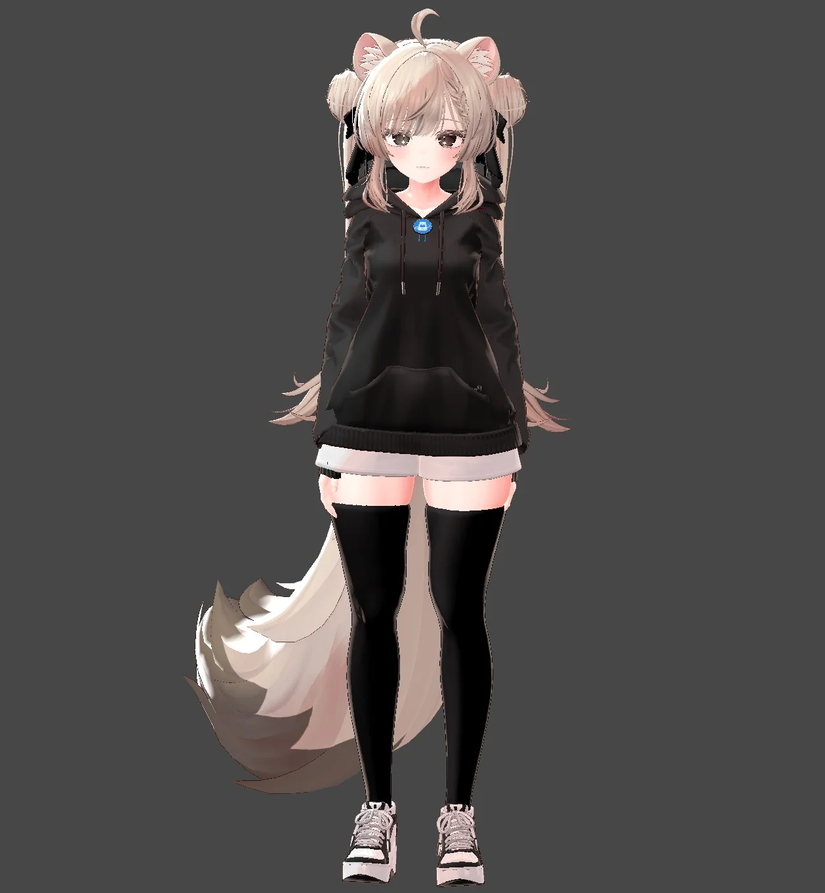

# Inex's GPT Image 2 Prompts — Cinematic Anime & Beyond

> 🎨 A personal collection of high-detail prompts for **GPT Image 2** — OpenAI's next-gen image model with pixel-perfect text rendering, cross-image consistency, and commercial-grade illustration quality. Focused on cinematic anime aesthetics, character-reference workflows, and atmospheric storytelling.

[](LICENSE)

---

## 📑 Table of Contents

- [About This Repo](#-about-this-repo)
  - [Character Gallery](#-character-gallery)
- [About GPT Image 2](#-about-gpt-image-2)
- [How to Use](#-how-to-use)
- [Prompts](#-prompts)
  - [🚗 Anime Cars](#-anime-cars)
  - [🪴 Brazilian Northeastern Folk Art](#-brazilian-northeastern-folk-art)
- [General Prompting Tips](#-general-prompting-tips)
- [License](#-license)

---

## 📌 About This Repo

This is a personal dump of GPT Image 2 prompts I use and refine over time. It's not a curated community resource — it's my working library, made public so anyone who finds it useful can copy, remix, or adapt the prompts.

**The prompts are character-agnostic.** They're written as reusable templates: the *character* itself is supplied at generation time via an attached reference image or a free-form description in your own request to the model. The prompts handle composition, lighting, art style, camera angle, mood, and rendering quality — everything *around* the character. This means the same prompt can drive completely different looks depending on the reference you pair it with.

Wherever a prompt requires a reference, it's marked with **📎 Requires**.

### 🧍 Character Gallery

The character reference images I used while testing and refining these prompts live in [`assets/images/base/`](./assets/images/base/). Browse them to see what kind of input each prompt was tuned against — useful when comparing your own output against my example renders.

<table>
  <tr>
    <td align="center" width="50%">
      <a href="./assets/images/base/001.webp">
        
      </a>
      <br><sub><b>Base 001</b></sub>
    </td>
    <td align="center" width="50%">
      <a href="./assets/images/base/002.webp">
        
      </a>
      <br><sub><b>Base 002</b></sub>
    </td>
  </tr>
  <tr>
    <td align="center" width="50%">
      <a href="./assets/images/base/003.webp">
        
      </a>
      <br><sub><b>Base 003</b></sub>
    </td>
    <td align="center" width="50%">
      <a href="./assets/images/base/004.webp">
        
      </a>
      <br><sub><b>Base 004</b></sub>
    </td>
  </tr>
</table>

---

## 🚀 About GPT Image 2

GPT Image 2 stands out in three areas where previous models struggled:

- **Pixel-perfect text** — renders full words without character errors
- **Cross-image consistency** — maintains characters, styles, and elements across generations from reference images
- **Commercial quality** — illustrations ready for professional use

This collection focuses on prompts that exploit these strengths, with detailed explanations of *why* each one works.

## 📖 How to Use

1. Browse the categories below
2. Click **"📋 Prompt — click to expand"** under any entry to reveal the prompt
3. Hover the expanded code block and click the **copy icon** in the top-right corner
4. Replace placeholder variables in `{CURLY_BRACES}` with your chosen values
5. If the prompt is marked **📎 Requires**, attach your character or style reference image to the same chat/request
6. Paste into GPT Image 2 (via ChatGPT, API, or Sora)

---

## 📚 Prompts

### 🚗 Anime Cars

Cinematic anime illustrations of characters inside premium sports cars, using attached references for identity-lock or style-inspiration workflows.

---

#### Anime Girl Driving a Supercar at Night


**Category:** Anime Cars · **Tags:** `anime` `cinematic` `cyberpunk` `night` `character-reference` `makoto-shinkai`

<details>
<summary>📋 <b>Prompt</b> — click to expand</summary>

```
CAR={McLaren P1 / Nissan GT-R R35 / Lamborghini Revuelto / Porsche 911 GT3 RS / etc}

Create a cinematic anime-style night illustration using the attached girl as the sole and explicit character reference. Fully preserve her recognizable identity, facial structure, eye shape, hairstyle, hair accessories, color palette, outfit silhouette, proportions, and soft expressive atmosphere exactly as shown in the reference image. Do not replace the character, alter her identity, obscure the face, or stylize away recognizability.

The girl is driving a {CAR} through a futuristic neon-lit city at night from an immersive interior cockpit perspective. The scene should feel atmospheric, dreamy, and slightly melancholic, with glowing city lights reflecting across the windshield, dashboard, windows, and her face. Emphasize motion blur, cinematic lighting, soft bloom, volumetric fog, reflections, chromatic aberration, and painterly brushstroke textures similar to high-end anime key visuals.

Camera angle from inside the car cabin, slightly wide-angle, showing both the character and the luxurious sports car interior. The dashboard and steering wheel should feel realistic and premium, illuminated by cool blue and white LEDs. Outside the windows: a dense cyberpunk-inspired skyline with elevated highways, speeding cars, rain-soaked streets, neon signs, and distant skyscrapers.

The character should have a relaxed but confident expression while driving, casually glancing toward the viewer. Her pose should feel natural and candid. Keep the overall composition balanced between the character, cockpit details, and the glowing urban scenery outside.

Art style: semi-realistic anime illustration, painterly rendering, highly atmospheric, cinematic composition, soft lighting gradients, deep blue night tones, detailed reflections, emotional ambience, modern anime movie aesthetic, Makoto Shinkai-inspired lighting, premium digital painting quality.

Ultra detailed, masterpiece, best quality, dynamic lighting, expressive eyes, depth of field, film grain, realistic reflections, immersive perspective, high detail environment, elegant color harmony, dramatic night atmosphere.
```

</details>

**📎 Requires:** An attached reference image of the character to preserve. Alternatively, replace the "attached girl" wording with a written character description if you don't have a reference image.

**💡 Why it works:** The prompt opens with an aggressive identity-lock paragraph — explicitly listing *what* must be preserved (facial structure, eye shape, hairstyle, accessories, palette, silhouette, proportions) and *what must not happen* (no replacement, no obscuring, no stylizing away). GPT Image 2 responds very well to negative-space framing like "Do not replace the character." The `{CAR}` placeholder gives you a single swappable variable while everything else stays consistent across renders. The Makoto Shinkai anchor locks in the lighting language; cyberpunk + neon + rain stack mutually reinforcing atmospheric cues.

**🔧 Variations:** swap `{CAR}` for any well-known model (the more iconic, the better the cockpit accuracy); change `night` → `golden hour` and `cyberpunk skyline` → `Tokyo Shibuya crossing` for a brighter take; replace `Makoto Shinkai` with `Mamoru Hosoda` for a warmer, less neon-saturated palette.

---

#### Anime Girls in a Convertible at Sunset


**Category:** Anime Cars · **Tags:** `anime` `cinematic` `summer` `convertible` `coastal` `style-reference` `makoto-shinkai`

<details>
<summary>📋 <b>Prompt</b> — click to expand</summary>

```
CAR={Any luxury convertible supercar / exotic sports car with a premium modern interior}
CHARACTERS={1 or 2}

Create a cinematic semi-realistic anime-style illustration inspired by the attached anime girl. Maintain a similar fashion aesthetic, hairstyle theme, color palette, accessories, and overall visual vibe while adapting the character into an original stylized anime illustration. Keep the design cohesive and visually consistent without directly replicating the exact identity or features from the reference.

Character placement rule:
- If CHARACTERS=1: only a single anime girl is present, sitting exclusively in the driver seat of the convertible.
- If CHARACTERS=2: use two anime girls with very similar styling, fashion aesthetic, and visual theme, with one driving and the other sitting in the passenger seat. Both should feel like alternate versions of the same original-inspired design with slight natural pose and expression variation.

Scene: a luxurious high-end convertible supercar with the roof down, cruising through a glowing coastal city highway during sunset or blue hour. The atmosphere should feel stylish, youthful, energetic, and cinematic.

The girl(s) wear elegant fashionable bikinis inspired by the original aesthetic, featuring premium summer fashion styling, soft fabric details, subtle shine, tasteful accessories, and coordinated colors. Hair ribbons, accessories, and visual motifs should remain stylistically consistent with the inspiration while still feeling original.

Camera angle from slightly above and inside the convertible cockpit, capturing the character(s), premium interior, and immersive open-air feeling of the car. The composition should emphasize the luxurious sports car cabin, glossy surfaces, metallic reflections, dashboard details, center console, ambient lighting, and realistic material rendering.

Pose and expression:
- Driver version: relaxed, confident, casually focused on the road.
- Passenger version (only if CHARACTERS=2): looking toward the viewer with a soft playful expression.

Environment details: ocean-side roads, distant skyline, palm trees, warm sunset light blending with cool evening shadows, motion blur from passing lights, soft wind moving hair and ribbons, glowing reflections on the car body, atmospheric depth, subtle lens flare, dreamy ambience.

Art style: semi-realistic anime illustration, highly polished painterly rendering, cinematic composition, premium anime key visual quality, soft bloom lighting, expressive eyes, detailed skin shading, elegant highlights, modern anime movie aesthetic, Makoto Shinkai-inspired lighting, vibrant but balanced colors.

Ultra detailed, masterpiece, best quality, convertible sports car interior, open roof, luxury atmosphere, immersive perspective, dynamic lighting, realistic reflections, summer mood, glossy paint, high-detail environment, anime cinematic illustration.
```

</details>

**📎 Requires:** An attached reference image used as **style inspiration only** (not identity-locked). Alternatively, replace the "attached anime girl" wording with a written description of the aesthetic you want as inspiration.

**💡 Why it works:** This is the inverse approach to the night-driving prompt — instead of identity-locking the reference, it explicitly says "*inspired by*… without directly replicating the exact identity." That gives the model permission to create original characters that share the *aesthetic* (palette, fashion, ribbons, hair theme) without copying the face. The `CHARACTERS={1 or 2}` conditional with explicit per-case rules is the key trick: GPT Image 2 follows branching logic well when each branch lists its own positioning, pose, and expression. Pairing identical-styled characters reads naturally as "alternate versions of the same design," which is a much cleaner mental model for the renderer than "two random girls."

**🔧 Variations:** swap sunset for `night blue hour` with neon coastal signage for a darker take; change `bikinis` to `coordinated summer dresses` for a softer, less swimwear-focused composition; replace `coastal highway` with `mountain pass at sunset` for dramatic elevation and curves.

---

### 🪴 Brazilian Northeastern Folk Art

Character-translation prompts that reinterpret a reference into the visual language of traditional Pernambuco / sertão folk art — woodcut prints, clay sculpture, puppet theater, and carnival figures. Each prompt handles the *transformation rules* while you supply the character.

---

#### Cordel Woodcut (Xilogravura) Portrait


**Category:** Brazilian Northeastern Folk Art · **Tags:** `xilogravura` `cordel` `woodcut` `folk-art` `nordeste` `character-reference` `identity-lock`

<details>
<summary>📋 <b>Prompt</b> — click to expand</summary>

```
Transform the attached character into a traditional Brazilian Northeastern xilogravura / cordel illustration while fully preserving the original character identity, face, hairstyle, outfit silhouette, colors, and personality.

IMPORTANT CHARACTER RULE:
- if the reference image is in T-pose, A-pose, idle rigging pose, model-sheet pose, or any unnatural 3D reference stance, DO NOT replicate that pose
- automatically reinterpret the character into a natural, expressive, cinematic pose
- use dynamic body language appropriate for a legendary cordel protagonist
- preserve anatomical proportions and recognizable silhouette while replacing the original static pose
- avoid stiff symmetry in the arms
- create believable movement in clothing, hair, and posture

Style inspired by classic Brazilian cordel woodcut prints:
- handcrafted woodcut engraving aesthetic
- bold black ink carving lines
- strong high-contrast shapes
- visible rough carved textures
- rustic handmade appearance
- dramatic cross-hatching and parallel cut marks
- limited color palette inspired by aged paper, charcoal black, burnt orange, deep red, dusty beige, and dry-earth tones
- flat printmaking composition
- folk-art energy
- authentic northeastern Brazilian visual language

Scene should feel like a legendary cordel tale from the sertao:
- dusty wind
- dramatic sun
- symbolic background elements
- cacti
- birds
- moon and stars
- rural Brazilian atmosphere
- decorative border ornaments common in cordel covers

Composition:
- centered heroic character
- poster-like framing
- highly detailed engraved textures
- symmetrical folk-art balance
- vintage print imperfections
- aged paper texture
- expressive shadows carved like woodcuts

Suggested poses:
- walking through the sertao wind
- holding part of the hoodie or hair
- looking toward the horizon
- slightly turned torso
- one hand raised naturally
- dynamic flowing hair
- calm but powerful stance
- subtle movement in legs and shoulders

Important:
Do NOT redesign the character.
Do NOT turn the character into a different person.
Keep the exact facial identity and recognizable features from the reference image.
Only translate the character into authentic xilogravura / literatura de cordel visual language.

Ultra detailed, authentic Brazilian cordel engraving style, masterful woodcut illustration, museum-quality folk print aesthetic.
```

</details>

**📎 Requires:** An attached reference image of the character to preserve.

**💡 Why it works:** The opening "IMPORTANT CHARACTER RULE" block solves a specific pain point — VRChat/3D model references are usually in T-pose or A-pose, which the model would otherwise faithfully reproduce. By explicitly listing those static poses as forbidden *and* providing a curated "Suggested poses" list at the end, you get a natural cordel hero stance regardless of how stiff the source reference is. The dual identity-lock (open paragraph + closing "Do NOT redesign" reminder) sandwiches the style-translation instructions, which keeps the model focused on *medium translation* rather than *character redesign*. The limited palette (aged paper, charcoal, burnt orange, deep red, dusty beige) gives the model concrete swatches instead of vague "warm tones."

**🔧 Variations:** swap `walking through the sertao wind` for `riding a horse across the sertao` for a more dramatic protagonist shot; change the palette accents from `burnt orange, deep red` to `indigo blue, forest green` for a Pernambuco coastal folk variant; remove the "Suggested poses" block entirely if you actually *want* the model to lean into the reference pose.

---

#### Alto do Moura Clay Sculpture (Mestre Vitalino Style)


**Category:** Brazilian Northeastern Folk Art · **Tags:** `clay` `ceramics` `mestre-vitalino` `alto-do-moura` `cangaceiro` `folk-sculpture` `character-reference`

<details>
<summary>📋 <b>Prompt</b> — click to expand</summary>

```
Transform the attached anime character into an authentic traditional Northeastern Brazilian clay folk sculpture in the exact rustic aesthetic of Alto do Moura and Mestre Vitalino ceramics, strongly inspired by classic handcrafted cangaceiro statues from Pernambuco folk art.

The character must preserve her recognizable identity, face, hairstyle, white hair, red eyes, twin tails, animal ears, gothic personality, and weapon silhouette, but reinterpret all clothing and accessories as traditional handmade cangaco attire crafted entirely from clay.

Visual Style:
- genuine Brazilian artesanato aesthetic
- rustic Alto do Moura ceramic sculpture
- simplified handcrafted proportions
- naive folk-art anatomy
- matte unfired terracotta appearance
- warm reddish-brown clay tones
- visible handmade imperfections
- sculpted with simple rounded forms
- subtle fingerprints, carving marks, and uneven handmade texture
- expressive folk-art eyes typical of Northeastern clay figures
- museum-quality documentary realism

Character Adaptation:
- reinterpret the gothic dress as traditional cangaceira clothing
- leather cangaco hat with star details and stitched ornaments
- rustic leather belts and cartridge straps
- simplified clay-rendered embroidered details
- traditional sertao-inspired skirt and clothing layers
- handmade clay sandals or rustic boots
- weapons redesigned as handcrafted folk-art clay versions while preserving their recognizable silhouettes
- maintain the character's stance, personality, and overall silhouette
- preserve the white hair and twin-tail hairstyle as sculpted clay forms
- preserve the animal ears and recognizable facial identity

Important:
- do NOT redesign the character into another person
- do NOT modernize the sculpture
- avoid anime plastic appearance
- avoid realistic human anatomy
- prioritize authentic Brazilian folk ceramic craftsmanship over anime aesthetics
- the sculpture should look like it was handmade by a real artisan from Pernambuco

Scene:
- rustic wooden shelf or old artisan workshop
- low warm ambient lighting
- earthy shadows
- handmade pottery and clay folk statues in the background
- subtle dust particles in the air
- authentic sertao atmosphere
- documentary photography realism

Composition:
- full-body sculpture
- standing pose
- centered composition
- photographed like a real museum or artisan-shop ceramic piece
- shallow depth of field
- highly detailed clay surface
- realistic ceramic shading
- natural imperfections and asymmetry

Reference Style: traditional cangaceiro clay statues from Alto do Moura, Mestre Vitalino folk ceramics, authentic Pernambuco artesanato, Brazilian sertao folk sculpture realism.
```

</details>

**📎 Requires:** An attached reference image of the character. The specific traits in the second paragraph (`white hair, red eyes, twin tails, animal ears, gothic personality, weapon silhouette`) are tuned to a specific character — **edit those to match your reference** when reusing this prompt.

**💡 Why it works:** This prompt fuses *medium translation* (anime → clay sculpture) with *cultural translation* (modern outfit → cangaceiro attire) simultaneously. The "Character Adaptation" block does the cultural mapping piece by piece (dress → cangaceira clothing, weapons → folk-art clay versions) which prevents the model from defaulting to generic "rustic" without committing to the cangaço aesthetic. Naming Mestre Vitalino as a specific artisan anchors the visual register much more reliably than "Brazilian folk sculpture" alone. The "Avoid" block ("anime plastic appearance, realistic human anatomy") is crucial — without it, the model often produces a hybrid anime-clay look instead of authentic naïve folk anatomy.

**🔧 Variations:** swap the character-specific trait list in paragraph 2 to match your reference; change `cangaceira` → `lavadeira` (washerwoman) or `vaqueiro` (cowboy) for different traditional Northeastern character archetypes; replace `Mestre Vitalino` with `Manuel Eudocio` for a slightly different Alto do Moura artisan signature.

---

#### Mamulengo Puppet (Pernambuco Folk Theater)


**Category:** Brazilian Northeastern Folk Art · **Tags:** `mamulengo` `puppet` `folk-theater` `pernambuco` `handcrafted` `character-reference` `identity-lock`

<details>
<summary>📋 <b>Prompt</b> — click to expand</summary>

```
Transform the attached character into an authentic Brazilian Northeastern mamulengo puppet while fully preserving the original character identity, face, hairstyle, outfit silhouette, colors, and personality.

Style inspired by traditional Pernambuco mamulengo folk theater:
- handcrafted puppet aesthetic
- handmade wooden head and fabric body
- expressive exaggerated folk-art facial features
- painted artisan textures
- rustic theatrical craftsmanship
- visible seams, stitching, cloth folds, and puppet construction details
- colorful traditional Brazilian fabrics
- playful folkloric proportions
- authentic handmade imperfections

Visual characteristics:
- articulated puppet arms and hands
- carved wooden or papier-mache head
- painted eyes and facial expressions
- fabric costume inspired by Northeastern Brazilian folk theater
- slightly worn handmade appearance
- vibrant but earthy folk-art colors
- theatrical puppet-stage energy

Scene:
- traditional mamulengo puppet theater stage
- colorful Festa Junina flags and decorations
- rustic wooden stage
- warm theatrical lighting
- folk festival atmosphere
- dark stage curtain background
- handcrafted props and rural Brazilian cultural elements

Composition:
- character presented as the main puppet performer
- cinematic puppet theater framing
- expressive pose with puppet-like movement
- shallow depth of field
- realistic textile and wood textures
- highly detailed handcrafted materials
- documentary-style folk photography realism

Mood:
- joyful
- whimsical
- folkloric
- culturally authentic
- energetic Brazilian street-theater atmosphere

Important:
Do NOT redesign the character.
Do NOT turn the character into a different person.
Preserve all recognizable visual traits from the reference image.
Only reinterpret the character as a traditional Northeastern Brazilian mamulengo puppet.

Ultra detailed Brazilian folk puppet realism, authentic Pernambuco mamulengo aesthetic, handcrafted artisan theater masterpiece, cultural documentary quality.
```

</details>

**📎 Requires:** An attached reference image of the character to preserve.

**💡 Why it works:** Compared to the xilogravura prompt, this one preserves anime-typical "exaggerated folk-art facial features" instead of fighting against them — mamulengos themselves have exaggerated features, so the natural overlap with anime stylization works in your favor. The "visible seams, stitching, cloth folds, and puppet construction details" line is the high-leverage instruction: GPT Image 2 takes that literally and renders actual textile structure rather than smooth illustrated fabric, which is what sells the "this is a real handmade puppet" reading. The Festa Junina flags + dark stage curtain combo gives the model a cohesive stage scene without leaving composition up to chance.

**🔧 Variations:** swap `mamulengo puppet theater stage` for `outdoor street performance setting` for a more raw, documentary feel; change `papier-mache head` → `carved wooden head` to force a more rigid, traditional puppet aesthetic; remove `Festa Junina flags` if you want a less festival-coded background.

---

#### Wooden Folk-Art Puppet Sculpture


**Category:** Brazilian Northeastern Folk Art · **Tags:** `wooden-puppet` `mamulengo` `boneco-de-olinda` `carved-wood` `folk-sculpture` `pernambuco` `style-translation` `identity-flex`

<details>
<summary>📋 <b>Prompt</b> — click to expand</summary>

```
Redesign the attached character as an authentic handcrafted Northeastern Brazilian folk-art wooden puppet sculpture, inspired by mamulengo puppets, Bonecos de Olinda, rustic artisan carvings, and traditional Pernambuco folk craftsmanship.

The character should NOT remain anatomically human.
Instead, fully reinterpret the design as a stylized wooden folk-art figure made from carved wood pieces and handcrafted artisan materials.

Core redesign direction:
- oversized caricatured wooden head
- simplified geometric anatomy
- segmented puppet-like limbs
- cylindrical arms and legs
- visible wooden joints and construction
- exaggerated facial proportions
- elongated carved nose
- painted expressive eyes
- handcrafted asymmetrical shapes
- rustic folk-art distortion
- theatrical puppet silhouette

Material construction:
- carved painted wood
- visible wood grain
- handmade carving marks
- chipped paint details
- artisan brushstrokes
- matte and semi-gloss painted surfaces
- handcrafted imperfections
- rustic assembly techniques
- visible screws, pins, rope joints, or artisan connections
- traditional handmade Brazilian puppet craftsmanship

Facial redesign:
- reinterpret the original face into a caricatured folk-art sculpture
- preserve recognizable identity through colors, hairstyle, accessories, and expression
- simplified puppet-like facial construction
- painted eyebrows and eyes
- sculpted cheeks and jawlines
- expressive folkloric exaggeration
- stylized artisan proportions instead of realism

Clothing redesign:
- reinterpret all clothing as handcrafted fabric costume pieces
- stitched folk fabrics
- rustic embroidery
- patchwork textures
- simplified sculpted clothing folds
- traditional Northeastern Brazilian artisan aesthetics
- decorative handcrafted details

Scene:
- rustic artisan workshop
- puppet theater backstage
- Pernambuco carnival folk-art environment
- warm ambient lighting
- wooden shelves
- handcrafted cultural atmosphere
- Brazilian folk festival mood

Composition:
- full-body redesign showcase
- character standing like a handcrafted puppet sculpture
- cinematic folk-art photography
- shallow depth of field
- highly detailed material realism
- emphasis on wood texture and handcrafted construction

Mood:
- whimsical
- folkloric
- rustic
- expressive
- handcrafted
- culturally authentic

Avoid:
- realistic human anatomy
- polished modern toy aesthetics
- plastic textures
- CGI perfection
- anime-style rendering
- mass-produced doll appearance

Ultra detailed handcrafted wooden folk-art character redesign, authentic Northeastern Brazilian artisan puppet aesthetic, rustic carved wood sculpture realism, museum-quality cultural folk-art craftsmanship.
```

</details>

**📎 Requires:** An attached reference image used as **loose identity inspiration** — the prompt deliberately overrides faithful preservation, keeping only colors, hairstyle, accessories, and overall expression as anchor cues.

**💡 Why it works:** This prompt is a hybrid of the mamulengo and Boneco de Olinda directions, but with a critical new structural choice: it splits the redesign into four explicit *layers* (Core / Material / Facial / Clothing), each with its own checklist. GPT Image 2 handles structured per-layer instructions much better than a single dense paragraph because each section becomes its own internal "rendering pass." The line `"The character should NOT remain anatomically human"` is doing heavy lifting at the top — it gives the model permission to break human proportions, which is the single biggest mental hurdle when translating an anime/3D character into folk sculpture. The `"preserve recognizable identity through colors, hairstyle, accessories, and expression"` clause inside the Facial layer is a smart compromise — it tells the model *which specific cues* to keep, rather than the vague "keep it recognizable" that produces inconsistent results. Naming `mamulengo + Bonecos de Olinda + rustic artisan carvings` together in the opening gives the model a wider folk-art search space than picking just one tradition, which translates to more varied and authentic outputs across re-runs.

**🔧 Variations:** swap `rustic artisan workshop` → `Olinda carnival street parade` for an outdoor festive context; change `full-body redesign showcase` → `cinematic close-up portrait` to emphasize the carved-wood face details; remove the `Clothing redesign` block and add `traditional cangaceiro/cangaceira leather outfit` to push toward sertão-themed puppets specifically; tighten identity preservation by changing `"preserve recognizable identity through colors, hairstyle, accessories, and expression"` to `"preserve only the original hair color and one signature accessory"`.

---

## 💡 General Prompting Tips

These patterns repeat across the prompts in this collection:

- **Use `{CURLY_BRACES}` for swappable variables** — define them at the top of the prompt so the rest stays reusable
- **Keep the prompt character-agnostic** — describe the scene, lighting, composition, and style; let the character come from an attached reference or a separate description
- **Identity-lock with explicit lists** — when preserving a reference character, enumerate *exactly* what must be preserved (face, eyes, hair, accessories, palette, silhouette) and *what must not happen* (no replacement, no obscuring)
- **Use negative-space framing** — "Do not replace the character" works surprisingly well alongside positive descriptions
- **Distinguish identity-lock vs. style-inspiration vs. caricature redesign** — three distinct modes that need three distinct prompt openings; mixing them produces muddled results
- **Pose-override blocks for stiff references** — if you're using a 3D/VRChat T-pose model as input, explicitly forbid the stiff stance and suggest natural poses
- **Branch with conditional rules** — `If X=1: ...` / `If X=2: ...` blocks let one prompt produce variant outputs
- **Anchor style with named artists/designers** — `Makoto Shinkai`, `Mestre Vitalino`, `Saul Bass` lock palette and composition more efficiently than adjectives
- **Use "Avoid" blocks for known failure modes** — naming the *wrong* aesthetic (`plastic toy appearance`, `CGI perfection`, `anime proportions`) suppresses it
- **Sandwich identity instructions** — open with what to preserve, close with another "Do NOT redesign" reminder; the middle handles style translation
- **Stack atmospheric cues** — cinematic lighting + bloom + volumetric fog + reflections reinforce each other rather than fight
- **End with quality keywords** — `masterpiece, best quality, ultra detailed, depth of field` at the tail nudges the renderer toward its best output
- **Short uppercase text works best** — words of 4–8 letters have the highest text-rendering accuracy
- **Specify text position explicitly** — `"on the chest"`, `"as a banner above"`, `"in the lower-right corner"`

## 📄 License

Licensed under [CC BY 4.0](LICENSE) — use it, remix it, share it; just give credit.
