# Inex's GPT Image 2 Prompts — Cinematic Anime, Brazilian Culture & Beyond

> 🎨 A personal collection of high-detail prompts for **GPT Image 2** — OpenAI's next-gen image model with pixel-perfect text rendering, cross-image consistency, and commercial-grade illustration quality. Focused on cinematic anime aesthetics, authentic Brazilian cultural reinterpretations, character-reference workflows, and atmospheric storytelling.

[](LICENSE)

<p align="center">
  
  <a href="./README_zh.md"></a>
  <a href="./README_zh-TW.md"></a>
  <a href="./README_ja-JP.md"></a>
  <a href="./README_ko-KR.md"></a>
  <a href="./README_th-TH.md"></a>
  <a href="./README_vi-VN.md"></a>
  <a href="./README_hi-IN.md"></a>
  <a href="./README_es-ES.md"></a>
  <a href="./README_es-419.md"></a>
  <a href="./README_de-DE.md"></a>
  <a href="./README_fr-FR.md"></a>
  <a href="./README_it-IT.md"></a>
  <a href="./README_pt-BR.md"></a>
  <a href="./README_pt-PT.md"></a>
  <a href="./README_tr-TR.md"></a>
</p>

---

## 📑 Table of Contents

- [About This Repo](#-about-this-repo)
  - [Character Gallery](#-character-gallery)
- [About GPT Image 2](#-about-gpt-image-2)
- [How to Use](#-how-to-use)
- [Prompts](#-prompts)
  - [🚗 Anime Cars](#-anime-cars)
  - [🛏️ Dakimakura](#️-dakimakura)
  - [🛋️ Interior & Intimate Scenes](#️-interior--intimate-scenes)
  - [🌌 Cosmic & Cinematic Scenes](#-cosmic--cinematic-scenes)
  - [🖼️ Wallpapers](#️-wallpapers)
  - [👗 Outfit Variants](#-outfit-variants)
  - [💪 Body Variants](#-body-variants)
  - [✏️ Sketches & Drawings](#️-sketches--drawings)
  - [😂 Meme & Cursed](#-meme--cursed)
  - [📝 Typography & Poster Art](#-typography--poster-art)
  - [🇧🇷 Brazilian Heritage & Print Culture](#-brazilian-heritage--print-culture)
  - [🪴 Brazilian Northeastern Folk Art](#-brazilian-northeastern-folk-art)
  - [🏙️ Liminal & Abstract Spaces](#️-liminal--abstract-spaces)
- [General Prompting Tips](#-general-prompting-tips)
- [License](#-license)

---

## 📌 About This Repo

This is a personal dump of GPT Image 2 prompts I use and refine over time. It's not a curated community resource — it's my working library, made public so anyone who finds it useful can copy, remix, or adapt the prompts.

**The prompts are character-agnostic.** They're written as reusable templates: the *character* itself is supplied at generation time via an attached reference image or a free-form description in your own request to the model. The prompts handle composition, lighting, art style, camera angle, mood, and rendering quality — everything *around* the character. This means the same prompt can drive completely different looks depending on the reference you pair it with.

Wherever a prompt requires a reference, it's marked with **📎 Requires**.

### 🧍 Character Gallery

The character reference images I used while testing and refining these prompts live in [`assets/images/base/`](./assets/images/base/). Browse them to see what kind of input each prompt was tuned against — useful when comparing your own output against my example renders.

---

## 🚀 About GPT Image 2

GPT Image 2 stands out in three areas where previous models struggled:

- **Pixel-perfect text** — renders full words without character errors
- **Cross-image consistency** — maintains characters, styles, and elements across generations from reference images
- **Commercial quality** — illustrations ready for professional use

This collection focuses on prompts that exploit these strengths, with detailed explanations of *why* each one works.

## 📖 How to Use

1. Browse the categories below
2. Hover the prompt code block and click the **copy icon** in the top-right corner
3. Replace placeholder variables in `{CURLY_BRACES}` with your chosen values
4. If the prompt is marked **📎 Requires**, attach your character or style reference image to the same chat/request
5. Paste into GPT Image 2 (via ChatGPT, API, or Sora)

---

## 📚 Prompts

### 🚗 Anime Cars

Cinematic anime illustrations of characters inside premium sports cars, using attached references for identity-lock or style-inspiration workflows.

---

#### Anime Girl Driving a Supercar at Night


**Category:** Anime Cars · **Tags:** `anime` `cinematic` `cyberpunk` `night` `character-reference`

**📋 Prompt:**

```
CAR={McLaren P1 / Nissan GT-R R35 / Lamborghini Revuelto / Porsche 911 GT3 RS / etc}

Create a cinematic anime-style night illustration using the attached girl as the sole and explicit character reference. Fully preserve her recognizable identity, facial structure, eye shape, hairstyle, hair accessories, color palette, outfit silhouette, proportions, and soft expressive atmosphere exactly as shown in the reference image. Do not replace the character, alter her identity, obscure the face, or stylize away recognizability.

The girl is driving a {CAR} through a futuristic neon-lit city at night from an immersive interior cockpit perspective. The scene should feel atmospheric, dreamy, and slightly melancholic, with glowing city lights reflecting across the windshield, dashboard, windows, and her face. Emphasize motion blur, cinematic lighting, soft bloom, volumetric fog, reflections, chromatic aberration, and painterly brushstroke textures similar to high-end anime key visuals.

Camera angle from inside the car cabin, slightly wide-angle, showing both the character and the luxurious sports car interior. The dashboard and steering wheel should feel realistic and premium, illuminated by cool blue and white LEDs. Outside the windows: a dense cyberpunk-inspired skyline with elevated highways, speeding cars, rain-soaked streets, neon signs, and distant skyscrapers.

The character should have a relaxed but confident expression while driving, casually glancing toward the viewer. Her pose should feel natural and candid. Keep the overall composition balanced between the character, cockpit details, and the glowing urban scenery outside.

Art style: semi-realistic anime illustration, painterly rendering, highly atmospheric, cinematic composition, soft lighting gradients, deep blue night tones, detailed reflections, emotional ambience, modern anime movie aesthetic, premium digital painting quality.

Ultra detailed, masterpiece, best quality, dynamic lighting, expressive eyes, depth of field, film grain, realistic reflections, immersive perspective, high detail environment, elegant color harmony, dramatic night atmosphere.
```

**📎 Requires:** An attached reference image of the character to preserve. Alternatively, replace the "attached girl" wording with a written character description if you don't have a reference image.

**💡 Why it works:** The prompt opens with an aggressive identity-lock paragraph — explicitly listing *what* must be preserved (facial structure, eye shape, hairstyle, accessories, palette, silhouette, proportions) and *what must not happen* (no replacement, no obscuring, no stylizing away). GPT Image 2 responds very well to negative-space framing like "Do not replace the character." The `{CAR}` placeholder gives you a single swappable variable while everything else stays consistent across renders. Cyberpunk + neon + rain stack mutually reinforcing atmospheric cues.

**🔧 Variations:** swap `{CAR}` for any well-known model (the more iconic, the better the cockpit accuracy); change `night` → `golden hour` and `cyberpunk skyline` → `Tokyo Shibuya crossing` for a brighter take; add a named director reference (`Makoto Shinkai-inspired lighting`) at the end of the art-style line for a warmer painterly mood.

---

#### Anime Girls in a Convertible at Sunset


**Category:** Anime Cars · **Tags:** `anime` `cinematic` `summer` `convertible` `coastal` `style-reference`

**📋 Prompt:**

```
CAR={Any luxury convertible supercar / exotic sports car with a premium modern interior}
CHARACTERS={1 or 2}

Create a cinematic semi-realistic anime-style illustration inspired by the attached anime girl. Maintain a similar fashion aesthetic, hairstyle theme, color palette, accessories, and overall visual vibe while adapting the character into an original stylized anime illustration. Keep the design cohesive and visually consistent without directly replicating the exact identity or features from the reference.

Character placement rule:
- If CHARACTERS=1: only a single anime girl is present, sitting exclusively in the driver seat of the convertible.
- If CHARACTERS=2: use two anime girls with very similar styling, fashion aesthetic, and visual theme, with one driving and the other sitting in the passenger seat. Both should feel like alternate versions of the same original-inspired design with slight natural pose and expression variation.

Scene: a luxurious high-end convertible supercar with the roof down, cruising through a glowing coastal city highway during sunset or blue hour. The atmosphere should feel stylish, youthful, energetic, and cinematic.

The girl(s) wear elegant fashionable bikinis inspired by the original aesthetic, featuring premium summer fashion styling, soft fabric details, subtle shine, tasteful accessories, and coordinated colors. Hair ribbons, accessories, and visual motifs should remain stylistically consistent with the inspiration while still feeling original.

Camera angle from slightly above and inside the convertible cockpit, capturing the character(s), premium interior, and immersive open-air feeling of the car. The composition should emphasize the luxurious sports car cabin, glossy surfaces, metallic reflections, dashboard details, center console, ambient lighting, and realistic material rendering.

Pose and expression:
- Driver version: relaxed, confident, casually focused on the road.
- Passenger version (only if CHARACTERS=2): looking toward the viewer with a soft playful expression.

Environment details: ocean-side roads, distant skyline, palm trees, warm sunset light blending with cool evening shadows, motion blur from passing lights, soft wind moving hair and ribbons, glowing reflections on the car body, atmospheric depth, subtle lens flare, dreamy ambience.

Art style: semi-realistic anime illustration, highly polished painterly rendering, cinematic composition, premium anime key visual quality, soft bloom lighting, expressive eyes, detailed skin shading, elegant highlights, modern anime movie aesthetic, vibrant but balanced colors.

Ultra detailed, masterpiece, best quality, convertible sports car interior, open roof, luxury atmosphere, immersive perspective, dynamic lighting, realistic reflections, summer mood, glossy paint, high-detail environment, anime cinematic illustration.
```

**📎 Requires:** An attached reference image used as **style inspiration only** (not identity-locked). Alternatively, replace the "attached anime girl" wording with a written description of the aesthetic you want as inspiration.

**💡 Why it works:** This is the inverse approach to the night-driving prompt — instead of identity-locking the reference, it explicitly says "*inspired by*… without directly replicating the exact identity." That gives the model permission to create original characters that share the *aesthetic* (palette, fashion, ribbons, hair theme) without copying the face. The `CHARACTERS={1 or 2}` conditional with explicit per-case rules is the key trick: GPT Image 2 follows branching logic well when each branch lists its own positioning, pose, and expression.

**🔧 Variations:** swap sunset for `night blue hour` with neon coastal signage for a darker take; change `bikinis` to `coordinated summer dresses` for a softer, less swimwear-focused composition; replace `coastal highway` with `mountain pass at sunset` for dramatic elevation and curves.

---


#### Rear Door Open — POV Invitation Inside Supercar

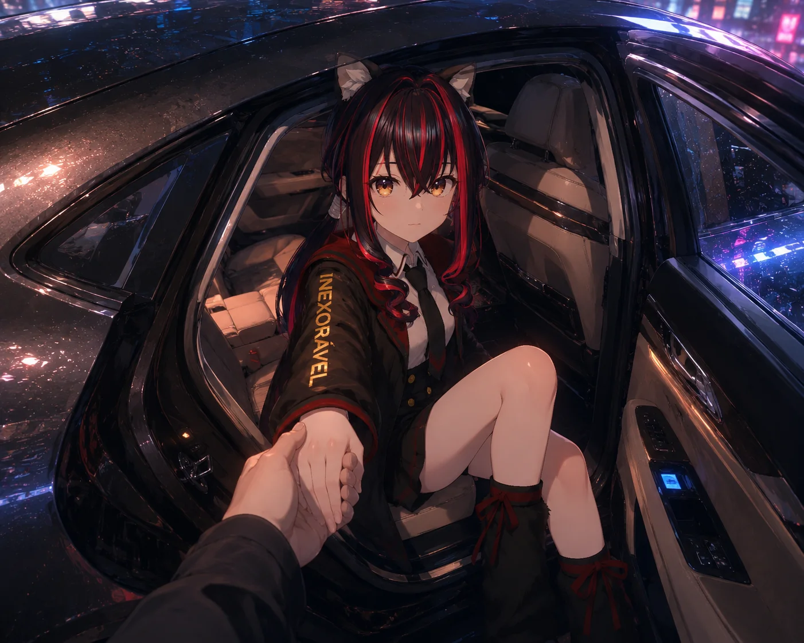

**Category:** Anime Cars · **Tags:** `anime` `cinematic` `cars` `pov` `intimate` `night` `neon` `first-person` `character-reference`

**📋 Prompt:**

```
CAR={McLaren P1 / Nissan GT-R R35 / Lamborghini Revuelto / Porsche 911 GT3 RS / etc}

Use the attached image only as reference for composition, framing, camera angle, perspective, and overall atmosphere.

Create a cinematic anime illustration at night from a highly immersive POV perspective.

Scene:
The viewer is standing outside a {CAR} with the rear passenger door open. The camera is positioned slightly above eye level and tilted downward toward the rear passenger compartment, creating the feeling of someone about to enter the vehicle.

Composition:
- framing through the open rear door
- luxury sports car or supercar interior occupying a large portion of the scene
- character seated diagonally on the rear seat (or rear seating area when applicable)
- legs naturally oriented toward the viewer
- direct eye contact with the camera
- character reaching forward and holding the viewer's hand
- intimate invitation gesture
- natural dynamic pose
- avoid T-pose
- avoid A-pose
- elegant cinematic storytelling

Character:
- preserve the identity of the attached character reference
- relaxed expression
- subtle warmth
- soft smile
- fully visible face
- fully visible eyes
- natural body language
- looking directly at the viewer

Vehicle Interior:
- premium luxury sports car interior
- detailed leather and alcantara surfaces
- illuminated dashboard
- ambient LED lighting
- carbon fiber accents
- polished trim
- realistic door panel details
- luxury materials
- reflections on glossy surfaces
- subtle depth of field

Lighting:
- nighttime urban environment
- soft neon reflections from outside
- city lights reflected on windows
- cinematic anime lighting
- volumetric glow
- realistic reflections
- soft bloom
- subtle chromatic aberration
- atmospheric lighting gradients

Environment:
- futuristic city at night
- blurred neon signs
- wet streets outside
- distant headlights
- rain droplets on glass
- reflections on vehicle bodywork

Camera:
- POV perspective
- viewer's hand visible in foreground
- character holding the viewer's hand
- camera close to the door frame
- slight downward angle
- wide-angle lens (24mm-35mm)
- immersive perspective
- natural perspective distortion
- luxury automotive photography influence

Style:
masterpiece,
best quality,
ultra detailed,
semi-realistic anime,
premium anime illustration,
anime movie quality,
high-end anime key visual,
cinematic composition,
beautiful reflections,
depth of field,
film grain,
luxury aesthetic,
emotional ambience,
painterly rendering,
dramatic night atmosphere,
detailed hands,
accurate anatomy,
immersive perspective,
8k
```

**📎 Requires:** An attached reference image — used for both character identity AND compositional/framing reference (the prompt mentions matching atmosphere from the image).

**💡 Why it works:** This is the first POV car prompt in the collection, and it pulls a key trick from the Red Latex Dress prompt: explicitly placing the viewer's hand visible in the foreground (`"viewer's hand visible in foreground / character holding the viewer's hand"`). That one detail flips the entire composition from "portrait of someone in a car" to "first-person scene of being invited into the car." The `{CAR}` variable at the top mirrors the same pattern from the Night Driving prompt (car002), making this part of a coherent series. The wide-angle lens spec (`24mm-35mm`) gives the model a concrete optical anchor that produces natural perspective distortion at door-frame proximity — without it, the model defaults to a flatter 50mm-equivalent look that breaks the POV feeling. Door-frame + slight downward angle + character reaching forward stacks three positional cues that mutually reinforce the "about to enter the vehicle" reading.

**🔧 Variations:** swap `{CAR}` for sedan/SUV options for less aggressive contexts (`Rolls-Royce Phantom`, `Mercedes Maybach`, `Range Rover SV`); change `nighttime urban` to `golden hour at private airport tarmac` for a more cinematic "private jet client pickup" mood; replace `rear passenger compartment` with `front passenger seat` for a co-driver invitation framing; remove `rain droplets on glass` if you want a dry desert highway variant; tighten "intimate invitation gesture" to "playfully patting the seat next to her" for a more casual reading.

---

### 🛏️ Dakimakura

Print-ready 1:3 vertical compositions for life-size body pillow covers, with front and back companion illustrations. Built around dense pose and anatomy rules and explicit negative-prompt blocks to keep the output print-quality.

---

#### Dakimakura — Front Side


**Category:** Dakimakura · **Tags:** `dakimakura` `body-pillow` `1:3-aspect` `print-ready` `character-reference` `identity-lock`

**📋 Prompt:**

```
Use the attached reference character ONLY for the character design, face, hairstyle, colors, outfit identity, accessories, proportions, and personality.

Create a full-body anime dakimakura FRONT-side illustration of the character in a classic premium dakimakura pose.

Canvas and format:
- exact 1:3 aspect ratio (width:height)
- ultra high resolution suitable for professional dakimakura printing
- vertical composition
- full body entirely visible from head to feet
- NO transparent background
- clean soft fabric-style background with subtle gradients or pastel bedding colors
- composition optimized specifically for life-size body pillow covers

Pose and composition:
- character lying down naturally on her back or slightly side-turned toward the viewer
- soft relaxed pose commonly used in premium anime dakimakura artwork
- gentle elegant body curves
- one arm near the chest or pillow area
- relaxed legs with natural positioning
- soft direct eye contact or sleepy affectionate expression
- hair spread softly around the head
- cozy and visually appealing presentation
- centered body alignment with balanced spacing around the silhouette
- entire silhouette clearly readable for printing

Art style:
- modern high-end anime illustration
- highly polished rendering
- detailed anime eyes with glossy highlights
- soft skin shading and subtle blush
- delicate hair strands with refined lighting
- premium gacha-game / visual novel quality artwork
- soft bloom lighting
- clean crisp linework
- smooth fabric rendering with detailed folds and cloth tension
- masterpiece quality
- collectible dakimakura artwork aesthetic

Background:
- soft bedsheets, subtle pillow wrinkles, or elegant minimal fabric textures
- simple clean background that enhances the character without clutter
- warm pastel or neutral color palette
- no detailed room environment

Rendering quality:
- extremely detailed
- razor-sharp print-ready illustration
- high detail from face to feet
- professional commercial-quality anime art
- smooth gradients
- detailed hands and feet
- anatomically clean and appealing proportions

Negative prompt:
- low resolution
- cropped body
- cropped feet
- extra limbs
- bad anatomy
- distorted perspective
- blurry image
- watermark
- text
- logo
- background clutter
- duplicate limbs
- malformed hands
- malformed feet
- fisheye distortion
- transparent background
- poorly centered composition
- low detail rendering
- messy lineart
- oversaturated colors
```

**📎 Requires:** An attached reference image of the character to identity-lock against.

**💡 Why it works:** Dakimakura artwork has very specific commercial requirements that hobby prompts usually miss — this prompt nails three of them. First, `exact 1:3 aspect ratio` stated explicitly at the top forces the model out of its default square/portrait bias. Second, the dedicated `Negative prompt:` block at the end (uncommon in GPT Image 2 prompts but extremely effective here) suppresses the top failure modes — cropped feet, malformed hands, transparent backgrounds — that ruin print runs. Third, `print-ready illustration` + `razor-sharp` as final quality keywords nudges the renderer toward higher detail density than vanilla "ultra detailed" produces. The split into Canvas/Pose/Art/Background/Quality/Negative is a clean layered structure the model handles section by section.

**🔧 Variations:** swap `lying down on her back` for `slightly side-turned with a hand near the cheek` for a more affectionate pose; change `warm pastel` → `cool blue-toned` for a different mood palette; tighten "soft sleepy expression" to a specific emotion like `slightly mischievous smile` or `gentle morning yawn` for character-specific variants.

---

#### Dakimakura — Back Side


**Category:** Dakimakura · **Tags:** `dakimakura` `body-pillow` `back-side` `1:3-aspect` `print-ready` `character-reference` `identity-lock`

**📋 Prompt:**

```
Use the attached reference character ONLY for the character design, face, hairstyle, colors, outfit identity, accessories, proportions, and personality.
Create a full-body anime dakimakura BACK-side illustration of the character in a classic premium dakimakura pose.

Canvas and format:
- exact 1:3 aspect ratio (width:height)
- ultra high resolution suitable for professional dakimakura printing
- vertical composition
- full body entirely visible from head to feet
- NO transparent background
- composition optimized specifically for life-size body pillow covers
- designed as the BACK side companion illustration to a dakimakura front-side artwork

Pose and composition:
- character lying naturally facing away from the viewer or partially turning her upper body back toward the camera
- elegant back-focused pose commonly used in premium dakimakura artwork
- visible back, shoulders, waistline, and relaxed leg positioning
- subtle natural body curves
- head slightly turned so part of the face or eye may still be visible
- hair flowing naturally across the pillow or bedsheets
- arms resting softly near the pillow or body
- relaxed legs with natural positioning
- cozy and visually appealing presentation
- centered body alignment with balanced spacing around the silhouette
- entire silhouette clearly readable for printing

Art style:
- modern high-end anime illustration
- highly polished rendering
- premium gacha-game / visual novel quality artwork
- clean refined linework
- soft anime skin shading
- delicate hair strands with glossy highlights
- detailed fabric folds and realistic cloth tension
- subtle bloom lighting
- elegant soft shadows
- masterpiece quality
- collectible dakimakura artwork aesthetic

Background:
- soft bedsheets, pillow folds, or subtle fabric textures
- clean minimal background without clutter
- warm pastel or neutral color palette
- soft cozy atmosphere

Rendering quality:
- extremely detailed
- razor-sharp print-ready illustration
- professional commercial-quality anime art
- high detail from hair to feet
- smooth gradients and polished shading
- detailed hands and feet
- anatomically clean and aesthetically pleasing proportions

Optional details:
- slightly lifted leg or subtle twist in posture for elegant silhouette flow
- hair partially covering the back or shoulders
- soft sleepy or teasing glance over the shoulder
- gentle fabric compression beneath the body

Negative prompt:
- low resolution
- cropped body
- cropped feet
- extra limbs
- distorted anatomy
- blurry details
- malformed hands
- malformed feet
- duplicate limbs
- fisheye distortion
- watermark
- logo
- text
- transparent background
- cluttered background
- poorly centered composition
- bad perspective
- messy lineart
- low-detail rendering
- overly exaggerated anatomy
```

**📎 Requires:** An attached reference image — should be the **same character used for the front-side prompt** to produce a matching pillow set.

**💡 Why it works:** Built as a deliberate companion to the front-side prompt — note the explicit line `"designed as the BACK side companion illustration to a dakimakura front-side artwork"` which tells the model this is part of a set, encouraging stylistic consistency. The "Optional details" block (lifted leg, hair across pillow, glance over shoulder) provides creative variations without forcing them — useful pattern when you want the renderer to pick one of several valid moves rather than rigidly executing one. The pose description is intentionally less prescriptive than the front-side because back-views have fewer hard constraints; instead, the prompt focuses heavily on what's *visible* (back, shoulders, waistline) to prevent awkward truncation.

**🔧 Variations:** generate front + back as a paired set using identical character reference and seed, then print both for a complete pillow cover; swap `glance over the shoulder` → `face fully turned away with only hair visible` for a more abstract back design; change the palette via the background line for matching seasonal sets.

---

### 🛋️ Interior & Intimate Scenes

Anime illustrations focused on quiet domestic moments, soft lighting, and emotionally restrained intimacy. Heavy emphasis on environmental atmosphere over action.

---

#### Bedroom Afternoon (Soft Anime Intimacy)


**Category:** Interior & Intimate Scenes · **Tags:** `anime` `intimate` `bedroom` `golden-hour` `soft-lighting` `character-reference` `identity-lock`

**📋 Prompt:**

```
Use the attached reference character ONLY for the character design, outfit, hairstyle, colors, accessories, and identity.

Recreate the scene in the exact emotional and cinematic style of a soft intimate anime illustration:
- warm golden sunlight streaming through a bedroom window
- dreamy late afternoon atmosphere
- soft bloom lighting
- subtle lens flare and chromatic aberration
- delicate anime rendering
- highly detailed painterly shading
- soft shadows across the body and bed sheets
- calm, intimate, relaxed mood
- cinematic composition
- shallow depth of field
- gentle ambient glow
- slightly overexposed highlights
- premium anime illustration quality

Pose and camera:
- character lying diagonally across a bed
- body partially curled naturally
- camera positioned above at a tilted angle
- one arm resting near the head
- relaxed fingers
- direct eye contact toward the viewer
- soft sleepy expression
- natural body perspective foreshortening
- elegant composition with the face as focal point
- hair spread naturally on the pillow and sheets
- legs partially visible and softly framed

Environment:
- soft white bed sheets with natural folds
- cozy bedroom atmosphere
- sunlight rays crossing the scene
- subtle pillow details
- soft ambient particles and light artifacts
- intimate indoor lighting

Art style:
- modern high-end anime illustration
- ultra detailed anime eyes
- delicate eyelashes
- soft skin gradients
- expressive face
- refined lineart
- painterly anime rendering similar to premium anime key visuals
- cinematic color grading
- warm cream, gold, and pastel tones
- highly aesthetic composition

IMPORTANT:
- preserve the attached character exactly
- keep the attached outfit unchanged
- keep the hairstyle and colors unchanged
- do not redesign the character
- prioritize mood, lighting, pose, framing, and atmosphere from the reference image
- avoid exaggerated anatomy
- avoid overly sharp shadows
- avoid photorealism
- avoid NSFW explicitness
- tasteful anime sensuality only

masterpiece, best quality, absurdres, cinematic anime illustration, soft lighting, dreamy atmosphere, volumetric sunlight, anime bedroom scene, emotional composition, ultra detailed
```

**📎 Requires:** An attached reference image — character, outfit, and hair fully identity-locked.

**💡 Why it works:** This prompt nails intimate anime aesthetics by stacking specific *technical* lighting choices that produce the look — `chromatic aberration`, `slightly overexposed highlights`, `volumetric sunlight`, `lens flare`. These are camera/lens artifacts, not illustration techniques, which is what gives the output its "anime film still" quality rather than "character portrait" feel. The pose block is unusually specific (diagonal across bed, tilted camera, foreshortening, hair spread on pillow) — that level of detail prevents the model from defaulting to a generic seated portrait. The explicit `avoid NSFW explicitness / tasteful anime sensuality only` line is doing important guardrail work: it tells the model the *register* is romantic-intimate, not erotic, and keeps the output in publishable territory.

**🔧 Variations:** swap `late afternoon` for `early morning blue-hour` for cooler tones; change `lying diagonally on bed` to `sitting by the window with knees drawn up` for a different intimate moment; replace `bedroom` with `tatami room with shoji screens` for a Japanese-traditional setting; remove `direct eye contact` and use `looking out the window` for a more contemplative pose.

---

#### Gothic Mansion Close-Up (Anime Opening Frame)

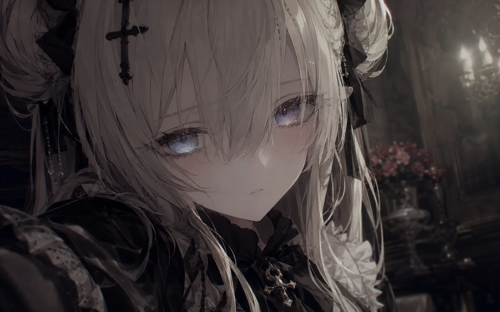

**Category:** Interior & Intimate Scenes · **Tags:** `anime` `gothic` `close-up` `victorian` `melancholic` `anime-opening` `aristocratic` `style-reference`

**📋 Prompt:**

```
Use the attached references ONLY as visual/style references.

GOAL:
Create a highly atmospheric anime scene in the EXACT aesthetic language of melancholic gothic mystery anime openings from the late 2010s-early 2020s.

IMPORTANT CAMERA CHANGE:
The camera must be close to the character's face.
Ultra intimate cinematic POV.
The composition should feel emotionally invasive and claustrophobic, like a slow anime opening close-up frame.

CAMERA / POV:
- extreme close-up shot
- face occupies most of the frame
- only partial shoulders/hair visible
- eyes positioned near cinematic upper-third framing
- shallow depth of field
- soft lens compression
- intimate facial framing
- subtle off-center composition
- delicate perspective distortion from close distance
- background heavily blurred into dreamy gothic shapes
- cinematic portrait framing
- visual novel opening close-up aesthetic
- extremely near camera distance
- viewer feels physically close to the character
- subtle breathing-space negative composition
- quiet psychological intimacy
- elegant oppressive closeness
- anime opening "silent stare" framing

CHARACTER STYLE:
- delicate anime girl designs
- pale porcelain skin
- long silver/white hair with extremely soft shading
- layered silky bangs partially covering one eye
- extremely thin and refined linework
- fragile facial structure
- tiny nose and soft small lips
- pale cool-toned complexion
- subtle blush gradients
- gothic aristocratic beauty

EYES (VERY IMPORTANT):
- large soft anime eyes with fragile melancholic appearance
- semi-lidded sleepy eyes
- distant emotionally restrained gaze
- slightly empty expression
- thin elegant eyelashes with layered sharp lash tips
- soft lower lashes
- faint glossy reflections
- translucent iris rendering
- icy blue-violet eyes
- subtle heterochromia
- muted luminous pupils
- extremely soft eye shading
- delicate gradient irises
- faint gray rings around the iris
- soft reflective anime highlights
- watery crystalline appearance
- no exaggerated sparkle
- tired aristocratic expression
- gentle downward eye angle
- subtle sadness in the eyes
- elegant emotionally detached doll-like anime eye design
- highly detailed but soft eyes
- delicate eyelid shadows
- slightly blurred dreamy eye rendering
- avoid modern hyper-saturated anime eyes
- avoid sharp shounen eyes
- avoid moe cartoon eyes

OUTFIT:
- aristocratic gothic maid attire
- Victorian-inspired fashion
- black ribbons
- lace frills
- elegant embroidery
- dark bows near the hair
- refined monochrome palette
- subtle religious/gothic ornamentation
- elegant silhouette design

ENVIRONMENT STYLE:
- luxurious gothic mansion interior
- antique chandeliers
- faded paintings
- Victorian architecture
- dim warm lighting mixed with cold green-gray shadows
- dusty cinematic atmosphere
- subtle fog/haze
- polished dark surfaces
- old European aristocratic estate feeling
- blurred flowers in antique vases
- muted color palette
- environment mostly out of focus due to close lens proximity

LIGHTING:
- cinematic low-contrast anime lighting
- soft bloom
- slight film grain
- volumetric light
- hazy glow around chandeliers
- desaturated colors
- gentle ambient occlusion
- soft shadow gradients
- dreamy atmospheric depth
- soft facial rim light
- subtle eye reflections
- delicate shadow transitions across cheeks and eyelids

COLOR PALETTE:
- muted ivory
- faded crimson
- dusty rose
- dark walnut wood
- pale gray-green
- antique gold
- desaturated black
- cold silver tones

RENDERING STYLE:
- ultra detailed anime face rendering
- soft painterly compositing
- cinematic anime frame
- realistic environmental texture but anime character rendering
- subtle blur and chromatic aberration
- atmospheric depth haze
- old film feeling
- high-quality anime production aesthetic
- soft skin rendering
- extremely delicate hair strands
- refined anime eyelash detail

POSE / EXPRESSION:
- looking slightly downward toward viewer
- subtle head tilt
- emotionally restrained expression
- calm silent stare
- tiny melancholic mouth expression
- relaxed facial muscles
- aristocratic emotional distance
- NEVER comedic expression
- NEVER exaggerated emotion
- NEVER T-pose
- NEVER A-pose

IMPORTANT:
- NO modern neon cyberpunk elements
- NO vibrant saturated colors
- NO glossy plastic rendering
- NO generic fantasy RPG aesthetic
- NO AI-art sharpness
- NO 3D Pixar look
- avoid hyperreal skin pores
- avoid action poses

MOOD:
lonely aristocratic mansion,
quiet psychological tension,
dreamlike sadness,
gothic elegance,
soft emotional distance,
haunting beauty,
silent intimate eye contact,
slow atmospheric anime opening energy
```

**📎 Requires:** Attached references — used as style/aesthetic anchors rather than strict identity-lock (the character traits are described prescriptively in the prompt body).

**💡 Why it works:** This prompt is structurally fascinating because it dedicates an *entire 22-line block* exclusively to eye rendering — that's unusual but extremely effective. For close-up anime portraits, the eyes carry almost all the emotional weight, so over-specifying them (semi-lidded, melancholic, translucent iris, faint gray rings, subtle heterochromia, no exaggerated sparkle) gives the model a precise target that prevents drift into generic "moe sparkle" or "shounen sharp" defaults. The "anime opening" framing is doing cultural-anchor work — naming a specific era (late 2010s-early 2020s) locks in a recognizable aesthetic family (think *Princess Principal*, *Violet Evergarden* OP frames). The repeated `NO` / `avoid` blocks at the end suppress every default the model would otherwise reach for (cyberpunk, saturated, glossy, RPG, AI-sharp, Pixar).

**🔧 Variations:** swap `aristocratic gothic maid attire` for `Victorian aristocrat with high collar` if you want less anime-trope-specific styling; change `icy blue-violet eyes` to a specific character eye color from your reference; replace `gothic mansion interior` with `abandoned cathedral with stained glass` for a more sacred mood; tighten `late 2010s-early 2020s anime openings` to a specific show reference if you want a particular OP director's framing.

---


#### Messy Couch Nap (Cozy Living Room POV)

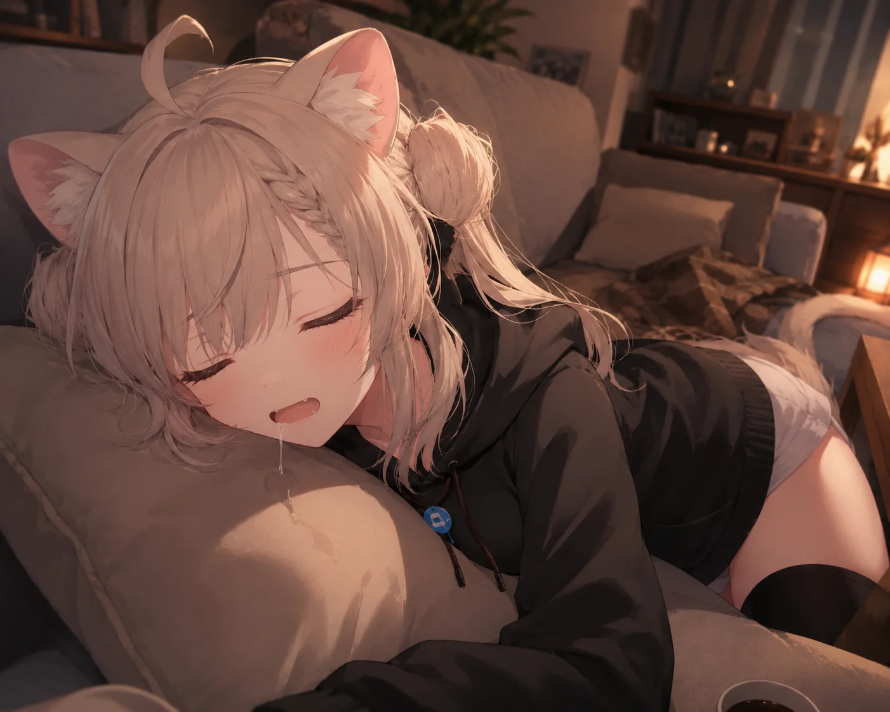

**Category:** Interior & Intimate Scenes · **Tags:** `anime` `intimate` `sleeping` `cozy` `living-room` `pov` `domestic` `character-reference` `identity-lock`

**📋 Prompt:**

```
Use the uploaded image strictly as the identity reference only. Preserve the exact face, hairstyle, hair color, eye shape, body proportions, species traits, silhouette, clothing style cues, and overall recognizable visual identity of the referenced character. Do not censor, obscure, crop, block, blur, or cover the face in any way.

Create a cozy anime-style indoor illustration of the same character sleeping messily on a living room sofa. The point of view is very close to the character's head and upper torso, as if the viewer is sitting beside the couch. The character is sprawled out awkwardly and ungracefully across the sofa in a natural sleeping pose, with limbs loosely positioned and posture slightly twisted from falling asleep unintentionally.

The character is sleeping deeply with their mouth slightly open, wearing a soft sleepy smile, visibly relaxed and comfortable. A small bit of drool is running from the corner of the mouth onto the sofa pillow or blanket, emphasizing the deep carefree sleep. Eyes fully closed, cheeks slightly relaxed, peaceful sleepy expression.

The living room environment should feel warm, lived-in, and cozy: soft ambient evening lighting, subtle clutter, cushions, coffee table, shelves, warm lamp light, curtains, and domestic details visible in the background. Make the interior feel believable and comfortable rather than staged.

Camera composition: close-up perspective near the head, slightly angled from above, emphasizing the sleepy facial expression and messy pose while still showing enough of the couch and room to establish the environment.

Art style: high-quality anime illustration, soft shading, cinematic lighting, detailed fabric folds, expressive sleeping expression, intimate cozy atmosphere, natural pose, warm colors, polished rendering.

Avoid T-pose, A-pose, stiff anatomy, symmetry, exaggerated glamour posing, excessive sharpness, horror atmosphere, or overly clean/composed sleeping posture.
```

**📎 Requires:** An attached reference image — identity fully locked through face, hair, eyes, body, species traits, clothing.

**💡 Why it works:** This prompt is built around a single counter-intuitive directive: *make the pose ugly on purpose*. Most anime prompts default to "elegant" / "graceful" / "composed" — this one explicitly requests `"sprawled out awkwardly and ungracefully"`, `"posture slightly twisted from falling asleep unintentionally"`, and even adds drool. The result reads as authentic and lived-in rather than glamorized. The "Avoid" block reinforces this by explicitly killing `"exaggerated glamour posing"` and `"overly clean/composed sleeping posture"` — those are the defaults the model would otherwise produce. The "lived-in, cozy, believable rather than staged" environment directive prevents the model from rendering a sterile catalog-style living room. The opening identity-lock paragraph adds an unusual line — `"Do not censor, obscure, crop, block, blur, or cover the face in any way"` — which preemptively kills the common failure where the model places a pillow/blanket/hand over the face when generating sleeping characters.

**🔧 Variations:** swap `living room sofa` for `reading nook with armchair`, `bedroom floor next to the bed`, or `study desk with head down on the keyboard` for different "fell asleep unexpectedly" contexts; change `evening warm lighting` to `late morning sunlight through blinds` for a different time-of-day; remove the drool detail if you want a slightly less cursed-cozy register; tighten the environment with specific items (`open book on chest`, `laptop still on with screensaver`, `controller dropped on the floor`) for richer "fell asleep doing X" storytelling.

---


#### Underwater Bubble Bikini (Floating in Aquatic Sphere)

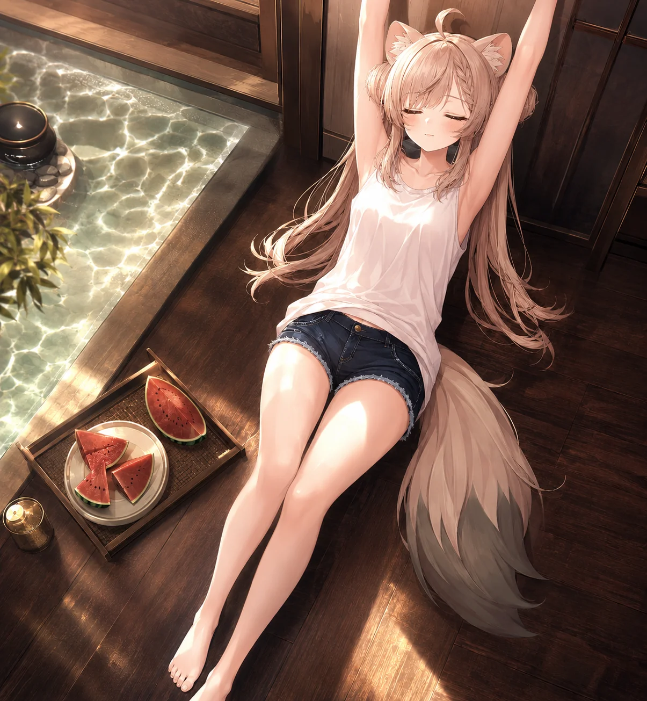

**Category:** Interior & Intimate Scenes · **Tags:** `anime` `underwater` `bubble` `bikini` `dynamic-pose` `foreshortening` `aquatic` `splash-art` `character-reference` `identity-lock`

**📋 Prompt:**

```
Use the attached image strictly as the full scene and character identity reference. Preserve exactly the same face, red eyes, long crimson hair, animal ears, black bikini design, proportions, expression, accessories, tail, and recognizable anime identity. Keep the same playful seductive energy and underwater fantasy atmosphere.

Create an ultra-detailed anime underwater illustration with a dynamic floating composition inside a massive transparent water bubble suspended in a bright turquoise aquatic environment. The character is curled into an elegant floating pose with dramatic foreshortening: legs bent dynamically toward the camera, one foot extended downward, torso slightly twisted, arms raised playfully against the inner surface of the bubble, hair flowing freely in all directions with fluid underwater motion.

Outfit:
minimal black triangle bikini with thin straps, glossy wet fabric, tiny gold ring accessories, black frilled wrist scrunchies, fantasy animal-ear accessories, sleek black tail element flowing behind the body.

Expression:
playful teasing smile with confident mischievous energy, direct eye contact toward the viewer, fully visible uncensored face, lively anime emotion.

Environment:
crystal-clear underwater setting filled with floating air bubbles, sparkling water particles, refracted sunlight beams, tiny fish swimming around the character, oversized translucent bubble sphere surrounding the body, floating inflatable rings in the distance, cute aquatic mascot float on the lower right, shimmering caustic reflections, energetic ocean atmosphere.

Motion and effects:
dynamic underwater hair movement, swirling ribbons of water, bubble distortion, water droplets sliding across the transparent sphere, refracted highlights, fluid motion trails, cinematic splash effects, glossy reflections across skin and water surface.

Lighting:
bright tropical aqua lighting, soft volumetric underwater rays, cool cyan glow, reflective wet highlights on skin and bikini fabric, sparkling specular highlights, luminous water atmosphere.

Art style:
premium modern anime illustration, ultra-clean linework, highly detailed skin rendering, glossy anime eyes, soft cel-shading blended with painterly gradients, cinematic composition, visual novel CG quality, high-end gacha splash-art aesthetic, masterpiece quality, absurdly detailed.

Camera:
wide-angle underwater perspective with strong depth, floating centered composition, dynamic diagonal flow, immersive aquatic framing.

Dynamic natural pose only, avoid T-pose and A-pose completely. No watermark, no logo, no extra text.
```

**📎 Requires:** An attached reference image — full identity lock (face, eyes, hair, ears, tail, bikini design, proportions, expression). The character-specific traits (crimson hair, red eyes, animal ears) should be edited if reusing with a different reference.

**💡 Why it works:** This prompt is structured around a single technical achievement: rendering a *character inside a transparent water sphere underwater* — a layered composition that requires the model to understand multiple refraction surfaces (the bubble surface + the surrounding water). Naming this explicitly as `"oversized translucent bubble sphere surrounding the body"` plus `"water droplets sliding across the transparent sphere"` tells the model there are two distinct water boundaries to render. The dramatic foreshortening directive (`"legs bent dynamically toward the camera, one foot extended downward"`) gives the model concrete anatomical positioning rather than vague "floating pose." The `"high-end gacha splash-art aesthetic"` reference is a specific cultural anchor — gacha mobile game character illustrations have very recognizable splash compositions with dynamic floating poses and caustic highlights, which the model has training data for. The bright turquoise palette + small fish + inflatable rings keeps the energy playful-summery rather than drifting into ominous deep-sea aesthetics.

**🔧 Variations:** swap `bright turquoise tropical aquatic environment` for `dark deep-sea bioluminescent setting` for a moody variant with glowing jellyfish and dark blue tones; change `black triangle bikini` to `iridescent mermaid-scale swimsuit` for a fantasy-aquatic look; replace `playful teasing smile` with `serene meditative expression and closed eyes` for a calmer contemplative composition; remove the bubble sphere entirely for a more conventional underwater scene; tighten "tiny fish" to specific species (`clownfish school`, `glowing jellyfish ribbons`, `tropical angelfish`).

---

### 🌌 Cosmic & Cinematic Scenes

Atmospheric anime illustrations exploring scale, emotion, and surreal environments — characters in impossible or sublime situations, with heavy emphasis on lighting and environmental storytelling.

---

#### Character on the Wing of a Flying Airplane


**Category:** Cosmic & Cinematic Scenes · **Tags:** `anime` `cinematic` `aviation` `night` `cosmic` `surreal` `character-reference`

**📋 Prompt:**

```
Use the attached reference character ONLY for the character design, outfit, hairstyle, colors, accessories, and identity.

Create an epic cinematic anime illustration of the character sitting or standing on the wing of a flying airplane high above Earth at night.

Scene composition:
- massive airplane wing extending into the sky
- character positioned directly on the wing
- enormous view of Earth curvature below
- glowing city lights stretching across continents
- visible atmosphere glow on the horizon
- deep dark blue and black space above
- countless stars filling the sky
- faint nebula-like clouds and cosmic dust
- surreal sense of scale and altitude
- dreamlike aviation atmosphere

Character pose:
- character sitting near the edge of the wing, legs relaxed over the side
- OR kneeling while looking toward the horizon
- OR standing carefully with hair flowing violently in the wind
- long hair streaming dramatically across the scene
- contemplative or melancholic expression
- calm body language despite impossible situation
- gaze directed toward Earth, stars, or distant horizon
- cinematic silhouette partially illuminated by city lights below

Camera and framing:
- ultra wide cinematic shot
- high-angle perspective showing both character and planet below
- airplane wing creating strong leading lines
- asymmetrical composition
- character relatively small compared to the environment for scale emphasis
- dynamic depth and atmospheric perspective
- immersive aerial composition

Lighting:
- golden city lights reflecting softly onto the character
- faint moonlight and starlight illumination
- soft rim lighting along hair and body
- subtle atmospheric glow
- deep cinematic shadows
- volumetric haze near the horizon
- gentle bloom and light streaks

Art style:
- cinematic anime key visual
- ultra detailed atmospheric rendering
- painterly anime lighting
- highly detailed nightscape
- Makoto Shinkai-inspired environmental lighting
- dramatic anime sky rendering
- soft yet detailed character shading
- elegant flowing hair animation feel
- premium anime movie aesthetic

Mood:
- lonely but beautiful
- surreal freedom
- emotional cosmic wonder
- dreamlike night flight
- peaceful solitude above the world
- melancholic yet breathtaking

IMPORTANT:
- preserve the attached character exactly
- keep original outfit unchanged
- keep original hairstyle and colors unchanged
- do not redesign the character
- the airplane wing must feel realistic in scale
- prioritize atmosphere and cinematic lighting
- avoid photorealism
- avoid hard cel-shading
- avoid overly saturated neon colors
- maintain a soft cinematic anime aesthetic

masterpiece, best quality, cinematic anime illustration, airplane wing scene, Earth from above, night flight atmosphere, glowing city lights, cosmic anime scenery, atmospheric perspective, emotional anime art, ultra detailed sky, volumetric lighting, dreamlike composition
```

**📎 Requires:** An attached reference image of the character.

**💡 Why it works:** This prompt sells the impossible by *grounding* it — the lines "calm body language despite impossible situation" and "the airplane wing must feel realistic in scale" tell the model to commit to the surreal premise without breaking physical believability. Listing three alternative pose options (sitting / kneeling / standing) gives the renderer flexibility rather than locking into one, which typically produces more natural results. The lighting block layers four light sources (city lights, moonlight, starlight, rim) — that's what gives the character physical presence in the scene instead of floating like a sticker.

**🔧 Variations:** swap `night` for `dawn breaking over the horizon` for warmer pinks/golds; change `airplane wing` to `bullet train roof` or `cargo airship deck` for different vehicle drama; replace the contemplative mood with `triumphant arms raised pose` for a more empowering shot.

---

#### Surreal Futuristic Observatory (Fisheye)


**Category:** Cosmic & Cinematic Scenes · **Tags:** `anime` `cinematic` `fisheye` `urban-fantasy` `gothic-futurism` `surreal` `character-redesign`

**📋 Prompt:**

```
create image
Use the attached reference character ONLY as the base identity reference for facial structure, hairstyle silhouette, recognizable facial traits, fox ears/tail identity, and overall character essence.

IMPORTANT CHARACTER REDESIGN:
- redesign the character so they naturally belong to the surreal futuristic world
- reinterpret the outfit into refined gothic retro-futuristic anime fashion
- preserve the recognizable identity while elevating visual sophistication
- cleaner and more intentional design language
- layered black fabrics, semi-transparent materials, lace accents, soft techwear elements, subtle metallic ornaments, ribbons, straps, asymmetrical sleeves, elegant accessories
- avoid excessive random detail clutter
- prioritize silhouette clarity and visual readability
- long flowing hair and tail should move naturally through the fisheye composition
- integrate subtle cyber-surreal motifs into clothing design rather than overwhelming mechanical complexity
- fashion should feel premium, artistic, cinematic, and believable within the world

Create an ultra-detailed surreal cinematic anime illustration inside a gigantic futuristic glass observatory suspended above a sprawling anime metropolis.

CORE VISUAL DIRECTION:
- immersive but visually readable
- highly detailed environment WITHOUT chaotic over-detailing
- focus on strong composition and atmospheric depth
- elegant environmental storytelling instead of random object overload
- the image should feel rich, alive, and cinematic while maintaining breathing room
- preserve areas of negative space for visual balance
- avoid noisy texture saturation
- avoid excessive tiny meaningless details

ENVIRONMENT:
- massive curved panoramic glass walls overlooking a futuristic city
- surreal fisheye distortion bending the architecture naturally
- layered city depth with bridges, suspended buildings, glowing streets, and distant structures
- subtle moving drones and small environmental activity below
- refined gothic interior mixed with futuristic architecture
- elegant chandeliers, hanging lamps, exposed pipes, glass reflections, roses, old clocks, suspended cables, decorative machinery, greenhouse elements
- carefully curated environmental props
- cozy luxurious atmosphere inside contrasted against gigantic city scale outside
- polished floor reflections and strong perspective depth
- environment should feel dense but organized

CHARACTER POSE:
- dynamic and visually engaging pose
- avoid stiff standing pose
- character leaning slightly toward the camera with confidence
- one hand extended naturally toward the viewer OR lightly touching curved glass
- subtle body twist to enhance perspective
- expressive posture with cinematic flow
- long hair and tail sweeping dramatically across the composition
- elegant leg positioning with believable balance
- direct eye contact toward the viewer
- expression: mysterious, inviting, slightly playful

CAMERA AND COMPOSITION:
- EXTREME fisheye / ultra wide-angle lens
- dramatic curved perspective distortion
- cinematic depth and scale
- strong leading lines guiding the eye toward the character
- foreground framing elements
- layered depth composition
- character clearly readable as focal point
- avoid overwhelming environmental clutter around the face
- maintain visual hierarchy
- balanced detail distribution across the image
- immersive but clean cinematic framing

LIGHTING:
- soft daylight mixed with warm interior lighting
- atmospheric haze
- cinematic bloom
- glowing reflections on glass
- soft volumetric lighting
- elegant contrast
- subtle colorful reflected lights
- dreamy atmospheric depth
- avoid aggressive neon overload

ART STYLE:
- premium anime concept art quality
- painterly anime rendering
- ultra detailed but controlled
- sophisticated environmental illustration
- delicate anime facial rendering
- refined linework
- rich atmospheric perspective
- cinematic anime key visual aesthetic
- surreal urban fantasy atmosphere
- visually cohesive color palette

MOOD:
- elegant surrealism
- immersive futuristic dreamscape
- mysterious urban fantasy
- cinematic wonder
- cozy sci-fi atmosphere
- dreamlike exploration
- controlled visual richness

IMPORTANT:
- the character MUST feel naturally integrated into the environment
- prioritize composition, readability, and atmosphere over raw density
- maintain visual cohesion between character and world
- avoid cluttered randomness
- avoid generic cyberpunk neon overload
- avoid empty spaces while still preserving visual breathing room
- avoid photorealism
- maintain painterly anime elegance

masterpiece, best quality, ultra detailed anime illustration, fisheye perspective, surreal futuristic observatory, cinematic anime composition, immersive urban fantasy, elegant anime sci-fi art, painterly anime rendering, atmospheric perspective, dreamlike futuristic city, refined visual storytelling, premium anime key visual, sophisticated environmental art
```

**📎 Requires:** An attached reference image — used as **essence reference** (face, silhouette, ears/tail), with explicit permission to redesign the outfit.

**💡 Why it works:** The most interesting structural choice here is the *anti-clutter discipline* — the "CORE VISUAL DIRECTION" block explicitly warns against `chaotic over-detailing`, `noisy texture saturation`, and `excessive tiny meaningless details`. GPT Image 2 tends to over-stuff scenes when given long environment lists, so this prompt counterbalances its own dense scene description with repeated calls for "breathing room" and "visual hierarchy." The `EXTREME fisheye / ultra wide-angle lens` is named multiple times because that's the highest-leverage compositional choice — it bends architecture and produces immediate visual identity for the piece.

**🔧 Variations:** swap `fisheye` for `dutch tilt cinematic angle` for a different distortion style; change `gothic retro-futuristic` to `art-nouveau futurism` or `solar-punk` for radically different fashion direction; remove `fox ears/tail` from the identity block if your reference doesn't have those features.

---

#### Tiny Character Under a Meteor Shower (16:9)


**Category:** Cosmic & Cinematic Scenes · **Tags:** `anime` `cinematic` `cosmic` `16:9` `landscape` `meteor-shower` `scale` `character-integration`

**📋 Prompt:**

```
create image
Use the attached reference character ONLY as the base identity reference for facial structure, hairstyle silhouette, recognizable traits, colors, and overall character essence.

IMPORTANT CHARACTER INTEGRATION:
- adapt the character rendering, lighting, textures, and color grading so the character naturally blends into the environment
- the character should feel like part of the atmosphere rather than pasted over the background
- soften edges where appropriate using atmospheric lighting and haze
- allow subtle painterly blending between hair, clothing, clouds, and cosmic light
- integrate the character into the scene using volumetric glow, ambient reflections, and environmental color bleed
- hair and clothing should visually flow with the wind direction and meteor movement
- avoid isolated or overly sharp character rendering
- prioritize cinematic harmony between character and environment

Create a breathtaking cinematic anime illustration of the character standing alone beneath an enormous cosmic sky filled with meteor trails and infinite stars.

FORMAT:
- exact 16:9 aspect ratio
- ultra wide cinematic framing
- landscape orientation
- extremely large environmental scale

Core visual concept:
- massive celestial sky dominating almost the entire composition
- countless meteor streaks crossing the atmosphere
- enormous curved horizon glowing softly with cosmic light
- the character appearing EXTREMELY small against the scale of the universe
- dreamlike sense of infinity and emotional solitude
- atmospheric cosmic fantasy aesthetic

Environment:
- endless cloudscape or surreal elevated world above the clouds
- horizon glowing with pale white-blue light
- deep dark blue star-filled sky
- dense stars, nebulae, and subtle galactic clouds
- shooting stars and meteor showers stretching diagonally across the scene
- faint atmospheric haze and glowing particles
- soft luminous mist drifting across the clouds
- minimal environmental clutter for maximum scale emphasis

Character composition:
- character positioned near the lower center or lower third of the image
- character occupying only a VERY tiny portion of the frame
- sky and celestial atmosphere should occupy roughly 90-95% of the composition
- partially enveloped by glowing mist and atmospheric light
- holding or reaching toward a glowing orb, star fragment, or faint cosmic light
- flowing hair and clothing moving softly in the wind
- contemplative posture
- emotional body language conveying awe and solitude
- silhouette subtly dissolving into the cosmic atmosphere in some areas
- prioritize environmental scale over character visibility

Pose rules:
- NEVER use T-pose, A-pose, mannequin pose, idle VRChat pose, or character-sheet standing pose
- if the generated pose resembles a T-pose or A-pose, replace it with a natural cinematic pose
- use soft asymmetrical body language
- natural weight distribution
- elegant relaxed arm positioning
- subtle emotional posture rather than action posing
- avoid stiff symmetrical posing

Camera and framing:
- ultra wide cinematic composition
- extremely distant camera perspective
- the character should look visually insignificant compared to the sky
- low horizon line to maximize celestial scale
- dramatic celestial perspective
- immersive atmospheric depth
- strong diagonal movement from meteor trails
- subtle curvature of the world or cloud horizon
- emphasize overwhelming cosmic scale and emptiness

Lighting:
- luminous blue-white cosmic illumination
- glowing meteor streaks casting subtle light
- soft rim lighting around the tiny character silhouette
- atmospheric bloom and haze
- delicate volumetric glow
- deep blue shadows contrasted with celestial highlights
- environmental lighting affecting the character naturally
- painterly atmospheric blending between foreground and background

Art style:
- ultra detailed anime sky rendering
- cinematic anime movie aesthetic
- painterly anime lighting
- highly integrated character/environment rendering
- Makoto Shinkai-inspired celestial atmosphere
- emotional environmental storytelling
- highly detailed stars and meteor effects
- atmospheric perspective and soft gradients
- premium anime key visual quality

Mood:
- cosmic wonder
- peaceful loneliness
- emotional transcendence
- dreamlike silence
- infinite scale and beauty
- melancholic serenity
- contemplative fantasy atmosphere

IMPORTANT:
- preserve recognizable identity traits from the attached character
- allow the rendering style to adapt for environmental cohesion
- the sky must overwhelmingly dominate the composition
- prioritize atmosphere, integration, scale, and celestial lighting
- the character should feel embedded inside the scene naturally
- avoid photorealism
- avoid hard cutout-looking character rendering
- avoid cluttered foregrounds
- avoid excessive neon cyberpunk colors
- maintain soft cinematic anime elegance

masterpiece, best quality, cinematic anime illustration, ultra wide 16:9 composition, meteor shower sky, cosmic anime scenery, emotional anime landscape, tiny character scale, overwhelming celestial environment, integrated character rendering, atmospheric blending, dreamlike celestial lighting, ultra detailed stars, atmospheric perspective, anime movie aesthetic, volumetric glow, painterly anime rendering
```

**📎 Requires:** An attached reference image — identity preserved but explicitly *adapted* to blend with environment.

**💡 Why it works:** This is one of the most structurally interesting prompts because it *inverts* the usual identity-lock pattern. The "IMPORTANT CHARACTER INTEGRATION" block at the top explicitly authorizes the model to soften edges, blend the character into atmospheric lighting, and dissolve parts of the silhouette into mist — instructions you'd never give for a portrait. This is necessary because the goal is *scale and atmosphere*, not character showcasing. The explicit `90-95% sky composition` numbers force the model out of its center-the-character default. The "Pose rules" block guards against T-pose contamination from 3D references — combined with the cosmic-integration directives, you get a character that feels embedded in the scene rather than pasted on.

**🔧 Variations:** swap `meteor shower` for `aurora borealis ribbons` or `total solar eclipse with corona` for different celestial events; change `lower third` positioning to `silhouette on a distant mountain ridge` for landscape framing; replace `glowing orb` with `paper lantern` for a more intimate emotional anchor.

---

#### Mirrored Dimensions (Gothic ↔ Futuristic)


**Category:** Cosmic & Cinematic Scenes · **Tags:** `anime` `surreal` `parallel-worlds` `gothic` `futuristic` `mirrored-reality` `character-reference` `dual-version`

**📋 Prompt:**

```
Use the attached reference character ONLY for the character design, face, hairstyle, colors, silhouette, and overall character identity.
Create a surreal cinematic anime illustration of a city street divided by a massive reflective surface or impossible mirrored reality.

Core concept:
- the upper world and lower reflection are NOT identical
- both realities contain the SAME character in different versions
- the reflection reveals an alternate timeline or parallel dimension
- the transition between realities should feel mysterious and dreamlike
- visual storytelling must strongly emphasize contrast between eras

Upper world (Victorian / Gothic reality):
- elegant neo-victorian city architecture
- gothic buildings with ornate stone facades
- cathedral towers and iron street lamps
- wet cobblestone streets
- overhead tram wires and vintage transport
- muted gray-blue atmosphere with subtle gold accents
- floating ash, petals, confetti, or dust particles
- cinematic cloudy daylight
- melancholic gothic ambience

Upper character design:
- same character identity
- refined gothic/victorian-inspired outfit
- long dark coat, corset details, layered fabrics, lace, ribbons, gloves, elegant boots
- subtle aristocratic aesthetic
- calm melancholic expression
- graceful posture
- slightly dramatic wind movement in clothes and hair
- elegant anime gothic fashion without excessive complexity
- holding ONLY her massive black gothic scythe
- preserve the original scythe silhouette and dark ornate aesthetic
- NO umbrella
- NO parasol
- no additional handheld accessories

Lower reflection world (modern futuristic 2030 reality):
- ultra-clean modern city reinterpretation
- futuristic signage and holographic advertisements
- modern transit systems and sleek architecture
- subtle cyberpunk influences without neon overload
- reflective glass buildings and digital billboards
- cooler cyan and white lighting palette
- advanced but believable near-future technology
- atmospheric urban realism
- modern cables, drones, screens, and transportation details

Lower reflected character:
- exact same character identity
- fully redesigned futuristic 2030-inspired outfit
- sleek elegant techwear aesthetic
- asymmetrical futuristic jacket or coat
- high-tech fabrics, segmented materials, subtle glowing seams
- modern tactical-fashion silhouette
- cleaner and sharper design language than the gothic version
- futuristic boots and accessories integrated naturally into clothing
- confident posture and more direct expression
- mirrored positioning matching the upper version
- the weapon must ALSO be redesigned into a futuristic 2030 version
- futuristic scythe reinterpretation with advanced materials
- sleek black alloy construction
- glowing cyan or white energy accents
- mechanical segments and refined sci-fi detailing
- preserve the original silhouette identity of the scythe while modernizing it
- weapon should feel like the same scythe from another timeline
- NO umbrella
- NO parasol
- no unrelated props

Composition:
- strong centered perspective
- enormous reflective surface splitting realities
- reflection almost perfectly aligned but visibly different
- both characters clearly readable
- cinematic environmental storytelling
- layered urban depth
- dramatic vanishing point perspective

Camera and framing:
- wide-angle cinematic shot
- low camera close to reflective surface
- symmetrical composition with intentional asymmetrical details
- immersive environmental scale
- strong vertical architecture framing

Lighting:
- upper world uses soft golden daylight and gothic shadows
- lower world uses cooler futuristic ambient light
- realistic reflections and refractions
- subtle bloom and cinematic glare
- atmospheric particles visible in both worlds
- soft volumetric lighting

Extra reflection detail:
- ALL digital billboards, holographic advertisements, TV screens, posters, and electronic displays visible in the lower futuristic world must appear upside down relative to the upper world
- the screen content itself must clearly respect the mirrored reality logic
- advertisements and character images displayed on futuristic screens should be inverted vertically as if truly reflected through the dimensional surface
- maintain visual coherence between reflected architecture and reflected media displays
- upside-down screen imagery should subtly reinforce the surreal alternate-dimension effect

Art style:
- ultra detailed cinematic anime background art
- Makoto Shinkai-inspired environmental rendering
- painterly anime architecture
- highly detailed reflections
- emotional cinematic atmosphere
- premium anime movie key visual quality
- rich environmental storytelling
- refined anime character rendering

Mood:
- parallel worlds
- alternate timelines
- nostalgic vs futuristic contrast
- emotional mystery
- dreamlike urban fantasy
- bittersweet atmosphere
- surreal realism

IMPORTANT:
- preserve the attached character identity exactly
- both versions must clearly be the same person
- emphasize contrast between eras while maintaining visual harmony
- the lower version must visibly have BOTH futuristic clothing and futuristic weapon redesign
- avoid excessive neon cyberpunk
- avoid photorealism
- avoid chaotic compositions
- do not generate umbrellas, parasols, canes, staffs, handbags, or unrelated props
- maintain cinematic anime elegance

masterpiece, best quality, cinematic anime illustration, parallel worlds, mirrored reality, gothic anime city, futuristic anime city, alternate timeline, reflective street, emotional urban fantasy, ultra detailed architecture, anime environmental storytelling, surreal cinematic atmosphere
```

**📎 Requires:** An attached reference image — the *same character* appears as two stylistically-distinct versions, so identity must be locked while clothing and weapon are deliberately redesigned per timeline.

**💡 Why it works:** Probably the most ambitious prompt structurally — it asks GPT Image 2 to render *two distinct versions of the same character* in a single composition with mirrored positioning. The "upper world" / "lower reflection" / "lower character" three-block split lets the model treat each as its own design brief while the explicit `"both characters clearly readable"` and `"mirrored positioning matching the upper version"` lines anchor them spatially. The "Extra reflection detail" section is doing world-building work — telling the model that the dimensional split affects *information* too, not just architecture (upside-down billboards as a logical consequence). The repeated `"NO umbrella / NO parasol / no additional props"` block exists because the model tends to add umbrellas to gothic anime girls automatically — explicit negative listing kills the default.

**🔧 Variations:** swap `Victorian / Gothic` ↔ `Futuristic 2030` for different era contrasts (e.g. `Edo period` ↔ `cyberpunk`); change the weapon from scythe to your character's signature item (the prompt structure handles any weapon if you keep the "redesign with same silhouette identity" language); convert the reflection into `water surface in a flooded street` for a more naturalistic mirror.

---


#### Cosmic Café — Ocean Aquarium Window (Galactic Diner)


**Category:** Cosmic & Cinematic Scenes · **Tags:** `anime` `cinematic` `cosmic` `surreal` `café` `aquarium` `melancholic` `wide-shot` `character-reference`

**📋 Prompt:**

```
Use a imagem anexada apenas como referência de identidade visual e composição geral da cena. Preserve a atmosfera sonhadora, o estilo anime refinado, a iluminação cósmica azulada e a sensação contemplativa do ambiente original.

Crie uma ilustração anime premium extremamente detalhada de um café/restaurante surreal viajando pelo espaço, com enormes janelas panorâmicas mostrando um oceano cósmico infinito repleto de estrelas, nebulosas, planetas translúcidos, águas flutuantes e criaturas marinhas luminosas nadando no vazio espacial.

A composição deve replicar fielmente o enquadramento da referência:

- personagem sentado sozinho em uma cabine acolchoada próxima à janela
- perspectiva lateral ampla do interior do vagão/café
- mesas e bancos alinhados em profundidade
- grande área negativa mostrando o espaço exterior
- enquadramento cinematográfico horizontal
- reflexo do personagem no vidro
- ambiente silencioso e melancólico

Exterior surreal:

- enormes esferas geométricas flutuantes contendo oceanos inteiros
- águas vivas brilhantes atravessando o espaço
- peixes tropicais luminosos nadando no ar
- partículas brilhantes e bolhas flutuando
- galáxia extremamente detalhada ao fundo
- cores predominantes azul, violeta, ciano e rosa neon suave

Interior:

- iluminação ambiente suave azulada e lilás
- bancos acolchoados luxuosos
- luminárias ornamentais delicadas
- reflexos cinematográficos no vidro
- brilho difuso elegante
- atmosfera calma, nostálgica e etérea

O personagem deve estar sentado de maneira relaxada observando a paisagem espacial, expressão contemplativa e serena, mãos apoiadas sobre um livro/tablet no colo. Roupa elegante casual com estética anime moderna e harmoniosa com o cenário.

Qualidade visual:

- masterpiece anime illustration
- ultra detailed environment
- cinematic wide shot
- dreamy sci-fi atmosphere
- highly detailed stars and nebulae
- glowing underwater-space aesthetic
- soft volumetric lighting
- detailed reflections on glass
- atmospheric depth
- premium anime background art
- Makoto Shinkai inspired lighting
- surreal cosmic aquarium aesthetic
- beautiful color harmony
- highly detailed luminous effects
- natural character pose (avoid T-pose, avoid A-pose)
- fully visible face and eyes
- no censorship on face

Negative prompt:
low quality, blurry, bad anatomy, empty background, flat lighting, low detail stars, poorly drawn perspective, distorted furniture, deformed hands, extra limbs, ugly face, cropped character, stiff pose, T-pose, A-pose, muddy colors, noisy image, low detail environment, overexposed lighting, watermark, logo, text, poorly drawn reflections, generic sci-fi background
```

**📎 Requires:** An attached reference image — used both for identity AND for general scene composition (the prompt explicitly references replicating the framing from the source image).

**💡 Why it works:** This is the first prompt in the collection written entirely in Portuguese, which is intentional — *GPT Image 2 handles Portuguese well, and writing the prompt in your native language often produces more nuanced results when the imagery itself is culturally/emotionally specific* (the contemplative-melancholic mood is harder to nail in translated English). The core visual concept — *cosmic ocean aquarium visible through café windows* — is unusually specific and stacks two normally-incompatible aesthetics: underwater scenes (jellyfish, tropical fish, bubbles) and space scenes (galaxies, nebulae, planets). By naming them as a single fused environment ("oceano cósmico", "galáxia extremamente detalhada ao fundo"), the prompt forces the model to render them together rather than picking one. Naming Makoto Shinkai locks the lighting register; the explicit reflection of the character on the glass adds spatial credibility to the scene. The reading-on-tablet pose anchor (`"mãos apoiadas sobre um livro/tablet no colo"`) avoids the default "character looking dramatically out the window" cliché.

**🔧 Variations:** swap `café/restaurante` for `vagão de trem espacial` (space train car) for a more Galaxy Express 999 reference; change the predominantly blue palette to `dourado, âmbar e magenta` for a sunset-cosmic mood; replace the contemplative pose with `personagem dormindo recostado na janela` for a deeper melancholic frame; remove jellyfish/tropical fish and keep only nebulae/planets for a cleaner cosmic-only environment.

---


#### Gothic Cyber Maid — Industrial Chair Top-Down

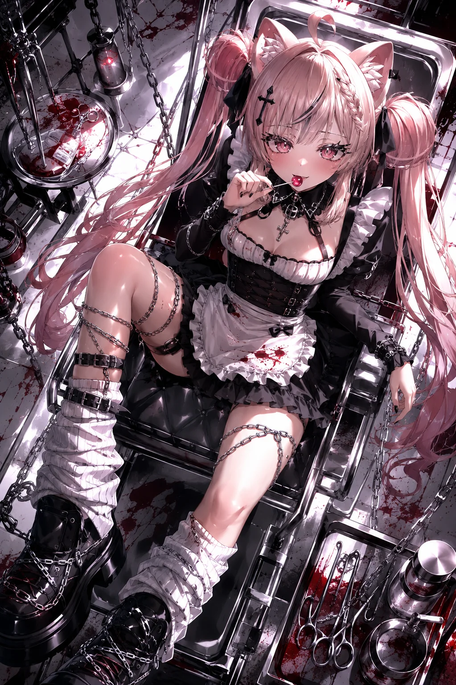

**Category:** Cosmic & Cinematic Scenes · **Tags:** `gothic` `cyber` `maid` `horror-fashion` `top-down` `industrial` `pink-twintails` `character-reference` `identity-lock`

**📋 Prompt:**

```
Use a imagem anexada apenas como referência de identidade do personagem, composição, atmosfera e direção artística. Preserve exatamente o rosto, cabelo rosa longo em twintails, olhos rosados, expressão provocante/brincalhona, estética gothic maid e toda a aparência reconhecível original do personagem.

Crie uma ilustração anime masterpiece extremamente detalhada em estética gothic cyber-guro elegante, combinando horror estilizado, fashion underground japonesa e composição cinematográfica premium. A cena deve replicar fielmente o mesmo ângulo de câmera inclinado visto de cima, com perspectiva dinâmica ampla e forte profundidade visual.

O personagem está relaxado dentro de uma cadeira metálica industrial futurista semelhante a uma cadeira médica/interrogatório cyberpunk, sentado de forma casual e dominante, pernas abertas em composição assimétrica natural, olhando diretamente para a câmera com sorriso provocante enquanto segura um pirulito parcialmente na boca.

Visual do personagem:

- cabelo rosa longo extremamente detalhado em twintails volumosos
- franja brilhante com reflexos suaves
- olhos rosa/vermelho brilhantes altamente renderizados
- blush delicado
- maquiagem suave estilo gothic fashion
- expressão travessa, confiante e levemente sádica
- pele extremamente polida com highlights cinematográficos

Roupa:

- gothic maid outfit preto e branco ultra detalhado
- vestido maid moderno com estética punk/lolita
- mangas pretas ajustadas
- avental branco com manchas vermelhas estilizadas
- cruz metálica pendurada no pescoço
- correntes metálicas envolvendo pernas e cadeira
- leg warmers brancos enrugados extremamente detalhados
- botas pretas pesadas estilo techwear/gothic
- acessórios metálicos brilhantes
- tecido com múltiplas camadas e microdetalhes

Composição:

- câmera inclinada diagonal vista de cima
- personagem ocupando quase toda a cena
- pernas estendidas em direção à câmera
- foreshortening forte e dinâmico
- composição caótica porém organizada visualmente
- forte sensação de profundidade cinematográfica
- enquadramento compacto e intenso

Ambiente:

- sala branca industrial estilizada
- cadeira mecânica/cirúrgica futurista
- correntes penduradas nas paredes
- superfícies metálicas reflexivas
- iluminação branca intensa contrastando com vermelho escuro
- manchas vermelhas estilizadas espalhadas pelo ambiente
- utensílios cirúrgicos/gothic decorativos
- atmosfera horror-fashion sofisticada
- estética inspirada em album cover anime underground

Iluminação:

- iluminação cinematográfica branca intensa
- sombras suaves porém contrastadas
- reflexos especulares fortes na pele e metal
- bloom leve
- ambient occlusion detalhado
- highlights brilhantes nos olhos, cabelo e acessórios
- atmosfera fria com contraste vermelho profundo

Qualidade visual:

- ultra detailed anime illustration
- masterpiece quality
- absurdres
- highly detailed gothic cyber aesthetic
- cinematic composition
- dynamic top-down perspective
- extreme detail rendering
- premium anime shading
- glossy skin highlights
- highly detailed chains and metallic objects
- detailed fabric folds
- atmospheric depth
- anime horror fashion aesthetic
- complex environmental storytelling
- expressive detailed eyes
- highly polished rendering
- dynamic natural pose (avoid T-pose, avoid A-pose)
- fully visible face and eyes
- no censorship on face

Estilo artístico:

- dark anime fashion editorial
- gothic cyberpunk lolita aesthetic
- semi-realistic anime rendering
- highly detailed lineart
- painterly lighting
- sharp focus on character
- visual novel CG quality
- luxury anime illustration
- Japanese underground art aesthetic

Negative prompt:
low quality, blurry, bad anatomy, stiff pose, T-pose, A-pose, extra limbs, malformed hands, deformed feet, ugly face, poorly drawn eyes, flat lighting, weak perspective, low detail background, censored face, hidden eyes, cropped body, poorly drawn chains, simple shading, bad proportions, distorted limbs, messy anatomy, low detail fabric, generic anime style, watermark, logo, text, jpeg artifacts, washed colors, poorly drawn metallic surfaces
```

**📎 Requires:** An attached reference image — preserves identity (pink twintails, rose eyes, gothic maid aesthetic) AND camera angle/composition from the source.

**💡 Why it works:** This prompt sits at the intersection of three normally-difficult aesthetic registers: *gothic-cyber* (chains, industrial chair, white surgical room), *maid fashion* (apron, ribbons, twintails), and *horror-fashion editorial* (stylized red stains, sadistic expression). Naming `"gothic cyber-guro"` is a precise subgenre reference that Japanese underground art has well-established conventions for — the model has training data on it. The top-down camera with strong foreshortening (`"câmera inclinada diagonal vista de cima"`, `"pernas estendidas em direção à câmera"`) is the single highest-leverage compositional choice: it transforms a static "character on chair" into a dynamic dominance composition. The `"manchas vermelhas estilizadas"` (stylized red stains) rather than literal blood keeps the horror in *fashion-editorial register* rather than gore. The white surgical room contrasted with deep red provides the high-contrast lighting essential for editorial-fashion reads.

**🔧 Variations:** swap `cadeira médica/interrogatório` for `throne with industrial metal frame` for a more regal-dominant variant; change `pirulito` (lollipop) to `cigarette holder` or `wine glass` for different age/mood implications; replace `manchas vermelhas` with `dark ink stains` or `oil splatter` for a less horror-coded but still editorial look; tighten the underground aesthetic by adding specific designer references (`"inspired by Limi Feu / Yohji Yamamoto darkwear aesthetic"`).

---

### 🖼️ Wallpapers

Atmospheric anime art designed for decorative use — wallpapers, profile backgrounds, playlist covers. Moody, symbolic, and emotionally restrained pieces where mood matters more than narrative.

---

#### Chaotic Abstract Mixed-Media (Avant-Garde Artbook)

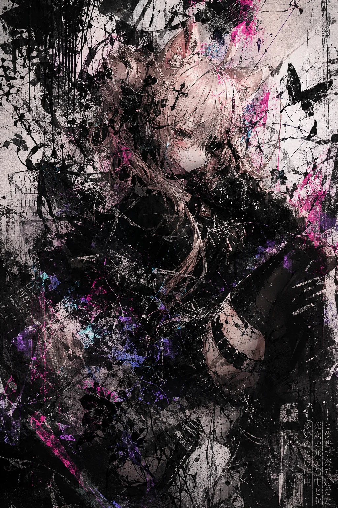

**Category:** Wallpapers · **Tags:** `wallpaper` `abstract` `mixed-media` `ink` `watercolor` `artbook` `avant-garde` `style-translation`

**📋 Prompt:**

```
create image
Use the attached reference character ONLY as identity reference for:
- core facial structure
- hair silhouette and color placement
- cat ears and tail
- outfit identity
- recognizable accessories and motifs
- overall recognizable character essence ONLY

ABSOLUTE STYLE PRIORITY:
The final artwork must feel FAR MORE ABSTRACT than character-focused.
The character should appear partially consumed, dissolved, fragmented, submerged, and reconstructed through chaotic mixed-media abstraction.
Avoid clean anime rendering entirely.
The image should resemble an experimental contemporary anime artbook page rather than a normal character illustration.

PRIMARY VISUAL GOAL:
Create an ultra-chaotic abstract anime composition inspired by dark avant-garde mixed-media aesthetics similar to Meola, Ruuya, and experimental Japanese artbook illustration culture.

The character must NOT remain fully anatomically readable.
Large portions of the body should dissolve into:
- ink eruptions
- watercolor bleeding
- fragmented silhouettes
- paint explosions
- tangled calligraphic strokes
- smoke ribbons
- scratched textures
- abstract graphic noise
- broken geometry
- floating debris
- visual corruption
- layered painterly destruction

ABSTRACTION RULES:
- anatomy should become unstable and partially unreadable
- limbs may partially disappear into ink masses
- hair should dissolve into abstract ribbons, smoke, splatters, and flowing paint trails
- clothing should merge with darkness and texture layers
- edges of the body should fragment into particles and chaotic brushwork
- facial features should only remain partially clear
- one eye may be obscured or swallowed by abstraction
- silhouette should feel unstable and dreamlike
- avoid complete physical coherence
- the artwork should prioritize emotional abstraction over anatomy

STYLE DIRECTION:
- extremely dense visual layering
- heavy distressed canvas textures
- aggressive ink splashes
- watercolor blooms
- scratched film textures
- torn-paper collage feeling
- mixed media appearance
- chaotic visual overlap
- abstract floral decay
- fragmented butterflies
- thorn vines
- shattered glass shapes
- drifting feathers
- smoke clouds
- painterly visual static
- ink drips everywhere
- distorted typography fragments
- surreal environmental fragments
- asymmetrical composition
- emotional visual overload

COLOR DIRECTION:
- dominant black-and-white palette
- deep crushed blacks
- overexposed whites
- selective neon accents ONLY
- cyan, violet, magenta, crimson, emerald, or electric blue accents
- color should appear like glowing contamination inside monochrome darkness
- avoid balanced color distribution
- large areas should remain monochrome

LIGHTING:
- non-realistic lighting
- glowing fog-like highlights
- selective bloom
- chromatic aberration
- dirty luminous textures
- atmospheric overexposure
- some areas swallowed entirely by darkness
- some areas blown out into white noise

COMPOSITION:
- asymmetrical and emotionally unstable
- visual flow spiraling around the character
- overlapping foreground/background abstraction
- fragmented depth
- negative space interrupted by chaotic detail clusters
- cinematic framing mixed with painterly destruction
- composition should feel suffocating and immersive

CHARACTER EXPRESSION:
- melancholic
- emotionally distant
- eerie calmness
- vacant gaze
- dreamlike emotional detachment

POSE RULES:
- NEVER use T-pose
- NEVER use A-pose
- NEVER use VRChat idle pose
- NEVER use model-sheet pose
- use a drifting, collapsing, floating, seated, curled, suspended, or emotionally broken pose
- pose should integrate into the abstract flow instead of feeling posed

QUALITY:
- masterpiece quality
- highly textured painterly finish
- experimental anime illustration
- abstract mixed-media artbook aesthetic
- emotionally overwhelming
- visually dense
- no clean rendering
- no empty background
- no minimalism
- no generic anime wallpaper appearance
- no clean lineart dominance
- no polished character illustration look

IMPORTANT:
The artwork should feel like the character is being erased and reborn inside a storm of ink, paint, memory fragments, and emotional noise.
The abstraction itself must dominate the image more than the character.
```

**📎 Requires:** An attached reference image — identity preserved only as *essence* (face structure, hair color, ears/tail), with explicit permission to dissolve anatomy.

**💡 Why it works:** This prompt is one of the most radical in the collection because it *inverts* the entire identity-lock paradigm. The line `"the abstraction itself must dominate the image more than the character"` is unusual: most prompts treat the character as the focal point and everything else as supporting; here, the character is just *one element in an emotional collage*. The `"ABSTRACTION RULES"` block lists specific permissions (limbs may disappear, one eye may be obscured, silhouette should feel unstable) — those explicit allowances are critical because GPT Image 2 defaults to anatomical coherence. Naming `Meola, Ruuya, and experimental Japanese artbook` anchors the style to a specific underground aesthetic family rather than generic "abstract art." The selective neon color rule (`color should appear like glowing contamination inside monochrome darkness`) prevents the model from defaulting to "balanced colorful abstract."

**🔧 Variations:** swap `dominant black-and-white + neon accents` for `dominant sepia + crimson + gold` for a warmer ink-painting variant; change `cat ears and tail` to your reference's specific traits; replace `Meola, Ruuya` with other experimental references (`Yoshitaka Amano sketch style`, `Yusuke Murata loose linework`) for different style families; tighten `chaotic mixed-media` to a specific medium (`pure ink-wash sumi-e destruction`, `acrylic gestural painting only`) for cleaner stylistic targets.

---

#### Shadow Wings with Bullet Holes (Symbolic Wall Scene)

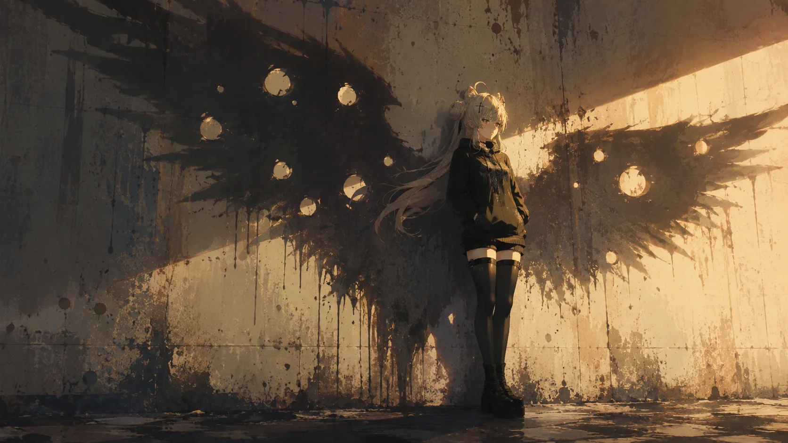

**Category:** Wallpapers · **Tags:** `wallpaper` `anime` `symbolic` `shadow-wings` `painterly` `melancholic` `urban` `environmental-storytelling` `16:9`

**📋 Prompt:**

```
create image
16:9
Use the attached image ONLY as an aesthetic and compositional reference.

Create a highly atmospheric anime-style illustration with symbolic environmental storytelling and painterly cinematic aesthetics.

The scene must feel melancholic, psychologically symbolic, quiet, mysterious, and emotionally restrained.

VISUAL STYLE:
- painterly anime illustration
- semi-realistic anime rendering
- watercolor + ink wash influence
- textured brushwork
- cinematic lighting gradients
- gritty wall textures
- soft bloom and atmospheric glow
- subtle film grain
- layered environmental shading
- muted/desaturated colors with warm golden-hour highlights
- imperfect painterly edges and ink splatter textures

CORE CONCEPT:
- a lone character stands against a large textured wall
- behind the character, massive wings appear ONLY as shadow projected onto the wall
- the wings are not physical
- they are formed from darkness, ink-like shading, smoke-like shadow texture, and environmental silhouette
- the wings should clearly resemble recognizable bird or angel wings while still remaining abstract and symbolic
- visible feather-like wing structure and layered silhouette shape
- the wing shadow should feel elegant, tragic, and ominous

CRITICAL SHADOW WING DETAILS:
- the shadow wings contain multiple clean ROUND puncture holes
- the holes should resemble circular bullet-like perforations in darkness
- perfectly or near-perfectly rounded shapes
- varying sizes of circular punctures
- the holes affect ONLY the shadow
- the wall underneath remains completely intact
- the revealed wall texture behind the holes must perfectly match the surrounding illuminated wall
- no cracks, debris, or physical wall damage
- the holes are simply absences of shadow
- warm sunlight naturally passes through these circular openings
- some holes softly glow from transmitted light
- subtle feather fragmentation and ink-drip distortion around certain punctures
- parts of the shadow wing dissolve into dripping darkness and abstract splashes

COMPOSITION:
- asymmetrical composition
- character positioned slightly off-center
- giant shadow wings dominate most of the wall
- strong negative space usage
- emotional balance between fragile character and overwhelming symbolic shadow
- wall acts as a visual storytelling surface
- environmental grime, stains, splashes, and urban decay textures

LIGHTING:
- strong directional golden-hour sunlight
- warm light cutting through cool shadows
- dramatic wall contrast
- soft volumetric atmosphere
- cinematic rim lighting
- selective overexposure in brightest areas
- atmospheric diffusion across textured surfaces

MOOD:
- melancholic
- introspective
- symbolic
- dreamlike
- lonely
- cinematic
- emotionally restrained
- poetic visual tension
- quiet psychological atmosphere

CHARACTER DIRECTION:
- character-agnostic
- any original anime character design
- natural anatomy
- subtle facial expression
- grounded clothing design
- wind-blown hair and fabric
- restrained realistic pose
- avoid exaggerated movement
- avoid fanservice

BACKGROUND:
- stained concrete or tiled wall
- visible grime and age
- abstract circular environmental lighting shapes
- subtle paint drips and splatters
- layered painterly wall texture
- urban poetic atmosphere

CAMERA:
- medium full-body shot
- eye-level or slightly low-angle framing
- cinematic anime composition
- emphasis on shadow silhouette readability
- atmospheric depth created through light and texture

IMPORTANT:
- the wings must visibly read as wings first, abstract shadow second
- maintain recognizable feather silhouette structure
- circular punctures must be clean and visually intentional
- the punctures destroy only the shadow, not the wall
- avoid literal fantasy aesthetics
- avoid glossy modern anime rendering
- avoid hyper-saturated colors
- preserve painterly softness and ambiguity
- no text, watermark, logo, or UI elements

QUALITY TAGS:
masterpiece, cinematic anime illustration, symbolic shadow wings, feathered shadow silhouette, circular shadow punctures, painterly anime art, melancholic atmosphere, emotional environmental storytelling, textured anime scene, poetic shadow composition, urban cinematic aesthetic, abstract wing symbolism
```

**📎 Requires:** An attached image used as **aesthetic/compositional reference only** — the character is fully described in the prompt as "any original anime character design."

**💡 Why it works:** This prompt nails a specific symbolic visual that's notoriously hard to render — *shadows with absences*. The `CRITICAL SHADOW WING DETAILS` block goes into surgical specificity: the holes affect *only the shadow*, not the wall; the wall behind the holes must match the surrounding illuminated wall; the holes are *absences of shadow*, not cracks or damage. Without that level of explicit logic, the model defaults to either physical wall damage (bullet holes drilled into concrete) or simply skipping the effect. The "wings must visibly read as wings first, abstract shadow second" line is a clever priority hierarchy that prevents the model from going too abstract and losing the recognizable angel/bird imagery. The 16:9 specification at the top forces ultra-wide cinematic framing where the shadow wings can actually dominate the wall space.

**🔧 Variations:** swap `golden-hour sunlight` for `moonlight casting cool blue shadows` for a nocturnal version; change `bullet-like puncture holes` to `cracked-glass pattern` or `dissolving petal-shapes` for different symbolic distortions; replace `concrete or tiled wall` with `aged wooden church wall` for a more sacred-melancholic setting; tighten "abstract wing symbolism" to a specific motif (broken wings, burning wings, etched constellation wings).

---


### 👗 Outfit Variants

Templated outfit redesigns of the same reference character, built around a `{outfit_color}` or similar variable so you can spin off color/style permutations from a single prompt structure.

---

#### Bunny Girl (Vertical Wallpaper, 1:2)

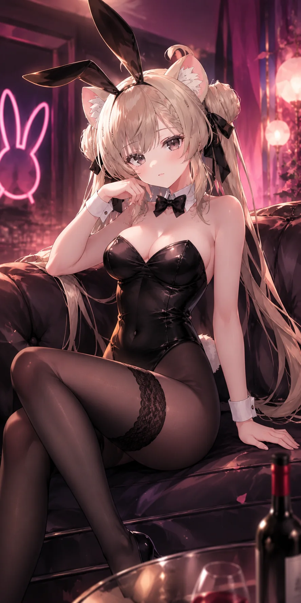

**Category:** Outfit Variants · **Tags:** `bunny-girl` `outfit-variant` `wallpaper` `1:2-aspect` `vertical` `templated` `character-reference`

**📋 Prompt:**

```
Use the attached reference character ONLY as the identity reference for the face, hairstyle, body proportions, accessories, and recognizable visual traits.

OUTFIT COLOR: {argument name="outfit color" default="black"}

Create a vertical anime illustration with a strict 1:2 aspect ratio (width:height), optimized for a tall smartphone wallpaper composition.

Transform the character into an elegant bunny girl while preserving the recognizable identity from the reference image.

STYLE:
- high-quality anime illustration
- clean polished linework
- soft cinematic shading
- elegant mature fashion aesthetic
- stylish modern anime rendering
- atmospheric lighting
- subtle glow and bloom
- visually balanced composition
- tasteful and fashionable presentation

OUTFIT:
- {outfit color} bunny girl outfit
- glossy or matte fabric depending on lighting
- bunny ears matching the outfit
- elegant collar with bow tie
- fitted corset-style bodice
- sheer black tights or stockings
- cuffs and stylish accessories
- optional heels
- outfit should look fashionable and anime-stylized rather than realistic

POSE:
- natural confident pose
- seated, leaning, kneeling, or standing pose with strong silhouette readability
- expressive body language
- avoid exaggerated anatomy
- NEVER use T-pose, A-pose, reference-sheet pose, or static idle pose

COMPOSITION:
- vertical framing with the character occupying most of the canvas height
- dynamic use of negative space
- cinematic perspective
- soft foreground blur and depth
- elegant framing emphasizing the character silhouette

BACKGROUND:
- stylish lounge, neon room, stage lighting, luxury interior, abstract gradients, or soft atmospheric environment
- blurred background allowed
- subtle decorative elements
- cohesive color harmony with the outfit

EXPRESSION:
- confident, mysterious, playful, calm, or melancholic expression
- expressive anime eyes
- preserve the character's recognizable emotional aura

QUALITY:
- masterpiece quality
- highly detailed anime rendering
- polished illustration finish
- clean anatomy
- soft cinematic lighting
- no low detail
- no chibi style
- no realism
- no photorealistic skin
- no distorted hands
- no extra limbs
```

**📎 Requires:** An attached reference image — identity preserved through face, hair, proportions, accessories.

**💡 Why it works:** This is the first templated prompt in the collection — `OUTFIT COLOR: {argument name="outfit color" default="black"}` follows the GPT Image 2 templated-variable syntax (same pattern as the Bronze Statue prompt's `LOCAL` variable). Even though GPT Image 2 doesn't *execute* templates, this syntax tells the model "this is a slot the user fills in," and the substitution `{outfit color} bunny girl outfit` flows naturally through the prompt. The strict **1:2 aspect ratio** specification at the top is critical — without it, the model defaults to square or portrait crops that don't work as phone wallpapers (which need ~1:2 to fill a modern smartphone screen). The pose block offers 4 alternatives (seated, leaning, kneeling, standing) which gives the model flexibility while suppressing the T-pose default. The background block also lists 5 alternatives (lounge, neon room, stage, luxury, gradient) — letting the renderer pick what fits the chosen color rather than locking one.

**🔧 Variations:** swap `{outfit color}` for `red`, `white`, `pastel pink`, `metallic gold`, `holographic iridescent` for color variants of the same composition; change `bunny girl outfit` to `maid outfit`, `china dress`, `idol stage costume`, or `gothic lolita` to create parallel outfit-variant prompts; replace `1:2` with `9:16` for a stricter mobile screen ratio; tighten `stylish lounge, neon room, stage lighting` to one specific environment for stronger atmospheric anchoring.

---


#### Beach Sunset Run (Golden Hour)

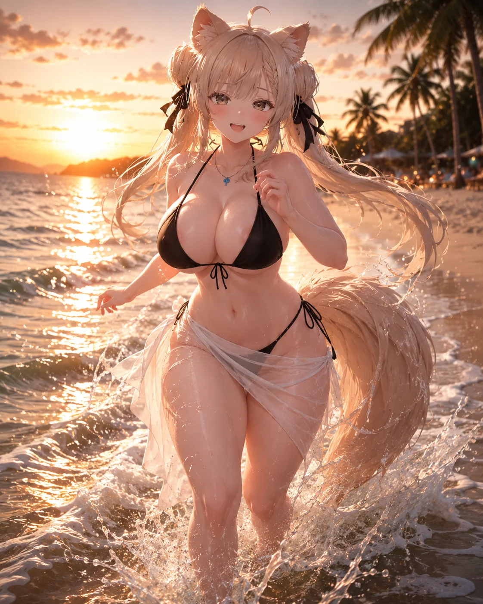

**Category:** Outfit Variants · **Tags:** `bikini` `beach` `sunset` `golden-hour` `athletic` `dynamic-motion` `summer` `character-reference`

**📋 Prompt:**

```
Use the uploaded character strictly as the identity reference only. Preserve the exact face, hairstyle, hair color, fox ears, fluffy tail, eye shape, and overall anime identity from the reference image. Transform her into a premium cinematic beach illustration at golden sunset. Adult anime woman with an athletic yet voluptuous curvy body, elegant mature proportions, wide hips, thick thighs, narrow waist, soft natural curves, and tasteful high-fashion swimsuit styling.

She is joyfully running out of shallow ocean waves toward the viewer, energetic dynamic movement, bright genuine smile, wet hair strands flowing naturally, water splashing around her legs, cinematic tropical beach environment, warm sunset lighting, reflective wet skin highlights, realistic fabric tension and wet swimsuit details, luxurious commercial anime art quality, highly detailed rendering, natural anatomy, premium summer fashion photography aesthetic.

Dynamic natural pose, expressive motion, avoid stiff posing, avoid T-pose and A-pose. Soft wind movement in hair and transparent beach fabric accessory. Realistic lighting, depth of field, dramatic sunset reflections on water, emotionally warm atmosphere, polished high-end illustration quality.
```

**📎 Requires:** An attached reference image — identity locked through face, hair, ears/tail, eyes; outfit fully reinterpreted as beach swimwear.

**💡 Why it works:** This prompt is unusually short for a high-detail output (only 3 paragraphs) because it leans heavily on *cinematographic anchors* rather than checklist density. `"golden sunset"` + `"warm sunset lighting"` + `"dramatic sunset reflections on water"` repeats the lighting cue three times across the prompt, which is a deliberate technique — repeated atmospheric anchors are more reliable than a single mention. The "joyfully running out of shallow ocean waves toward the viewer" pose description is doing critical work: it specifies *direction of motion* (out of waves, toward camera), *energy* (joyful/dynamic), and *body interaction* (water splashing around legs) — much stronger than "standing on beach." `"premium summer fashion photography aesthetic"` near the end pulls the rendering toward editorial commercial quality rather than illustration-style. The proportions block ("wide hips, thick thighs, narrow waist") gives the model concrete anatomy targets while the `"tasteful high-fashion swimsuit"` directive keeps it in publishable register.

**🔧 Variations:** swap `golden sunset` → `early morning blue-hour` for cooler tones; change `running out of waves toward viewer` → `walking along the shore looking back over shoulder` for a more contemplative composition; replace `tropical beach` with `rocky northern coast with dramatic cliffs` for a different beach aesthetic; tighten the outfit to a specific style (`one-piece athletic swimsuit`, `vintage retro swimsuit`, `metallic high-fashion swimwear`).

---

#### Red Latex Dress (Intimate POV Toast)

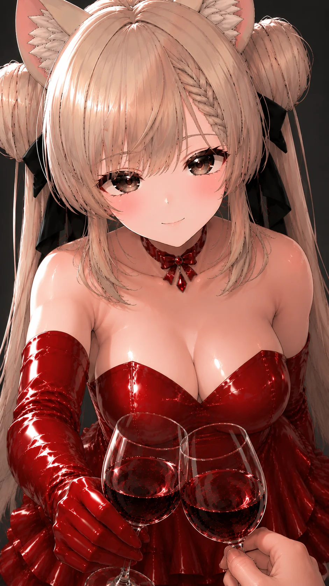

**Category:** Outfit Variants · **Tags:** `latex` `red-dress` `intimate-pov` `first-person` `wine` `vertical-close-up` `glossy` `character-reference` `identity-lock`

**📋 Prompt:**

```
Use the uploaded character strictly as the EXCLUSIVE identity reference. Preserve the exact delicate anime face, soft brown eyes, long blonde bangs partially covering the eyes, side braid, twin buns with black ribbons, fluffy cat ears, large fluffy tail, and the overall recognizable avatar identity.

Transform the scene into an extremely intimate cinematic anime POV portrait with a very close vertical composition, as if the viewer is taller than her and looking slightly downward from their own perspective.

The character should be MUCH closer to the camera, leaning forward toward the viewer with a warm, gentle, slightly shy expression, soft smile, and natural blush. She is holding a transparent wine/champagne glass filled with deep red wine using a glossy long red vinyl/latex glove. A second matching wine glass is being held by the viewer's hand in the lower-right foreground, creating an intimate first-person toast perspective. Keep both glasses positioned lower in the composition near the bottom of the frame so they do not cover the character's face.

Replace the original outfit entirely with an elegant glossy red vinyl/latex dress matching the gloves exactly: highly reflective shiny material, luxurious premium texture, form-fitting design, tasteful soft neckline, short layered skirt details, sophisticated anime fashion aesthetic. Maintain adult anime proportions and elegant styling.

Use soft cinematic lighting with realistic glossy reflections on the latex material, ultra-detailed anime rendering, highly refined eyes, soft skin shading, detailed hair strands, subtle depth of field, and an intimate luxurious atmosphere. Background should remain dark, neutral, and softly blurred to emphasize the character.

High-detail anime illustration, premium rendering quality, natural dynamic pose, avoid T-pose and A-pose, no text, no watermark, no extra objects.
```

**📎 Requires:** An attached reference image — identity-locked through specific listed features (brown eyes, blonde bangs, side braid, twin buns, cat ears, fluffy tail). **Edit the second paragraph trait list to match your reference character.**

**💡 Why it works:** This prompt is built around a single compositional concept — *first-person toast POV* — and stacks every detail to reinforce that single visual. The viewer-perspective directives are precise: `"as if the viewer is taller than her and looking slightly downward"`, `"a second matching wine glass is being held by the viewer's hand in the lower-right foreground"`. That second glass in the lower-right is the entire trick: it tells the model "this is a POV shot," not "this is a portrait of someone holding a glass." Without that foreground element, the model would default to a regular portrait. The matching gloves + dress in same material/color is doing visual-cohesion work — single material across multiple garment elements reads as intentional couture rather than mismatched outfit. `"Keep both glasses positioned lower in the composition near the bottom of the frame so they do not cover the character's face"` is preventive instruction — without it, the model often places hand-held objects in front of the face.

**🔧 Variations:** swap `red latex dress` for `black satin evening dress` or `midnight blue velvet` for different formal aesthetics with the same POV structure; change `wine/champagne glass` to `coffee mug` or `martini glass` for different drink contexts; replace the dark blurred background with `cozy fireplace with warm orange light` for a more romantic intimate setting; tighten the expression from `slightly shy` to `confident sultry` or `playfully teasing` for different emotional registers.

---

#### Wellness Bodybuilder (Compact Stylized Athlete)

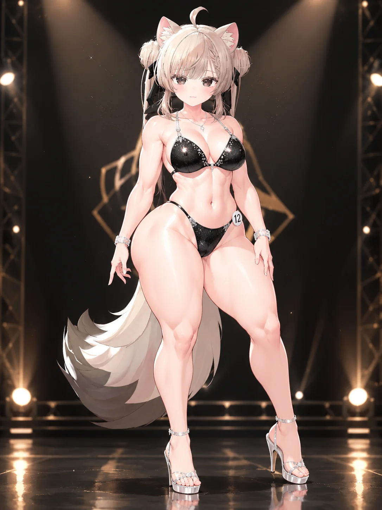

**Category:** Outfit Variants · **Tags:** `bodybuilder` `wellness` `competition` `shortstack` `athletic` `stage` `muscular` `character-reference` `identity-lock`

**📋 Prompt:**

```
Use the attached image ONLY as identity reference for the character's:
face, hairstyle, hair color, eyes, cat ears, fluffy tail, and overall recognizable appearance.

Create a full-body anime-style illustration of the same character as a compact muscular wellness competitor.

IMPORTANT PROPORTIONS:
Keep the character SHORT and COMPACT.
DO NOT make her tall.
DO NOT give her fashion model proportions.
DO NOT elongate the legs or torso.

The body must remain:
shortstack,
compact,
wide,
stylized,
cute,
anime-like.

Approximately 4.5-heads-tall proportions.
Large head-to-body ratio.
Shorter legs.
Wide hips.
Large thighs.
Thick glutes.
Compact athletic waist.

The body should feel like:
a stylized anime wellness athlete,
not a realistic tall bodybuilder.

IMPORTANT BODY STYLE:
Muscular lower body with soft feminine curves.
Strong thighs and glutes.
Compact muscle mass.
Cute anime silhouette preserved.

Avoid:
IFBB proportions,
giantess proportions,
hyper-realistic anatomy,
extreme muscles,
male musculature.

FACE RULES:
Keep the original anime face style and identity.
Large anime eyes.
Small nose.
Soft jawline.
Cute calm expression.
Slightly confident expression.

IMPORTANT SKIN + RENDERING CONSISTENCY:
The ENTIRE body must use the SAME pale soft anime skin tone as the original face.
NO bodybuilding spray tan.
NO dark stage tan.
NO orange skin.
NO bronze skin.

Use:
soft pale anime skin,
light creamy skin tone,
uniform skin color across face and body,
same rendering style on head and body,
same lighting response,
same gloss intensity,
same shadow softness,
same anime shading style,
same subsurface softness.

The face and body must feel physically connected and rendered together as one character.
No visible difference between facial skin and body skin.
No pasted-on face look.
No disconnected rendering.
No different shader style between face and body.

TAIL:
Keep the original oversized fluffy anime tail.
Large fluffy tail.
Wide soft fur shape.
High fur density.
Cute oversized anime silhouette.

Do NOT make the tail:
small,
thin,
realistic,
rat-like,
short-haired.

OUTFIT:
Sparkly black wellness competition bikini.
Competition heels.
Small competition badge.
Subtle jewelry.

POSE:
Cute confident wellness competition pose.
Natural posture.
Slight hip angle.
Relaxed shoulders.
One hand near thigh.
Cute confident stage presence.

Avoid:
T-pose,
A-pose,
overly exaggerated arching.

SCENE:
Professional bodybuilding competition stage.
Warm dramatic spotlights.
Dark background.
Stage floor reflections.
Cinematic fitness stage atmosphere.

STYLE:
Ultra detailed.
High quality anime rendering.
Semi-realistic lighting.
Stylized anime anatomy.
Compact silhouette.
Cute anime face with athletic compact body.

IMPORTANT NEGATIVE PROMPT:
tall body,
long legs,
elongated proportions,
fashion model body,
realistic adult face,
male body,
extreme muscularity,
giantess,
hyper-realism,
dark tan,
orange tan,
bronze skin,
bodybuilder spray tan,
pale face with darker body,
different face/body skin tone,
separate face lighting,
detached face shading,
head pasted onto body,
small tail,
thin tail,
realistic tail,
T-pose,
A-pose,
bad anatomy,
extra limbs,
deformed hands,
blurry,
low quality,
watermark,
text
```

**📎 Requires:** An attached reference image — face, hair, ears, tail identity-locked; body proportions fully reinterpreted as compact muscular shortstack.

**💡 Why it works:** This prompt is one of the most aggressive *anti-default* prompts in the collection — it has to fight against three GPT Image 2 defaults simultaneously: (1) tall fashion-model proportions when "competition" is mentioned, (2) bronze/orange stage tan when "bodybuilder" is mentioned, (3) hyper-realistic IFBB anatomy when "muscular" is mentioned. The numbered approach (`"DO NOT make her tall"` / `"DO NOT elongate the legs"` / `"DO NOT give her fashion model proportions"`) repeated three different ways forces the model to break its proportion defaults. The "skin + rendering consistency" block is doing crucial composition work — without it, the model often renders the face in one anime style and the body in a different shader, producing a "pasted-on face" effect. Calling out `"4.5-heads-tall proportions"` is a concrete anatomical specification that produces consistent shortstack output. The 30+ item negative prompt at the end catches every common failure mode (giantess, hyper-realism, dark tan, head pasted onto body, small/realistic tail). Naming `wellness` competition specifically (versus generic "bodybuilding") locks the muscular but feminine aesthetic.

**🔧 Variations:** swap `competition stage` for `gym training environment` for a workout-context variant; change `4.5-heads-tall` to `5-heads-tall` for slightly less extreme shortstack proportions; replace `sparkly black competition bikini` with `colorful posing suit (red/blue/green)` for different competition divisions; tighten "wellness" to "bikini division" or "figure division" for specific IFBB-style category targeting.

---


#### Princess Close-Up POV (Sensual Wide-Angle)


**Category:** Outfit Variants · **Tags:** `princess` `pov` `close-up` `wide-angle` `seductive` `vertical` `foreshortening` `character-reference` `identity-lock`

**📋 Prompt:**

```
Use a imagem anexada apenas como referência de identidade do personagem. Preserve exatamente o mesmo rosto, olhos avermelhados, cabelo castanho, orelhas de cavalo, tiara ornamentada azul, laço vermelho, acessórios, blush intenso e toda a aparência reconhecível do personagem original. Não alterar a identidade visual.

Crie uma ilustração anime premium extremamente detalhada replicando fielmente o EXATO ângulo, pose corporal, expressão facial e enquadramento da imagem de referência.

A composição deve manter:

- câmera extremamente próxima em perspectiva POV íntima
- ângulo alto inclinado olhando para baixo
- rosto parcialmente inclinado para cima encarando diretamente a câmera
- expressão sedutora e provocante com sorriso discreto
- olhos semicerrados
- blush intenso nas bochechas
- corpo comprimido próximo à câmera criando forte sensação de profundidade
- enquadramento fechado no rosto, ombros e torso
- perspectiva exagerada estilo lente grande angular anime

Roupa:

- vestido branco elegante exatamente no mesmo estilo da referência
- tecido delicado e brilhante
- gola caída sobre os ombros
- detalhes refinados e luxuosos
- acessórios azuis e dourados preservados
- aparência sofisticada e sensual
- sem nudez explícita

Iluminação:

- iluminação branca intensa e suave vinda do fundo
- brilho cinematográfico forte nas bordas do corpo e cabelo
- highlights brilhantes na pele
- bloom delicado
- sombras suaves
- acabamento anime semi-realista extremamente polido

Detalhes importantes:

- mesma inclinação do tronco
- mesma proximidade extrema da câmera
- mesma posição dos ombros e cabeça
- mesma sensação de pressão do corpo contra a lente
- mesmo enquadramento compacto
- mesma energia provocante e confiante da expressão original

Qualidade visual:

- ultra detailed anime illustration
- identical camera angle to reference
- identical facial expression
- identical clothing style
- cinematic close-up composition
- highly detailed skin shading
- glossy skin highlights
- premium anime rendering
- masterpiece quality
- dynamic foreshortening
- expressive detailed eyes
- natural dynamic pose (avoid T-pose, avoid A-pose)
- fully visible face and eyes
- elegant sensual atmosphere
- no censorship on face

Negative prompt:
low quality, blurry, bad anatomy, wrong angle, incorrect expression, different pose, stiff pose, T-pose, A-pose, deformed hands, extra limbs, distorted torso, flat lighting, ugly face, poorly drawn eyes, cropped face, hidden eyes, censored face, low detail skin, poorly drawn clothes, wrong perspective, weak foreshortening, watermark, logo, text, overexposed image, malformed body
```

**📎 Requires:** An attached reference image — full identity lock (red eyes, brown hair, horse ears, blue tiara, red ribbon, white dress). Edit the identity-trait list to match your reference when reusing.

**💡 Why it works:** This prompt belongs to a small family of *reference-replication* prompts where the goal isn't to generate a new composition but to *re-render the exact same scene* with full identity preservation — useful when an existing image has the right framing but needs cleaner rendering or different details. The directive `"replicando fielmente o EXATO ângulo, pose corporal, expressão facial e enquadramento"` is repeated three times in different phrasings across the prompt (`"identical camera angle to reference"`, `"identical facial expression"`, `"mesma inclinação do tronco"`, `"mesma proximidade extrema"`) — that level of redundancy is deliberate: it locks the composition tightly to the source image, preventing the model from "creatively reinterpreting" the scene. The `"corpo comprimido próximo à câmera"` + `"perspectiva exagerada estilo lente grande angular"` combo describes the wide-angle close-up distortion effect, which produces the characteristic *pressing-against-the-lens* feeling. The `"sem nudez explícita"` line is important register-control given the seductive directives elsewhere — keeps the output in suggestive-elegant rather than explicit territory.

**🔧 Variations:** swap `vestido branco` for the same dress in `dark midnight blue with silver embroidery` for a darker variant; change `iluminação branca intensa vinda do fundo` to `golden hour warm light from the side` for a different lighting mood; replace `expressão sedutora` with `shy embarrassed expression with averted eyes` for a softer emotional register; tighten the framing from "rosto, ombros e torso" to just `face and shoulders only` for tighter portrait-only compositions.

---

### 💪 Body Variants

Body-type modifier prompts designed to be **combined with other prompts** (typically Outfit Variants or full scene prompts). These describe anatomical proportions and physique only — paste them alongside a scene prompt to shape the character's body type in the output.

---

#### Curvy Brazilian Body Modifier

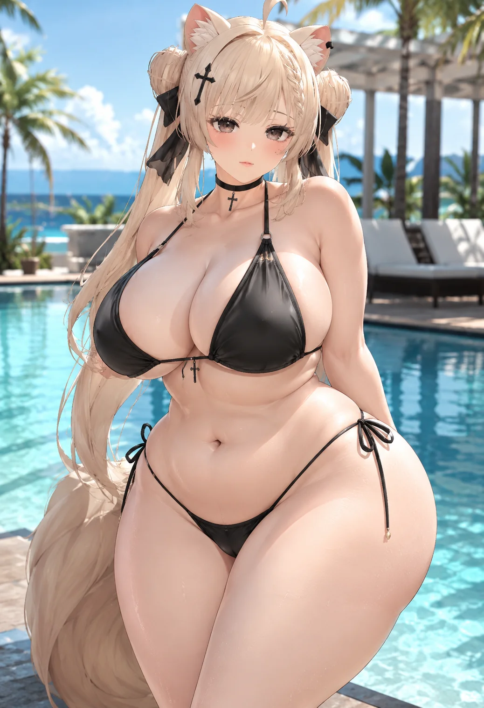

**Category:** Body Variants · **Tags:** `body-modifier` `curvy` `brazilian-proportions` `voluptuous` `combinable` `high-fashion`

**📋 Prompt:**

```
The character has an extremely curvy and voluptuous adult body type inspired by glamorous Brazilian fashion model proportions, with very wide hips, thick thighs, a narrow waist, soft belly curves, and a prominently full bust. Body silhouette is exaggerated yet elegant and aesthetically balanced, emphasizing mature feminine curves and luxurious beauty. Legs are thick and shapely, hips broad and rounded, overall physique soft, healthy, sensual, and visually striking while remaining tasteful and high-end.

Swimsuit naturally conforms to the character's curvy physique, with realistic fabric tension, subtle compression, and refined silhouette definition. The overall impression should resemble a high-fashion summer photoshoot with premium commercial illustration quality.
```

**📎 Requires:** This prompt is a **modifier**, not a standalone scene. Combine it with a scene prompt (e.g. Beach Sunset Run, Red Latex Dress, Bunny Girl) to apply the body type to that scene. Append it as an additional paragraph **after** the main prompt block in your GPT Image 2 request.

**💡 Why it works:** This prompt isolates *anatomy from scene*, which is a structurally unusual approach in this collection — most prompts bundle body proportions inside a larger scene description. Treating body type as a separable modifier means you can apply the same proportions across multiple outfits/scenes without rewriting the anatomical spec each time. The Brazilian fashion-model reference is a strong cultural anchor — Brazilian beauty standards specifically favor wider hips + narrow waist + thick thighs (the "hourglass amplified" silhouette), which is different from the slimmer fashion-model proportions the model defaults to when given "fashion photoshoot" cues. The `"exaggerated yet elegant and aesthetically balanced"` line is doing register-control work: it tells the model to push proportions further than realism but stop short of caricature. The fabric-tension callout ("realistic fabric tension, subtle compression") prevents the model from rendering loose-fit clothing — it forces the swimsuit/garment to conform to the curvy silhouette.

**🔧 Variations:** swap `glamorous Brazilian` → `vintage pin-up`, `runway high-fashion`, or `K-pop idol` for different cultural-aesthetic anchors with similar curvy silhouette; tighten `extremely curvy` → `moderately curvy` for less exaggerated proportions; replace `swimsuit` with `dress`, `corset`, or `bodysuit` for non-beach combinations (the fabric-tension principle still applies); pair with the Beach Sunset Run prompt for editorial beach + curvy results, or with the Red Latex Dress prompt for sultry latex + curvy results.

---

### ✏️ Sketches & Drawings

Prompts that simulate traditional analog drawing media — ballpoint pen, pencil, marker, ink. The output looks physically hand-drawn rather than digitally rendered, with paper grain, pen pressure variation, and natural human imperfections.

---

#### Blue BIC Ballpoint Pen Sketch (Rooftop Scene)

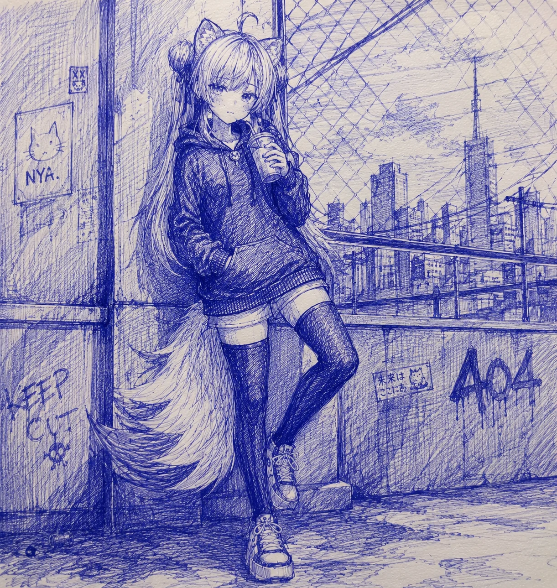

**Category:** Sketches & Drawings · **Tags:** `ballpoint-pen` `bic-pen` `sketch` `analog` `traditional-media` `monochrome-blue` `hand-drawn` `sketchbook`

**📋 Prompt:**

```
Use the attached reference image ONLY as the identity reference for the character's face, hairstyle, proportions, clothing design, accessories, tail, ears, and recognizable visual traits.

Transform the image into a highly believable traditional blue ballpoint pen sketch, as if manually drawn on rough sketchbook paper using a cheap blue BIC pen.

IMPORTANT:
- Preserve the original character identity and outfit.
- Preserve the anime proportions and recognizable silhouette.
- Keep the same general aesthetic and visual appeal.
- The final image must feel physically hand-drawn, NOT digitally filtered.
- Avoid clean digital anime rendering.

STYLE:
authentic blue BIC ballpoint pen drawing,
traditional analog sketch,
raw sketchbook illustration,
expressive handmade linework,
messy artist practice sketch,
rough notebook doodle aesthetic,
hand-drawn imperfections,
visible pen motion,
traditional scanned paper texture

MEDIUM:
monochrome blue ink only,
blue ballpoint pen strokes,
visible ink buildup,
slight ink skipping,
natural pen pressure variation,
occasional ink pooling,
subtle smudging from hand movement,
rough off-white sketchbook paper,
visible paper grain,
tiny paper imperfections,
realistic scanned sketch appearance

DRAWING TECHNIQUE:
dense cross-hatching,
layered hatch buildup,
scribble shading,
rough contour lines,
overlapping sketch marks,
gesture drawing energy,
construction lines still visible,
uneven handmade strokes,
rough unfinished areas,
loose expressive sketch flow,
natural asymmetry,
visible pen strokes in every shaded area

SHADING:
heavy cross-hatching in shadows,
lighter sparse strokes in highlights,
rough shadow transitions,
diagonal hatch patterns,
circular scribble shading,
manual tonal buildup,
no smooth gradients,
no airbrushing,
no soft digital shading

POSE & EXPRESSION:
give the character a cool relaxed urban pose,
slightly leaning posture,
one hand inside hoodie pocket,
other hand casually making a peace sign near the face,
one leg bent naturally,
dynamic body tilt,
confident but cute expression,
soft smug smile,
half-lidded eyes,
laid-back street fashion vibe,
natural dynamic pose,
avoid stiff posing,
avoid T-pose,
avoid A-pose

SCENARIO:
urban rooftop setting,
chain-link fence background,
graffiti walls,
city skyline in the distance,
telephone poles and cables,
concrete rooftop textures,
small stickers and doodles on walls,
street fashion atmosphere,
cozy urban anime vibe,
all drawn entirely with blue pen hatching

COMPOSITION:
full body shot,
vertical composition,
slightly tilted camera angle,
character centered,
tail flowing naturally,
hair reacting naturally to movement,
background fully integrated with the sketch style

QUALITY:
masterpiece,
best quality,
ultra detailed,
highly believable traditional media simulation,
authentic analog imperfections,
real hand-drawn feel,
raw expressive pen illustration,
scanned sketchbook page aesthetic

AVOID:
digital painting,
clean vector lines,
watercolor,
marker rendering,
colored pencils,
photorealism,
3D render look,
smooth shading,
AI glossy finish,
overly polished details,
empty background,
white void background,
watermark,
text,
logo
```

**📎 Requires:** An attached reference image — identity, outfit, and proportions preserved, with the rendering medium fully translated to analog ballpoint pen sketch.

**💡 Why it works:** This prompt fights against GPT Image 2's strongest default — *clean digital rendering*. The opening directive `"The final image must feel physically hand-drawn, NOT digitally filtered"` sets the goal, and then the prompt stacks 30+ specific *physical media artifacts* the model has to reproduce: ink buildup, ink skipping, ink pooling, hand smudging, paper grain, pen pressure variation, construction lines still visible. Naming a specific real-world product (BIC ballpoint pen) anchors the rendering to a concrete media memory the model has training data for — much stronger than "blue pen sketch." The `"AVOID"` block at the end is comprehensive: it kills `digital painting, clean vector lines, watercolor, marker, colored pencils, photorealism, 3D, smooth shading, AI glossy finish` — all the rendering styles the model would otherwise default to. The "rooftop with chain-link fence" scenario is doing important framing work: the integrated environment forces the model to draw the background in the same medium as the character, preventing the common failure of "clean character on filtered-photo background."

**🔧 Variations:** swap `blue BIC pen` for `black fineliner` or `red biro` for different ballpoint variants with the same hand-drawn feel; change `cross-hatching` dominant technique to `stippling` (dots) for a denser engraving-like result; replace `urban rooftop` with `cafe interior at a window seat` for a more intimate slice-of-life sketch; tighten `cheap BIC pen` to `Pilot G2 gel pen` for a slightly cleaner ink quality while keeping analog feel.

---

### 😂 Meme & Cursed

Silly, playful, or cursed transformations where the character becomes something it shouldn't — food, household objects, hybrid creatures. The aesthetic embraces absurdity and the joke is the point.

---

#### Bread Creature (Shokupan Hybrid)

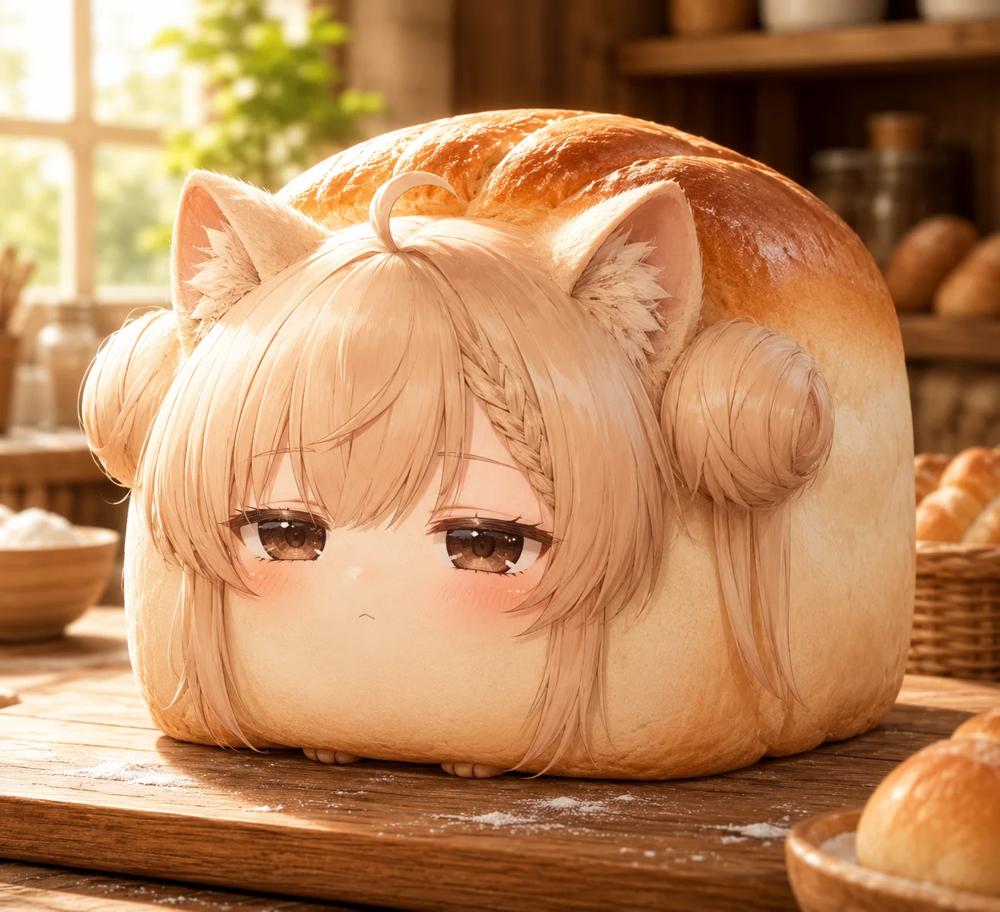

**Category:** Meme & Cursed · **Tags:** `meme` `cursed` `food-hybrid` `bread` `shokupan` `loaf-cat` `cute` `creature` `style-translation`

**📋 Prompt:**

```
masterpiece, best quality, ultra detailed, cute anime bread creature, fully fused bread-anime hybrid, living loaf creature

the character is NOT wearing bread,
the character IS the bread

entire body replaced by a single fluffy shokupan loaf,
no humanoid torso,
no human neck,
no shoulders,
no chest,
no arms,
no separate body parts visible,

the anime girl's head organically grows out of the front/top of the bread loaf,
face smoothly embedded into the bread surface,
seamless anatomical fusion between skin and bread,
bread texture naturally transitions into cheeks and hairline,
the loaf body and head are biologically connected as one creature,

soft baked bread skin,
golden brown crust,
puffy dough texture,
rounded blob-like silhouette,
tiny hidden cat paws underneath,
loaf cat pose,
resting on a wooden kitchen table,

cute sleepy expression,
cat ears,
cozy bakery atmosphere,
soft warm lighting,
funny but adorable food creature aesthetic,

(reference image used only for face/hair/ear design)

negative prompt:
human body,
humanoid anatomy,
neck,
shoulders,
torso,
hoodie,
clothes,
separate head,
head attached to bread,
bread around neck,
costume,
person inside bread,
full body girl,
extra limbs,
deformed anatomy,
t-pose,
a-pose,
uncanny,
horror,
nsfw
```

**📎 Requires:** An attached reference image — used **only** for face, hair, ears design; everything else (body, anatomy, identity below the neck) is discarded.

**💡 Why it works:** This prompt does something almost no other prompt in the collection does — it *aggressively* uses contrastive directives: `"the character is NOT wearing bread, the character IS the bread"`. That single line resolves the entire ambiguity that would otherwise produce the wrong output (an anime girl wearing a bread costume, or holding bread, or sitting next to bread). The list of body parts being *removed* (no torso, no neck, no shoulders, no chest, no arms) is explicit anatomical subtraction — without that, the model preserves humanoid structure by default. The "loaf cat pose" anchor is a brilliant reference: it points to the well-known internet meme of cats sitting in loaf shape, which the model has training data for, so it understands the silhouette goal immediately. The negative prompt is doing crucial guardrail work — `"head attached to bread"` is specifically suppressed because that's the most common partial-failure mode (head sitting on top of bread rather than fused into it). The closing `nsfw` block is important because requests with `cute anime girl + creature transformation` can drift toward weird territory; explicit suppression keeps it wholesome-cursed.

**🔧 Variations:** swap `shokupan loaf` for `croissant`, `bagel`, `melon-pan` (very on-theme with anime), `donut`, or `dumpling` for different food-hybrid creatures; change `cozy bakery atmosphere` to `kitchen counter at night` for a cuter sleepy-snack vibe; replace `cat paws underneath` with `tiny bird feet` or `frog legs` for different absurd anatomy combinations; tighten the cursed-cute balance by removing `cat ears` if your reference character doesn't have them.

---

### 📝 Typography & Poster Art

Prompts that integrate large cinematic typography into anime scenes, treating text as a compositional element rather than an overlay.

---

#### Cinematic Anime Poster with Integrated Typography


**Category:** Typography & Poster Art · **Tags:** `anime` `cinematic` `typography` `poster` `melancholic` `editorial` `character-reference`

**📋 Prompt:**

```
generate image:
Use the attached reference character ONLY for the character design, face, hairstyle, fox ears, tail, colors, outfit identity, accessories, silhouette, and overall personality.
DO NOT copy the reference pose.

Create a cinematic melancholic anime illustration with the character naturally integrated into the environment in a believable emotional pose.

Character posing rules:
- NEVER use T-pose, A-pose, model-sheet pose, idle VRChat pose, or reference-sheet stance
- avoid arms fully extended sideways
- body language must feel candid, cinematic, emotionally grounded, and naturally photographed
- use asymmetrical posture and subtle weight shifting
- hands should interact naturally with clothing, hair, railing, umbrella, pockets, sleeves, headphones, or environment
- prioritize poses seen in anime films, visual novel key art, or cinematic photography
- possible poses include:
  - standing quietly while looking into the distance
  - walking slowly through rain or petals
  - sitting on stairs, rooftops, train seats, or guardrails
  - leaning against utility poles, vending machines, windows, or fences
  - partially turned away from the camera
  - looking back over shoulder
  - holding sleeves close to chest against wind
  - resting hands in oversized hoodie pockets
  - crouching near puddles or fallen petals
  - subtle mid-motion walking poses
- facial expression should feel introspective, nostalgic, emotionally restrained, or quietly melancholic
- hair, sleeves, ribbons, and tail should react naturally to wind and movement
- avoid stiff symmetry
- avoid mannequin-like balance
- avoid generic "character showcase" composition

Scene and atmosphere:
- cinematic anime movie aesthetic
- environmental storytelling emphasized over character posing
- soft atmospheric haze
- drifting sakura petals
- wet pavement reflections
- distant urban lights or mountain silhouettes
- layered depth with foreground, midground, and background separation
- subtle film grain
- realistic cinematic lighting
- soft bloom and atmospheric diffusion
- subdued palette with muted pinks, charcoal blacks, foggy grays, and pale warm highlights

Typography and graphic design integration:
- include larger cinematic English typography integrated naturally into the environment
- typography should feel like refined anime movie poster design or melancholic visual novel key art
- use emotionally evocative English phrases, poetic fragments, location captions, timestamps, or reflective narration
- typography may occupy a significant portion of the negative space while remaining elegant and restrained
- allow tall vertical text compositions and layered cinematic title placement
- elegant serif typography strongly preferred
- typography should interact with atmospheric haze, sakura petals, and environmental depth
- use low-contrast off-white, pale gray, or faint sakura-tinted lettering
- text should softly blend into film grain and mist
- avoid bold commercial poster aesthetics
- avoid oversaturated or highly readable advertising typography
- preserve cinematic subtlety and editorial restraint

Examples of integrated text:
- "Spring remembers what we tried to forget."
- "The petals fall quietly, even now."
- "Some places only exist in memory."
- "APR. 13 2025 - YAMANASHI"
- "The silence between seasons."

Composition:
- cinematic framing with strong negative space
- portrait orientation
- layered depth and atmospheric perspective
- character should occupy only part of the frame, allowing the environment and typography to breathe
- composition should feel like a still frame from an emotional anime film
- highly detailed anime rendering
- masterpiece quality
- ultra detailed
- soft cinematic contrast
- emotional environmental storytelling
- natural anatomy and believable pose
- no T-pose
- no reference-sheet stance
- no symmetrical mannequin posture
```

**📎 Requires:** An attached reference image — used for identity essence only, with explicit `DO NOT copy the reference pose` directive.

**💡 Why it works:** This prompt sits at the intersection of three difficult things: pose authenticity (the long anti-T-pose block with 10 concrete pose examples), GPT Image 2's text rendering strength (paired with restraint — `low-contrast off-white` lettering, `avoid bold commercial poster aesthetics`), and editorial design composition. Including 5 example text strings is genius: the model picks one or generates similar phrasing, but the *register* is locked. Serif typography + sakura petals + film grain stacks reinforcing "anime movie poster" cues without ever using the word "poster" prescriptively. The result feels published, not promoted.

**🔧 Variations:** swap the example text lines for any 5 phrases in your desired tone (haiku fragments, song lyrics, location stamps); change `sakura petals` to `snow drift` or `falling autumn leaves` for seasonal variants; replace `serif typography` with `Japanese vertical kanji + small English subtitle` for a Japanese-poster aesthetic.

---

#### Crystal Mall Exhibition Poster (Luxury Editorial)

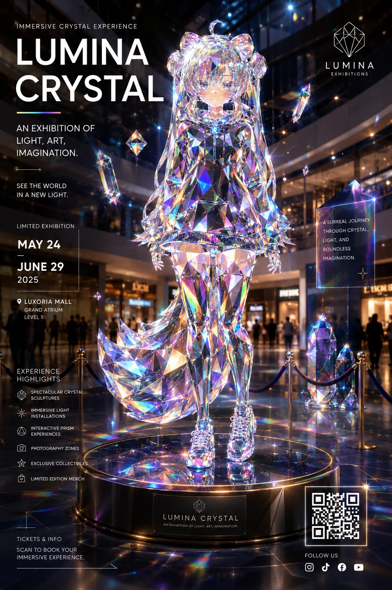

**Category:** Typography & Poster Art · **Tags:** `poster` `exhibition` `luxury` `crystal` `gemstone` `editorial` `commercial-design` `character-translation`

**📋 Prompt:**

```
Create a premium modern exhibition poster / magazine-cover style promotional artwork set inside a luxurious contemporary shopping mall atrium at night, featuring the attached character transformed entirely into a surreal faceted rainbow diamond sculpture as the centerpiece of a public crystal art installation.

The artwork should look like a professionally designed high-end advertising campaign for an immersive mall exhibition. The composition combines cinematic product photography, luxury fashion editorial aesthetics, futuristic exhibition branding, and ultra-detailed CGI rendering.

CHARACTER REQUIREMENTS:
Transform the attached character completely into a transparent refractive gemstone entity while preserving the recognizable identity, facial structure, hairstyle silhouette, proportions, outfit design language, iconic visual traits, and overall silhouette of the original character.

The entire body is composed of sharp low-poly crystalline geometry with hundreds of angular diamond facets. Every surface behaves like physically accurate rainbow crystal material with:
- intense spectral dispersion
- chromatic aberration
- rainbow caustics
- internal reflections
- refractive depth
- translucent gemstone layering
- prism-like light splitting
- iridescent reflections
- vivid multicolored glints

Hair strands become jagged transparent crystal spikes and faceted gemstone ribbons. Clothing folds are reinterpreted as angular geometric crystal planes. The eyes are luminous gemstone cores with subtle internal rainbow glow.

The character stands naturally on a sleek circular exhibition platform inside the mall, surrounded by velvet ropes, luxury lighting fixtures, reflective polished floors, floating crystal fragments, and decorative prism sculptures. The installation should feel like a premium futuristic museum exhibit inside a luxury shopping center.

ENVIRONMENT:
Modern upscale shopping mall interior with:
- cinematic depth of field
- glossy reflective floor
- blurred luxury storefronts
- elegant architectural lighting
- soft crowd silhouettes in the distance
- ambient volumetric light
- holographic reflections
- rainbow light projections cast onto nearby surfaces
- suspended prism installations
- floating crystal dust particles
- reflective caustic patterns

LIGHTING:
Use dramatic cinematic lighting with:
- strong backlight
- colorful rim lighting
- bright prism reflections
- realistic gemstone refractions
- shimmering rainbow highlights
- volumetric glow
- octane render style illumination
- Unreal Engine 5 quality rendering
- physically based rendering

DESIGN / LAYOUT:
The final image must look like a professionally designed modern exhibition poster or luxury magazine cover.

Use:
- clean contemporary typography
- minimalist premium layout
- modern grid-based composition
- elegant spacing
- luxury branding aesthetics
- subtle futuristic UI accents
- premium editorial design
- modern sans-serif typography
- stylish information hierarchy

ALL TEXT MUST BE IN ENGLISH.

Include realistic professional exhibition promotional text such as:
- exhibition title
- slogan/tagline
- exhibition dates
- shopping mall location
- short immersive experience description
- premium feature list
- QR code area
- social media icons
- elegant branding elements

Example style references for text:
"LUMINA CRYSTAL"
"AN EXHIBITION OF LIGHT, ART, IMAGINATION."
"SEE THE WORLD IN A NEW LIGHT."
"IMMERSIVE CRYSTAL EXPERIENCE"
"LIMITED EXHIBITION"

STYLE:
Ultra-detailed cinematic fantasy render, luxury advertisement aesthetic, premium magazine cover design, futuristic mall exhibition campaign, octane render aesthetic, highly reflective transparent surfaces, physically based rendering, Unreal Engine 5 quality, masterpiece quality, ultra sharp focus, sophisticated composition.

IMPORTANT:
- Maintain a single continuous character body with correct anatomy.
- Preserve the attached character's recognizable appearance and proportions.
- Avoid melted geometry or amorphous crystal blobs.
- Avoid T-pose or A-pose; use a natural dynamic pose.
- Ensure anatomically correct hands, fingers, and limbs.
- Emphasize low-poly faceted gemstone surfaces over smooth glass.
- Do not use outdated graphic design styles.
- The poster must feel modern, premium, sleek, minimalistic, and professionally art-directed.
```

**📎 Requires:** An attached reference image — identity preserved through facial structure, silhouette, and proportions, with the entire body translated into refractive crystal material.

**💡 Why it works:** This is a *dual-task prompt* — it asks GPT Image 2 to do two hard things simultaneously: render a physically accurate crystal/gemstone character (with refraction, dispersion, caustics) AND lay out a publishable editorial poster around it. The trick is in the structural split: each task gets its own dedicated block (CHARACTER REQUIREMENTS, ENVIRONMENT, LIGHTING, DESIGN/LAYOUT). The explicit `Emphasize low-poly faceted gemstone surfaces over smooth glass` is doing important work because the model defaults to smooth crystal-ball aesthetics; the low-poly faceting is what makes it read as *sculpture* rather than *blob*. The example text strings (LUMINA CRYSTAL, etc.) lock the *register* of commercial copy without forcing exact wording. `ALL TEXT MUST BE IN ENGLISH` is critical because the model otherwise mixes Japanese/Chinese characters into design copy when given anime-adjacent context.

**🔧 Variations:** swap `rainbow crystal` for `obsidian black mirror`, `liquid mercury`, or `frozen ice sculpture` for different material aesthetics with the same poster structure; change `shopping mall atrium` to `airport terminal exhibition` or `art biennale pavilion` for different commercial contexts; replace the example text strings with your own brand/concept for a real promotional mockup; tighten `low-poly faceted` to `Swarovski crystal precision faceting` for jewelry-grade detail.

---

### 🇧🇷 Brazilian Heritage & Print Culture

Prompts that reinterpret characters through Brazilian historical, archival, and print-medium aesthetics — antique stamps, currency, postal artifacts, and broader national heritage iconography (distinct from the Northeastern regional folk tradition).

---

#### Antique Brazilian Postage Stamp (Lithographic Engraving)

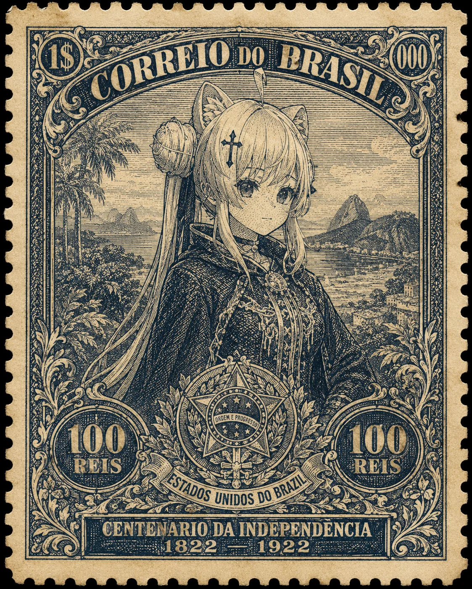

**Category:** Brazilian Heritage & Print Culture · **Tags:** `postage-stamp` `philately` `engraving` `lithograph` `antique-print` `correio-do-brasil` `archival` `low-fidelity`

**📋 Prompt:**

```
create image:
Transform the attached character into an authentic low-resolution antique Brazilian postage stamp illustration inspired by genuine late 19th-century and early 20th-century Correio do Brasil print technology, especially imperfect intaglio engraving, coarse lithographic ink transfer, antique halftone printing, and early postal reproduction limitations.

CRITICAL STYLE GOAL:
The image must NOT look digitally sharp, modern, HD, clean, or highly rendered.
It should resemble a physically printed historical Brazilian stamp scanned from aged paper — visibly rough, noisy, imperfect, low-fidelity, and mechanically reproduced using primitive engraving and lithographic methods.

The final result should feel like:
- an old stamp enlarged beyond its original print size
- visibly limited by antique printing technology
- slightly blurry in micro-details
- heavily textured with dot patterns and ink noise
- imperfectly registered printing plates
- aged archival paper with ink bleeding and worn line precision

IMPORTANT PRINT CHARACTERISTICS:
- coarse engraving lines
- visible ink spread
- stippling and dense dot shading
- halftone texture
- rough cross-hatching
- broken contour lines
- uneven ink absorption
- imperfect print registration
- faded micro-details
- slightly muddy engraved shadows
- tactile paper grain overpowering fine details
- subtle print smearing
- antique print degradation
- low-DPI historical print appearance
- enlarged vintage stamp scan realism

The artwork should resemble:
- a real 1890-1930 Brazilian stamp enlarged under magnification
- worn museum philately scans
- antique postal archives
- faded engraved currency and stamp reproductions
- early government printing presses with mechanical imperfections

Character treatment:
- reinterpret the character through simplified engraved portraiture
- avoid anime-clean line art
- reduce facial sharpness
- soften eye rendering into engraved ink shapes
- simplify clothing details into readable print masses
- preserve identity while adapting it to low-resolution engraved reproduction
- no glossy surfaces
- no digital gradients
- no clean cel shading
- no modern rendering fidelity

Visual rendering:
- monochromatic or duotone only
- faded navy ink, sepia, dark green, or burgundy
- extremely dense stippling
- heavy etched shadows
- dot-based tonal transitions
- visible print grain
- degraded edge fidelity
- noisy engraved texture
- antique paper discoloration
- subtle foxing and age stains
- worn corners and perforations
- irregular ink density

Stamp structure:
- authentic perforated edges
- asymmetrical wear
- ornate but imperfect border engravings
- antique Correio do Brasil typography
- engraved denomination markings
- vintage postal insignia
- imperial and republican Brazilian symbolism
- historical decorative symmetry
- flawed mechanical print alignment

Composition:
- vertically framed classical stamp format
- centered engraved portrait
- highly decorative but visually compressed layout
- dense antique linework
- low-detail readability like real stamps
- visually crowded ornamental print design
- realistic antique reproduction limitations

Texture emphasis:
- aged cellulose paper
- visible fibers
- rough ink transfer
- oxidation stains
- faded printing
- dirty scan texture
- archival wear
- pressure inconsistencies from antique presses
- tactile low-quality historical print realism

Mood:
- archival
- historical
- official
- nostalgic
- worn
- scholarly
- authentic
- mechanically printed
- antique Brazilian philatelic realism

Avoid:
- ultra HD rendering
- crisp digital detail
- modern sharpness
- smooth gradients
- glossy surfaces
- clean vector aesthetics
- pristine linework
- anime rendering polish
- modern print quality
- cinematic lighting
- photorealistic skin rendering

Ultra authentic degraded antique Brazilian postage stamp scan, low-fidelity historical print reproduction, coarse engraved lithographic realism, enlarged archival philately texture, imperfect antique printing aesthetics, museum-grade worn stamp authenticity.

ADDITIONAL IMPORTANT INSTRUCTION:
Intentionally simulate low print resolution and primitive reproduction quality. The image should feel physically printed in the early 1900s, then enlarged digitally from a tiny real-world stamp, revealing all imperfections, dot patterns, ink spread, and engraving degradation.

Avoid T-pose and A-pose; use a natural formal portrait pose appropriate for historical engraved stamp portraiture.
```

**📎 Requires:** An attached reference image — identity preserved through silhouette/key features, with the entire visual translated into low-fidelity antique print language.

**💡 Why it works:** This is the most aggressively *anti-quality* prompt in the entire collection — and that's the entire point. The model's default is to produce HD, clean, sharp output, so this prompt has to explicitly fight against every default at multiple levels. The opening `"The image must NOT look digitally sharp, modern, HD, clean, or highly rendered"` sets the tone, then the prompt stacks 30+ degradation directives (coarse engraving, stippling, ink spread, paper grain, foxing, oxidation stains, asymmetric wear). The framing as `"a real 1890-1930 Brazilian stamp enlarged under magnification"` is a *cultural-artifact identity anchor* — the model has training data on actual antique philately scans and pulls authenticity from that pool. Specifying `monochromatic or duotone only` with a limited palette (faded navy, sepia, dark green, burgundy) is critical: full color destroys the antique reading immediately. The "Avoid" block at the end (ultra HD, crisp digital, glossy, anime rendering polish, cinematic lighting) is doing heavy redirective work — those are all the defaults the model would otherwise produce.

**🔧 Variations:** swap `1890-1930` for `1850s imperial Brazil with Pedro II iconography` for a more imperial-era stamp variant; change `monochromatic navy ink` to `polychromatic 4-color old print with imperfect registration` for early color stamps; replace `vertically framed classical stamp format` with `horizontal commemorative envelope (envelope-with-stamp composition)` for a postal-historical document feel; tighten `Correio do Brasil typography` to a specific historical Brazilian government typeface era for sharper period accuracy.

---


---

### 🪴 Brazilian Northeastern Folk Art

Character-translation prompts that reinterpret a reference into the visual language of traditional Pernambuco / sertão folk art — woodcut prints, clay sculpture, puppet theater, embroidery, baroque sacred art, carnival figures, and historical Northeastern aesthetics. Each prompt handles the *transformation rules* while you supply the character.

---

#### Cordel Woodcut (Xilogravura) Portrait


**Category:** Brazilian Northeastern Folk Art · **Tags:** `xilogravura` `cordel` `woodcut` `folk-art` `nordeste` `character-reference` `identity-lock`

**📋 Prompt:**

```
Transform the attached character into a traditional Brazilian Northeastern xilogravura / cordel illustration while fully preserving the original character identity, face, hairstyle, outfit silhouette, colors, and personality.

IMPORTANT CHARACTER RULE:
- if the reference image is in T-pose, A-pose, idle rigging pose, model-sheet pose, or any unnatural 3D reference stance, DO NOT replicate that pose
- automatically reinterpret the character into a natural, expressive, cinematic pose
- use dynamic body language appropriate for a legendary cordel protagonist
- preserve anatomical proportions and recognizable silhouette while replacing the original static pose
- avoid stiff symmetry in the arms
- create believable movement in clothing, hair, and posture

Style inspired by classic Brazilian cordel woodcut prints:
- handcrafted woodcut engraving aesthetic
- bold black ink carving lines
- strong high-contrast shapes
- visible rough carved textures
- rustic handmade appearance
- dramatic cross-hatching and parallel cut marks
- limited color palette inspired by aged paper, charcoal black, burnt orange, deep red, dusty beige, and dry-earth tones
- flat printmaking composition
- folk-art energy
- authentic northeastern Brazilian visual language

Scene should feel like a legendary cordel tale from the sertao:
- dusty wind
- dramatic sun
- symbolic background elements
- cacti
- birds
- moon and stars
- rural Brazilian atmosphere
- decorative border ornaments common in cordel covers

Composition:
- centered heroic character
- poster-like framing
- highly detailed engraved textures
- symmetrical folk-art balance
- vintage print imperfections
- aged paper texture
- expressive shadows carved like woodcuts

Suggested poses:
- walking through the sertao wind
- holding part of the hoodie or hair
- looking toward the horizon
- slightly turned torso
- one hand raised naturally
- dynamic flowing hair
- calm but powerful stance
- subtle movement in legs and shoulders

Important:
Do NOT redesign the character.
Do NOT turn the character into a different person.
Keep the exact facial identity and recognizable features from the reference image.
Only translate the character into authentic xilogravura / literatura de cordel visual language.

Ultra detailed, authentic Brazilian cordel engraving style, masterful woodcut illustration, museum-quality folk print aesthetic.
```

**📎 Requires:** An attached reference image of the character to preserve.

**💡 Why it works:** The opening "IMPORTANT CHARACTER RULE" block solves a specific pain point — VRChat/3D model references are usually in T-pose or A-pose, which the model would otherwise faithfully reproduce. By explicitly listing those static poses as forbidden *and* providing a curated "Suggested poses" list at the end, you get a natural cordel hero stance regardless of how stiff the source reference is. The dual identity-lock (open paragraph + closing "Do NOT redesign" reminder) sandwiches the style-translation instructions, which keeps the model focused on *medium translation* rather than *character redesign*. The limited palette (aged paper, charcoal, burnt orange, deep red, dusty beige) gives the model concrete swatches instead of vague "warm tones."

**🔧 Variations:** swap `walking through the sertao wind` for `riding a horse across the sertao` for a more dramatic protagonist shot; change the palette accents from `burnt orange, deep red` to `indigo blue, forest green` for a Pernambuco coastal folk variant; remove the "Suggested poses" block entirely if you actually *want* the model to lean into the reference pose.

---

#### Alto do Moura Clay Sculpture (Mestre Vitalino Style)


**Category:** Brazilian Northeastern Folk Art · **Tags:** `clay` `ceramics` `mestre-vitalino` `alto-do-moura` `cangaceiro` `folk-sculpture` `character-reference`

**📋 Prompt:**

```
Transform the attached anime character into an authentic traditional Northeastern Brazilian clay folk sculpture in the exact rustic aesthetic of Alto do Moura and Mestre Vitalino ceramics, strongly inspired by classic handcrafted cangaceiro statues from Pernambuco folk art.

The character must preserve her recognizable identity, face, hairstyle, white hair, red eyes, twin tails, animal ears, gothic personality, and weapon silhouette, but reinterpret all clothing and accessories as traditional handmade cangaco attire crafted entirely from clay.

Visual Style:
- genuine Brazilian artesanato aesthetic
- rustic Alto do Moura ceramic sculpture
- simplified handcrafted proportions
- naive folk-art anatomy
- matte unfired terracotta appearance
- warm reddish-brown clay tones
- visible handmade imperfections
- sculpted with simple rounded forms
- subtle fingerprints, carving marks, and uneven handmade texture
- expressive folk-art eyes typical of Northeastern clay figures
- museum-quality documentary realism

Character Adaptation:
- reinterpret the gothic dress as traditional cangaceira clothing
- leather cangaco hat with star details and stitched ornaments
- rustic leather belts and cartridge straps
- simplified clay-rendered embroidered details
- traditional sertao-inspired skirt and clothing layers
- handmade clay sandals or rustic boots
- weapons redesigned as handcrafted folk-art clay versions while preserving their recognizable silhouettes
- maintain the character's stance, personality, and overall silhouette
- preserve the white hair and twin-tail hairstyle as sculpted clay forms
- preserve the animal ears and recognizable facial identity

Important:
- do NOT redesign the character into another person
- do NOT modernize the sculpture
- avoid anime plastic appearance
- avoid realistic human anatomy
- prioritize authentic Brazilian folk ceramic craftsmanship over anime aesthetics
- the sculpture should look like it was handmade by a real artisan from Pernambuco

Scene:
- rustic wooden shelf or old artisan workshop
- low warm ambient lighting
- earthy shadows
- handmade pottery and clay folk statues in the background
- subtle dust particles in the air
- authentic sertao atmosphere
- documentary photography realism

Composition:
- full-body sculpture
- standing pose
- centered composition
- photographed like a real museum or artisan-shop ceramic piece
- shallow depth of field
- highly detailed clay surface
- realistic ceramic shading
- natural imperfections and asymmetry

Reference Style: traditional cangaceiro clay statues from Alto do Moura, Mestre Vitalino folk ceramics, authentic Pernambuco artesanato, Brazilian sertao folk sculpture realism.
```

**📎 Requires:** An attached reference image of the character. The specific traits in the second paragraph (`white hair, red eyes, twin tails, animal ears, gothic personality, weapon silhouette`) are tuned to a specific character — **edit those to match your reference** when reusing this prompt.

**💡 Why it works:** This prompt fuses *medium translation* (anime → clay sculpture) with *cultural translation* (modern outfit → cangaceiro attire) simultaneously. The "Character Adaptation" block does the cultural mapping piece by piece (dress → cangaceira clothing, weapons → folk-art clay versions) which prevents the model from defaulting to generic "rustic" without committing to the cangaço aesthetic. Naming Mestre Vitalino as a specific artisan anchors the visual register much more reliably than "Brazilian folk sculpture" alone. The "Avoid" block ("anime plastic appearance, realistic human anatomy") is crucial — without it, the model often produces a hybrid anime-clay look instead of authentic naïve folk anatomy.

**🔧 Variations:** swap the character-specific trait list in paragraph 2 to match your reference; change `cangaceira` → `lavadeira` (washerwoman) or `vaqueiro` (cowboy) for different traditional Northeastern character archetypes; replace `Mestre Vitalino` with `Manuel Eudocio` for a slightly different Alto do Moura artisan signature.

---

#### Mamulengo Puppet (Pernambuco Folk Theater)


**Category:** Brazilian Northeastern Folk Art · **Tags:** `mamulengo` `puppet` `folk-theater` `pernambuco` `handcrafted` `character-reference` `identity-lock`

**📋 Prompt:**

```
Transform the attached character into an authentic Brazilian Northeastern mamulengo puppet while fully preserving the original character identity, face, hairstyle, outfit silhouette, colors, and personality.

Style inspired by traditional Pernambuco mamulengo folk theater:
- handcrafted puppet aesthetic
- handmade wooden head and fabric body
- expressive exaggerated folk-art facial features
- painted artisan textures
- rustic theatrical craftsmanship
- visible seams, stitching, cloth folds, and puppet construction details
- colorful traditional Brazilian fabrics
- playful folkloric proportions
- authentic handmade imperfections

Visual characteristics:
- articulated puppet arms and hands
- carved wooden or papier-mache head
- painted eyes and facial expressions
- fabric costume inspired by Northeastern Brazilian folk theater
- slightly worn handmade appearance
- vibrant but earthy folk-art colors
- theatrical puppet-stage energy

Scene:
- traditional mamulengo puppet theater stage
- colorful Festa Junina flags and decorations
- rustic wooden stage
- warm theatrical lighting
- folk festival atmosphere
- dark stage curtain background
- handcrafted props and rural Brazilian cultural elements

Composition:
- character presented as the main puppet performer
- cinematic puppet theater framing
- expressive pose with puppet-like movement
- shallow depth of field
- realistic textile and wood textures
- highly detailed handcrafted materials
- documentary-style folk photography realism

Mood:
- joyful
- whimsical
- folkloric
- culturally authentic
- energetic Brazilian street-theater atmosphere

Important:
Do NOT redesign the character.
Do NOT turn the character into a different person.
Preserve all recognizable visual traits from the reference image.
Only reinterpret the character as a traditional Northeastern Brazilian mamulengo puppet.

Ultra detailed Brazilian folk puppet realism, authentic Pernambuco mamulengo aesthetic, handcrafted artisan theater masterpiece, cultural documentary quality.
```

**📎 Requires:** An attached reference image of the character to preserve.

**💡 Why it works:** Compared to the xilogravura prompt, this one preserves anime-typical "exaggerated folk-art facial features" instead of fighting against them — mamulengos themselves have exaggerated features, so the natural overlap with anime stylization works in your favor. The "visible seams, stitching, cloth folds, and puppet construction details" line is the high-leverage instruction: GPT Image 2 takes that literally and renders actual textile structure rather than smooth illustrated fabric, which is what sells the "this is a real handmade puppet" reading. The Festa Junina flags + dark stage curtain combo gives the model a cohesive stage scene without leaving composition up to chance.

**🔧 Variations:** swap `mamulengo puppet theater stage` for `outdoor street performance setting` for a more raw, documentary feel; change `papier-mache head` → `carved wooden head` to force a more rigid, traditional puppet aesthetic; remove `Festa Junina flags` if you want a less festival-coded background.

---

#### Wooden Folk-Art Puppet Sculpture


**Category:** Brazilian Northeastern Folk Art · **Tags:** `wooden-puppet` `mamulengo` `boneco-de-olinda` `carved-wood` `folk-sculpture` `pernambuco` `style-translation` `identity-flex`

**📋 Prompt:**

```
Redesign the attached character as an authentic handcrafted Northeastern Brazilian folk-art wooden puppet sculpture, inspired by mamulengo puppets, Bonecos de Olinda, rustic artisan carvings, and traditional Pernambuco folk craftsmanship.

The character should NOT remain anatomically human.
Instead, fully reinterpret the design as a stylized wooden folk-art figure made from carved wood pieces and handcrafted artisan materials.

Core redesign direction:
- oversized caricatured wooden head
- simplified geometric anatomy
- segmented puppet-like limbs
- cylindrical arms and legs
- visible wooden joints and construction
- exaggerated facial proportions
- elongated carved nose
- painted expressive eyes
- handcrafted asymmetrical shapes
- rustic folk-art distortion
- theatrical puppet silhouette

Material construction:
- carved painted wood
- visible wood grain
- handmade carving marks
- chipped paint details
- artisan brushstrokes
- matte and semi-gloss painted surfaces
- handcrafted imperfections
- rustic assembly techniques
- visible screws, pins, rope joints, or artisan connections
- traditional handmade Brazilian puppet craftsmanship

Facial redesign:
- reinterpret the original face into a caricatured folk-art sculpture
- preserve recognizable identity through colors, hairstyle, accessories, and expression
- simplified puppet-like facial construction
- painted eyebrows and eyes
- sculpted cheeks and jawlines
- expressive folkloric exaggeration
- stylized artisan proportions instead of realism

Clothing redesign:
- reinterpret all clothing as handcrafted fabric costume pieces
- stitched folk fabrics
- rustic embroidery
- patchwork textures
- simplified sculpted clothing folds
- traditional Northeastern Brazilian artisan aesthetics
- decorative handcrafted details

Scene:
- rustic artisan workshop
- puppet theater backstage
- Pernambuco carnival folk-art environment
- warm ambient lighting
- wooden shelves
- handcrafted cultural atmosphere
- Brazilian folk festival mood

Composition:
- full-body redesign showcase
- character standing like a handcrafted puppet sculpture
- cinematic folk-art photography
- shallow depth of field
- highly detailed material realism
- emphasis on wood texture and handcrafted construction

Mood:
- whimsical
- folkloric
- rustic
- expressive
- handcrafted
- culturally authentic

Avoid:
- realistic human anatomy
- polished modern toy aesthetics
- plastic textures
- CGI perfection
- anime-style rendering
- mass-produced doll appearance

Ultra detailed handcrafted wooden folk-art character redesign, authentic Northeastern Brazilian artisan puppet aesthetic, rustic carved wood sculpture realism, museum-quality cultural folk-art craftsmanship.
```

**📎 Requires:** An attached reference image used as **loose identity inspiration** — the prompt deliberately overrides faithful preservation, keeping only colors, hairstyle, accessories, and overall expression as anchor cues.

**💡 Why it works:** This prompt is a hybrid of the mamulengo and Boneco de Olinda directions, but with a critical new structural choice: it splits the redesign into four explicit *layers* (Core / Material / Facial / Clothing), each with its own checklist. GPT Image 2 handles structured per-layer instructions much better than a single dense paragraph because each section becomes its own internal "rendering pass." The line `"The character should NOT remain anatomically human"` is doing heavy lifting at the top — it gives the model permission to break human proportions, which is the single biggest mental hurdle when translating an anime/3D character into folk sculpture.

**🔧 Variations:** swap `rustic artisan workshop` → `Olinda carnival street parade` for an outdoor festive context; change `full-body redesign showcase` → `cinematic close-up portrait` to emphasize the carved-wood face details; remove the `Clothing redesign` block and add `traditional cangaceiro/cangaceira leather outfit` to push toward sertão-themed puppets specifically.

---

#### Sertão Naïve Folk-Art Painting (005)


**Category:** Brazilian Northeastern Folk Art · **Tags:** `naive-painting` `sertao` `forro` `folk-painting` `nordeste` `feira-painting` `style-translation`

**📋 Prompt:**

```
Transform the attached character into an authentic Northeastern Brazilian folk-art painting inspired by rustic sertão musical illustration, handmade feira paintings, naïve Brazilian popular art, and traditional forró/cordel visual culture.

IMPORTANT STYLE GOAL:
The image should look like a handcrafted Brazilian folk painting made by a rural artisan using simple materials, expressive brushwork, and symbolic cultural imagery — NOT modern digital illustration.

IMPORTANT CANVAS SETTINGS:
- ultra high resolution
- non-transparent background
- full-body character completely visible
- centered composition
- poster-like folk-art framing

Artistic style:
- primitive naïve folk-art painting
- hand-painted appearance
- flat two-dimensional perspective
- simplified anatomy
- exaggerated symbolic proportions
- thick black contour lines
- rough expressive brushstrokes
- handcrafted imperfections
- rustic artisanal painting texture
- uneven paint application
- culturally authentic Brazilian sertão visual language

Visual characteristics:
- warm earthy palette
- strong oranges, reds, yellows, browns, dusty blues, and black outlines
- stylized folkloric facial construction
- almond-shaped or simplified eyes
- symbolic smiling expressions
- geometric simplified bodies
- decorative repetitive patterns
- rustic painted textures
- minimal realistic shading
- expressive primitive visual storytelling

Character redesign:
- reinterpret the character completely in this handcrafted folk-art style
- transform anatomy into simplified painted folk forms
- preserve recognizable identity through colors, hairstyle, silhouette, and accessories
- stylize clothing into traditional sertão-inspired artisan shapes
- simplify details into symbolic painted forms
- expressive folkloric exaggeration instead of realism

Scene atmosphere:
- Northeastern Brazilian sertão environment
- Festa Junina / forró cultural energy
- symbolic sun
- cacti
- rustic dry landscape
- accordion or traditional musical elements
- decorative folk patterns
- handmade cultural atmosphere
- joyful communal rural celebration mood

Composition:
- frontal folk-art arrangement
- character standing like a symbolic cultural figure
- decorative mural-like composition
- balanced handcrafted visual rhythm
- large color blocks separated by black outlines
- flat painted background
- rustic artisan poster aesthetic

Texture and material:
- visible paint texture
- handmade paper or painted wall feel
- pigment irregularities
- rough black ink outlines
- dry brush marks
- authentic handcrafted imperfections
- tactile folk-art realism

Mood:
- warm
- celebratory
- rustic
- musical
- folkloric
- culturally authentic
- handmade and expressive

Avoid:
- photorealism
- anime rendering
- realistic anatomy
- cinematic lighting
- glossy digital painting
- modern vector art
- polished CGI appearance
- hyper-detail realism
- transparent background

Ultra detailed Brazilian naïve folk-art masterpiece, authentic sertão musical painting aesthetic, handcrafted cordel-inspired rural illustration, museum-quality Northeastern Brazilian cultural art.
```

**📎 Requires:** An attached reference image — identity preserved through colors/hairstyle/silhouette, but the rendering itself is fully translated into naïve folk-painting language.

**💡 Why it works:** This prompt explicitly tells the model `"NOT modern digital illustration"` — a rare and powerful negative directive at the top. The combo of `"thick black contour lines"` + `"rough expressive brushstrokes"` + `"large color blocks separated by black outlines"` produces the unmistakable visual signature of Brazilian feira paintings: high-contrast outlined shapes with flat color fills. The palette is locked to a specific earthy set (oranges, reds, yellows, browns, dusty blues) rather than vague "warm tones," which keeps the output from drifting into generic folk-art that could be from anywhere. The "Avoid" block targeting `cinematic lighting` and `glossy digital painting` is key — those are the model's defaults, so naming them as failure modes shifts the output decisively toward authentic naïve craft.

**🔧 Variations:** swap `Festa Junina / forró` for `vaqueiro nordestino` or `pesca artesanal` for different sertão cultural contexts; change the palette to `indigo blues + sea greens + sand` for a Brazilian coastal folk-painting variant; replace `accordion` with `viola caipira` for an interior-Brazil musical anchor.

---

#### Psychedelic Sertão Surrealist Collage (006)


**Category:** Brazilian Northeastern Folk Art · **Tags:** `psychedelic` `collage` `surrealism` `retro-futurism` `nordeste` `experimental` `cosmic-folklore` `analog-print`

**📋 Prompt:**

```
Transform the attached character into a completely reimagined surreal Northeastern Brazilian psychedelic collage artwork with a NEW DYNAMIC POSE integrated into the composition itself — not standing still, but interacting physically and symbolically with the surreal environment.

The character should now appear in an expressive cinematic pose inspired by ritual dance, folkloric performance, cosmic trance, vaqueiro movement, maracatu energy, cangaço iconography, and avant-garde underground Brazilian poster aesthetics.

IMPORTANT:
The original pose must be completely transformed.
Avoid static "character showcase" posture.
The body language must feel alive, symbolic, theatrical, experimental, and integrated into the surreal collage storytelling.

NEW POSE IDEAS:
- floating diagonally through space
- crouching atop impossible cactus formations
- leaning backward in ecstatic trance
- twisting mid-motion like a ritual dance
- dragging the giant scythe across fragmented desert planets
- suspended upside-down among collage fragments
- stepping through cosmic paper layers
- arms spread dramatically toward a gigantic moon
- walking through surreal sand dunes with distorted perspective
- body fragmented into layered collage cutouts
- interacting with floating folkloric symbols
- spiraling through psychedelic sertão winds
- dynamic asymmetrical silhouette
- cinematic movement with exaggerated foreshortening

STYLE GOAL:
The image should feel like an obscure experimental Brazilian album cover discovered in an abandoned cultural archive from an alternate retro-futurist Northeast Brazil.

Aesthetic influences:
- psychedelic sertão futurism
- tropical surrealism
- retro Brazilian counterculture graphics
- experimental cordel art
- handmade analog collage
- underground Brazilian poster design
- cosmic regional folklore
- avant-garde Latin American print culture
- surreal mixed-media installation aesthetics

VISUAL LANGUAGE:
- asymmetrical composition
- chaotic but intentional layering
- surreal symbolic storytelling
- rough handmade montage feeling
- overlapping paper fragments
- mixed photography and painting
- torn paper textures
- photocopy artifacts
- halftone print textures
- VHS distortion
- chromatic aberration
- offset-print imperfections
- faded vintage ink
- rough scan textures
- analog media realism
- fragmented spatial logic

SCENE ELEMENTS:
- gigantic moon filling the background
- impossible desert planets
- floating cacti
- cosmic skies
- astronauts mixed with sertão imagery
- folkloric Brazilian symbolism
- retro CRT technology
- floating animals
- celestial mandalas
- dreamlike desert ruins
- surreal Brazilian religious iconography
- distorted horizons
- impossible architecture
- floating paper fragments
- celestial storms
- regional mysticism fused with sci-fi

CHARACTER REDESIGN:
- preserve recognizable hair, silhouette, red eyes, gothic palette, and iconic weapon
- reinterpret clothing with surreal retro-folk Brazilian textures
- integrate the scythe into the environment like a symbolic cosmic artifact
- mix painted, printed, photographic, and collage textures
- allow partial abstraction and symbolic fragmentation
- incorporate folkloric ornaments and psychedelic regional motifs

COLOR PALETTE:
- neon red
- electric cyan
- acid green
- cosmic purple
- saturated magenta
- desert orange
- moonlit blue
- deep black shadows
- faded vintage yellows
- psychedelic gradients
- high-contrast analog lighting

MOOD:
- mystical
- uncanny
- nostalgic
- cosmic
- poetic
- folkloric
- psychedelic
- ritualistic
- dreamlike
- culturally surreal

TEXTURE EMPHASIS:
- visible paper grain
- ripped collage edges
- dirty print artifacts
- analog paint layers
- magazine cutout textures
- silkscreen imperfections
- xerox distortion
- old Brazilian poster realism
- tactile handmade materials

Avoid:
- static character pose
- centered symmetry
- clean digital illustration
- polished CGI
- generic anime wallpaper composition
- sterile cyberpunk
- smooth rendering
- modern minimalist aesthetics
- plain background

Ultra-detailed Brazilian psychedelic folk-surrealist collage masterpiece, dynamic cinematic pose, cosmic sertão retro-futurism, experimental Northeastern Brazilian cultural art, underground Brazilian avant-garde poster aesthetic, ritual movement, dreamlike analog montage composition.
```

**📎 Requires:** An attached reference image — identity preserved through hair/silhouette/eyes/weapon, with heavy permission to fragment and stylize.

**💡 Why it works:** Three structural tricks make this prompt go far beyond generic "psychedelic art" requests. First, the 14-item "NEW POSE IDEAS" list explicitly forbids static showcase posture and gives the model a curated pool of expressive movement choices — most prompts under-specify pose. Second, the "STYLE GOAL" frame as "*obscure experimental Brazilian album cover from an alternate retro-futurist Northeast*" gives the renderer a *cultural artifact identity* to mimic, which is a much stronger anchor than listing aesthetic adjectives. Third, the analog texture stack (paper grain + ripped edges + xerox + halftone + VHS + chromatic aberration) is what differentiates this from clean digital surrealism — those imperfections are the entire aesthetic.

**🔧 Variations:** swap `gigantic moon` for `enormous setting sun` for a hot-tone variant; change `astronauts + sertão imagery` to `divers + caatinga` for an aquatic surreal mix; replace the album-cover frame with `vintage Brazilian movie poster discovered in archives` for slightly different texture priorities.

---

#### Authentic Boneco de Olinda (Cultural Documentary) (007)


**Category:** Brazilian Northeastern Folk Art · **Tags:** `boneco-de-olinda` `carnival` `papier-mache` `pernambuco` `documentary` `street-photography` `cultural-realism`

**📋 Prompt:**

```
Transform the attached character into a gigantic authentic Boneco de Olinda carnival puppet from Pernambuco, Brazil.

IMPORTANT:
The character must be FULLY REIMAGINED as a traditional Boneco de Olinda giant puppet — not merely wearing carnival clothes.
The final result should look like a real handcrafted Brazilian carnival giant being carried through the streets during the Olinda carnival.

Core redesign:
- gigantic oversized puppet head
- massive caricatured facial proportions
- long stylized nose
- exaggerated painted eyes and eyebrows
- simplified folkloric facial anatomy
- handcrafted papier-mâché head construction
- visible artisan sculpting imperfections
- elongated puppet body
- giant carnival costume
- theatrical folk-art silhouette
- towering puppet scale above the crowd

Identity preservation:
- preserve recognizable facial identity through hairstyle, colors, expression, accessories, and key silhouette traits
- reinterpret all facial features into caricatured Boneco de Olinda proportions
- maintain recognizable personality while transforming the character into a folkloric carnival giant

Material realism:
- painted papier-mâché textures
- handcrafted wood and fabric construction
- visible brushstrokes
- artisan paint imperfections
- sewn carnival fabrics
- embroidered decorative details
- metallic trims and ribbons
- handcrafted seams and folds
- authentic carnival craftsmanship
- realistic worn handmade textures

Costume design:
- extravagant Pernambuco carnival outfit
- vibrant folkloric costume
- sequins
- ribbons
- glitter embroidery
- oversized decorative bowties or collars
- traditional carnival tailoring
- luxurious but handcrafted appearance
- strong regional Brazilian visual identity

Scene:
- crowded Olinda carnival street at night
- massive festive crowd surrounding the puppet
- yellow festa banners overhead
- colonial Brazilian houses
- warm street lighting
- energetic carnival atmosphere
- people dancing and celebrating
- authentic Pernambuco street carnival energy
- documentary photography realism

Composition:
- low-angle cinematic framing emphasizing the giant scale
- full-body puppet visible
- towering over the crowd
- dense crowd composition
- realistic carnival street depth
- dynamic documentary-style photography
- highly detailed environment and costume textures

Mood:
- euphoric
- folkloric
- theatrical
- joyful
- chaotic
- culturally authentic
- energetic Brazilian carnival atmosphere

Visual style:
- realistic cultural photography
- cinematic street photojournalism
- vibrant carnival colors
- dramatic nighttime lighting
- authentic Brazilian folk-art realism
- handcrafted puppet realism

Avoid:
- anime aesthetics
- realistic human anatomy
- plastic mascot appearance
- modern mascot costume design
- CGI perfection
- clean commercial parade aesthetics
- theme-park mascot look

Ultra detailed authentic Boneco de Olinda giant puppet redesign, handcrafted Pernambuco carnival realism, Brazilian folk-art festival masterpiece, cinematic documentary carnival photography.
```

**📎 Requires:** An attached reference image — identity preserved through hairstyle/colors/expression, with full permission to transform anatomy into caricatured puppet proportions.

**💡 Why it works:** Where prompt 004 produces a *display sculpture* of the character as wooden puppet, this prompt pushes for **cultural documentary realism** — the character isn't a static art piece but a *carnival giant being paraded through Olinda streets at night*. The low-angle framing + dense crowd + colonial Brazilian houses + yellow banners overhead is what sells the scene as real street photojournalism. The "Avoid" block explicitly killing `theme-park mascot look` and `clean commercial parade aesthetics` is important — without it, the model defaults to Disney-parade-float aesthetic. The night setting with warm street lighting forces commitment to a specific carnival moment rather than a generic daytime puppet showcase.

**🔧 Variations:** swap `night` for `late afternoon golden hour` for a brighter documentary mood; change the location from `Olinda` to `Recife Galo da Madrugada parade` for a different specific Pernambuco carnival context; remove `crowd composition` and use `solitary puppet against colonial church facade` for a more melancholic standalone shot.

---

#### Naïve Folk-Mural Integration (008)


**Category:** Brazilian Northeastern Folk Art · **Tags:** `mural` `naive-painting` `sertao` `primitive-art` `folk-mural` `character-integration` `anti-anime`

**📋 Prompt:**

```
Transform the attached character into an authentic handcrafted Northeastern Brazilian naïve folk-art painting where the CHARACTER ITSELF is COMPLETELY repainted in the SAME visual language as the environment, villagers, animals, and scenery — absolutely no separation between character rendering style and background rendering style.

CRITICAL STYLE PRIORITY:
The attached character MUST lose ALL traces of modern anime rendering, glossy digital shading, 3D VTuber aesthetics, cel-shading, realistic anatomy, game-art rendering, or polished illustration techniques.

The character must look as if painted by the SAME rural Brazilian folk artisan who painted the entire countryside mural.

The final image should feel like a genuine handcrafted Brazilian primitive painting from the sertão, where every element shares the exact same artisanal naïve aesthetic.

MANDATORY CHARACTER TRANSFORMATION:
- flatten the character into primitive folk-art geometry
- fully remove 3D appearance
- remove anime rendering language
- remove modern digital-art finish
- simplify anatomy into rustic handcrafted painted forms
- simplify hands, limbs, and proportions intentionally
- reduce facial detail dramatically
- use folk-art facial construction:
  - simple almond eyes
  - tiny stylized nose
  - minimal mouth
  - painted folk expression
- paint hair as simplified decorative shape masses
- simplify clothing folds into painted symbolic shapes
- integrate the hoodie into rustic folkloric painted aesthetics
- reinterpret black clothing using matte painted pigment texture
- convert all accessories into simplified painted symbols
- repaint boots, stockings, and hoodie in handcrafted primitive style
- preserve only the recognizable silhouette:
  - blonde hair
  - twin buns
  - animal ears
  - long tail
  - black outfit
- make the character look painted directly onto wood or canvas using gouache or acrylic
- visible brush texture everywhere
- no smooth gradients
- no polished rendering
- no studio-quality character finish
- no visual hierarchy separating character from environment
- character MUST have the SAME level of simplification as villagers and animals

VERY IMPORTANT:
The character should resemble traditional Brazilian folk paintings from Northeastern artisan culture, similar to hand-painted rural murals and popular naïve countryside paintings.

The character must appear:
- rustic
- symbolic
- folkloric
- handcrafted
- communal
- decorative
- painted with emotional simplicity
- intentionally imperfect
- visually integrated into the mural composition

ENVIRONMENT STYLE:
Authentic Northeastern Brazilian sertão countryside naïve painting.

Artistic style:
- Brazilian naïve folk art
- primitive-art painting
- handcrafted mural aesthetic
- popular countryside painting
- flat two-dimensional composition
- decorative spatial organization
- simplified perspective
- symbolic storytelling
- folkloric visual rhythm
- artisanal painted textures

Scene elements:
- white rural houses with clay tile roofs
- dirt roads
- ox carts
- villagers carrying baskets and supplies
- goats, cows, chickens, donkeys, birds
- cactus and dry sertão vegetation
- decorative trees with circular foliage
- warm sunset sky
- earthy orange soil
- bright folkloric greens and blues
- communal countryside atmosphere
- peaceful rural storytelling

COMPOSITION:
- panoramic mural-like arrangement
- many small rural interactions happening simultaneously
- decorative balance between houses, trees, villagers, and animals
- flat readable storytelling composition
- handcrafted ornamental rhythm
- character naturally inserted among villagers rather than posed separately

TEXTURE AND MATERIAL:
- matte gouache or acrylic paint feel
- painted wood or canvas texture
- visible handmade brushwork
- uneven artisanal pigment application
- rustic imperfections
- handcrafted Brazilian popular-art realism

ABSOLUTELY AVOID:
- anime aesthetics
- VTuber appearance
- glossy rendering
- cel shading
- realistic anatomy
- cinematic lighting
- modern digital illustration
- hyper-detailing
- polished character rendering
- sharp digital gradients
- game-art aesthetics
- semi-realism
- photorealism
- modern stylization
- isolated character composition
- high-detail face rendering
- 3D shading
- studio-quality finish

The final result must look indistinguishable from an authentic museum-quality Northeastern Brazilian naïve folk-art mural painted entirely by hand by a traditional sertão artisan painter.
```

**📎 Requires:** An attached reference image — the character-specific silhouette traits in the "preserve only the recognizable silhouette" block (`blonde hair, twin buns, animal ears, long tail, black outfit`) should be edited to match your reference.

**💡 Why it works:** This is the most *aggressive style-translation prompt* in the entire collection — note the all-caps `"CRITICAL STYLE PRIORITY"` and `"MANDATORY CHARACTER TRANSFORMATION"` headers, plus an 18-item `"ABSOLUTELY AVOID"` block specifically targeting every rendering style the model would naturally default to (anime, VTuber, cel-shading, 3D, glossy, polished, photorealism). The line `"no visual hierarchy separating character from environment"` is the key technical demand: most character-translation prompts leave the character as a focal point with the background simpler around it; this one forces the character to be as simplified as the chickens and goats in the mural. The result is a fully-integrated naïve folk-painting where the character feels *painted by the same artisan*, not pasted on top.

**🔧 Variations:** swap `sertão countryside` for `coastal fishing village (jangadeiros)` for a different rural-Brazil setting; replace `warm sunset sky` with `early morning cool dawn` for a calmer mood; tighten the silhouette-preservation list to your specific character (this version is tuned to one specific reference).

---

#### Frevo Carnival Performer (009)


**Category:** Brazilian Northeastern Folk Art · **Tags:** `frevo` `passista` `carnival` `pernambuco` `dance` `acrobatic` `motion` `cultural-realism`

**📋 Prompt:**

```
Transform the attached character into an authentic Frevo carnival performer from Pernambuco, fully redesigning the character into the energetic visual language of traditional Brazilian Frevo culture while still preserving recognizable identity traits such as hairstyle silhouette, facial essence, colors, accessories, and personality.

IMPORTANT STYLE GOAL:
The character should feel like a true Frevo passista captured during an explosive Pernambuco carnival performance — full of movement, rhythm, acrobatics, color, and joyful chaos.

The redesign should NOT simply place the original character into a costume.
Instead, completely reinterpret the visual design through authentic Frevo aesthetics.

Character redesign:
- transform the outfit into traditional Frevo carnival attire
- vibrant multicolored fabric patterns
- sequined and embroidered details
- lightweight dance costume designed for extreme movement
- decorative ribbons and carnival trims
- colorful geometric patterns
- stylized carnival boots or dance shoes
- dynamic flowing costume elements reacting to movement
- festive handcrafted Brazilian costume realism

Movement and pose:
- highly dynamic acrobatic Frevo pose
- explosive dance movement
- airborne jump or dramatic spin
- impossible energetic body posture
- limbs extended rhythmically
- expressive joyful body language
- strong diagonal composition
- NEVER use static standing poses
- NEVER use T-pose or A-pose
- pose should communicate rhythm and speed instantly

Frevo umbrella:
- iconic small Frevo umbrella
- brightly colored segments
- saturated red, blue, green, yellow panels
- spinning or motion-blurred movement
- integrated naturally into choreography
- decorative handcrafted details

Visual style:
- vibrant Brazilian carnival atmosphere
- kinetic composition
- saturated tropical colors
- intense sunlight
- joyful crowd energy
- rhythmic visual flow
- cinematic movement photography
- dynamic festival realism
- authentic Pernambuco street carnival aesthetic

Scene:
- Recife or Olinda carnival environment
- open sky
- festival crowds
- confetti
- banners
- Brazilian street celebration atmosphere
- parade energy
- dancers and musicians in background
- realistic Brazilian cultural environment

Composition:
- dramatic low-angle camera
- airborne dance capture
- wide dynamic framing
- motion-focused composition
- character as energetic center of attention
- visual rhythm created through color repetition and movement
- cinematic cultural photography style

Texture and material:
- realistic fabric movement
- sweat, sunlight, and festival realism
- detailed embroidery and carnival textures
- vibrant cloth materials
- natural outdoor lighting
- realistic movement blur
- documentary-style cultural photography realism

Mood:
- euphoric
- explosive
- rhythmic
- joyful
- celebratory
- energetic
- colorful
- culturally authentic

Avoid:
- generic samba aesthetics
- static posing
- realistic ballet style
- cyberpunk aesthetics
- dark muted palettes
- modern fashion photography
- polished CGI look
- anime idol aesthetic

Ultra detailed Frevo carnival masterpiece, authentic Pernambuco cultural dance realism, explosive Brazilian street festival energy, cinematic passista performance photography.
```

**📎 Requires:** An attached reference image — identity preserved through hairstyle/colors/accessories; outfit fully reinterpreted as Frevo attire.

**💡 Why it works:** Movement is the entire point of Frevo, so the prompt is structured around it — `"NEVER use static standing poses"` appears twice and `"pose should communicate rhythm and speed instantly"` is a directive about *outcome* rather than just appearance. The iconic small Frevo umbrella gets its own dedicated block because it's the single visual element that prevents confusion with samba (the "Avoid" block kills `generic samba aesthetics` explicitly — that's a real failure mode). The low-angle airborne dance capture + motion blur stack pushes the rendering toward sports-photojournalism feel rather than illustration, which is the difference between a Frevo *poster* and a Frevo *moment*.

**🔧 Variations:** swap `airborne jump` for `low crouch with umbrella spinning above` for a different signature pose; change the setting to `nighttime carnival with stage lights` for dramatic moody lighting; replace `Recife/Olinda` with `Recife Antigo cobblestone street` for a specific historic district context.

---

#### Cangaceiro / Xaxado Warrior (010)


**Category:** Brazilian Northeastern Folk Art · **Tags:** `cangaco` `cangaceiro` `lampiao` `xaxado` `sertao` `historical` `nordeste` `leather-craft`

**📋 Prompt:**

```
Transform the attached character into an authentic Northeastern Brazilian xaxado and cangaço warrior figure inspired by the historical visual culture of Lampião, Maria Bonita, and the sertão cangaceiros, while preserving recognizable identity traits such as hairstyle silhouette, facial essence, colors, and personality.

IMPORTANT STYLE GOAL:
The character should feel like a legendary sertão cangaceiro captured inside a dusty cinematic Brazilian backlands epic — mixing survivalism, folk culture, historical realism, and symbolic Northeastern identity.

This is NOT generic cowboy aesthetics.
The redesign must reflect authentic cangaço visual language from the Brazilian Northeast.

Character redesign:
- transform the outfit into traditional cangaço clothing
- richly decorated leather garments
- handcrafted stitched details
- ornamental leather hats with iconic crescent shape
- leather belts crossing the torso
- rustic bandoliers
- embroidered symbols and geometric folk patterns
- aged leather textures
- handmade sertão craftsmanship
- worn fabric and survival gear
- rustic scarves and neck cloths
- traditional sandals or leather boots
- weathered historical appearance

Facial redesign:
- reinterpret the character as a hardened sertão survivor
- sunburned dusty skin tones
- expressive eyes
- rugged folkloric realism
- historically inspired styling
- dramatic but authentic facial construction
- preserve recognizable identity while adapting to cangaço aesthetics

Movement and pose:
- dynamic xaxado dance posture OR cinematic cangaceiro stance
- confident survivalist body language
- rhythmic marching movement
- diagonally composed action pose
- dust kicking from the dry ground
- expressive folkloric silhouette
- NEVER use static mannequin poses
- NEVER use T-pose or A-pose

Visual style:
- cinematic Brazilian sertão realism
- dusty sunlight
- warm earthy palette
- cracked dry landscapes
- rustic historical atmosphere
- harsh tropical backlands lighting
- dramatic cultural realism
- folkloric historical epic energy

Scene:
- Northeastern Brazilian sertão
- dry caatinga vegetation
- cacti
- rocky terrain
- dusty roads
- old rural settlements
- harsh sunlight
- leather textures reacting to heat and dust
- cinematic Brazilian backlands atmosphere
- subtle xaxado dance references or cangaceiro group presence

Composition:
- strong heroic silhouette
- cinematic low-angle framing
- dramatic desert-like composition
- visual emphasis on leather craftsmanship and iconic hat silhouette
- folkloric historical storytelling
- balanced rustic composition
- realistic environmental integration

Texture and material:
- cracked leather realism
- handmade stitching
- dusty fabric
- dry earth textures
- weathered metal details
- realistic sunlight exposure
- tactile artisan craftsmanship
- documentary-style Brazilian historical realism

Mood:
- resilient
- legendary
- folkloric
- historical
- rugged
- dramatic
- culturally authentic
- mythic sertão atmosphere

Avoid:
- generic western cowboy aesthetics
- futuristic cyberpunk elements
- anime idol styling
- polished fantasy armor
- medieval European aesthetics
- clean modern fashion
- glossy CGI look
- exaggerated Hollywood western tropes

Ultra detailed Brazilian cangaço masterpiece, authentic xaxado and sertão warrior realism, cinematic Northeastern historical folk aesthetic, museum-quality Brazilian cultural epic.
```

**📎 Requires:** An attached reference image — identity preserved through hairstyle/colors; outfit fully reinterpreted as cangaço leather attire.

**💡 Why it works:** The biggest risk with this prompt is the model defaulting to *American Old West cowboy* — the "Avoid" block explicitly kills `generic western cowboy aesthetics` and `Hollywood western tropes` to redirect toward the authentic cangaço visual language. Naming Lampião and Maria Bonita as historical anchors is much stronger than generic "Brazilian bandits" because it locks specific iconographic elements (crescent-shape leather hat, decorated bandoliers, embroidered patterns). The "cinematic Brazilian backlands epic" frame draws from Glauber Rocha's Cinema Novo aesthetic without naming him — dusty, harsh sun, dry caatinga, rocky terrain — which produces dramatically different lighting than a clean studio character render.

**🔧 Variations:** swap `mid-march xaxado dance` for `still confident stance with rifle resting on shoulder` for a more iconic Lampião-photo composition; change `harsh midday sun` to `dramatic sunset against caatinga silhouettes` for warmer Cinema Novo tones; add `flag or cangaço band insignia` for added historical specificity.

---

#### Carranca do São Francisco (River Guardian) (011)


**Category:** Brazilian Northeastern Folk Art · **Tags:** `carranca` `sao-francisco` `wood-carving` `mystical` `river-guardian` `nordeste` `folkloric-horror` `identity-flex`

**📋 Prompt:**

```
Transform the attached character into an authentic Carranca do Rio São Francisco — a mystical Northeastern Brazilian river guardian sculpture carved from wood — while preserving recognizable identity traits such as facial essence, hairstyle silhouette, colors, accessories, and personality.

IMPORTANT STYLE GOAL:
The character should be fully redesigned as a supernatural carved wooden carranca figure traditionally mounted on boats from the São Francisco River.

This is NOT simply a human holding a carranca.
The character itself must become the carranca.

The result should feel:
- ancient
- mystical
- folkloric
- intimidating
- handcrafted
- spiritual
- rustic
- culturally authentic

Character redesign:
- fully reinterpret anatomy as a carved wooden guardian sculpture
- exaggerated monstrous facial construction
- oversized mouth and teeth
- sharp carved cheekbones
- wide staring eyes
- aggressive folkloric expression
- elongated sculptural nose
- carved wooden hair and beard shapes
- exaggerated brows and jawline
- stylized folk-art anatomy
- symbolic protective spirit appearance

Material construction:
- handcrafted carved wood realism
- visible wood grain
- aged river-worn texture
- cracked paint and weathering
- artisan carving marks
- rough chisel imperfections
- hand-painted folkloric details
- matte aged wood surfaces
- sculptural artisan realism

Visual characteristics:
- dramatic carved facial features
- exaggerated teeth and mouth
- large circular eyes
- river-spirit guardian aesthetic
- rustic handcrafted asymmetry
- folkloric monstrous proportions
- weathered paint layers
- ritualistic symbolic energy
- sculptural silhouette readable from distance

Scene:
- São Francisco River atmosphere
- old Brazilian riverboat environment
- foggy dawn or dramatic sunset lighting
- wooden boat textures
- tropical river environment
- mystical Brazilian folklore ambiance
- humid atmosphere
- river reflections
- poetic Northeastern realism

Composition:
- cinematic folkloric portrait OR full-body guardian sculpture framing
- strong silhouette emphasis
- low-angle dramatic camera
- environmental storytelling
- tactile sculptural realism
- visually dominant carved face
- atmospheric river composition

Mood:
- mythic
- eerie
- protective
- spiritual
- ancestral
- folkloric
- mysterious
- rustic
- culturally authentic

Texture and material:
- aged tropical wood realism
- rough carved surfaces
- visible chisel cuts
- cracked artisan paint
- river humidity wear
- organic texture detail
- handcrafted imperfections
- tactile sculptural material realism

Optional symbolic elements:
- river mist
- candles
- fishing boats
- folk talismans
- carved ornamental patterns
- spiritual protective symbols
- Brazilian river folklore atmosphere

Avoid:
- polished fantasy monster aesthetics
- generic tiki statues
- clean modern sculpture
- glossy CGI surfaces
- medieval European monster design
- polished horror creature aesthetics
- anime demon styling
- synthetic textures

Ultra detailed Brazilian Carranca masterpiece, authentic São Francisco River guardian sculpture realism, mystical Northeastern folk-art horror aesthetic, museum-quality handcrafted carved wood folklore.
```

**📎 Requires:** An attached reference image — identity preserved through facial essence/colors, but anatomy fully reimagined as a monstrous carved wooden guardian.

**💡 Why it works:** The structural masterstroke here is the line `"This is NOT simply a human holding a carranca. The character itself must become the carranca."` — without that explicit reframing, the model defaults to a person standing next to a wooden sculpture. Naming `carved teeth, oversized mouth, wide staring eyes, exaggerated brows` gives a concrete distortion vocabulary that's specifically carranca rather than generic gargoyle or tiki. The "Avoid" block does heavy work: `polished fantasy monster aesthetics, generic tiki statues, medieval European monster design, anime demon styling` — those are the four most common drift targets, and naming them explicitly suppresses each. The river mist + dawn lighting + humid atmosphere stack pushes the scene toward folkloric horror rather than craft display.

**🔧 Variations:** swap `foggy dawn` for `pitch-black night with candle-lit boat` for ritual horror intensity; change `single guardian` to `row of carrancas lined up on a riverboat prow` for documentary scale; replace `protective spirit` with `vengeful river demon` if you want a more aggressive expression direction.

---

#### Renda Renascença Lace Entity (012)


**Category:** Brazilian Northeastern Folk Art · **Tags:** `renda-renascenca` `lace` `embroidery` `textile` `pernambuco` `paraiba` `ceremonial` `identity-flex` `craft-art`

**📋 Prompt:**

```
Transform the attached character into a fully textile-based handcrafted entity made entirely from authentic Northeastern Brazilian Renda Renascença lace craftsmanship from Pernambuco and Paraíba. Preserve the recognizable identity, facial proportions, hairstyle silhouette, expression, colors, accessories, and overall personality of the original character, but reinterpret her entire body, clothing, hair, weapon, ornaments, and environment as if they were physically handcrafted from luxurious artisanal lace, embroidery, woven threads, crochet structures, and ceremonial textile construction.

IMPORTANT CORE CONCEPT:
The character herself must no longer appear as flesh wearing lace clothing — instead, she must appear as if her entire existence is made from handcrafted textile art and woven embroidery.

Her:
- skin becomes delicate woven lace mesh
- hair becomes flowing embroidered silk threads and lace filaments
- eyes become stitched gemstone embroidery and layered threadwork
- ears and tail become soft layered textile structures
- fingers, legs, and facial details become constructed from intricate stitched fabric anatomy
- weapon becomes an elaborate sculptural lace artifact made from woven threads, embroidery, crochet structures, ornamental knots, and artisanal textile engineering

The entire character should resemble:
- a sacred handcrafted textile doll
- a museum-quality artisanal embroidery sculpture
- a living lace entity
- a ceremonial folkloric textile spirit
- a handcrafted Northeastern Brazilian lace masterpiece

Authentic Brazilian Renda Renascença aesthetic:
- intricate interconnected lace geometry
- handcrafted needle lace realism
- floral and radial embroidery motifs
- visible thread tension and stitching logic
- woven textile anatomy
- layered lace transparency
- ornamental handcrafted complexity
- tactile artisanal construction
- realistic thread intersections
- handcrafted textile density
- ceremonial folkloric sophistication

Materials:
- ivory lace
- pearl embroidery
- cream woven fabric
- off-white crochet structures
- subtle gold thread accents
- handmade cotton lace
- embroidered silk thread
- linen textile layering
- delicate translucent woven patterns

Visual design:
- the body itself is constructed from embroidery and lace
- no visible human skin texture
- no synthetic surfaces
- no plastic CGI materials
- no smooth anime shading
- every surface must show thread structure and handcrafted textile realism
- layered stitched anatomy
- woven structural logic
- visible embroidery seams
- ornamental thread filigree integrated into anatomy

Hair design:
- hair made from flowing embroidered fibers
- woven thread strands
- delicate lace tassels
- ornamental textile ribbons
- layered handcrafted fabric curls
- lace veil integration
- subtle floral embroidery woven into hair structure

Facial treatment:
- preserve recognizable face and expression
- eyes made from layered embroidery and stitched gemstone-like threadwork
- embroidered eyelashes
- delicate textile blush made from pink stitched fibers
- ornamental lace markings around the eyes
- handcrafted doll-like elegance

Clothing integration:
- clothing and body partially merge together
- dress appears organically woven into anatomy
- sleeves dissolve into thread structures
- layered textile growth patterns
- ceremonial lace armor aesthetic
- folkloric sacred textile fashion
- flowing handcrafted veils and embroidered panels

Weapon redesign:
- fully made from woven lace engineering
- crocheted ornamental blade structures
- thread-based filigree weapon anatomy
- embroidered metallic illusion through textile techniques
- hanging embroidered chains and lace pendants
- sacred ceremonial textile weapon aesthetic

Scene:
- authentic Northeastern Brazilian artisan environment
- lace workshop atmosphere
- handcrafted embroidery studio
- ceremonial folkloric textile shrine
- lace curtains and embroidered backgrounds
- radial ornamental textile framing
- layered handcrafted decorative environment

Composition:
- elegant full-body pose
- fashion photography framing
- symmetrical handcrafted ornamentation
- decorative textile density
- layered foreground lace elements
- soft cinematic lighting
- sacred folkloric atmosphere

Texture quality:
- hyper-detailed textile realism
- visible fibers
- visible thread intersections
- handcrafted stitching precision
- tactile embroidery depth
- museum-quality artisanal craftsmanship
- realistic lace holes and woven transparency
- layered fabric shadows
- macro-level textile detailing

Mood:
- sacred
- poetic
- handcrafted
- folkloric
- ceremonial
- elegant
- timeless
- delicate
- culturally authentic

Avoid:
- exposed human skin
- smooth anime surfaces
- synthetic materials
- glossy CGI rendering
- modern fashion minimalism
- cyberpunk aesthetics
- mass-produced fabric appearance
- generic European lace look
- plastic doll appearance
- machine-made textile patterns

Ultra detailed Brazilian Renda Renascença textile entity, fully handcrafted lace anatomy, living embroidery sculpture, authentic Northeastern Brazilian artisanal textile realism, museum-quality handcrafted thread masterpiece, sacred folkloric lace fantasy.
```

**📎 Requires:** An attached reference image — identity preserved through face/hairstyle/expression, with the entire body radically reinterpreted as textile construction.

**💡 Why it works:** This is one of the most conceptually ambitious prompts in the collection — instead of *dressing* the character in lace or *placing* her near lace, it tells the model `"her entire existence is made from handcrafted textile art."` The bulleted breakdown (skin → woven mesh, hair → embroidered fibers, eyes → stitched gemstone threadwork, weapon → woven lace engineering) provides a per-body-part transformation rule, which the model handles much better than a vague global directive. The line `"no visible human skin texture"` is critical — without it, the model produces a character *wearing* lace rather than *made of* it. The Materials block locks the palette to ivory/cream/pearl/gold, which keeps the textile reading rather than drifting into generic fantasy doll aesthetics. Naming `Pernambuco and Paraíba` regionally anchors the prompt away from generic European needle lace.

**🔧 Variations:** swap `ivory + cream + pearl + gold` for `deep red + black + crimson` for a darker ceremonial textile entity; change `lace workshop` to `cathedral or ceremonial chapel setting` for stronger sacred framing; tighten the weapon redesign to a specific scythe/sword silhouette to preserve recognizability across renders.

---

#### Brazilian Baroque (Barroco Nordestino) Sacred Portrait (013)


**Category:** Brazilian Northeastern Folk Art · **Tags:** `baroque` `barroco-nordestino` `sacred-art` `colonial` `gilded` `pernambuco` `bahia` `religious-aesthetic`

**📋 Prompt:**

```
Transform the attached character into a monumental Northeastern Brazilian Baroque masterpiece inspired by the sacred art, gilded churches, religious sculpture, colonial ornamentation, and dramatic visual language of Brazilian Barroco Nordestino from Pernambuco, Bahia, and Paraíba.

IMPORTANT STYLE GOAL:
The image should feel like an extravagant Brazilian colonial-Baroque religious artwork mixing:
- sacred theatricality
- overwhelming ornamentation
- tropical colonial aesthetics
- gold-covered architecture
- dramatic spirituality
- handcrafted sacred sculpture
- emotional intensity
- Brazilian historical grandeur

The result should resemble a forgotten masterpiece hidden inside an ancient Northeastern Brazilian church.

Character redesign:
- reinterpret the character through Brazilian Baroque sacred aesthetics
- transform clothing into richly ornamented colonial ceremonial garments
- elaborate gold embroidery
- sacred textile layering
- flowing dramatic fabrics
- ornamental lace and sacred detailing
- jewel-encrusted accessories
- carved decorative motifs integrated into costume
- angelic or saint-like visual symbolism
- tropical colonial luxury mixed with spiritual solemnity

Facial treatment:
- preserve recognizable identity while adapting into Baroque sacred portraiture
- emotionally expressive eyes
- dramatic spiritual intensity
- sculptural facial lighting
- soft sacred realism
- painted religious-art facial treatment
- idealized but human emotional depth

Visual characteristics:
- overwhelming ornamental density
- gilded carvings everywhere
- gold leaf textures
- dramatic arches and church interiors
- sacred floral arabesques
- carved angels and decorative saints
- candle-lit atmosphere
- painted ceilings
- colonial Brazilian ornamentation
- sacred theatrical composition
- heavy decorative symmetry

Scene:
- ancient Northeastern Brazilian Baroque church
- gilded altar background
- colonial sacred architecture
- candlelight illuminating gold surfaces
- carved wooden ornamentation
- tropical sacred atmosphere
- incense haze
- religious mural paintings
- richly decorated chapels
- emotional spiritual grandeur

Composition:
- grand cathedral-like framing
- monumental sacred portrait composition
- dramatic central figure presentation
- symmetrical Baroque visual balance
- ornate architectural layering
- theatrical sacred staging
- painterly museum-quality composition
- divine light beams entering through church windows

Lighting:
- dramatic chiaroscuro
- golden candlelight
- divine illumination
- deep shadows contrasted with glowing gold
- spiritual cinematic atmosphere
- sacred painterly light realism

Texture and materials:
- gold leaf realism
- carved wood ornamentation
- aged colonial paint textures
- cracked sacred paintings
- candle wax
- embroidered velvet fabrics
- marble and gilded surfaces
- handcrafted sculptural detailing
- museum-quality material realism

Mood:
- sacred
- monumental
- spiritual
- theatrical
- emotionally intense
- ornate
- majestic
- mystical
- culturally authentic

Art influences:
- Brazilian colonial sacred art
- Northeastern Baroque churches
- gilded Brazilian altars
- sacred Catholic procession aesthetics
- handcrafted colonial ornamentation
- tropical Baroque emotional realism

Avoid:
- minimalist aesthetics
- modern fashion styling
- futuristic cyberpunk elements
- clean contemporary architecture
- generic European-only Baroque
- sterile museum lighting
- anime rendering
- glossy CGI appearance

Ultra detailed Brazilian Baroque masterpiece, authentic Northeastern colonial sacred art realism, monumental gilded church aesthetic, museum-quality tropical Baroque painting and sculpture realism.
```

**📎 Requires:** An attached reference image — identity preserved through facial essence, with clothing fully reinterpreted as colonial ceremonial garments.

**💡 Why it works:** The "Avoid" block explicitly excludes `generic European-only Baroque` — a critical distinction because Brazilian Barroco Nordestino has tropical-colonial sensibilities (warmer palette, integration of indigenous and African motifs, regional materials) that pure European Baroque lacks. Naming three specific Brazilian regions (Pernambuco, Bahia, Paraíba) anchors the visual register regionally. The chiaroscuro + candlelight + gold leaf + incense haze stack produces Caravaggio-meets-tropics atmospheric quality. The phrase "forgotten masterpiece hidden inside an ancient Northeastern Brazilian church" gives the renderer a *cultural artifact identity* to mimic — much stronger anchor than aesthetic adjective lists.

**🔧 Variations:** swap the gilded altar background for `colonial church courtyard with tropical foliage` for an outdoor sacred procession setting; change `candle-lit interior` to `dramatic sunset through stained glass` for warmer hues; tighten `saint-like visual symbolism` to a specific saint (Nossa Senhora Aparecida, São Francisco) for character-specific iconography.

---

#### Azulejo Tile Mural (Maranhão / Bahia) (014)


**Category:** Brazilian Northeastern Folk Art · **Tags:** `azulejo` `tile-mural` `maranhao` `bahia` `colonial` `ceramic` `cobalt-blue` `decorative` `style-translation`

**📋 Prompt:**

```
Transform the attached character into an elegant artwork inspired by traditional Azulejaria Maranhense and Bahian colonial tile aesthetics, while preserving recognizable identity traits such as facial essence, hairstyle silhouette, colors, accessories, and personality.

IMPORTANT STYLE GOAL:
The entire image should feel like a living colonial Brazilian azulejo mural — mixing Portuguese tilework traditions with tropical Northeastern Brazilian architecture, decorative geometry, handcrafted ceramic ornamentation, and historic coastal cultural atmosphere.

The character should appear naturally integrated into the tile composition itself, as if painted and glazed directly onto handcrafted ceramic panels found in São Luís do Maranhão or Salvador colonial architecture.

Art direction:
- traditional Brazilian colonial azulejo aesthetic
- handcrafted ceramic mural realism
- ornamental tile composition
- decorative geometric repetition
- floral and arabesque patterns
- Portuguese-inspired tile symmetry
- tropical Brazilian reinterpretation
- elegant handcrafted decorative storytelling
- mural-like visual structure
- artisanal ceramic craftsmanship

Character redesign:
- reinterpret the character entirely through azulejo visual language
- stylize anatomy and clothing into painted ceramic forms
- integrate decorative tile motifs into clothing, hair, and accessories
- transform costume into colonial-tropical ornamental patterns
- preserve recognizable identity while adapting all visual elements into ceramic mural aesthetics
- subtle stylization inspired by painted colonial saints, historical murals, and handcrafted tile illustrations

Visual characteristics:
- dominant blue-and-white palette
- cobalt blue ceramic painting
- off-white aged glaze
- optional turquoise, faded yellow, and weathered earthy accents
- intricate floral repetition
- decorative borders and frames
- hand-painted imperfections
- visible ceramic crackling
- glazed reflective surfaces
- ornamental geometric structures
- repetitive tile segmentation

Scene:
- colonial Northeastern Brazilian architecture
- São Luís or Salvador-inspired tiled walls
- historic tropical streets
- arched windows and balconies
- aged colonial facades
- coastal humidity atmosphere
- decorative ceramic environments
- handcrafted historical ambiance
- poetic urban Brazilian colonial realism

Composition:
- mural-like composition
- character integrated into decorative tile panels
- symmetrical ornamental framing
- repeating border elements
- layered ceramic storytelling
- elegant flat decorative perspective
- architectural visual rhythm
- handcrafted wall-art composition

Texture and materials:
- glazed ceramic realism
- cracked aged tile surfaces
- visible grout lines
- hand-painted pigment variation
- weathered colonial ceramic textures
- reflective glazed highlights
- chipped edges
- artisan tile imperfections
- tactile handcrafted material realism

Mood:
- elegant
- nostalgic
- historical
- poetic
- handcrafted
- ornamental
- tropical-colonial
- culturally authentic

Optional decorative elements:
- tropical flowers
- birds
- colonial arches
- ocean motifs
- decorative vines
- sacred symbols
- maritime iconography
- geometric tile repetition
- handcrafted border patterns

Avoid:
- clean modern minimalism
- futuristic cyberpunk elements
- glossy CGI aesthetics
- anime rendering
- realistic modern fashion photography
- sterile European-only tile aesthetics
- flat vector-art appearance
- photorealistic skin textures disconnected from ceramic style

Ultra detailed Brazilian colonial azulejo masterpiece, authentic Maranhense and Bahian tile-art realism, handcrafted ceramic mural aesthetic, museum-quality Northeastern Brazilian ornamental architecture artwork.
change pose and facial expression
```

**📎 Requires:** An attached reference image — facial essence and silhouette preserved, with the entire visual translated into painted ceramic mural language.

**💡 Why it works:** The "Avoid" block explicitly excludes `sterile European-only tile aesthetics` — that's the key distinction because Brazilian colonial azulejaria from Maranhão and Bahia developed its own tropical-coastal sensibility (different motifs, integration of local flora/fauna, different aging patterns from humidity). The line `"painted and glazed directly onto handcrafted ceramic panels"` is doing structural work: it tells the model the character isn't *in front of* a tile mural but *part of* the tile mural itself. Cobalt blue + off-white aged glaze is a specifically anchored palette rather than vague "blue and white." The "Texture and materials" section is particularly strong because authentic azulejos have very specific aging characteristics (cracking, chipping, grout lines, glaze variation) that distinguish them from clean modern ceramic tile.

**🔧 Variations:** swap the dominant `cobalt blue` for `polychrome (red, green, yellow, blue)` for a Bahian colonial church variant; change `coastal architecture` to `interior of colonial chapel` for a more sacred-art framing; replace `Maranhense/Bahian` with `Portuguese pombaline` if you want a more European register.

---

#### Festa Junina Celebration (015)


**Category:** Brazilian Northeastern Folk Art · **Tags:** `festa-junina` `sao-joao` `forro` `quadrilha` `rural-festival` `nordeste` `bonfire` `cultural-celebration`

**📋 Prompt:**

```
Transform the attached character into a fully authentic Northeastern Brazilian Festa Junina celebration redesign, completely reinterpreting the character through traditional São João visual culture, rural festival fashion, handcrafted decorations, and joyful Brazilian countryside festivities.

IMPORTANT STYLE GOAL:
The character should feel like the star of a vibrant Festa Junina night in the Brazilian Northeast — energetic, colorful, rustic, festive, and deeply connected to traditional São João culture.

This is NOT just modern clothing with plaid textures.
The entire design language, movement, atmosphere, and visual identity must become authentic Festa Junina aesthetics.

Character redesign:
- full traditional Festa Junina outfit redesign
- handcrafted rural festival fashion
- colorful patchwork fabrics
- stitched decorative remendos
- layered ruffles and ribbons
- embroidered countryside details
- rustic lace trims
- chita fabric patterns
- straw accessories
- colorful bows and ribbons
- handcrafted festival textures
- decorative floral patterns
- traditional Northeastern São João visual language

Clothing details:
- exaggerated Festa Junina fashion silhouette
- layered skirts or decorative festival garments
- colorful stitched patches
- playful asymmetrical tailoring
- handmade fabric realism
- folk-art textile aesthetics
- rustic boots or festival shoes
- traditional countryside festival accessories
- decorative hats, ribbons, braids, scarves, or straw elements

Pose and movement:
- dynamic Festa Junina dance poses
- quadrilha dance movement
- joyful spinning motion
- dancing with expressive body language
- jumping during celebration
- interacting naturally with fireworks
- holding sparklers or traditional festival props
- celebrating around bonfires
- energetic folkloric choreography
- NEVER use static standing poses
- NEVER use T-pose or A-pose
- body language should communicate rhythm, celebration, and warmth instantly

Scene:
- authentic Northeastern Festa Junina environment
- nighttime São João festival
- bonfire glow
- colorful hanging paper flags
- lanterns
- fireworks exploding in the sky
- rustic countryside square
- wooden festival stalls
- glowing warm lights
- dancers and musicians in background
- festive communal atmosphere
- magical Brazilian rural celebration energy

Visual characteristics:
- highly saturated festive colors
- warm fire lighting
- rustic handcrafted atmosphere
- folk-art decoration everywhere
- paper ornaments
- colorful geometric banners
- festive visual chaos
- joyful cultural realism
- warm cinematic night atmosphere

Composition:
- dynamic cinematic framing
- movement-focused composition
- diagonal energy lines created through dance and decorations
- character as the center of celebration
- flowing costume movement
- fireworks illuminating the scene
- immersive festival storytelling

Texture and materials:
- realistic fabric folds and stitching
- handcrafted textile realism
- paper banner textures
- glowing fireworks smoke
- rustic wood and straw materials
- warm bonfire lighting
- festive handcrafted imperfections
- tactile artisan decoration realism

Mood:
- joyful
- nostalgic
- warm
- communal
- playful
- romantic countryside energy
- vibrant
- musical
- culturally authentic

Optional elements:
- accordion players
- forró dancers
- bonfire sparks
- roasted corn stands
- balloons
- lanterns
- traditional festival foods
- folk musicians
- rural Brazilian celebration atmosphere

Avoid:
- modern nightclub aesthetics
- generic carnival costumes
- cyberpunk elements
- minimalist fashion
- polished CGI appearance
- sterile studio photography
- anime idol concert styling
- realistic urban fashion

Ultra detailed Festa Junina masterpiece, authentic Northeastern São João cultural realism, handcrafted Brazilian rural festival aesthetic, cinematic folk celebration photography.
```

**📎 Requires:** An attached reference image — identity preserved through hairstyle/colors; outfit fully reinterpreted as traditional Festa Junina rural fashion.

**💡 Why it works:** The line `"This is NOT just modern clothing with plaid textures"` directly attacks the most common Festa Junina prompt failure — the model defaulting to "anime girl in plaid shirt." By calling that out as the *wrong* answer, the model is pushed toward authentic textile elements: chita fabrics, patchwork remendos, ribbons, straw accessories. The pose block prioritizes *movement* (quadrilha dance, jumping, spinning) over showcase — that's what makes the output feel like a festival moment rather than a costume photo. Bonfire warm lighting + fireworks night sky + paper flags overhead is a specific Festa Junina visual ID stack that prevents drift into generic outdoor festival imagery.

**🔧 Variations:** swap `nighttime bonfire` for `golden afternoon dance circle` for daytime celebration tones; change `dancing alone as center of celebration` to `quadrilha couple dancing with a partner` for traditional duo dance composition; replace generic Northeast with `arraiá in Caruaru` or `São João de Campina Grande` for specific iconic festival locations.

---

#### Bordado Sertanejo (Folk Embroidery) (016)


**Category:** Brazilian Northeastern Folk Art · **Tags:** `bordado-sertanejo` `embroidery` `folk-textile` `stitched-art` `nordeste` `appliqué` `craft-translation` `identity-flex`

**📋 Prompt:**

```
Transform the attached character into an authentic Northeastern Brazilian folk embroidery masterpiece inspired by Bordado Sertanejo, handcrafted popular embroidery, rural textile art, and traditional Brazilian artisan stitching culture.

IMPORTANT STYLE GOAL:
The image should feel entirely handcrafted from embroidered fabric, colorful threadwork, stitched ornamentation, and traditional Northeastern Brazilian textile artistry.

The character should look as if they were created from layers of embroidery, patchwork, stitched fabrics, handmade appliqué, and decorative thread illustrations.

This is NOT simply normal clothing with embroidery added.
The entire visual language must become embroidery-based folk art.

Character redesign:
- fully reinterpret the character through handcrafted embroidery aesthetics
- transform clothing into richly stitched textile compositions
- layered embroidered fabrics
- floral folk-art stitching
- decorative thread ornamentation
- handmade appliqué details
- patchwork fabric construction
- colorful stitched borders
- woven folk patterns
- handcrafted ribbon decorations
- visible seam structures
- embroidered accessories integrated into hair and outfit

Visual characteristics:
- visible threadwork everywhere
- raised embroidered textures
- thick stitched outlines
- floral and geometric folk motifs
- handcrafted asymmetry
- colorful textile layering
- folk-art ornamental repetition
- decorative rural Brazilian visual language
- tactile handmade realism
- visible embroidery knots and thread intersections

Color palette:
- vivid reds
- sunflower yellows
- deep blues
- bright greens
- earthy browns
- warm oranges
- off-white linen tones
- colorful handcrafted Brazilian folk-art saturation
- rich textile contrast

Facial treatment:
- preserve recognizable identity
- reinterpret facial construction through stitched and textile-like forms
- embroidered eyelashes, eyebrows, and decorative facial details
- soft handcrafted expression
- folk-art stylization instead of realistic rendering

Scene:
- Northeastern Brazilian artisan environment
- embroidered textile backdrop
- handmade rural decoration
- warm natural lighting
- rustic sewing atmosphere
- decorative hanging fabrics
- handcrafted cultural ambiance
- poetic folk-art realism

Composition:
- decorative textile-inspired framing
- symmetrical folk-art balance
- layered stitched visual density
- ornamental composition
- character integrated naturally into embroidered scenery
- handcrafted mural-like arrangement
- elegant textile storytelling

Texture and materials:
- hyper-detailed embroidery realism
- visible fabric fibers
- raised thread textures
- woven cloth materials
- linen and cotton realism
- tactile artisan craftsmanship
- handcrafted stitching imperfections
- layered textile depth
- realistic embroidered shadows and thread overlap

Mood:
- warm
- handcrafted
- nostalgic
- folkloric
- decorative
- communal
- poetic
- culturally authentic

Optional decorative elements:
- embroidered flowers
- birds
- stars
- hearts
- cacti
- folk symbols
- stitched suns and moons
- rural Brazilian motifs
- handmade textile borders

Avoid:
- photorealistic modern fashion
- glossy synthetic fabrics
- futuristic cyberpunk elements
- CGI perfection
- anime idol aesthetics
- clean vector-art appearance
- minimalist modern embroidery
- machine-made textile look

Ultra detailed Brazilian embroidery masterpiece, authentic Bordado Sertanejo realism, handcrafted Northeastern textile folk-art aesthetic, museum-quality artisan stitching artwork.
```

**📎 Requires:** An attached reference image — identity preserved through colors and recognizable traits, fully translated into stitched textile language.

**💡 Why it works:** Where prompt 012 (Renda Renascença) used delicate ivory lace with sacred ceremonial tone, this prompt does the opposite — warm folk-art saturation with vivid reds, yellows, blues, greens and *visible thread texture everywhere*. The line `"raised embroidered textures"` is the key technical demand: it tells the model the embroidery should have *physical depth*, not be flat painted ornamentation. The "handcrafted asymmetry" + "embroidery knots and thread intersections" forces visible irregularity that authentic Bordado Sertanejo has — machine-made embroidery is perfectly symmetric, which is exactly why the "Avoid" block targets `machine-made textile look`. The optional decorative elements (cacti, suns, moons, birds) give the model concrete Bordado Sertanejo motif vocabulary rather than generic flowers.

**🔧 Variations:** swap the warm saturated palette for `earth tones only (browns, ochres, dusty reds)` for a more rustic countryside variant; change `embroidered textile backdrop` to `traditional Bordado Sertanejo workshop with hanging samples` for documentary framing; tighten the facial treatment to `embroidered Brazilian saint icon style` for sacred folk-art crossover.

---


#### Chita Nordestina Folk Fashion Editorial (017)

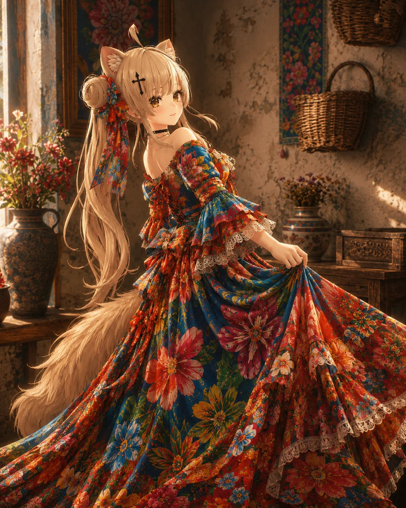

**Category:** Brazilian Northeastern Folk Art · **Tags:** `chita-nordestina` `folk-fashion` `editorial` `textile` `floral` `nordeste` `cotton` `style-translation`

**📋 Prompt:**

```
create image:

Use the attached character ONLY as identity reference (face, hairstyle silhouette, colors, accessories, ears, tail, personality essence, and recognizable visual traits).

Transform the character into an elegant Brazilian folk-fashion editorial entirely inspired by authentic Chita Nordestina textile aesthetics.

IMPORTANT:
The focus is exclusively on the beauty of Chita fabric culture and handcrafted Brazilian floral textile fashion.

DO NOT include:
- Festa Junina decorations
- bonfires
- paper flags
- fireworks
- straw hats
- quadrilha dancing
- carnival aesthetics
- festival scenes

The image must feel like a sophisticated Brazilian textile-fashion portrait rooted in authentic popular fabric artistry.

Character redesign:
- fully redesign the outfit using authentic Chita Nordestina aesthetics
- oversized tropical floral prints
- vibrant saturated cotton fabrics
- handcrafted Brazilian folk-fashion styling
- layered flowing skirts and sleeves
- decorative ribbon details
- elegant rural-inspired silhouette
- colorful ornamental textile combinations
- floral maximalism
- handcrafted textile richness
- traditional Brazilian popular fabric aesthetics

Dress design:
- dramatic flowing Chita dress
- large-scale floral repetition
- colorful layered fabrics
- visible cotton texture
- handcrafted tailoring feel
- decorative lace trims
- stitched textile details
- soft fabric folds
- elegant folkloric movement
- museum-quality textile realism

Facial expression and emotion:
- calm and poetic expression
- soft nostalgic gaze
- subtle warm smile
- delicate emotional warmth
- serene folkloric elegance
- gentle contemplative eyes
- peaceful and graceful mood
- expressive but restrained emotion
- natural relaxed facial muscles
- elegant editorial fashion presence
- slight blush from warm sunlight
- emotionally soft and inviting atmosphere

Pose and body language:
- elegant relaxed fashion pose
- natural folkloric grace
- flowing fabric movement
- gentle body curves
- subtle movement in the skirt and sleeves
- calm posture instead of energetic dancing
- soft artisanal femininity
- NEVER use mannequin poses
- NEVER use T-pose or A-pose

Scene:
- rustic handcrafted Brazilian interior
- aged painted walls
- warm countryside atmosphere
- subtle artisan setting
- soft natural window light
- minimal environmental distraction
- focus on textile beauty and silhouette

Composition:
- cinematic folk-fashion editorial framing
- emphasis on fabric movement and dress silhouette
- elegant visual balance
- ornamental textile composition
- character centered as wearable folk-art
- layered textile richness dominating the frame

Texture and materials:
- realistic cotton fabric realism
- visible woven textile structure
- handcrafted stitching
- layered fabric depth
- tactile artisan quality
- authentic Chita material realism
- soft natural lighting interacting with cloth fibers

Color palette:
- strong reds
- deep blues
- warm yellows
- vibrant greens
- oranges
- saturated pinks
- warm Brazilian countryside harmony
- maximalist floral color rhythm

Rendering style:
- ultra detailed folk-fashion illustration
- cinematic editorial lighting
- soft artisanal atmosphere
- painterly textile realism
- handcrafted visual richness
- elegant Brazilian folk-art fashion photography
- natural fabric physics
- highly detailed floral textile rendering
- warm cinematic shadows
- soft depth of field

Mood:
- elegant
- warm
- folkloric
- poetic
- decorative
- handcrafted
- vibrant
- emotionally soft
- culturally authentic

Avoid:
- glossy CGI look
- cyberpunk
- modern haute couture
- anime idol styling
- minimalism
- exaggerated expressions
- comedic expressions
- energetic dance poses
- festival iconography

Ultra detailed Chita Nordestina fashion masterpiece, authentic Brazilian floral textile realism, handcrafted folk-fashion editorial aesthetic, museum-quality Brazilian popular fabric artistry, elegant emotional warmth, poetic folkloric fashion portrait.
```

**📎 Requires:** An attached reference image — identity preserved through facial essence, hair, ears/tail; outfit fully reinterpreted as Chita Nordestina editorial fashion.

**💡 Why it works:** The most interesting structural choice here is the *explicit "DO NOT include" block* at the top, listing all the obvious Festa Junina associations (bonfires, paper flags, fireworks, straw hats, quadrilha). Without that block, the model conflates Chita fabric with Festa Junina costume by default because they share cultural overlap. By forbidding the festival iconography upfront, the prompt redirects the model toward *editorial fashion* — Chita as a textile tradition standing on its own. The line `"calm posture instead of energetic dancing"` reinforces this redirection. The dress design block emphasizes "large-scale floral repetition" + "visible cotton texture" which are the two visual signatures that distinguish authentic Chita from generic floral prints. The "Avoid" block targeting `modern haute couture` is doing important work: it prevents the model from rendering a polished runway version that loses the *handcrafted popular-fabric* identity.

**🔧 Variations:** swap `rustic Brazilian interior` for `colonial Brazilian courtyard with tropical foliage` for an outdoor editorial; change `large-scale floral repetition` to `medium-scale floral mosaic` for a more refined patterning; replace `cotton` with `linen-cotton blend with starched finish` for a more formal textile feel; tighten the palette to `red + indigo + cream only` for a more disciplined editorial composition.

---

#### Public Bronze Statue at Brazilian Landmark (018)

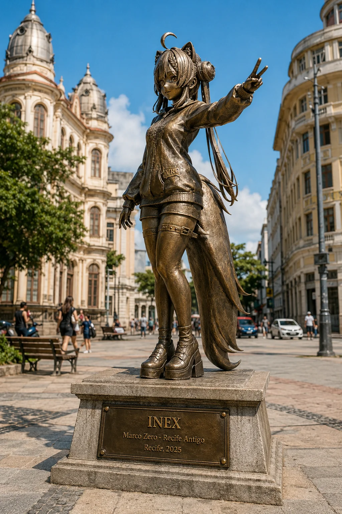

**Category:** Brazilian Northeastern Folk Art · **Tags:** `bronze-statue` `monument` `public-art` `sculpture` `marco-zero` `recife` `documentary` `urban-realism`

**📋 Prompt:**

```
create image
LOCAL="{argument name="location" default="no meio do marco zero no recife antigo"}" 
Status name="Inex"

Create a highly detailed cinematic photograph of a large bronze statue based on the attached character, permanently installed at LOCAL during a bright sunny day. The statue preserves the recognizable identity, facial structure, hairstyle silhouette, proportions, outfit design language, and iconic visual traits of the attached character while realistically adapted into monumental bronze sculpture form.

The statue stands prominently in the middle of LOCAL, integrated naturally into the surrounding urban environment with pedestrians, city architecture, vehicles, street details, trees, public benches, and environmental storytelling appropriate to the chosen place. The sculpture is mounted on a realistic stone pedestal with engraved metallic plaque and subtle weathering. If its T-pose or A-pose change it. 

The bronze material should feature realistic metallic reflections, oxidized patina variations, fine sculpted surface texture, visible craftsmanship marks, polished highlights on exposed edges, and believable sunlight interaction. Strong natural sunlight casts sharp realistic shadows across the ground and surrounding structures, creating a vivid midday atmosphere with blue sky and warm illumination.

The character's pose should feel iconic, dynamic, and commemorative, like an important cultural landmark or famous public monument. Maintain accurate anatomy and a coherent full-body sculpted structure. Avoid duplicated limbs, disconnected parts, floating elements, deformed hands, extra fingers, broken symmetry, warped anatomy, T-pose, A-pose, low-detail sculpture, toy-like appearance, melted bronze textures, or unrealistic proportions.

Ultra-realistic photography, monumental public art, cinematic composition, realistic urban scale, high-detail bronze material, physically based lighting, depth of field, sharp focus, authentic environmental integration, museum-quality sculpture realism, 8k detail.
```

**📎 Requires:** An attached reference image — identity preserved through facial structure, hairstyle, proportions, and outfit design language, translated into monumental bronze.

**💡 Why it works:** This prompt does something unusual — it uses a *templated variable system* at the top (`LOCAL="{argument...default="no meio do marco zero no recife antigo"}"`) that mimics the syntax of code/automation tools. Even though GPT Image 2 doesn't *execute* the template, the structure tells the model "this is a variable representing a location" and the model substitutes contextually. Naming `marco zero no recife antigo` (the actual zero-marker plaza in old Recife) as the default location grounds the prompt in a specific real-world setting the model has training data for. The two-paragraph structure works well: first paragraph establishes the *sculpture identity* (bronze, identity-preserving, monumental), second paragraph establishes *environmental integration* (pedestrians, architecture, pedestal with plaque). The detailed material spec ("oxidized patina variations, fine sculpted surface texture, visible craftsmanship marks") is what sells the bronze realism over generic metallic appearance. The long anti-failure list at the end (no duplicated limbs, no warped anatomy, no melted bronze, no toy-like appearance) catches the common sculpture-rendering bugs.

**🔧 Variations:** change `LOCAL` to other Brazilian landmarks for thematic variants — `Praça XV no Rio de Janeiro`, `Largo do Pelourinho em Salvador`, `Paulista esquina com Consolação em São Paulo`, `Praça da Sé em São Luís do Maranhão`; swap `bright sunny day` for `golden-hour sunset with long shadows` or `overcast moody afternoon` for different lighting moods; change `bronze` to `weathered marble` or `dark granite` for different sculpture materials with appropriate pedestal/finish changes; remove `pedestrians, vehicles` for a quiet contemplative variant.

---

### 🏙️ Liminal & Abstract Spaces

Prompts for environments that exist between architecture, memory, and dream — empty pools, abandoned stations, impossible malls, supermarkets at 3 AM, vacation destinations that feel remembered rather than visited. Each location has multiple prompts ranging from **pure liminal** (real-world architecture with unsettling emptiness) → **liminal+abstract** (subtle impossible geometry) → **abstract surreal** (architecture dissolves into dream logic).

**Important — these prompts work with OR without a character reference:**
- **With a reference image:** the character appears small, contemplative, integrated into the space (never looking at the camera).
- **Without a reference image:** the prompts include explicit anti-character rules — no people, no silhouettes, no shadows of figures. The emptiness *is* the subject.

> 💚 **Credits:** Several of these prompts reference the visual aesthetic of **Dr. Morro**'s VRChat liminal worlds, which inspired the entire category. Spaces designed for crowds, occupied by nobody — built between simulation and memory.

---

#### Liminal Pool — Glass Block Walls (Pure Liminal)

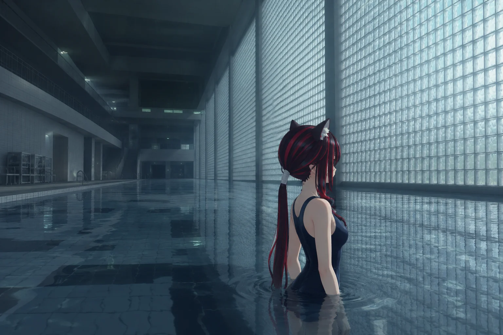

**Category:** Liminal & Abstract Spaces · **Tags:** `liminal` `pool` `pure-liminal` `architecture` `empty` `dreamlike` `optional-character` `dr-morro-inspired`

**📋 Prompt:**

```
CHARACTER RULES

If a character reference image is attached:

Use the attached image strictly as the character identity reference. Preserve exactly the same face, eyes, hairstyle, hair color, facial features, proportions, expression style, age appearance, species traits, skin tone, body shape, charm, and overall recognizable visual identity shown in the reference image. Do not redesign, replace, reinterpret, or significantly alter the character.

The character should appear naturally integrated into the environment.

If no character reference image is attached:

Do not generate any person, humanoid, anime character, animal, creature, silhouette, shadow figure, mannequin, statue, or human-like presence.

The scene must consist exclusively of architecture, lighting, atmosphere, water, reflections, environmental details, and empty space.

The feeling of absence should become a major part of the composition.

CHARACTER PRESENCE

When a character reference image is attached:
- include exactly one character
- no additional people
- no crowds
- no background figures
- no reflections showing additional people

When no character reference image is attached:
- absolutely no characters
- absolutely no people
- absolutely no humanoid forms
- absolutely no silhouettes
- absolutely no figures visible anywhere in the scene
```

**📎 Requires:** Optional reference image — the prompt branches based on whether a reference is attached.

**💡 Why it works:** This is the *base template* for the entire liminal series — a conditional character-handling block that gets reused across all 16 prompts in this category. The structural trick is the binary branching: explicit "if/then" rules for both reference-attached and reference-absent scenarios. Most prompts assume a character is present and the model fills in defaults; this one explicitly says *no defaults* when no reference exists. The `"feeling of absence should become a major part of the composition"` line is the entire liminal aesthetic in one sentence: empty space *is* the subject, not a missing element. The minimal scene description (just architecture / water / reflections / empty space) gives the model room to lean fully into the liminal-pool training data without competing details.

**🔧 Variations:** add specific architectural anchors (`"endless glass-block walls"`, `"oversized ceilings disappearing into atmospheric haze"`) for stronger liminal pool aesthetics; tighten to a specific time-of-day (`"pale blue-gray afternoon light"`, `"fluorescent-only night atmosphere"`); swap `pool` for `hot springs` / `bathhouse` / `aquarium` for related liminal aquatic spaces; combine with explicit Dr. Morro VRChat aesthetic anchors for stronger reference matching.

---

#### Liminal Pool — Contemplative Empty Bath (Liminal + Character POV)

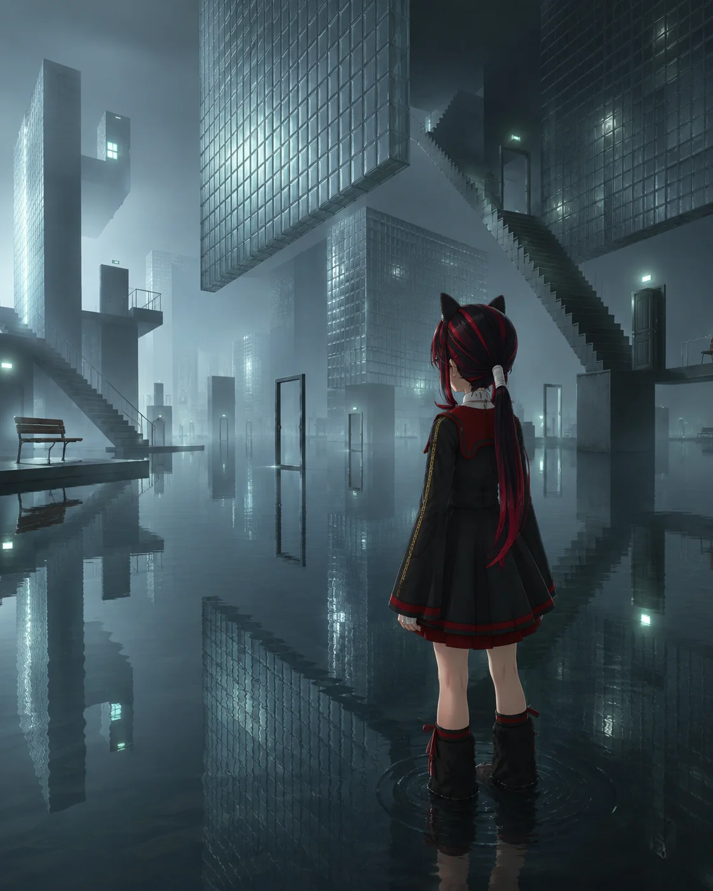

**Category:** Liminal & Abstract Spaces · **Tags:** `liminal` `pool` `liminal-abstract` `contemplative` `character-integration` `optional-character` `architecture` `dr-morro-inspired`

**📋 Prompt:**

```
[CHARACTER HANDLING]

If a character reference image is attached:

Use the attached image strictly as the character identity reference. Preserve exactly the same face, eyes, hairstyle, hair color, facial features, proportions, expression style, age appearance, species traits, skin tone, body shape, charm, and overall recognizable identity shown in the reference image. Do not redesign, replace, reinterpret, or significantly alter the character.

Place the character naturally within the environment. The character should appear contemplative, emotionally distant, and integrated into the scene rather than posed for the viewer.

The character should not look at the camera. Natural pose, relaxed body language, physically plausible anatomy, avoid T-pose, avoid A-pose.

If clothing is visible in the reference image, preserve the overall visual identity and impression of the original outfit unless otherwise specified.

If no character reference image is attached:

Do not generate any people, humanoids, animals, creatures, silhouettes, statues, mannequins, or character-like figures.

The image should focus entirely on the environment, architecture, atmosphere, scale, lighting, reflections, and spatial composition.

The scene must feel abandoned, empty, and completely devoid of visible life.
```

**📎 Requires:** Optional reference image — when attached, character is positioned as contemplative observer rather than focal subject.

**💡 Why it works:** This is the *character-integration variant* of the liminal pool base — pool001 is pure environment, pool002 adds explicit character behavior rules. The single highest-leverage directive is `"The character should not look at the camera"` — this single rule transforms the output from a portrait-in-environment to a person-existing-in-environment. The `"contemplative, emotionally distant, and integrated"` triplet defines the character's emotional register, suppressing default poses (smile-and-pose, action stance, dramatic looking-into-distance hero shot). The outfit-preservation clause `"unless otherwise specified"` is a small but useful escape valve — lets you override with a different outfit in a follow-up message without rewriting the whole prompt.

**🔧 Variations:** swap `contemplative` for `seated by the edge dangling feet in the water` for a more grounded pose; tighten emotional register to `quietly nostalgic` or `peacefully resigned` for different moods; pair with the pool003 architectural anchors below for a complete liminal pool scene; remove the outfit-preservation clause if you want to combine with an Outfit Variants prompt (e.g. liminal bikini variant).

---

#### Liminal Pool — Glass Block Cathedral (Full Liminal + Abstract)

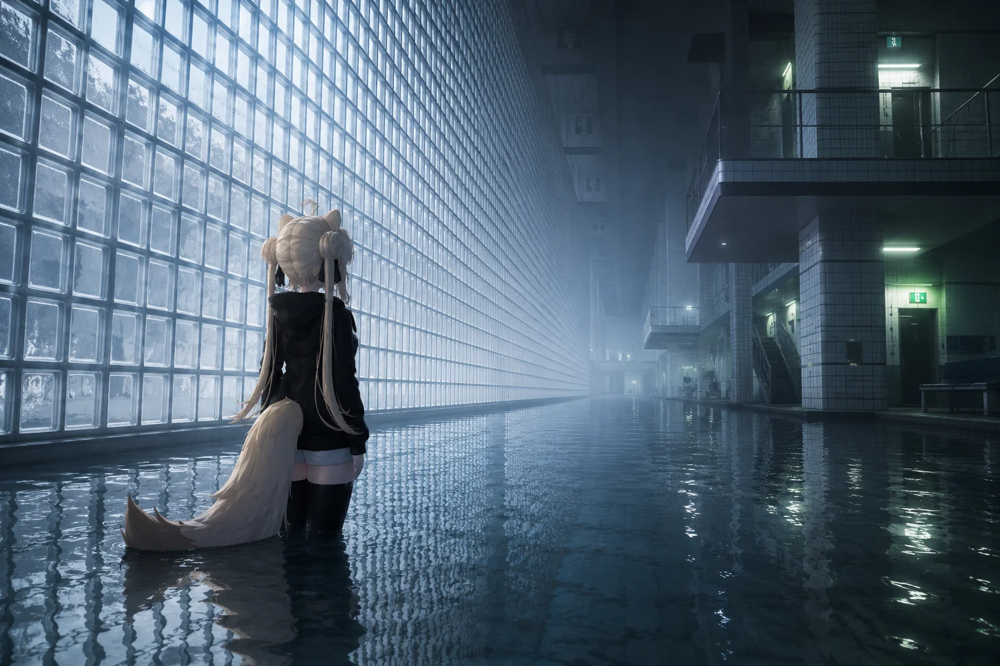

**Category:** Liminal & Abstract Spaces · **Tags:** `liminal` `pool` `abstract-surreal` `non-euclidean` `glass-blocks` `vrchat` `architecture` `optional-character` `dr-morro-inspired` `masterpiece`

**📋 Prompt:**

```
Character Handling (Conditional):

If a character reference image is attached, use the attached image strictly as the character identity reference. Preserve exactly the same face, eyes, hairstyle, hair color, facial features, proportions, expression style, age appearance, species traits, cat ears, skin tone, body shape, charm, and overall recognizable anime identity shown in the reference image. Do not redesign, replace, reinterpret, or alter the character.

Outfit (only when a character reference image is attached):

Preserve exactly the outfit shown in the reference image, including its design, silhouette, materials, colors, proportions, accessories, textures, and overall visual identity. Do not replace, redesign, reinterpret, modify, stylize, or substitute the outfit with alternative clothing.

If no character reference image is attached:

Do not generate any character, person, humanoid figure, silhouette, animal, creature, or visible living being.

The image must depict only the environment.

The scene should work equally well as:

- a solitary character exploring the environment (when a reference image exists)

or

- a completely empty liminal environment (when no reference image exists)

Scene:

An immense indoor aquatic structure detached from ordinary reality.

The environment should be slightly more abstract than a real swimming pool while still remaining believable as a physical place.

Strong inspiration from liminal-space environments similar to surreal VRChat exploration worlds, emphasizing dreamlike architecture, impossible spatial relationships, emotional solitude, and quiet existential atmosphere.

If a character is present:

The character stands alone in waist-deep water and quietly gazes toward a colossal wall of glass blocks stretching seemingly forever into the distance.

The character is not looking at the camera.

Natural posture, relaxed body language, contemplative mood, emotionally distant presence.

The pool appears abandoned yet carefully maintained.

Architecture:

- enormous glass-block walls extending beyond visible limits
- oversized ceilings disappearing into atmospheric haze
- repeating structural modules with subtle geometric variation
- observation decks suspended over vast empty space
- distant staircases connecting to unknown levels
- corridors that appear longer than physically possible
- elevated walkways fading into fog
- large voids between architectural elements
- subtle non-euclidean spatial impressions
- architectural repetition that feels dreamlike rather than mechanical

The environment should feel like a memory of a swimming pool rather than a perfectly realistic pool.

Emphasize the sensation of:

- being completely alone
- existing between places
- suspended reality
- nostalgia for a place never visited
- endless quiet
- dream logic
- architectural déjà vu
- impossible scale
- peaceful emptiness
- subtle unreality

The glass-block wall dominates the composition, generating overwhelming perspective lines and geometric rhythm.

The pool extends far beyond realistic proportions, gradually dissolving into blue-gray haze and darkness.

Additional liminal elements:

- distant changing-room entrances with lights still functioning
- silent emergency exit signs
- empty maintenance corridors
- unused pool equipment neatly arranged
- observation windows overlooking vacant rooms
- isolated benches with no occupants
- subtle reflections that create uncertainty about depth and scale
- repeating architectural patterns
- faintly visible spaces beyond the glass-block walls
- occasional impossible sightlines
- quiet ventilation shafts disappearing overhead

The environment should not feel ruined or decayed.

Instead, it should feel forgotten, preserved, and disconnected from time.

Very subtle signs of abandonment:

- slightly aged surfaces
- minor discoloration on tiles
- occasional closed-off passages
- long-unused facilities
- traces of former activity
- immaculate water despite lack of occupants

If a character is present:

- realistic interaction between body, clothing, and water
- subtle wet surfaces
- physically plausible water behavior
- natural reflections and refractions

Lighting:

Pale blue-gray daylight filtering through thousands of glass blocks.

Soft geometric illumination spreads across the water and architecture.

Cold ambient lighting mixed with faint greenish fluorescent tones.

No direct sunlight.

Atmosphere:

quiet,
eerie,
nostalgic,
melancholic,
surreal,
emotionally distant,
dreamlike,
tranquil,
liminal,
contemplative,
beautiful loneliness.

The water surface is highly reflective, creating fragmented reflections of architecture, lighting patterns, and impossible spatial relationships.

Composition:

Wide cinematic framing emphasizing overwhelming scale.

If a character is present:

- the character occupies only a small portion of the frame
- architecture remains the primary subject

If no character is present:

- emphasize emptiness and monumental scale
- architecture completely dominates the composition

Strong leading lines guide the eye into seemingly endless space.

Camera:

medium-wide shot,
slightly low angle,
architectural photography composition,
deep perspective,
cinematic framing.

Style:

masterpiece,
ultra-detailed anime illustration,
atmospheric environmental storytelling,
highly detailed architectural rendering,
realistic water simulation,
subtle volumetric haze,
premium cinematic artwork,
psychological liminal-space aesthetic,
surreal contemporary architecture,
VRChat dream-world atmosphere,
abstract institutional nostalgia.

Visual references:

liminal spaces,
dream pools,
surreal aquatic centers,
poolrooms,
VRChat exploration worlds,
impossible interiors,
abstract architectural photography,
silent institutional spaces,
forgotten public architecture,
dreamlike modernism,
Dr. Morro-inspired liminal environments.

Mood:

beautiful loneliness,
quiet isolation,
suspended reality,
dreamlike nostalgia,
uncanny familiarity,
peaceful emptiness,
soft existential melancholy.

Quality:

best quality,
masterpiece,
ultra detailed,
cinematic lighting,
realistic reflections,
environmental storytelling,
high resolution,
sharp focus,
immersive atmosphere.

If a character is present:

natural pose,
dynamic posture,
relaxed body language,
physically plausible anatomy,
avoid T-pose,
avoid A-pose.

Negative:

low quality,
crowded scene,
multiple people,
busy environment,
strong sunlight,
cheerful atmosphere,
warm colors,
modern resort feeling,
party atmosphere,
heavy decay,
ruins,
excessive damage,
clutter,
text,
logo,
watermark,
blurry face,
bad anatomy,
distorted limbs,
low detail,
noise,
film grain,
compression artifacts.

If no character reference image is attached:

person,
human,
humanoid,
character,
anime girl,
anime boy,
silhouette,
figure,
crowd,
people,
pedestrian,
swimmer,
lifeguard,
occupant,
animal,
creature,
living being.
```

**📎 Requires:** Optional reference image — full prompt covering both branches with detailed architecture, lighting, atmosphere, and negative prompts. **Edit `cat ears` in the identity block to match your reference's species traits.**

**💡 Why it works:** This is the *complete* liminal pool prompt — pool001 establishes the conditional structure, pool002 adds character behavior, and pool003 stacks the full environmental vocabulary on top. The architecture block does precise vocabulary work: `"non-euclidean spatial impressions"`, `"corridors that appear longer than physically possible"`, `"architectural déjà vu"` — these aren't generic "weird architecture" prompts, they're specific perceptual phenomena the model has training data for. Naming `Dr. Morro-inspired liminal environments` and `VRChat exploration worlds` as visual references anchors the aesthetic to a known underground subgenre. The `"memory of a swimming pool rather than a perfectly realistic pool"` line is structurally brilliant — it tells the model to render not a real pool but the *act of remembering one*, which is the entire liminal aesthetic compressed into one phrase. The `"forgotten, preserved, and disconnected from time"` framing prevents the model from drifting toward decay/horror defaults that empty buildings would normally trigger.

**🔧 Variations:** swap `glass-block walls` for `tiled mosaic walls in pale 70s green/beige` for a vintage public-pool variant; change `pale blue-gray daylight` to `late-night fluorescent only with deep blue water` for a nocturnal pool variant; remove the `Dr. Morro / VRChat` references and replace with `inspired by Andreas Gursky photography` for a more high-art architectural feel; tighten the spatial weirdness to one specific element (only impossible corridors, only suspended walkways) for cleaner non-euclidean reads; combine with the Curvy Brazilian Body modifier or any Outfit Variants prompt for liminal-pool-with-specific-styling combos.

---


#### Liminal Metro — Elevated Cloud Station (Pure Liminal)

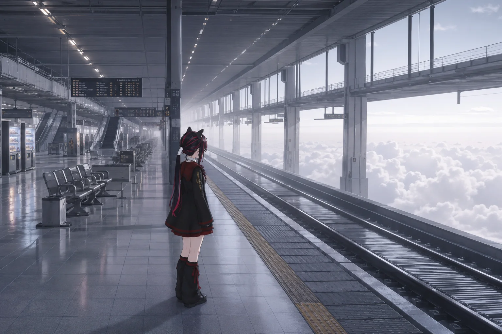

**Category:** Liminal & Abstract Spaces · **Tags:** `liminal` `metro` `station` `pure-liminal` `clouds` `architecture` `empty` `optional-character` `dr-morro-inspired`

**📋 Prompt:**

```
If a character reference image is provided:

Use the attached image strictly as the character identity reference. Preserve exactly the same face, eyes, hairstyle, hair color, facial features, proportions, expression style, age appearance, outfit impression, color palette, charm, and overall recognizable anime identity shown in the reference image. Do not redesign, replace, or reinterpret the character.

Preserve exactly the outfit shown in the reference image, including color, shape, proportions, material appearance, and overall design.

Include the character in the scene as a small figure within the environment.

If no character reference image is provided:

Do not create any character, person, silhouette, humanoid figure, reflection, shadow person, passenger, staff member, or living being.

Generate only the environment itself.

The scene must remain completely empty and abandoned.

An impossibly large elevated railway terminal suspended above an endless sea of clouds.

The station appears completely operational yet completely abandoned.

No trains.
No staff.
No announcements.
No passengers.

Only silence.

If a character is present:

The character stands near the platform edge, gazing toward distant tracks that disappear into dense white fog.

The character is not looking at the camera.

The architecture should evoke a powerful liminal-space atmosphere.

Environment:

- endless train platforms
- hundreds of identical empty benches
- departure boards frozen on outdated schedules
- escalators running endlessly without passengers
- rows of vending machines glowing softly
- empty ticket gates
- fluorescent ceiling lights stretching infinitely
- distant railway tracks vanishing into clouds
- impossible platform extensions
- oversized waiting areas
- glass walls overlooking nothing but sky

The station exists above the clouds.

Outside the windows there is no visible city.

Only an infinite bright overcast sky and vast cloud formations.

The viewer should feel uncertain whether this location exists in the future, the past, a dream, or an afterlife.

Atmosphere:

- profound solitude
- suspended time
- dreamlike nostalgia
- peaceful melancholy
- quiet anticipation
- waiting for something that never arrives
- familiar yet impossible

Lighting:

Soft overcast daylight.

Diffuse white illumination enters through gigantic floor-to-ceiling windows.

No direct sunlight.

No dramatic shadows.

Everything feels softly illuminated as though reality itself has been muted.

Composition:

Wide cinematic framing.

If a character is present:

The character occupies only a small portion of the scene.

The vast architecture dominates the image.

Strong perspective lines created by tracks, platform markings, ceiling lights, and rows of benches.

Camera:

Architectural photography style.

Medium-wide shot.

Eye-level perspective.

Deep depth and spatial scale.

Immense environmental scale.

Style:

Masterpiece.

Ultra-detailed anime illustration.

Premium environmental storytelling.

Photorealistic architecture.

Subtle atmospheric haze.

Dreamlike realism.

Liminal-space aesthetic.

High-detail reflections.

Beautiful cloud rendering.

Immense sense of scale.

Massive architectural volumes.

Quiet surrealism.

Mood:

A place where someone has been waiting for years.

A destination that may not exist.

A station between realities.

The feeling of arriving somewhere important and finding nobody there.

A location suspended outside normal time.

Quality:

best quality,
masterpiece,
ultra detailed,
cinematic lighting,
environmental storytelling,
realistic architecture,
immersive atmosphere,
high resolution,
sharp focus

Negative:

crowd,
multiple people,
busy station,
staff,
passengers,
background characters,
silhouettes,
human figures,
strangers,
advertisements everywhere,
modern commercial clutter,
party atmosphere,
strong sunlight,
warm tropical feeling,
text,
logo,
watermark,
low quality,
blurry,
bad anatomy,
distorted limbs,
noise,
film grain,
compression artifacts,

If no character reference image is provided also exclude:

person,
people,
human,
anime girl,
anime boy,
figure,
traveler,
commuter,
staff member,
shadow person,
reflection of a person,
silhouette,
portrait,
human presence
```

**📎 Requires:** Optional reference image — fully self-contained prompt for both branches.

**💡 Why it works:** The single strongest creative choice is positioning the station *above the clouds* — this immediately solves the "where is the city?" problem that empty stations normally have. By making the exterior literally just sky and clouds, the prompt removes any anchoring detail that would tie the location to a specific place or time, pushing the output deep into liminal territory. The `"completely operational yet completely abandoned"` paradox is the prompt's emotional thesis statement — every other detail (frozen departure boards, escalators running without passengers, vending machines glowing) reinforces this single contradiction. The mood block (`"a place where someone has been waiting for years"`, `"a destination that may not exist"`) gives the model emotional anchors that aren't just architectural — they tell the model what *feeling* to render, which is what separates good liminal output from generic empty architecture.

**🔧 Variations:** swap `elevated cloud station` for `underground station with no surface exit` for an opposite spatial inversion (buried instead of suspended); change `overcast white sky` to `eternal sunset with no horizon` for a more emotionally warm liminal variant; replace `train platforms` with `bus terminal` / `ferry dock` / `monorail station` for related transit liminals; tighten the era (`1980s Japanese commuter station preserved perfectly`, `1960s American train station with original signage`) for period-specific liminal aesthetics.

---

#### Liminal Metro — Impossible Transit Cathedral (Liminal + Abstract)

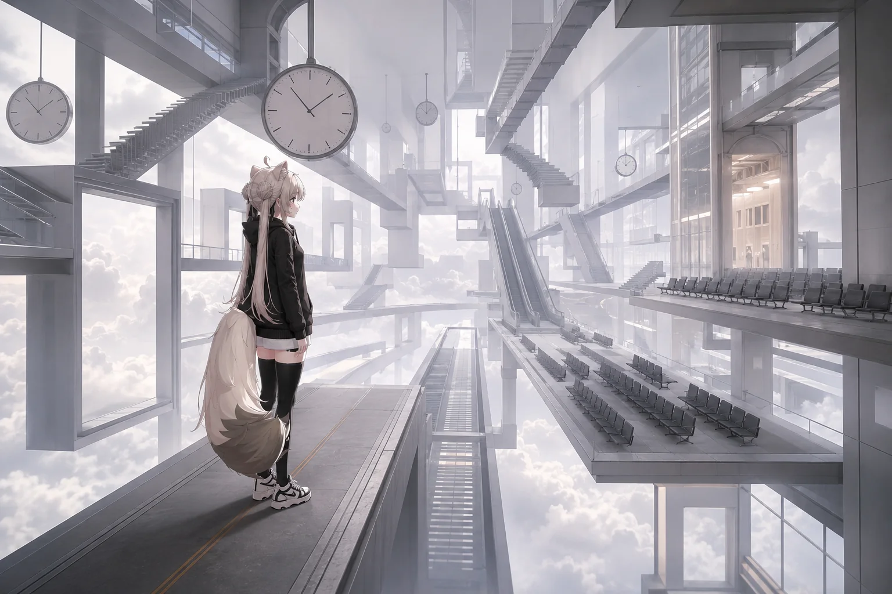

**Category:** Liminal & Abstract Spaces · **Tags:** `liminal` `metro` `transit` `liminal-abstract` `cathedral` `impossible-architecture` `non-euclidean` `optional-character` `dr-morro-inspired`

**📋 Prompt:**

```
CHARACTER HANDLING:

If a character reference image is provided:

Use the attached image strictly as the character identity reference. Preserve exactly the same face, eyes, hairstyle, hair color, facial features, proportions, expression style, age appearance, outfit impression, color palette, charm, and overall recognizable identity shown in the reference image.

Do not redesign, replace, reinterpret, or alter the character.

Preserve exactly the outfit shown in the reference image, including color, shape, proportions, material appearance, and overall design.

Include only this character in the scene.

The character occupies only a small portion of the composition.

The character stands naturally and is not looking at the camera.

Use a natural, relaxed pose. Avoid T-pose, A-pose, symmetrical idle poses, mannequin posture, or stiff presentation poses.

If no character reference image is provided:

Do not generate any person, humanoid, animal, creature, robot, mannequin, statue, silhouette, shadow figure, or identifiable character.

The scene must be completely empty.

Focus entirely on architecture, atmosphere, scale, and environmental storytelling.

The feeling of absence should become even stronger due to the complete lack of occupants.

SCENE:

A vast impossible transit structure that does not clearly belong to any known form of transportation.

The architecture feels simultaneously like a railway station, an airport terminal, a museum, a cathedral, and a dream.

The environment is highly abstract, surreal, and strongly liminal.

There is no clear destination.

There are no signs that can be understood.

No staff.

No travelers.

No vehicles.

No announcements.

Only silence.

A narrow platform is suspended above an endless white void.

If a character is present, the character stands motionless on the platform, gazing into the distance.

If no character is present, the platform remains completely empty.

ENVIRONMENT:

- floating platforms disconnected from one another
- staircases leading nowhere
- escalators ascending into fog
- endless rows of identical empty seats
- giant suspended clocks frozen at different times
- impossible bridges crossing empty space
- doorways opening onto clouds
- illuminated corridors visible in the distance but impossible to reach
- vast floor-to-ceiling windows overlooking only sky
- geometric structures repeating infinitely
- suspended walkways fading into white haze
- abandoned information boards displaying unreadable symbols
- large empty halls stretching beyond visibility
- architecture that subtly contradicts physical reality

Outside every opening there is only an infinite bright overcast sky.

No city.

No landscape.

No horizon.

Only clouds, fog, light, and emptiness.

The viewer should feel uncertain whether this location exists in a dream, a memory, an afterlife, a forgotten future, or outside reality entirely.

ATMOSPHERE:

- profound solitude
- suspended time
- dreamlike nostalgia
- existential calm
- quiet anticipation
- familiar yet impossible
- peaceful unreality
- the feeling of waiting for something that will never arrive

LIGHTING:

Soft overcast daylight.

Diffuse white illumination enters from every direction.

No visible light source.

No direct sunlight.

No dramatic shadows.

The entire scene feels softly illuminated as though reality itself has been muted.

COMPOSITION:

Wide cinematic framing.

If a character is present, the character occupies only a small portion of the image.

The architecture always dominates the composition.

Strong perspective lines created by platforms, staircases, corridors, bridges, windows, and repeating geometric forms.

Immense negative space.

CAMERA:

Architectural photography style.

Medium-wide or wide architectural shot.

Eye-level perspective.

Deep depth and enormous spatial scale.

STYLE:

Masterpiece.

Ultra-detailed anime illustration.

Premium environmental storytelling.

Photorealistic architecture.

Surreal architectural realism.

Dreamlike liminal-space aesthetic.

Subtle atmospheric haze.

Beautiful cloud rendering.

Infinite sense of scale.

Impossible geometry.

Elegant visual minimalism.

Strong Dr. Morro-inspired liminal atmosphere.

MOOD:

A place between destinations.

A structure built for a purpose that has been forgotten.

A location that feels deeply familiar despite never having existed.

The sensation of arriving somewhere important and realizing that nobody has ever been there.

QUALITY:

best quality,
masterpiece,
ultra detailed,
cinematic lighting,
environmental storytelling,
realistic architecture,
surreal architecture,
immersive atmosphere,
high resolution,
sharp focus

NEGATIVE:

crowd,
multiple people,
extra characters,
busy environment,
advertisements everywhere,
commercial clutter,
vehicles,
trains,
airplanes,
modern city skyline,
strong sunlight,
warm tropical feeling,
text,
readable signs,
logo,
watermark,
low quality,
blurry face,
bad anatomy,
distorted limbs,
noise,
film grain,
compression artifacts,
T-pose,
A-pose,
stiff pose,
mannequin pose,
presentation pose
```

**📎 Requires:** Optional reference image — works equally well as character-in-space or empty environment.

**💡 Why it works:** This prompt levels up from metro001 by *deliberately removing transit specificity*. The line `"The architecture feels simultaneously like a railway station, an airport terminal, a museum, a cathedral, and a dream"` is a structural inversion — instead of asking the model to render a specific space, it asks the model to render the *idea of transit space without a clear referent*. That ambiguity is what produces the strongest liminal output. The detail `"abandoned information boards displaying unreadable symbols"` is doing important work: unreadable signs avoid the model's tendency to invent plausible-but-wrong text, while still conveying institutional context. `"Staircases leading nowhere"` and `"doorways opening onto clouds"` give the model concrete impossibility anchors — much more effective than abstract `"impossible architecture"` because the model can render specific impossible elements but struggles with vague ones.

**🔧 Variations:** add specific architectural mashups (`"the proportions of a Soviet metro station crossed with a Gothic cathedral"`) for stronger style-anchor pulls; swap `endless white void` for `endless ocean visible through windows` for an aquatic liminal variant; change `unreadable symbols` to `signs in a fictional alphabet that resembles Devanagari/Cyrillic/kanji` for more visually rich unreadability; tighten `floating platforms` to `single suspended platform with no visible support` for a more focused composition.

---

#### Liminal Metro — Frozen Cloud Station (Abstract Surreal)

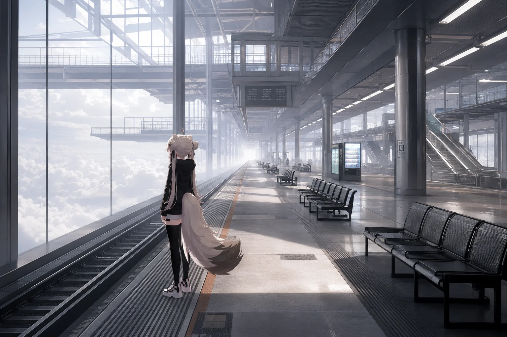

**Category:** Liminal & Abstract Spaces · **Tags:** `liminal` `metro` `station` `abstract-surreal` `vrchat` `dreamlike` `optional-character` `dr-morro-inspired` `masterpiece`

**📋 Prompt:**

```
If a character reference image is provided:

Use the attached image strictly as the character identity reference.

Preserve exactly the same face, eyes, hairstyle, hair color, facial features, proportions, expression style, age appearance, species traits, outfit impression, color palette, charm, and overall recognizable anime identity shown in the reference image.

Do not redesign, replace, reinterpret, or alter the character in any way.

Preserve exactly the outfit shown in the reference image, including color, shape, proportions, material appearance, and overall design.

The character stands alone inside the environment described below.

If no character reference image is provided:

Do not generate any character, person, silhouette, humanoid figure, animal, creature, robot, mannequin, statue, or visible living being.

The image should depict only the environment itself.

The architecture, atmosphere, scale, and environmental storytelling become the sole focus of the composition.

Scene:

An impossibly large elevated railway terminal suspended above an endless sea of clouds.

The station appears fully maintained and technically operational, yet subtly disconnected from reality.

No trains.
No staff.
No announcements.
No passengers.

Only silence.

If a character is present:

The character stands near the platform edge, gazing toward distant tracks that gradually dissolve into pale white fog.

The character is not looking at the camera.

The character should appear naturally integrated into the environment.

The architecture should evoke a liminal-space atmosphere inspired by the surreal environmental design often seen in VRChat worlds by Dr. Morro: familiar transportation infrastructure that slowly becomes impossible upon closer inspection.

Environment:

- endless train platforms
- repeating rows of identical empty benches
- departure boards displaying outdated schedules frozen in time
- escalators moving endlessly without passengers
- softly glowing vending machines
- empty ticket gates leading nowhere
- fluorescent ceiling lights extending far beyond visible limits
- railway tracks fading into clouds
- subtle impossible platform extensions
- oversized waiting areas with unusual proportions
- glass walls overlooking only sky
- corridors that appear to connect back into themselves
- distant stairways leading to platforms that cannot physically exist
- elevated walkways suspended in open air
- occasional architectural elements repeated where they should not be

The station exists above the clouds.

Outside the windows there is no visible city.

Only an infinite bright overcast sky and vast cloud formations.

Reality feels slightly unstable.

Not overtly supernatural.

Just quietly wrong.

The viewer should feel uncertain whether this location exists in the future, the past, a dream, a memory, or somewhere between realities.

Atmosphere:

- profound solitude
- suspended time
- dreamlike nostalgia
- peaceful melancholy
- quiet anticipation
- subtle unreality
- familiar yet impossible
- the sensation of waiting for a train that may never arrive

Lighting:

Soft overcast daylight.

Diffuse white illumination enters through gigantic floor-to-ceiling windows.

No direct sunlight.

No dramatic shadows.

Everything feels softly illuminated as though reality itself has been muted.

Slight atmospheric haze.

Soft bloom around distant lights.

Composition:

If a character is present:

- wide cinematic framing
- the character occupies only a small portion of the image
- the immense architecture dominates the scene
- strong perspective lines created by tracks, platform markings, ceiling lights, benches, corridors, and elevated walkways

If no character is present:

- wide cinematic environmental shot
- the station itself becomes the subject
- emphasize emptiness, scale, perspective, and spatial mystery
- strong perspective lines created by tracks, platform markings, ceiling lights, benches, corridors, and elevated walkways
- vast uninterrupted views of the architecture
- no implied human presence

Camera:

Architectural photography style.

Medium-wide shot.

Eye-level perspective.

Deep depth and immense spatial scale.

Style:

Masterpiece.

Ultra-detailed anime illustration.

Premium environmental storytelling.

Photorealistic architecture.

Subtle surrealism.

Dreamlike realism.

High-detail reflections.

Beautiful cloud rendering.

Immense sense of scale.

Liminal-space aesthetic.

Dr. Morro-inspired environmental design.

Slightly abstract spatial logic.

Elegant environmental mystery.

Mood:

A place where someone has been waiting for years.

A destination that may not exist.

A station between realities.

The feeling of arriving somewhere important and finding nobody there.

The feeling that the station remembers people who are no longer present.

Character presence rules:

- If a character reference image exists, generate exactly one character based on that reference
- If no character reference image exists, generate no characters whatsoever
- No background people
- No distant silhouettes
- No reflections containing people
- No shadows implying unseen people
- No crowds

Quality:

best quality, masterpiece, ultra detailed, cinematic lighting, environmental storytelling, realistic architecture, immersive atmosphere, high resolution, sharp focus

Negative:

crowd, multiple people, busy station, advertisements everywhere, modern commercial clutter, party atmosphere, strong sunlight, warm tropical feeling, horror, monsters, ruins, heavy decay, excessive vegetation, graffiti, post-apocalyptic destruction, text, logo, watermark, low quality, blurry face, bad anatomy, distorted limbs, noise, film grain, compression artifacts, T-pose, A-pose
```

**📎 Requires:** Optional reference image — most refined version of the metro series.

**💡 Why it works:** This is the *evolved* version of metro001 — same base scenario, but the language becomes more psychologically specific. Key upgrade: `"Reality feels slightly unstable. Not overtly supernatural. Just quietly wrong."` — three lines that perfectly calibrate the unreality dial. Too overt and it becomes horror; too subtle and it becomes generic empty. The phrase `"quietly wrong"` is the entire abstract-surreal liminal genre in two words. Another structural improvement: the architecture block now includes self-referential impossibilities (`"corridors that appear to connect back into themselves"`, `"distant stairways leading to platforms that cannot physically exist"`) instead of just absent details. The closing mood line `"the feeling that the station remembers people who are no longer present"` adds an unusual temporal-emotional dimension — the space itself has memory. This is what separates this prompt from metro001's pure liminal.

**🔧 Variations:** swap "Dr. Morro VRChat" reference for `"inspired by Petit Imp's poolrooms aesthetic"` or `"backrooms level 0 visual logic"` for adjacent subgenre anchors; change `"the station remembers people who are no longer present"` to `"the station is patiently waiting for occupants who haven't been born yet"` for a future-oriented liminal variant; remove the cloud anchor and place the station `"deep underground with no exit"` for a claustrophobic liminal variant; tighten the unreality to one specific impossible element for cleaner composition.

---

#### Liminal Supermarket — Endless 24-Hour Aisles (Pure Liminal)

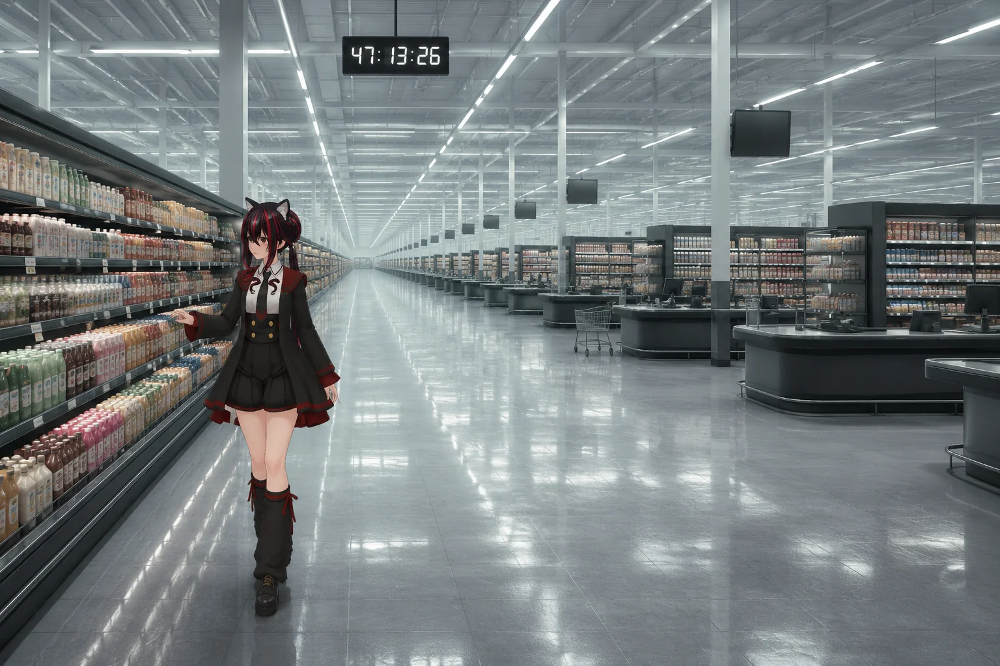

**Category:** Liminal & Abstract Spaces · **Tags:** `liminal` `supermarket` `retail` `pure-liminal` `fluorescent` `3am-aesthetic` `endless-aisles` `optional-character` `dr-morro-inspired`

**📋 Prompt:**

```
IF a character reference image is provided:

Use the attached image strictly as the character identity reference. Preserve exactly the same face, eyes, hairstyle, hair color, facial features, proportions, expression style, age appearance, outfit impression, color palette, charm, and overall recognizable anime identity shown in the reference image. Do not redesign, replace, or reinterpret the character.

Outfit: preserve exactly the outfit shown in the attached reference image, including color, shape, proportions, material appearance, and overall design.

The character stands alone inside the environment described below.

The character is quietly walking through an endless aisle, lightly touching the edge of a shelf while looking toward the far distance.

She is not looking at the camera.

The character occupies only a relatively small portion of the overall composition.

IF no character reference image is provided:

Do not create any characters, people, silhouettes, reflections of people, employees, customers, mannequins, shadows suggesting people, or humanoid figures of any kind.

Generate only the environment described below.

The scene must remain completely empty.

The scene takes place inside a gigantic 24-hour supermarket that feels frozen outside of time.

The store appears perfectly clean, fully stocked, brightly illuminated, and completely empty.

No employees.

No customers.

No sounds except the distant hum of fluorescent lights.

The supermarket should feel impossibly large.

The aisles continue far beyond visibility.

Every row appears almost identical.

The architecture creates uncertainty about whether the building ever ends.

Environment:

- endless grocery aisles
- fully stocked shelves
- bright fluorescent lighting
- polished reflective floors
- abandoned checkout lanes
- empty shopping carts
- frozen digital clocks displaying strange times
- distant refrigerators softly glowing
- repeating signs hanging from the ceiling
- long empty corridors between shelves
- oversized warehouse-like spaces
- unused customer service desks

The store should feel simultaneously comforting and unsettling.

Atmosphere:

- profound loneliness
- late-night nostalgia
- suspended reality
- dreamlike familiarity
- quiet emptiness
- strange comfort
- forgotten memories
- the feeling of being the last person awake

Lighting:

Bright white fluorescent lighting.

No dramatic shadows.

Uniform illumination across the entire scene.

Subtle reflections on polished floors.

A slightly unreal cleanliness.

Composition:

Wide-angle perspective.

Long aisles create powerful leading lines.

The immense empty environment dominates the image.

IF a character is present, the character occupies only a small portion of the frame.

The architecture and scale should remain the primary visual focus.

Camera:

Architectural photography.

Slightly low eye-level angle.

Deep perspective.

Strong sense of depth.

The image should emphasize the overwhelming scale of the supermarket.

Style:

Masterpiece.

Ultra-detailed anime illustration.

Photorealistic environment.

Premium atmospheric artwork.

Hyper-detailed retail architecture.

Dreamlike realism.

Liminal-space aesthetic.

Mood:

A place that should be busy but isn't.

A familiar location transformed into something uncanny.

The sensation of wandering through a memory at 3 AM.

A supermarket that may have existed only in a dream.

The environment should feel both comforting and unsettling at the same time.

Quality:

best quality,
masterpiece,
ultra detailed,
cinematic atmosphere,
realistic lighting,
environmental storytelling,
immersive scale,
high resolution,
sharp focus

Negative:

crowd,
employees,
customers,
busy environment,
shopping activity,
sunlight,
outdoor scenery,
clutter,
graffiti,
damaged shelves,
horror monsters,
jumpscare elements,
text,
logo,
watermark,
low quality,
blurry face,
bad anatomy,
noise,
film grain,
compression artifacts

Additional negative when NO reference image is provided:

person,
human,
girl,
boy,
woman,
man,
character,
anime character,
humanoid,
silhouette,
shadow person,
customer,
employee,
shopper,
reflection of a person,
mannequin,
NPC,
figure,
portrait,
people in distance

Additional requirements:

The supermarket must feel endless.

The store should appear fully operational but abandoned.

The architecture should repeat in ways that create uncertainty about scale and distance.

The image should evoke liminal-space photography, late-night nostalgia, suspended reality, and dreamlike familiarity.

No T-pose.

No A-pose.

Natural body posture if a character is present.
```

**📎 Requires:** Optional reference image — character walks through aisle when attached.

**💡 Why it works:** The supermarket is one of the most culturally loaded liminal locations because *everyone has been in a 24-hour store at 3 AM*, and that experience already feels slightly liminal in real life. The prompt leverages this with `"the sensation of wandering through a memory at 3 AM"` — naming the exact emotional trigger most viewers will recognize. The detail `"frozen digital clocks displaying strange times"` is doing important work: it implies time has stopped without rendering literal stopped clocks (which would be too on-the-nose). The directive `"the store should feel simultaneously comforting and unsettling"` is the key emotional calibration — supermarkets normally read as either *banal* or *horror* (think: backrooms supermarket levels), but the comfort-unease blend is the genuine liminal register. The character-action specificity (`"lightly touching the edge of a shelf"`) is unusually concrete — it gives the model a precise gesture instead of a generic "walking pose," which produces more natural-looking results.

**🔧 Variations:** swap `24-hour supermarket` for `Brazilian hipermercado` (Carrefour/Atacadão aesthetic) for a specific cultural variant; change `bright fluorescent` to `flickering aging fluorescent with some bulbs out` for a slightly more decayed liminal feel; replace `polished reflective floors` with `worn vinyl floor tiles with subtle imperfections` for a more realistic everyday supermarket aesthetic; tighten the scene to a specific aisle (`"endless cereal aisle"`, `"endless frozen foods section with cold haze rolling out of open freezers"`) for stronger atmospheric specificity.

---

#### Liminal Interior — Abstract Memory Hallways (Abstract Surreal)

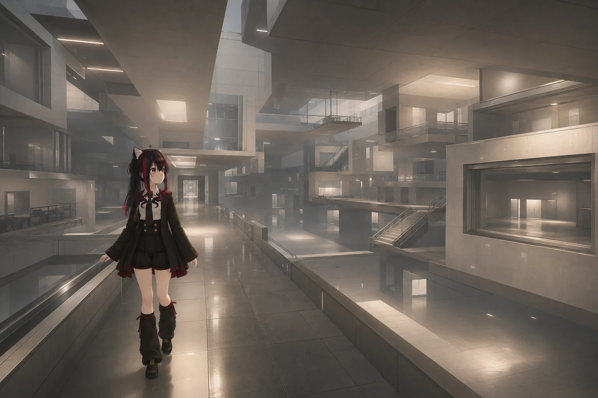

**Category:** Liminal & Abstract Spaces · **Tags:** `liminal` `interior` `abstract-surreal` `non-euclidean` `dreamcore` `memory-space` `optional-character` `hallways` `dr-morro-inspired`

**📋 Prompt:**

```
IF a character reference image is attached:

Use the attached image strictly as the character identity reference. Preserve exactly the same face, eyes, hairstyle, hair color, facial features, proportions, expression style, age appearance, outfit impression, color palette, charm, and overall recognizable anime identity shown in the reference image. Do not redesign, replace, or reinterpret the character.

Outfit: preserve exactly the outfit shown in the attached reference image, including color, shape, proportions, material appearance, and overall design.

The character stands alone inside an immense abstract interior that feels like a forgotten memory rather than a real place.

The character is quietly walking forward through the space, lightly brushing her fingertips against nearby structures while looking toward a distant point far ahead.

She is not looking at the camera.

The character occupies a relatively small portion of the frame.

The environment dominates the composition.

IF no character reference image is attached:

Do not generate any character, person, silhouette, humanoid figure, animal, creature, robot, mannequin, shadow figure, statue, reflection of a person, or any visible living being.

The scene must contain only the environment.

The environment is the sole subject of the image.

Focus entirely on architecture, atmosphere, scale, lighting, composition, and environmental storytelling.

The scene takes place inside an immense abstract interior that feels like a forgotten memory rather than a real place.

The environment cannot be clearly identified as any specific location.

It resembles fragments of familiar spaces merged together into something impossible.

The environment should feel infinite.

The architecture repeats in ways that do not make sense.

Hallways connect to open rooms.

Open rooms connect to elevated platforms.

Platforms connect to empty corridors.

The space seems to continue forever beyond visibility.

Environment:

- endless repeating hallways
- oversized empty rooms
- floating ceiling panels
- isolated fluorescent lights
- distant doorways leading nowhere
- elevated walkways suspended in darkness
- repeating geometric structures
- large empty observation windows
- impossible architectural transitions
- blank walls interrupted by occasional signs
- abandoned waiting areas
- silent escalators leading into empty space
- long polished corridors disappearing into fog
- subtle reflections on smooth floors
- strange architectural symmetry

The environment should feel carefully maintained, clean, and functional, yet completely devoid of purpose.

No visible damage.

No graffiti.

No dirt.

No obvious decay.

Only the feeling that nobody has been here for a very long time.

Atmosphere:

- profound loneliness
- suspended reality
- dreamlike familiarity
- quiet emptiness
- impossible scale
- forgotten memories
- gentle melancholy
- strange comfort
- nostalgic uncertainty
- the sensation of wandering inside a dream that almost makes sense

Lighting:

Bright fluorescent lighting mixed with large areas of soft ambient illumination.

No dramatic shadows.

Uniform light distribution.

Occasional pools of light floating in otherwise empty spaces.

Subtle atmospheric haze.

Composition:

Wide-angle perspective.

Strong leading lines.

Large negative space.

The architecture itself becomes the primary subject.

IF a character is present:

The character occupies only a small portion of the frame.

The environment remains the dominant visual element.

Camera:

Architectural photography.

Slightly low eye-level angle.

Deep perspective.

Extreme sense of scale.

Strong depth.

Style:

Masterpiece.

Ultra-detailed anime illustration.

Photorealistic environment.

Dreamlike realism.

Premium atmospheric artwork.

Hyper-detailed architecture.

Abstract liminal-space aesthetic.

Surreal environmental storytelling.

Mood:

A place that feels familiar but cannot be remembered.

A location that may never have existed.

The sensation of walking through fragments of forgotten dreams.

A comforting yet deeply uncanny space suspended outside normal reality.

Quality:

best quality,
masterpiece,
ultra detailed,
cinematic atmosphere,
realistic lighting,
environmental storytelling,
immersive scale,
high resolution,
sharp focus

IF a character is present:

Natural dynamic pose.

Relaxed body language.

Realistic weight distribution.

Walking motion.

No T-pose.

No A-pose.

Negative:

crowd,
people,
employees,
customers,
busy environment,
outdoor scenery,
sunlight,
vehicles,
horror monsters,
jumpscare elements,
gore,
clutter,
damaged architecture,
graffiti,
excessive decay,
text,
logo,
watermark,
low quality,
blurry face,
bad anatomy,
noise,
film grain,
compression artifacts

IF no character reference image is attached:

additional negative:
character,
person,
human,
girl,
boy,
woman,
man,
anime character,
humanoid,
silhouette,
figure,
creature,
NPC,
pedestrian,
traveler,
wanderer,
portrait,
face,
body,
hands,
eyes
```

**📎 Requires:** Optional reference image — most abstract version, character has specific walking-and-touching gesture when present.

**💡 Why it works:** This is the most *fully abstract* liminal prompt in the series — it deliberately refuses to identify the location, instead describing it as `"fragments of familiar spaces merged together into something impossible"`. That refusal is the entire trick. By telling the model what the space is *not* (not a hallway, not a hotel, not a mall) while describing universal architectural elements, the prompt forces a synthesis output rather than a category match. The genius detail is `"hallways connect to open rooms. Open rooms connect to elevated platforms. Platforms connect to empty corridors"` — this rhythm tells the model the *transitions themselves* are the dreamlike quality, not any single space. The mood anchor `"a place that feels familiar but cannot be remembered"` captures something universally recognizable: déjà vu without referent. The character gesture (`"lightly brushing her fingertips against nearby structures"`) is poetic and specific — touch as a way of grounding in unstable space.

**🔧 Variations:** swap `bright fluorescent` for `dimly lit emergency lighting only` for a more ominous variant (carefully — this can push toward backrooms horror); change `silent escalators leading into empty space` to specific architectural cliché mashups (`escalators ending in walls`, `staircases that loop back on themselves`); replace `walking forward` with `seated on the floor staring at the ceiling` for a contemplative-stuck pose; combine this prompt with the metro001 cloud-window detail for a hybrid hallway-station liminal.

---


#### Liminal Hotel — Convention Center Hallways (Pure Liminal)

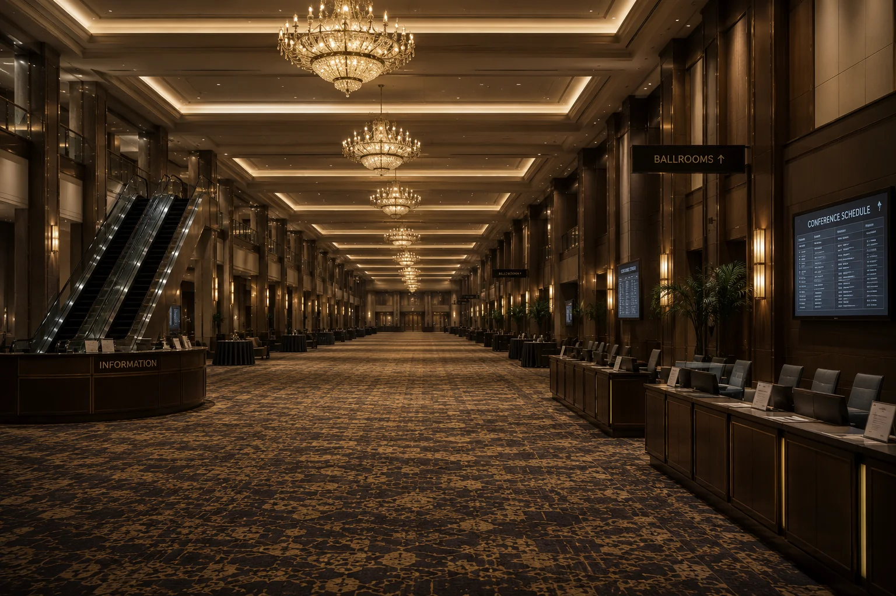

**Category:** Liminal & Abstract Spaces · **Tags:** `liminal` `hotel` `convention-center` `pure-liminal` `corporate-nostalgia` `endless-hallways` `optional-character` `dr-morro-inspired`

**📋 Prompt:**

```
CHARACTER HANDLING:

If a character reference image is attached:

Use the attached image strictly as the character identity reference.

Preserve exactly the same face, eyes, hairstyle, hair color, facial features, proportions, expression style, age appearance, outfit impression, color palette, charm, and overall recognizable anime identity shown in the reference image.

Do not redesign, replace, reinterpret, or significantly alter the character.

Preserve exactly the outfit shown in the reference image, including color, shape, proportions, material appearance, and overall design.

Place the character naturally within the environment.

The character should not look at the camera.

The character should appear small compared to the architecture.

Use natural body language and a natural walking, standing, or observing pose.

Avoid T-pose and A-pose.

If no character reference image is attached:

Do not generate any people.

Do not generate any humanoids.

Do not generate any visible characters.

The scene should be purely environmental architecture.

Focus entirely on the atmosphere, scale, lighting, composition, and environmental storytelling.

The architecture becomes the sole subject of the image.

SCENE:

A massive convention hotel complex that feels abandoned moments after an event that never actually happened.

The building is perfectly maintained.

Every light is on.

Every sign is in place.

Nothing is broken.

Nothing is dirty.

Everything appears fully operational.

Yet nobody is there.

If a character is present:

The character slowly walks through an enormous carpeted convention hallway, looking toward distant ballrooms and meeting rooms.

The character is not looking at the camera.

If no character is present:

The corridor remains completely empty.

The absence of people should feel significant and impossible to explain.

The architecture should feel overwhelmingly large.

The convention hotel is not ruined, dirty, or neglected.

It is meticulously maintained, fully operational, and unnervingly clean.

However, subtle signs suggest that nobody has been there for a very long time.

ENVIRONMENT:

- endless hotel corridors
- patterned convention-center carpets
- massive chandeliers
- silent escalators continuously running with no passengers
- empty registration counters with neatly stacked unused forms
- abandoned information desks that remain perfectly organized
- rows of banquet tables prepared for guests who never arrived
- identical conference room doors extending into the distance
- glowing directional signs pointing toward empty spaces
- empty lounges with untouched furniture
- silent elevators opening onto vacant hallways
- floor-to-ceiling windows revealing nothing but dense fog
- conference schedules still displayed for events that never happened
- decorative plants carefully maintained but slightly overgrown
- meeting rooms illuminated behind closed doors
- vending machines softly glowing in empty corridors
- digital signs looping forgotten announcements

The hallway should seem to continue forever.

Every intersection leads to more empty corridors.

Ballrooms connect to more ballrooms.

The layout should feel impossible to fully understand.

Corridors branch into identical corridors.

The architecture becomes increasingly repetitive and dreamlike.

The space feels trapped between preparation and occupation.

ATMOSPHERE:

- strange familiarity
- corporate nostalgia
- forgotten gatherings
- waiting for people who never arrived
- silence after anticipation
- dreamlike emptiness
- emotional distance
- suspended time
- preserved abandonment
- eternal waiting
- uncanny familiarity
- comfortable unease
- the feeling of arriving years too late
- a place that never realized the event was cancelled

Everything feels preserved rather than abandoned.

Everything feels functional.

Nothing appears damaged.

Yet the absence of people feels impossible to explain.

The environment feels like it has been waiting for years without realizing it.

LIGHTING:

Soft warm hotel lighting.

Golden chandeliers.

Dim indirect wall lighting.

Gentle reflections on polished surfaces.

Soft pools of light fading into distant hallways.

Everything feels comfortable yet unsettling.

COMPOSITION:

Wide cinematic framing.

If a character is present:

The character appears small compared to the architecture.

If no character is present:

Use architectural elements, furniture, escalators, registration counters, chandeliers, and corridor scale to communicate the immense size of the space.

Long corridors create strong vanishing points.

The environment dominates the image.

The architecture is the true subject of the scene.

CAMERA:

Architectural photography.

Wide-angle lens.

Eye-level perspective.

Deep depth of field.

Strong perspective lines.

STYLE:

Masterpiece.

Ultra-detailed anime illustration.

Photorealistic architecture.

Premium environmental storytelling.

Luxury hotel aesthetic.

Dreamlike realism.

Strong liminal-space atmosphere.

Impossible architecture.

Backrooms-like architecture without horror.

MOOD:

A conference that ended before it began.

A hotel waiting for guests that never arrived.

The feeling of arriving one day too late.

A memory of a place visited only in dreams.

A building eternally preparing for an event that never starts.

ADDITIONAL KEYWORDS:

empty convention center,
preserved abandonment,
impossible architecture,
endless hallways,
threshold spaces,
liminal hotel,
non-euclidean layout,
corporate nostalgia,
silent luxury,
eternal waiting,
dreamlike emptiness,
transitional space,
uncanny familiarity,
forgotten event,
infinite convention center,
liminal convention hotel,
empty luxury interiors,
vast architectural spaces,
psychological liminality,
subtle loneliness,
quiet anticipation

QUALITY:

best quality,
masterpiece,
ultra detailed,
cinematic atmosphere,
realistic lighting,
environmental storytelling,
immersive architecture,
high resolution,
sharp focus

NEGATIVE:

crowd,
staff,
guests,
busy environment,
event attendees,
party atmosphere,
sunlight,
outdoor scenery,
horror monsters,
jumpscares,
graffiti,
heavy decay,
collapsed structures,
damage,
trash,
vandalism,
post-apocalyptic,
text,
logo,
watermark,
low quality,
blurry face,
bad anatomy,
noise,
film grain,
compression artifacts,
T-pose,
A-pose
```

**📎 Requires:** Optional reference image — character walks slowly through carpeted hallway when present.

**💡 Why it works:** This prompt taps into a *very specific cultural memory*: corporate convention hotels with patterned carpets, chandeliers, and infinite identical conference rooms. This setting is uniquely liminal because anyone who's ever attended a conference or stayed in a Marriott-style hotel has experienced the slight unreality of these spaces even when they were full. The phrase `"abandoned moments after an event that never actually happened"` is the prompt's emotional thesis — it implies a paradox (something ended that never began) that creates the liminal feeling automatically. The specificity of details like `"empty registration counters with neatly stacked unused forms"` and `"banquet tables prepared for guests who never arrived"` gives the model concrete visual targets that read as *preparation arrested in time*. The mood line `"a place that never realized the event was cancelled"` is the entire genre in one phrase.

**🔧 Variations:** swap `convention hotel` for `cruise ship interior with no passengers` for a maritime variant; change `golden chandeliers` to `cold corporate fluorescents` for a less luxurious / more sterile liminal feel; replace `forgotten event` framing with `eternal preparation for an event tomorrow` for a more anxious anticipatory variant; add specific period anchors (`1990s American business hotel`, `2000s Brazilian eventos hotel`) for cultural-temporal liminal specificity.

---

#### Liminal Hotel — Abstract Threshold Spaces (Abstract Surreal)


**Category:** Liminal & Abstract Spaces · **Tags:** `liminal` `hotel` `interior` `abstract-surreal` `non-euclidean` `threshold-space` `dreamcore` `optional-character` `dr-morro-inspired`

**📋 Prompt:**

```
[CHARACTER HANDLING]

If a character reference image is attached:

Use the attached image strictly as the character identity reference.

Preserve exactly the same face, eyes, hairstyle, hair color, facial features, proportions, expression style, age appearance, outfit impression, color palette, charm, and overall recognizable identity shown in the reference image.

Do not redesign, replace, reinterpret, or significantly alter the character.

Preserve exactly the outfit shown in the reference image, including color, shape, proportions, material appearance, and overall design.

The character is present within the environment and naturally interacts with the space.

The character is not looking at the camera.

The character slowly walks through the space as though searching for something she vaguely remembers but cannot name.

The character appears small compared to the architecture.

If no character reference image is attached:

Do not generate any people.

Do not generate any humanoid figures.

Do not generate any silhouettes.

Do not generate any distant individuals.

Do not generate staff, guests, travelers, pedestrians, or background characters.

Focus entirely on the environment itself.

The architecture becomes the sole subject of the image.

The scene should convey the same emotional atmosphere through scale, composition, lighting, atmosphere, and environmental storytelling alone.

--------------------------------------------------

The scene exists inside an impossible transitional space that cannot be identified as any specific place.

The environment feels as if fragments of many familiar locations have been quietly merged together inside a dream.

The architecture should feel overwhelmingly large.

Nothing is broken.

Nothing is dirty.

Nothing is visibly abandoned.

Everything appears perfectly maintained.

Everything appears fully functional.

Yet the purpose of the place cannot be understood.

Environment:

- endless floating corridors leading nowhere
- large empty platforms suspended in vast interior voids
- staircases connecting to identical staircases
- doors standing alone without walls
- floor-to-ceiling windows revealing only soft white fog
- waiting areas with perfectly arranged furniture
- illuminated information boards displaying unreadable schedules
- escalators continuously operating between indistinguishable levels
- isolated chandeliers hanging in impossible open spaces
- repeating geometric structures fading into the distance
- empty reception desks without any visible destination
- hallways bending beyond visibility
- bridges connecting identical rooms
- clusters of decorative plants growing in unexpected places
- conference tables arranged for unknown purposes
- glowing directional signs pointing toward abstract concepts rather than locations
- distant rooms visible through multiple layers of glass
- repeating architectural motifs that slowly transform as they recede
- large open atriums surrounded by impossible balconies
- silent elevators arriving at undefined floors
- endless carpets extending across disconnected spaces

The layout should feel impossible to mentally map.

Every path seems familiar.

Every destination seems forgotten.

The architecture gradually loses logical structure while remaining visually believable.

Spaces transition into other spaces without clear boundaries.

Large rooms open into larger rooms.

Corridors become bridges.

Bridges become hallways.

Hallways become waiting rooms.

The environment should feel suspended between memory and reality.

Atmosphere:

- strange familiarity
- dreamlike nostalgia
- preserved emptiness
- forgotten destinations
- suspended time
- emotional distance
- comfortable unease
- silent anticipation
- disconnected memories
- architectural déjà vu
- impossible familiarity
- tranquil loneliness
- transitional existence
- forgotten purpose
- eternal waiting
- subconscious recognition
- the feeling of remembering a place that never existed

The environment feels preserved rather than abandoned.

The space appears to be patiently waiting for something undefined.

Nothing suggests danger.

Nothing suggests horror.

The unease comes entirely from impossible familiarity.

Lighting:

Soft warm ambient lighting.

Gentle indirect illumination.

Diffuse glow from unseen sources.

Subtle reflections on polished surfaces.

Pools of light fading into vast empty distances.

Mild atmospheric haze.

Everything feels comfortable yet unreal.

Composition:

Wide cinematic framing.

If a character is present, the character appears small compared to the environment.

The architecture dominates the image.

Strong depth and scale.

Large negative spaces.

Emphasis on environmental storytelling.

Camera:

Architectural photography.

Wide-angle lens.

Eye-level perspective.

Deep depth of field.

Strong perspective lines.

Style:

Masterpiece.

Ultra-detailed anime illustration.

Photorealistic architecture.

Dreamlike realism.

Premium environmental storytelling.

Liminal-space atmosphere.

Surreal architectural design.

Impossible yet believable interiors.

Psychological liminality.

Subtle surrealism.

Mood:

A place remembered from a dream.

A destination that never had a name.

A memory that belongs to nobody.

A space waiting for an arrival that was never scheduled.

The feeling of wandering through the architecture of forgotten thoughts.

Additional keywords:

abstract liminal space,
impossible architecture,
dream corridors,
transitional spaces,
psychological liminality,
architectural surrealism,
endless interiors,
non-euclidean environment,
forgotten destination,
empty dreamscape,
subconscious architecture,
infinite hallways,
unreal familiarity,
liminal realism,
memory space,
threshold environment,
eternal waiting,
dreamlike emptiness,
vast interior void,
architectural nostalgia,
preserved silence,
surreal corporate space,
abstract waiting room,
impossible transitions,
familiar unknown place

Quality:

best quality,
masterpiece,
ultra detailed,
cinematic atmosphere,
realistic lighting,
environmental storytelling,
immersive architecture,
high resolution,
sharp focus

Negative:

crowd,
staff,
guests,
busy environment,
party atmosphere,
sunlight,
outdoor scenery,
horror monsters,
jumpscares,
graffiti,
heavy decay,
collapsed structures,
damage,
trash,
vandalism,
post-apocalyptic,
text,
logo,
watermark,
low quality,
blurry face,
bad anatomy,
noise,
film grain,
compression artifacts,
T-pose,
A-pose,

If no character reference image is attached:

people,
person,
human,
humanoid,
silhouette,
figure,
background character,
pedestrian,
traveler,
employee,
visitor,
customer,
guest,
staff member
```

**📎 Requires:** Optional reference image — character walks as if searching for forgotten memory when present.

**💡 Why it works:** This is the most poetic prompt in the series — `"the character slowly walks through the space as though searching for something she vaguely remembers but cannot name"` is the kind of evocative directive that produces strong emotional output from GPT Image 2. The transitional architecture block uses *grammatical transformation* as a rendering technique: `"corridors become bridges. Bridges become hallways. Hallways become waiting rooms."` That cascading become-structure tells the model that *transitions themselves are unstable*, not just the destinations. The detail `"doors standing alone without walls"` is a single concrete impossibility anchor that's visually rich — the model can render it precisely, and one such impossibility reads stronger than many vague ones. `"Glowing directional signs pointing toward abstract concepts rather than locations"` is a Surrealist trick — gives the model permission to render text-like elements without actual readable text. The closing mood line `"a memory that belongs to nobody"` is the entire liminal subgenre compressed into five words.

**🔧 Variations:** swap `warm ambient lighting` for `cold blue-gray morning light` for a more melancholic memory-space variant; tighten the impossible-architecture to one specific element (only doors without walls, only staircases connecting to identical staircases) for cleaner composition; change `searching for something she vaguely remembers` to `having found exactly what she was looking for and forgotten why` for a different emotional register; combine with metro003's frozen-clock detail for a hybrid memory-station liminal.

---

#### Liminal Aquatic Park — Dreamcore Indoor Waterpark (Pure Liminal)

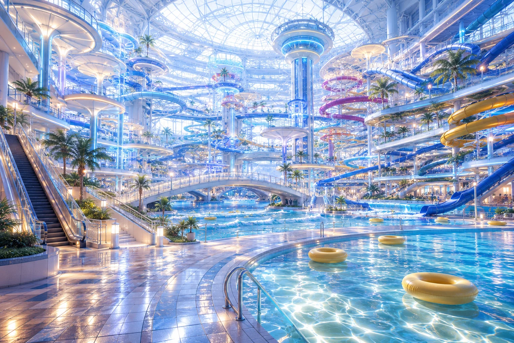

**Category:** Liminal & Abstract Spaces · **Tags:** `liminal` `waterpark` `aquatic` `pure-liminal` `dreamcore` `vacation-memory` `artificial-paradise` `optional-character` `dr-morro-inspired`

**📋 Prompt:**

```
Use the attached image strictly as the character identity reference. Preserve exactly the same face, eyes, hairstyle, hair color, facial features, proportions, expression style, age appearance, outfit impression, color palette, charm, and overall recognizable anime identity shown in the reference image. Do not redesign, replace, or reinterpret the character.

Outfit: preserve exactly the outfit shown in the attached reference image, including color, shape, proportions, material appearance, and overall design.

The character stands alone inside an enormous indoor waterpark that appears to exist slightly outside normal reality.

Everything is active.
Water flows.
Lights are on.
Escalators move.
Wave machines operate.
Digital signs glow softly.
Yet nobody is present.

The character stands near the edge of a shallow pool, quietly observing the vast interior. She is not looking at the camera.

Environment:

- gigantic indoor waterpark
- endless water slides disappearing into distant structures
- looping slide networks that seem larger on the inside than the building itself
- artificial palm trees repeating in strangely regular patterns
- glowing signs with vague unreadable symbols
- empty food courts extending farther than expected
- silent ticket counters with nobody working
- wave pools operating without swimmers
- floating inner tubes drifting slowly through still water
- illuminated bridges leading toward distant areas
- enormous skylights revealing a bright white sky
- endless tiled walkways
- observation decks with no visitors
- balconies overlooking other balconies
- corridors leading to more pools that should not physically fit inside the structure
- distant attractions partially obscured by soft atmospheric haze
- subtle architectural repetition creating dreamlike familiarity

The architecture should feel almost believable.

Only slightly wrong.

The park appears much bigger than physically possible.

Slides disappear behind structures and never seem to end.

Bridges connect areas that seem disconnected.

Some paths loop back into spaces that resemble themselves.

Certain attractions appear duplicated in the distance.

The boundaries of the building are never fully visible.

Atmosphere:

- dreamlike nostalgia
- artificial paradise
- liminal-space aesthetic
- loneliness inside a place designed for crowds
- vacation memories that never happened
- suspended time
- quiet wonder
- peaceful isolation
- soft unreality
- comforting emptiness
- the feeling of wandering through a forgotten dream
- subtle Dr. Morro VRChat world atmosphere
- reality gently bending without becoming surreal horror

Lighting:

Bright white daylight entering through gigantic skylights.

Soft reflections on water.

Clean, slightly overexposed highlights.

Diffuse illumination.

No dramatic shadows.

No sunset lighting.

No horror lighting.

The entire environment should feel bright, open, strangely timeless, and gently detached from reality.

Composition:

Wide cinematic shot.

The character occupies a very small portion of the frame.

Most of the image is dedicated to the enormous environment.

Slides, bridges, pools, escalators, and walkways create powerful perspective lines.

The viewer's eye should continually discover new distant structures.

Camera:

Architectural photography.

Ultra-wide lens.

Deep environmental focus.

Large sense of scale.

Environmental storytelling prioritized over character prominence.

Style:

Masterpiece.

Ultra-detailed anime illustration.

Photorealistic environment.

Premium environmental storytelling.

Dreamlike realism.

Luxury architectural rendering quality.

High-end liminal-space artwork.

Subtle impossible architecture.

Bright dreamcore-inspired atmosphere.

Dr. Morro VRChat-inspired spatial design.

Mood:

A place built for thousands of people.

A place currently occupied by one.

A place that feels remembered rather than visited.

The feeling of discovering a forgotten vacation destination existing somewhere between memory, dream, and reality.

Quality: best quality, masterpiece, ultra detailed, cinematic atmosphere, realistic reflections, immersive scale, environmental storytelling, high resolution, sharp focus.

Negative: crowd, tourists, children, staff, busy environment, horror monsters, decay, vandalism, broken equipment, abandoned ruins, dark atmosphere, creepy horror, text, logo, watermark, low quality, blurry face, bad anatomy, noise, film grain, compression artifacts, T-pose, A-pose.
```

**📎 Requires:** Reference image (this prompt assumes a character is present near the pool edge).

**💡 Why it works:** The waterpark is a uniquely powerful liminal location because *active operation without people* is its core paradox — wave machines running without swimmers, slides flowing without users, vending machines glowing without customers. This is different from the empty-station or empty-hotel liminals because waterparks are *acoustically and visually busy* even when empty (water sounds, mechanical motion, flowing lights). The directive `"looping slide networks that seem larger on the inside than the building itself"` is a specific impossibility anchor — it tells the model the architecture violates internal/external geometry, which is one of the most reliable dreamcore tricks. The phrase `"vacation memories that never happened"` is the emotional thesis: nostalgia for a place you've never been is the liminal aesthetic distilled. The "bright dreamcore" register (over-bright, over-clean, slightly overexposed) is the opposite of horror lighting — this is critical because waterpark interiors can easily drift into backrooms-horror territory without explicit lighting calibration.

**🔧 Variations:** swap `bright white skylights` for `colored fluorescent glow with no skylights` for a more dreamcore underground variant; change `artificial palm trees` for region-specific decoration (`fake Japanese cherry trees`, `inflatable tropical decor in 1990s Brazilian Hopi Hari style`); replace `floating inner tubes` with `floating pool noodles arranged in geometric patterns` for a more obsessively-arranged dreamcore aesthetic; add `the sound of distant filtered water echoing throughout the building` to the atmosphere block for stronger acoustic-implied atmosphere.

---

#### Liminal Aquatic Park — Self-Rearranging Waterpark (Abstract Surreal)

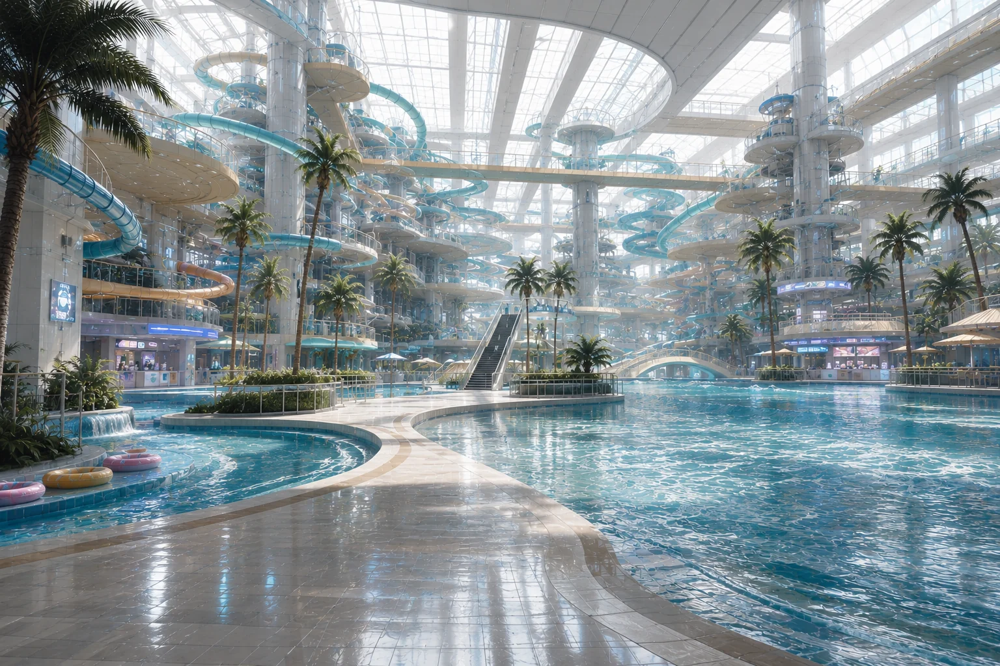

**Category:** Liminal & Abstract Spaces · **Tags:** `liminal` `waterpark` `aquatic` `abstract-surreal` `non-euclidean` `dreamcore` `self-rearranging` `optional-character` `dr-morro-inspired`

**📋 Prompt:**

```
CHARACTER RULE (CONDITIONAL)

If a character reference image is attached:

- Use the attached image strictly as the character identity reference.
- Preserve exactly the same face, eyes, hairstyle, hair color, facial features, proportions, expression style, age appearance, outfit impression, color palette, charm, and overall recognizable anime identity shown in the reference image.
- Do not redesign, replace, or reinterpret the character.
- Preserve exactly the outfit shown in the attached reference image, including color, shape, proportions, material appearance, and overall design.
- Place the character naturally within the environment.
- The character must occupy only a very small portion of the frame.
- The environment remains the primary subject.

If NO character reference image is attached:

- Do not generate any person, humanoid, character, silhouette, visitor, staff member, tourist, child, or human figure.
- The environment must be completely empty.
- The scene becomes a pure environmental illustration.
- Preserve all environmental storytelling, atmosphere, scale, architecture, and composition.

SCENE

If a character reference image is attached:

The character stands alone inside an immense indoor waterpark that seems to exist in the uncertain space between architecture, memory, and dream.

She quietly stands near the edge of a shallow reflective pool, gazing toward the interior of the structure.

She is not looking at the camera.

If NO character reference image is attached:

An immense indoor waterpark exists in complete solitude, suspended somewhere between architecture, memory, and dream.

No people are present anywhere.

The structure quietly operates by itself.

Everything is active.

Water flows.

Lights glow.

Escalators move.

Wave machines operate.

Signs illuminate distant corridors.

Yet nobody is present.

ENVIRONMENT

- colossal indoor waterpark
- endless interconnected slide systems disappearing into distant layers of architecture
- looping slide networks that seem to fold through the building in impossible ways
- repeating palm trees placed with almost artificial perfection
- softly glowing signs displaying unreadable symbols and forgotten directions
- food courts stretching farther than expected
- ticket counters operating without staff
- wave pools running continuously without swimmers
- floating inner tubes drifting through empty channels
- elevated bridges crossing vast open spaces
- enormous skylights revealing a featureless white sky
- tiled pathways continuing beyond visible destinations
- observation decks overlooking other observation decks
- balconies overlooking identical balconies
- corridors leading toward pools that should not physically fit inside the structure
- distant attractions partially hidden behind luminous atmospheric haze
- occasional duplicate landmarks appearing in multiple locations
- stairways and escalators leading toward spaces that seem familiar before being reached

The architecture should remain mostly believable.

Only gently impossible.

The waterpark feels larger than the building containing it.

Some attractions appear farther away than perspective should allow.

Certain bridges connect locations that seem unrelated.

Some slides vanish behind structures and never visibly emerge.

Entire sections of the park appear to repeat with slight differences.

The boundaries of the complex are never visible.

A faint feeling emerges that the building is quietly rearranging itself when nobody is looking.

ATMOSPHERE

- dreamlike nostalgia
- artificial paradise
- liminal-space aesthetic
- peaceful isolation
- suspended time
- forgotten vacation memories
- subtle unreality
- comforting emptiness
- quiet wonder
- gentle spatial confusion
- dream logic hidden beneath ordinary architecture
- reality bending softly at the edges
- familiar places becoming slightly unfamiliar
- subtle Dr. Morro VRChat atmosphere
- the sensation of remembering a place that never existed

SURREAL ELEMENTS (VERY SUBTLE)

- distant pools occasionally reflect locations that are not visible nearby
- some skylights reveal only bright white light without a visible exterior
- a few slide entrances seem larger inside than outside
- reflections sometimes reveal slightly different architectural layouts
- certain bridges appear to reconnect to themselves far away
- repeating clusters of palm trees create impossible visual rhythms
- isolated sections of the park appear suspended in soft haze as if disconnected from physical space

LIGHTING

Bright white daylight enters through enormous skylights.

Soft reflections shimmer across water.

Clean slightly overexposed highlights.

Diffuse illumination.

Minimal shadows.

No sunset colors.

No horror lighting.

The environment feels bright, timeless, sterile, peaceful, and dreamlike.

The white sky outside the skylights appears slightly unreal, as if the concept of daytime has replaced an actual sky.

COMPOSITION

Wide cinematic shot.

If a character reference image is attached:

- The character occupies a very small portion of the frame.
- The environment overwhelmingly dominates the composition.

If NO character reference image is attached:

- No characters anywhere in the frame.
- The entire composition is dedicated to the environment.

Slides, bridges, pools, escalators, and pathways create layered perspective lines.

The viewer continuously discovers new distant structures.

Multiple architectural layers fade gradually into luminous haze.

CAMERA

Architectural photography.

Ultra-wide lens.

Deep environmental focus.

Massive sense of scale.

Environmental storytelling prioritized over character prominence.

STYLE

Masterpiece.

Ultra-detailed anime illustration.

Photorealistic environment.

Premium environmental storytelling.

Dreamlike realism.

Luxury architectural visualization.

High-end liminal-space artwork.

Subtle impossible architecture.

Soft surrealism.

Dreamcore-inspired atmosphere.

Dr. Morro VRChat-inspired spatial design.

Backrooms-adjacent comfort without horror.

MOOD

A place built for thousands.

A place occupied by one.

Or by nobody at all.

A place remembered more than visited.

A place that feels suspended between vacation memory, dream, simulation, and reality.

The sensation that if one keeps walking long enough, the waterpark might gradually become something else.

QUALITY

best quality,
masterpiece,
ultra detailed,
cinematic atmosphere,
realistic reflections,
immersive scale,
environmental storytelling,
high resolution,
sharp focus,
atmospheric depth,
subtle surrealism

NEGATIVE

crowd,
tourists,
children,
staff,
busy environment,
horror monsters,
decay,
vandalism,
broken equipment,
abandoned ruins,
dark atmosphere,
creepy horror,
aggressive surrealism,
eldritch imagery,
text,
logo,
watermark,
low quality,
blurry face,
bad anatomy,
noise,
film grain,
compression artifacts,
T-pose,
A-pose

Additional negative when NO reference image is attached:

people,
person,
human,
humanoid,
character,
anime girl,
anime boy,
visitor,
tourist,
staff member,
employee,
pedestrian,
silhouette,
population,
crowd,
group,
portrait,
figure,
model
```

**📎 Requires:** Optional reference image — fully self-contained both branches.

**💡 Why it works:** This is the upgrade to aquaticpark001 — same scenario, but the surrealism gets its own dedicated block. The `SURREAL ELEMENTS (VERY SUBTLE)` section is structurally unique in this collection: it's a checklist of *specific impossibilities* (pools reflecting non-visible locations, skylights showing only white light, slide entrances larger inside than outside) rather than vague "weird architecture." This specificity is what produces actual dreamlike output instead of generic-strange output. The closing mood line `"the sensation that if one keeps walking long enough, the waterpark might gradually become something else"` introduces a *temporal* dimension to the liminality — implying the space is alive and changes through engagement. `"Reality bending softly at the edges"` is a precise calibration phrase: the liminal effect should be in peripheral vision, not central focus. The directive `"Backrooms-adjacent comfort without horror"` is doing critical genre work — it acknowledges the cultural reference but explicitly rejects the horror direction.

**🔧 Variations:** swap `bright white daylight` for `late afternoon golden hour through skylights` for a warmer, more melancholic variant; add the directive `"some pools contain reflections of the same waterpark seen from different angles"` for stronger recursive-architecture reads; change `palm trees` to `pine trees` or `bamboo` for region-specific dreamcore (Japanese onsen-style waterpark); tighten to a single impossibility for cleaner abstract reads (`"only the duplicate-landmarks effect, all other architecture conventional"`).

---

#### Liminal Airport — Mall + Terminal Fusion (Pure Liminal)

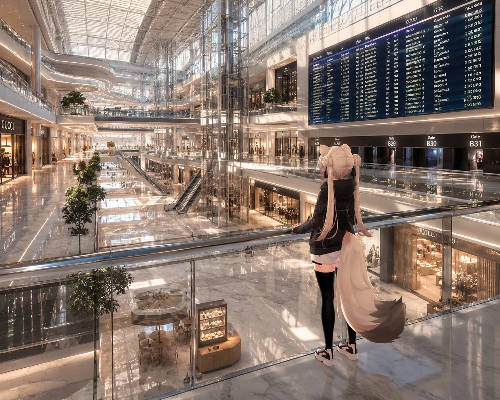

**Category:** Liminal & Abstract Spaces · **Tags:** `liminal` `airport` `mall` `pure-liminal` `commercial-space` `mall-fusion` `vrchat` `optional-character` `dr-morro-inspired`

**📋 Prompt:**

```
If a character reference image is attached:

Use the attached image strictly as the character identity reference. Preserve exactly the same face, eyes, hairstyle, hair color, facial features, proportions, expression style, age appearance, outfit impression, color palette, charm, and overall recognizable identity shown in the reference image. Do not redesign, replace, or reinterpret the character.

Preserve exactly the outfit shown in the reference image, including color, shape, proportions, materials, and overall design.

Include the character naturally within the environment.

The character should occupy only a small portion of the frame and should not be the primary focus.

The character stands beside a glass railing overlooking the immense interior, quietly gazing into the distance.

The character is not looking at the camera.

If no character reference image is attached:

Do not generate any person, humanoid figure, anime character, animal character, silhouette, crowd, traveler, staff member, or visible living subject.

The image should focus entirely on the environment itself.

The architecture and atmosphere become the sole subject of the composition.

Scene:

An impossible architectural space that feels like a fusion between a luxury shopping mall and a massive international airport terminal.

The building appears fully operational.

All lights are on.

Departure boards are active.

Escalators are moving.

Store displays are illuminated.

Yet there are no people anywhere.

The architecture should feel both familiar and impossible.

Environment:

- airport departure gates connected directly to shopping corridors
- luxury storefronts with no customers
- moving walkways extending into the distance
- gigantic departure boards displaying destinations
- empty cafés
- glowing vending machines
- silent escalators
- endless glass elevators
- vast atriums
- decorative indoor trees
- polished marble floors
- enormous skylights
- suspended bridges connecting distant sections

The space should appear much larger than physically possible.

Corridors continue beyond visibility.

Gate numbers become increasingly distant and unreadable.

The viewer should feel uncertain whether this place is a shopping mall, an airport, a dream, or a memory.

Atmosphere:

- quiet anticipation
- suspended journeys
- nostalgia for a place never visited
- artificial comfort
- loneliness inside a public space
- endless waiting
- dreamlike familiarity
- peaceful emptiness

Lighting:

Bright daytime illumination.

Large skylights fill the interior with soft white light.

Reflections cover polished floors and glass surfaces.

No harsh shadows.

The entire environment feels frozen in a perfect afternoon.

Composition:

Wide cinematic framing.

IF a character is present, the character occupies only a small area of the image.

Most of the frame is dedicated to the immense architecture.

Strong perspective lines from bridges, walkways, storefronts, and terminals.

Camera:

Architectural photography.

Wide-angle lens.

Eye-level perspective.

Deep environmental focus.

Massive sense of scale.

Style:

Masterpiece.

Ultra-detailed anime illustration.

Photorealistic architecture.

Luxury commercial interior design.

Premium environmental storytelling.

Dreamlike realism.

Strong liminal-space aesthetic.

Architecture inspired by impossible yet believable spaces similar to high-end VRChat liminal environments.

Mood:

A journey that never begins.

A destination that cannot be reached.

A place where thousands of people should be present but none are.

A memory from a future that never happened.

Quality:

best quality, masterpiece, ultra detailed, cinematic atmosphere, realistic reflections, environmental storytelling, immersive architecture, high resolution, sharp focus

Negative:

crowd, travelers, airport staff, shoppers, busy environment, advertisements everywhere, clutter, horror monsters, decay, vandalism, darkness, text, logo, watermark, low quality, blurry face, bad anatomy, noise, film grain, compression artifacts, T-pose, A-pose
```

**📎 Requires:** Optional reference image — character stands at glass railing when present.

**💡 Why it works:** The mall + airport fusion is one of the most psychologically loaded liminal locations because both spaces share specific architectural DNA — high ceilings, polished floors, retail storefronts, transitory atmosphere, fluorescent lighting. By explicitly fusing them (`"airport departure gates connected directly to shopping corridors"`), the prompt creates a synthesis that feels familiar yet wrong. Most travelers have walked through the duty-free shopping section of an airport and felt this exact ambiguity in real life. The detail `"gate numbers become increasingly distant and unreadable"` is doing precise rendering work: it gives the model a way to imply infinity through *visual degradation of detail* rather than through impossible spatial geometry. `"A journey that never begins"` and `"a destination that cannot be reached"` is the mood thesis — transit liminals always trade on the gap between *being on the way* and *never arriving*.

**🔧 Variations:** swap `luxury shopping mall` for `airport food court` for a less prestige-coded variant; change `daytime skylights` to `night with massive panoramic windows showing dark runways and distant lit planes that never move` for nocturnal airport liminal; replace `bridges connecting distant sections` with `escalators descending into other terminals visible through glass floors` for stronger vertical layering; tighten to a specific real airport aesthetic (`Singapore Changi style with indoor gardens`, `2000s Brazilian Guarulhos terminal feeling`) for cultural specificity.

---

#### Liminal Airport — Eternal Afternoon Terminal (Abstract Surreal)

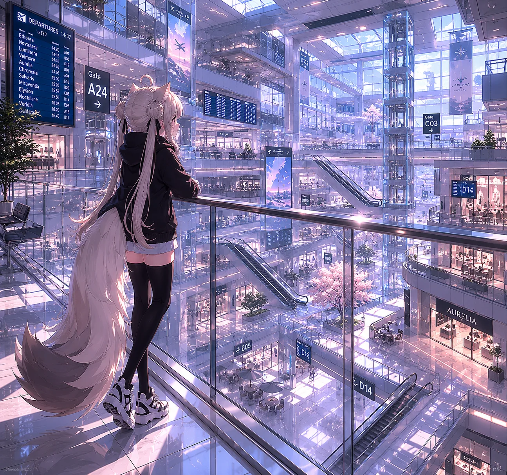

**Category:** Liminal & Abstract Spaces · **Tags:** `liminal` `airport` `mall` `abstract-surreal` `recursive-architecture` `vrchat` `eternal-afternoon` `optional-character` `dr-morro-inspired`

**📋 Prompt:**

```
Character Logic (Conditional)

IF a character reference image is attached:

Use the attached image strictly as the character identity reference. Preserve exactly the same face, eyes, hairstyle, hair color, facial features, proportions, expression style, age appearance, outfit impression, color palette, charm, and overall recognizable anime identity shown in the reference image. Do not redesign, replace, or reinterpret the character.

Outfit: preserve exactly the outfit shown in the attached reference image, including color, shape, proportions, material appearance, and overall design.

The character stands alone beside a glass railing overlooking an immense central atrium, quietly gazing into the distance. She is not looking at the camera.

IF no character reference image is attached:

Do not generate any person, humanoid figure, silhouette, traveler, staff member, shopper, character, animal, creature, or visible living being.

The scene becomes a pure environmental illustration focused entirely on the architecture, atmosphere, scale, lighting, and liminal-space qualities of the location.

Main Scene

An impossible architectural space that feels like a fusion between a luxury shopping mall, an international airport terminal, and a carefully constructed dream.

The building appears fully operational.

All lights are on.

Departure boards are active.

Escalators are moving.

Store displays are illuminated.

Glass elevators travel silently between floors.

Yet there are no people anywhere.

The architecture initially appears realistic, but subtle impossibilities reveal themselves the longer the viewer observes.

Environment

- airport departure gates connected directly to shopping corridors
- luxury storefronts with no customers
- moving walkways extending far beyond visible destinations
- gigantic departure boards displaying unfamiliar city names
- empty cafés with untouched tables
- glowing vending machines
- silent escalators
- endless glass elevators
- enormous atriums
- decorative indoor trees
- polished marble floors
- vast skylights
- suspended bridges connecting distant sections

Additional surreal architectural elements

- terminals visible through windows inside other terminals
- bridges that appear to connect spaces impossibly far apart
- skylights revealing layers of interior architecture above instead of the sky
- storefronts repeating in the distance with subtle variations
- gates numbered in non-sequential patterns
- distant corridors fading into bright atmospheric haze
- balconies overlooking larger versions of themselves
- faint reflections suggesting spaces that do not physically exist

The space should feel believable at first glance, but increasingly dreamlike upon inspection.

The viewer should feel uncertain whether this place is a shopping mall, an airport, a memory, or a location that only exists between destinations.

Atmosphere

- quiet anticipation
- suspended journeys
- nostalgia for a place never visited
- artificial comfort
- loneliness inside a public space
- endless waiting
- dreamlike familiarity
- peaceful emptiness
- subtle unreality
- architectural déjà vu

Liminal-Space Influence

Inspired by large-scale VRChat liminal environments, particularly the feeling of impossibly clean, oversized public architecture.

The environment should feel intentionally designed for people, yet completely abandoned.

No horror.

No danger.

Only a persistent feeling that something about the space is slightly wrong.

The world feels paused rather than empty.

Lighting

Bright daytime illumination.

Large skylights fill the interior with soft white light.

Reflections cover polished floors and glass surfaces.

No harsh shadows.

The entire environment feels frozen in a perfect afternoon.

A slight atmospheric bloom softens distant structures.

Far-away areas gradually dissolve into bright haze.

Composition

IF a character reference image is attached:

- wide cinematic framing
- the character occupies a small area of the image
- most of the frame is dedicated to the immense architecture
- strong perspective lines from bridges, walkways, storefronts, terminals, and layered atriums

IF no character reference image is attached:

- wide cinematic framing
- no visible characters anywhere
- architecture occupies the entire frame
- strong perspective lines from bridges, walkways, storefronts, terminals, and layered atriums
- emphasis on environmental storytelling and scale

Camera

Architectural photography.

Wide-angle lens.

Eye-level perspective.

Deep environmental focus.

Massive sense of scale.

Style

Masterpiece.

Ultra-detailed anime illustration.

Photorealistic architecture.

Dreamlike realism.

Premium environmental storytelling.

High-end architectural visualization.

Subtle surrealism.

VRChat liminal-space aesthetic.

DrMorro-inspired atmosphere.

Clean futuristic public architecture.

Mood

A journey that never begins.

A destination that cannot be reached.

A public place that seems to remember its visitors long after they are gone.

A perfect afternoon repeating forever.

A memory from a future that never happened.

Quality

best quality,
masterpiece,
ultra detailed,
cinematic atmosphere,
realistic reflections,
environmental storytelling,
immersive architecture,
high resolution,
sharp focus

Negative

crowd,
travelers,
airport staff,
shoppers,
busy environment,
horror monsters,
decay,
vandalism,
darkness,
abandoned ruins,
post-apocalyptic elements,
graffiti,
clutter,
excessive advertisements,
text,
logo,
watermark,
low quality,
blurry face,
bad anatomy,
noise,
film grain,
compression artifacts,
T-pose,
A-pose

Additional Negative When No Reference Image Is Attached

person,
people,
human,
woman,
man,
girl,
boy,
character,
anime character,
humanoid,
silhouette,
background character,
NPC,
anthropomorphic character,
animal,
creature,
visible living being
```

**📎 Requires:** Optional reference image.

**💡 Why it works:** This is the *Borgesian* version of airport001 — the architecture gets explicit recursive impossibilities. The `Additional surreal architectural elements` block is the most important section: `"terminals visible through windows inside other terminals"`, `"skylights revealing layers of interior architecture above instead of the sky"`, `"balconies overlooking larger versions of themselves"`. These are *recursive geometry* impossibilities — the architecture contains itself, which is a fundamentally different kind of impossibility from `"hallway connects to nothing"`. Recursive impossibilities feel more dreamlike because they suggest the space is *aware of itself*. The detail `"gates numbered in non-sequential patterns"` is doing nuanced work: it implies the systematization is broken without rendering literal misnumbered signs. The mood line `"a public place that seems to remember its visitors long after they are gone"` introduces a *haunting* quality without horror — the space has emotional memory of crowds that no longer exist.

**🔱 Variations:** swap `eternal afternoon` for `eternal sunset golden hour` for a warmer melancholic variant; change `terminals visible through windows` to `terminals visible only in reflections of polished floors` for a more uncanny detail; add `"large clocks throughout the terminal all show different times that never change"` for stronger frozen-time reads; replace `Borges-like recursive architecture` framing with `M.C. Escher-inspired impossible geometry` for a more visually aggressive variant.

---

#### Liminal Beach — Rio Boardwalk (Pure Liminal)

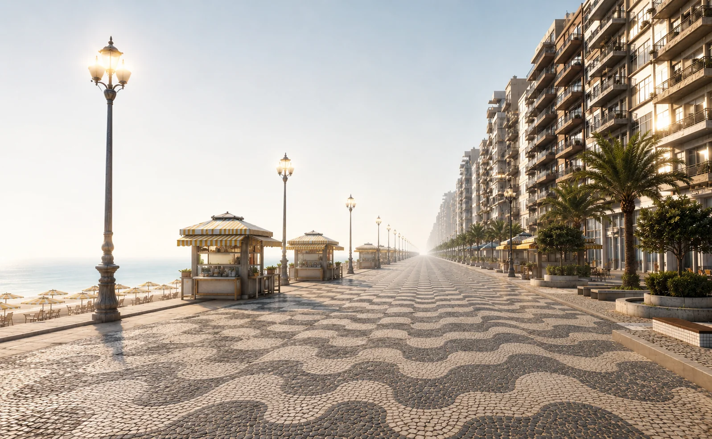

**Category:** Liminal & Abstract Spaces · **Tags:** `liminal` `beach` `brazil` `rio` `pure-liminal` `boardwalk` `coastal` `optional-character` `nostalgia` `dr-morro-inspired`

**📋 Prompt:**

```
If a character reference image is attached:

Use the attached image strictly as the character identity reference. Preserve exactly the same face, eyes, hairstyle, hair color, facial features, proportions, expression style, age appearance, outfit impression, color palette, charm, and overall recognizable identity shown in the reference image. Do not redesign, replace, or reinterpret the character.

The character is naturally present within the environment.

Use a natural, relaxed, believable pose. Avoid T-pose, A-pose, mannequin posture, rigid symmetry, presentation-sheet poses, or standing unnaturally straight.

If no character reference image is attached:

Do not generate any character, person, silhouette, humanoid figure, animal, creature, reflection, shadow-person, distant pedestrian, or any other living subject.

The environment itself is the sole subject of the image.

The scene depicts an enormous Brazilian seaside boardwalk stretching endlessly along the coastline.

The ocean is calm.

The kiosks are open.

The streetlights remain illuminated despite full daylight.

Beach umbrellas are arranged perfectly.

The promenade extends for kilometers without a single person.

Apartment towers line the coastline.

Every balcony contains furniture.

Every window reflects sunlight.

Yet no movement can be seen anywhere.

The city feels inhabited but empty.

The horizon is obscured by bright white haze.

The ocean and sky almost merge together.

The atmosphere feels like a forgotten family vacation remembered incorrectly decades later.

Bright.

Peaceful.

Beautiful.

Slightly surreal.

The viewer should feel uncertain whether this place exists in reality or inside a memory.

Subtle liminal atmosphere.

Dreamlike familiarity.

Quiet nostalgia.

Soft atmospheric haze.

Long uninterrupted sightlines.

Photorealistic Brazilian coastal architecture.

Empty yet convincingly inhabited.

Cinematic composition.

High environmental detail.

Natural daylight.

No crowds.

No vehicles.

No signs of ongoing activity.

A place that feels remembered rather than visited.
```

**📎 Requires:** Optional reference image.

**💡 Why it works:** This is the only outdoor liminal in the entire collection, which makes it visually distinct from the others. The Brazilian beach boardwalk is a culturally specific liminal — it taps into the experience of childhood vacations in Rio/Recife/Salvador, the wave-pattern Copacabana pavement, the row of apartment towers along the coastline. The detail `"streetlights remain illuminated despite full daylight"` is a *specific subtle wrongness* that anyone who's been on a Brazilian beach at midday recognizes as off (streetlights should be on at night). The phrase `"a forgotten family vacation remembered incorrectly decades later"` is doing all the emotional work — the *incorrectness of memory* is what makes this liminal rather than just empty. The `"empty yet convincingly inhabited"` paradox is the central tension: every balcony has furniture, every window has reflections, but no movement exists. This implies recent abandonment without showing it, which is more unsettling than literal ruins. The prompt is significantly shorter than others in this category — the brevity is intentional, leaving room for the model to fill in Brazilian coastal aesthetics from training data.

**🔧 Variations:** specify the location explicitly (`Copacabana boardwalk with the wave-pattern Portuguese stone pavement`, `Boa Viagem promenade in Recife with anti-shark netting visible offshore`, `Ipanema with the Two Brothers mountains in the distant haze`) for stronger cultural anchors; swap `midday daylight` for `golden hour with empty beach`; add `tiny tropical birds visible in the distance but no people` if you want to suggest non-human life; change apartment towers to `colonial Portuguese-style buildings in Salvador` for a different Brazilian coastal aesthetic.

---

#### Liminal Beach — Memory of Rio (Abstract Surreal)

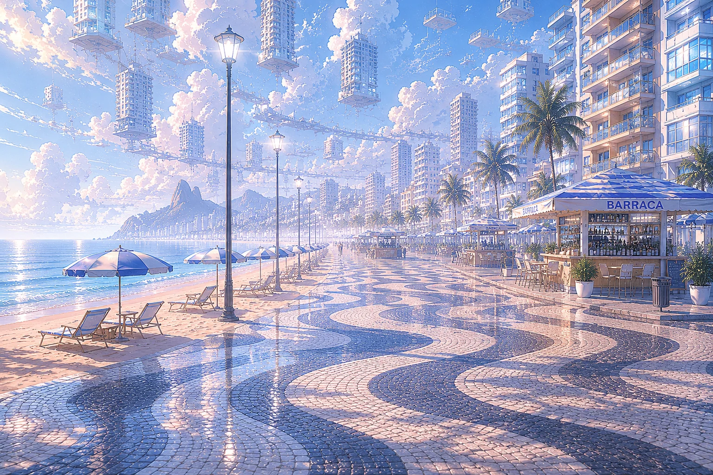

**Category:** Liminal & Abstract Spaces · **Tags:** `liminal` `beach` `brazil` `abstract-surreal` `memory-reconstruction` `non-euclidean` `optional-character` `nostalgia` `dr-morro-inspired`

**📋 Prompt:**

```
If a character reference image is attached:

Use the attached image strictly as the character identity reference.

Preserve exactly the same face, eyes, hairstyle, hair color, facial features, proportions, expression style, age appearance, outfit impression, color palette, charm, and overall recognizable anime identity shown in the reference image.

Do not redesign, replace, reinterpret, or alter the character's identity in any way.

Place the character naturally within the environment.

Natural standing pose.

Relaxed posture.

Looking naturally toward the viewer or into the distance.

Not T-pose.

Not A-pose.

If no character reference image is attached:

Do not create any character.

Do not create any person.

Do not create silhouettes, crowds, pedestrians, distant figures, reflections of people, shadows suggesting people, or implied human presence.

The image should depict only the environment itself.

The scene must remain completely empty.

An immense Brazilian seaside promenade feels less like a physical location and more like a memory attempting to reconstruct itself.

The environment is inspired by the atmosphere of a childhood beach vacation remembered thousands of times over many years.

The ocean is calm.

The air is bright.

The weather is clear.

Nothing appears damaged, abandoned, or threatening.

Everything is maintained, beautiful, and strangely permanent.

The famous wave-pattern pavement begins normally near the viewer, but gradually loses geometric consistency as it stretches into the distance.

The curves become larger.

The waves become softer.

The pattern slowly transforms into oversized abstract shapes that resemble someone's imperfect memory of the original design rather than the real pavement itself.

The promenade extends impossibly far.

The coastline bends in directions that should not be physically possible.

Far away, sections of the beach seem to curve upward into the sky before disappearing into white haze.

Rows of beach umbrellas repeat endlessly.

Some rows continue for kilometers.

Some rows subtly overlap each other despite occupying the same space.

The kiosks are open.

Many kiosks appear identical.

The same kiosk seems to reappear repeatedly throughout the landscape at impossible distances.

Apartment towers line the coast.

Every balcony contains furniture.

Every window reflects sunlight.

Every detail suggests that people live here.

Yet no people exist anywhere.

No movement exists anywhere.

No vehicles.

No birds.

No waves breaking.

No visible wind.

No signs of activity.

The city feels inhabited but completely still.

Several distant buildings hover slightly above the ground.

Some towers appear duplicated.

Others seem partially unfinished, fading into haze before reaching the sky.

Streetlights remain illuminated despite full daylight.

They continue endlessly toward the horizon.

As they recede into the distance, they become smaller and smaller until they resemble stars suspended inside the daytime sky.

The horizon cannot be clearly located.

Ocean, sky, architecture, beach, and promenade gradually dissolve into a continuous white brightness where perspective becomes unreliable.

Certain parts of the environment appear reconstructed from incomplete memories.

Some buildings repeat.

Some streets lead nowhere.

Some spaces feel larger on the inside than on the outside.

The architecture remains familiar but subtly impossible.

The viewer should constantly question whether this place is real, remembered, dreamed, or being generated from memories in real time.

The atmosphere should evoke:

Liminal space.

Dreamlike nostalgia.

Comforting emptiness.

Peaceful solitude.

Familiarity without certainty.

Reality blending with memory.

Subtle impossible geometry.

Dr. Morro-style environmental storytelling.

Bright daylight liminality.

The scene should feel emotionally warm rather than eerie.

The emptiness should feel comforting.

The surrealism should feel gentle.

The abstraction should emerge gradually from the environment rather than appearing chaotic.

Ultra-detailed environmental storytelling.

Strong atmospheric depth.

Volumetric white haze.

Soft reflections.

Dreamlike perspective.

Memory-like architecture.

Impossible but believable spatial relationships.

Large-scale environment.

Cinematic composition.

High-quality anime illustration.
```

**📎 Requires:** Optional reference image — works best as pure environment.

**💡 Why it works:** This is the most *poetic* prompt in the entire repo. The central conceit — `"the famous wave-pattern pavement begins normally near the viewer, but gradually loses geometric consistency as it stretches into the distance"` — is a brilliant rendering trick. It gives the model permission to render *partial accuracy*: photorealistic in foreground, gradually abstracting toward background. This mimics how human memory actually works (clear details up close, increasingly approximate in distant past). The detail `"streetlights ... as they recede into the distance, they become smaller and smaller until they resemble stars suspended inside the daytime sky"` is a single concrete impossibility that perfectly captures dream logic — scale violation rendered as a specific visual phenomenon. The framing `"a memory attempting to reconstruct itself"` is structurally fascinating: the space isn't *containing* a memory, it *is* the act of remembering. The `"emotional warmth rather than eerie"` directive is critical calibration — the prompt deliberately avoids the cold-empty-horror direction that liminal Brazilian coastal would otherwise drift toward. This prompt also showcases the *gradient abstraction* technique — the surreal quality emerges progressively across the image rather than being uniform.

**🔧 Variations:** swap `Brazilian seaside` for `Mediterranean coastline in summer` or `1990s Japanese beach town with vending machines` for parallel cultural memory-spaces; tighten the gradient abstraction to one specific element (`"only the pavement pattern abstracts"`, `"only the towers duplicate"`) for cleaner surreal reads; add `"the sound of waves is absent — the ocean is silent"` to the negative space for stronger acoustic implication; change `bright daylight` to `late afternoon golden hour with long shadows from objects that have no visible source` for a more uncanny lighting variant; combine with the streetlights-as-stars detail extracted as standalone variation for use in other coastal prompts.

---

## 💡 General Prompting Tips

These patterns repeat across the prompts in this collection:

- **Use `{CURLY_BRACES}` for swappable variables** — define them at the top of the prompt so the rest stays reusable
- **Keep the prompt character-agnostic** — describe the scene, lighting, composition, and style; let the character come from an attached reference or a separate description
- **Three distinct identity modes** — identity-lock (preserve everything exactly), style-inspiration (keep aesthetic, redesign), and caricature-redesign (deliberately distort while keeping cues); mixing them produces muddled results
- **Identity-lock with explicit lists** — when preserving a reference character, enumerate *exactly* what must be preserved (face, eyes, hair, accessories, palette, silhouette) and *what must not happen* (no replacement, no obscuring)
- **Use negative-space framing** — "Do not replace the character" and `"NEVER use T-pose"` work surprisingly well alongside positive descriptions
- **Pose-override blocks for stiff references** — if you're using a 3D/VRChat T-pose model as input, explicitly forbid the stiff stance and provide a curated list of natural pose alternatives
- **Branch with conditional rules** — `If X=1: ...` / `If X=2: ...` blocks let one prompt produce variant outputs
- **Layered redesign structure** — for complex translations, split the prompt into per-aspect blocks (Core / Material / Facial / Clothing / Scene) — each becomes its own "rendering pass" for the model
- **Anchor style with named artists/regions** — `Makoto Shinkai`, `Mestre Vitalino`, `Lampião and Maria Bonita`, `São Luís do Maranhão` lock visuals more efficiently than generic adjectives
- **Use "Avoid" blocks to name failure modes** — naming the *wrong* aesthetic (`plastic toy appearance`, `generic cowboy aesthetics`, `sterile European-only tile aesthetics`) suppresses default drift
- **Cultural anchoring beats adjective stacking** — for regional/traditional aesthetics, name *specific* cultural references (artisan names, towns, historical figures, named traditions) rather than relying on vague "folk-art" descriptors
- **Sandwich identity instructions** — open with what to preserve, close with another "Do NOT redesign" reminder; the middle handles style translation
- **Stack atmospheric cues** — cinematic lighting + bloom + volumetric fog + reflections reinforce each other rather than fight
- **Negative-prompt blocks work in GPT Image 2** — for print-ready or high-precision outputs (dakimakura, posters), include an explicit `Negative prompt:` section listing failure modes
- **End with quality keywords** — `masterpiece, best quality, ultra detailed, depth of field` at the tail nudges the renderer toward its best output
- **Short uppercase text works best** — words of 4–8 letters have the highest text-rendering accuracy
- **Specify text position explicitly** — `"on the chest"`, `"as a banner above"`, `"in the lower-right corner"`
- **Provide example text strings for typography prompts** — listing 3-5 sample phrases locks the *register* without forcing exact wording

## 📄 License

Licensed under [CC BY 4.0](LICENSE) — use it, remix it, share it; just give credit.
