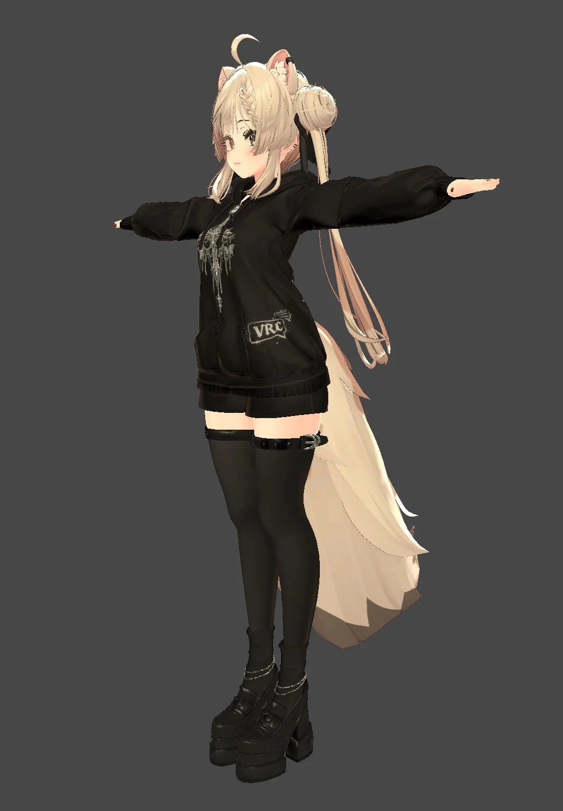
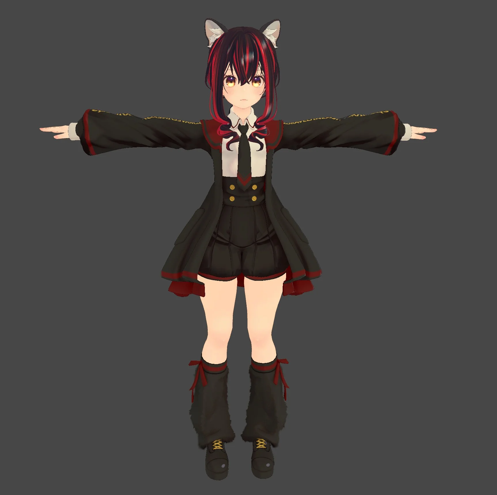
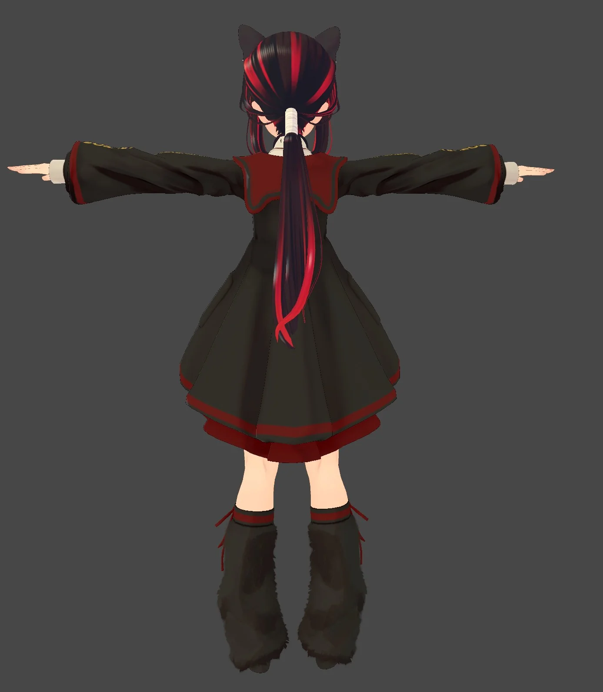

# 🧍 Character Gallery — Base References

This folder contains the **base reference images** used as identity anchors across the prompts in [the main README](../../../README.md). Each prompt that says *"Use the attached reference character..."* expects one of these (or similar) images as the input.

Files are organized by character and style variation. All images are `.webp` (max 1024px, optimized via `scripts/optimize.bat`).

---

## Manuka

The main reference character — used as default identity anchor in most prompts.

<table>
<tr>
<td align="center" width="33%">
 
<i>manuka001.webp</i>
</td>
<td align="center" width="33%">
 
<i>manuka002.webp</i>
</td>
<td align="center" width="33%">
</td>
</tr>
</table>

---

## Manuka Gothic

Gothic outfit/style variation of Manuka — used as identity reference for darker, aristocratic, and gothic-themed prompts.

<table>
<tr>
<td align="center" width="33%">
 
<i>manukagothic001.webp</i>
</td>
<td align="center" width="33%">
 
<i>manukagothic002.webp</i>
</td>
<td align="center" width="33%">
 
<i>manukagothic003.webp</i>
</td>
</tr>
<tr>
<td align="center" width="33%">
 
<i>manukagothic004.webp</i>
</td>
<td align="center" width="33%">
 
<i>manukagothic005.webp</i>
</td>
<td align="center" width="33%">
 
<i>manukagothic006.webp</i>
</td>
</tr>
</table>

---

## Manuka Vamp Gothic

Vampire gothic variant — for horror-aesthetic, gothic-cyber, and dark-fashion prompts.

<table>
<tr>
<td align="center" width="33%">
 
<i>manukavampgothic001.webp</i>
</td>
<td align="center" width="33%">
</td>
<td align="center" width="33%">
</td>
</tr>
</table>

---

## Neco

Secondary reference character — alternative identity anchor.

<table>
<tr>
<td align="center" width="33%">
 
<i>neco01.webp</i>
</td>
<td align="center" width="33%">
 
<i>neco02.webp</i>
</td>
<td align="center" width="33%">
 
<i>neco03.webp</i>
</td>
</tr>
<tr>
<td align="center" width="33%">
 
<i>neco04.webp</i>
</td>
<td align="center" width="33%">
 
<i>neco05.webp</i>
</td>
<td align="center" width="33%">
</td>
</tr>
</table>

---

## How These Images Are Used

These base references are passed to GPT Image 2 alongside the prompts in the main README. The prompt typically locks identity through:

- **Face** — facial structure, eye shape and color, expression
- **Hair** — color, length, hairstyle, accessories
- **Animal traits** — ears, tail, species-specific features
- **Outfit** — when the prompt preserves the original outfit rather than redesigning it
- **Proportions** — body type, height, silhouette

For most prompts, **Manuka** (or one of its style variations) is the default. Use **Neco** when you want a different character identity while keeping the same scene/style logic.

When in doubt about which base to use, the main README's prompt descriptions usually hint at the expected reference (e.g. prompts mentioning *"pink twintails / gothic maid"* are designed for **Manuka Gothic** or **Manuka Vamp Gothic**; prompts mentioning *"red eyes / crimson hair"* point to **Neco**).

---

[← Back to main README](../../../README.md)
